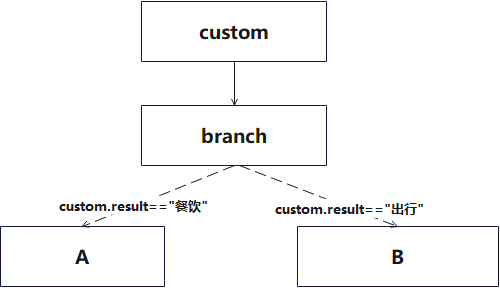

openJiuwen provides flexible and powerful component development capabilities. Users only need to inherit the `WorkflowComponent` abstract class and implement its methods to quickly build custom components. A custom component generally includes the following features:

- Process component input data to generate component output data, supporting both stream and batch processing.
- Customize supporting branch scenarios for the component.
- Use capabilities provided by `Session`, including fetching configuration information, updating or retrieving state, recording trace information, managing resources, and interaction interruption. Refer to [Session](./Session/Overview.md).

# Implementing Custom Components

openJiuwen supports two ways to implement custom components:

- Inherit both `WorkflowComponent` and `ComponentExecutable`: Directly implement the methods of `ComponentExecutable` in the class and return `self` in the component’s `to_executable` method. Suitable for simple component functionality scenarios where the defined component itself is the runtime instance.
- Inherit `WorkflowComponent`: Write a separate class that inherits `ComponentExecutable`, and return that instance in the component’s `to_executable` method. Suitable for scenarios where the component is more complex and construction logic should be separated from execution logic.

`ComponentExecutable` is the abstract class for executors, mainly providing business processing interfaces `invoke`, `stream`, `collect`, and `transform`. Users can implement different interfaces based on business needs. If the component involves custom connection configurations (e.g., intent recognition components, branch components), you need to implement the `add_component` method to add the component’s runtime `to_executable` and necessary connection relationships to the `Graph` execution engine.

Below are examples of implementing custom components in both ways: a compute node component `ComputeComponent` and a binary response deserialization component `ResponseHandlerComponent`.

## Inheriting WorkflowComponent and ComponentExecutable

`ResponseHandlerComponent` is a custom component for response deserialization that inherits both `WorkflowComponent` and `ComponentExecutable`. In this inheritance approach, the default implementations of `to_executable` and `add_component` treat the component itself as a `ComponentExecutable` instance and add it to the workflow’s graph execution engine.

`ResponseHandlerComponent` deserializes streaming response content frame by frame. It returns deserialized results frame by frame via the `transform` method, and returns the collected results in batch via the `collect` method.

```python
import json
from typing import AsyncIterator

from openjiuwen.core.workflow import WorkflowComponent, Input, Output
from openjiuwen.core.context_engine import ModelContext
from openjiuwen.core.workflow.components import Session


class ResponseHandlerComponent(WorkflowComponent):
    async def transform(self, inputs: Input, session: Session, context: ModelContext) -> AsyncIterator[Output]:
        """ Handle streaming inputs: iterate over all inputs, retrieve response content,
            call __deserialize__ to deserialize it, and yield a generator element
            containing the deserialized result. """
        response_generator = inputs.get("response")
        async for response in response_generator:
            if response is not None:
                yield {"content": self.__deserialize__(content_bytes=response.get("content", None))}

        yield {"status": "finished"}

    async def collect(self, inputs: Input, session: Session, context: ModelContext) -> Output:
        """ Collect all parsed response messages and return them in batch. """
        responses = []
        response_generator = inputs.get("response")

        async for response in response_generator:
            if response is not None:
                responses.append(self.__deserialize__(content_bytes=response.get("content", None)))
        return {"result": responses}

    @staticmethod
    def __deserialize__(content_bytes: bytes):
        """ Deserialization """
        if content_bytes is None:
            return {}
        return json.loads(content_bytes.decode("utf-8"))
```

- When the workflow calls the `transform` interface, the output result is 3 frames of data.

Add the custom `ResponseHandlerComponent` to the workflow via `workflow.add_workflow_comp`, set the component id to "handler", and specify the streaming input schema as `"${llm.response}"`:

```python
from openjiuwen.core.workflow.base import Workflow

workflow = Workflow()
workflow.add_workflow_comp("response_handler", ResponseHandlerComponent(),
                           stream_inputs_schema={"response": "${llm.response}"})
```

Execute the workflow by calling `workflow.stream({"user_inputs": "Help me generate an image of a little girl"}, session=create_workflow_session(), stream_modes=[BaseStreamMode.OUTPUT])`. The workflow execution results contain the following 3 frames:

```python
receive chunk:  type='end node stream' index=0 payload={'end_transform': {'response_handler': {'content': {'url': 'http://xxxxx', 'description': 'a little girl in the park'}}}}
receive chunk:  type='end node stream' index=1 payload={'end_transform': {'response_handler': {'content': {'url': 'http://xxxxx', 'description': 'a schoolgirl'}}}}
receive chunk:  type='end node stream' index=2 payload={'end_transform': {'response_handler': {'content': {'status': 'finished'}}}}
receive chunk:  type='end node stream' index=3 payload={'output': {'end_transform': {'status': 'finished'}}}
```

- When the workflow calls the `collect` interface, the output result is batch data.
Add the custom `ResponseHandlerComponent` to the workflow via `workflow.add_workflow_comp`, set the component id to "handler", specify the streaming input schema as `"${llm.response}"`, and specify the component ability as `COLLECT`:

```python
workflow.add_workflow_comp("response_handler", ResponseHandlerComponent(),
                           stream_inputs_schema={"response": "${llm.response}"})
```

Execute the workflow by calling `workflow.invoke({"user_inputs": "Help me generate an image of a little girl"}, session=create_workflow_session())`. The output is as follows:

```python
result={'result': {'result': [{'url': 'http://xxxxx', 'description': 'a little girl in the park'}, {'url': 'http://xxxxx', 'description': 'a schoolgirl'}, {'status': 'finished'}]}} state=<WorkflowExecutionState.COMPLETED: 'COMPLETED'>
```

Complete code:

```python
import asyncio
import json
from typing import AsyncIterator

from openjiuwen.core.workflow import WorkflowComponent, Output, Input
from openjiuwen.core.workflow import End, Start
from openjiuwen.core.context_engine import ModelContext
from openjiuwen.core.workflow import Session
from openjiuwen.core.workflow import create_workflow_session
from openjiuwen.core.session.stream import BaseStreamMode
from openjiuwen.core.workflow import Workflow
from openjiuwen.core.workflow.workflow_config import ComponentAbility

# mock llm component that outputs 3 frames
class MockLLMComponent(WorkflowComponent):
    def __init__(self):
        super().__init__()
        self.mock_llm_streams = [
            json.dumps({"url": "http://xxxxx", "description": "a little girl in the park"}).encode("utf-8"),
            json.dumps({"url": "http://xxxxx", "description": "a schoolgirl"},).encode("utf-8"),
            json.dumps({"status": "finished"}).encode("utf-8"),
        ]

    async def stream(self, inputs: Input, session: Session, context: ModelContext) -> AsyncIterator[Output]:
        for stream in self.mock_llm_streams:
            yield {"response": { "content": stream }}

class ResponseHandlerComponent(WorkflowComponent):
    async def transform(self, inputs: Input, session: Session, context: ModelContext) -> AsyncIterator[Output]:
        """ Handle streaming inputs: iterate over all inputs, retrieve response content,
            call __deserialize__ to deserialize it, and yield a generator element
            containing the deserialized result. """
        response_generator = inputs.get("response")
        async for response in response_generator:
            if response is not None:
                yield {"content": self.__deserialize__(content_bytes=response.get("content", None))}

        yield {"status": "finished"}

    async def collect(self, inputs: Input, session: Session, context: ModelContext) -> Output:
        """ Collect all parsed response messages and return them in batch. """
        responses = []
        response_generator = inputs.get("response")

        async for response in response_generator:
            if response is not None:
                responses.append(self.__deserialize__(content_bytes=response.get("content", None)))
        return {"result": responses}

    @staticmethod
    def __deserialize__(content_bytes: bytes):
        """ Deserialization """
        if content_bytes is None:
            return {}
        return json.loads(content_bytes.decode("utf-8"))

# Trigger transform functionality
async def run_transform_workflow():
    workflow = Workflow()
    workflow.set_start_comp("s", Start())
    workflow.add_workflow_comp("llm", MockLLMComponent(), inputs_schema={"query": "${user_inputs}"},
                               comp_ability=[ComponentAbility.STREAM], wait_for_all=True)
    workflow.add_workflow_comp("response_handler", ResponseHandlerComponent(),
                               comp_ability=[ComponentAbility.TRANSFORM],
                               stream_inputs_schema={"response": "${llm.response}"},
                               wait_for_all=True)
    workflow.set_end_comp("e", End(), response_mode="streaming",
                          stream_inputs_schema={"end_transform": "${response_handler}"})

    workflow.add_connection("s", "llm")
    workflow.add_stream_connection("llm", "response_handler")
    workflow.add_stream_connection("response_handler", "e")
    async for chunk in workflow.stream({"user_inputs": "Help me generate an image of a little girl"}, session=create_workflow_session(),
                                       stream_modes=[BaseStreamMode.OUTPUT]):
        print("receive chunk: ", chunk)

# Trigger collect functionality
async def run_collect_workflow():
    workflow = Workflow()
    workflow.set_start_comp("s", Start())
    workflow.add_workflow_comp("llm", MockLLMComponent(), inputs_schema={"query": "${user_inputs}"},
                               comp_ability=[ComponentAbility.STREAM], wait_for_all=True)
    workflow.add_workflow_comp("response_handler", ResponseHandlerComponent(),
                               comp_ability=[ComponentAbility.COLLECT],
                               stream_inputs_schema={"response": "${llm.response}"},
                               wait_for_all=True)
    workflow.set_end_comp("e", End(), inputs_schema={"result": "${response_handler}"})

    workflow.add_connection("s", "llm")
    workflow.add_stream_connection("llm", "response_handler")
    workflow.add_connection("response_handler", "e")
    output = await workflow.invoke({"user_inputs": "Help me generate an image of a little girl"}, session=create_workflow_session())
    print(output)

if __name__ == "__main__":
    asyncio.run(run_transform_workflow())
    asyncio.run(run_collect_workflow())
```

Output:

```python
receive chunk:  type='end node stream' index=0 payload={'output': {'end_transform': {'content': {'url': 'http://xxxxx', 'description': 'a little girl in the park'}}}}
receive chunk:  type='end node stream' index=1 payload={'output': {'end_transform': {'content': {'url': 'http://xxxxx', 'description': 'a schoolgirl'}}}}
receive chunk:  type='end node stream' index=2 payload={'output': {'end_transform': {'content': {'status': 'finished'}}}}
receive chunk:  type='end node stream' index=3 payload={'output': {'end_transform': {'status': 'finished'}}}
receive chunk:  type='end node stream' index=0 payload={'status': 'finished'}
result={'output': {'result': {'result': [{'url': 'http://xxxxx', 'description': 'a little girl in the park'}, {'url': 'http://xxxxx', 'description': 'a schoolgirl'}, {'status': 'finished'}]}}} state=<WorkflowExecutionState.COMPLETED: 'COMPLETED'>
```
## Inheriting WorkflowComponent

`ComputeExecutor` inherits from `ComponentExecutable`, supporting single mathematical operations and multiple-operation accumulation. It processes a single input via the `invoke` method, executing the specified mathematical operation (add, subtract, multiply, divide). It processes batch inputs via the `stream` method, performing the specified operation for each input and passing each result downstream as streaming data, enabling efficient data processing and aggregation.

```python
from typing import AsyncIterator

from openjiuwen.core.context_engine import ModelContext
from openjiuwen.core.workflow import ComponentExecutable, Input, Output
from openjiuwen.core.workflow.components import Session


class ComputeExecutor(ComponentExecutable):
    async def invoke(self, inputs: Input, session: Session, context: ModelContext) -> Output:
        """ Process a single input, call __calculate__ to perform the specific math operation, and return the result. """
        return {"result": self.__calculate__(data=inputs.get("data"))}

    async def stream(self, inputs: Input, session: Session, context: ModelContext) -> AsyncIterator[Output]:
        datas = inputs.get("data")
        for data in datas:
            yield {"result": self.__calculate__(data=data)}

    @staticmethod
    def __calculate__(data):
        """ Execute add, subtract, multiply, or divide based on the operator in the input. """
        operator = data.get("op", None)
        data = data.get("data", None)
        a = data.get("a", 0)
        b = data.get("b", 0)
        if operator == "add":
            return a + b
        elif operator == "subtract":
            return a - b
        elif operator == "multiply":
            return a * b
        elif operator == "divide":
            return a / b if b != 0 else 0
        else:
            return None
```

`ComputeComponent` inherits `ComponentComposable` and is used for mathematical operations. It implements the `to_executable` method to provide a `ComputeExecutor` instance that implements the calculation logic, and implements `add_component` to add the `ComputeComponent` node to the workflow.

```python
from openjiuwen.core.graph.base import Graph
from openjiuwen.core.graph.executable import Executable
from openjiuwen.core.workflow import ComponentComposable


class ComputeComponent(ComponentComposable):
    def add_component(self, graph: Graph, node_id: str, wait_for_all: bool = False) -> None:
        """ Add the current component's ComputeExecutor to the graph. """
        graph.add_node(node_id, self.to_executable(), wait_for_all=wait_for_all)

    def to_executable(self) -> Executable:
        """ Convert the current object to a ComputeExecutor instance and return it. """
        return ComputeExecutor()

```

Add the custom `ComputeComponent` to the graph via `workflow.add_workflow_comp` (the workflow will call the custom `ComputeComponent`’s `add_component` to add the component itself to the workflow), set the component id to `compute`, and specify the input schema as `{"data": "${last_component.result}"}`:

```python
from openjiuwen.core.workflow import Workflow

workflow = Workflow()
workflow.add_workflow_comp("compute", ComputeComponent(), inputs_schema={"data": "${last_component.result}"})
```

Execute the workflow via `workflow.invoke`. On the first execution, the workflow will `compile`, calling the custom `ComputeComponent`’s `to_executable` to create a `ComputeExecutor` instance. Subsequent workflow executions will call the corresponding `ComputeExecutor` interfaces.

- If the output from the preceding `compute` component node `last_component` is `"{data": {"op": "add", "data":{ "a":1, "b":2}}`, the workflow will automatically call `ComputeExecutor`’s `invoke`, and the output will be `{"result":3}`.
- If the output from the preceding `compute` component node `last_component` is `{"data":[{"op": "add", "data":{ "a":1, "b":2}}, {"op": "multiply", "data":{ "a":1, "b":2}}, {"op": "add", "data":{ "a":2, "b":3}}]}`, the workflow will automatically call `ComputeExecutor`’s `stream`, and the output will be 3 frames: `{"result":3}`, `{"result":2}`, `{"result":5}`.

Complete code:

```python
import asyncio
from typing import AsyncIterator

from openjiuwen.core.workflow import ComponentComposable, ComponentExecutable, Output, Input
from openjiuwen.core.workflow import End, Start
from openjiuwen.core.context_engine import ModelContext
from openjiuwen.core.graph.base import Graph
from openjiuwen.core.graph.executable import Executable
from openjiuwen.core.workflow.components import Session
from openjiuwen.core.workflow import create_workflow_session
from openjiuwen.core.session.stream import BaseStreamMode
from openjiuwen.core.workflow import Workflow
from openjiuwen.core.workflow.workflow_config import ComponentAbility


class ComputeExecutor(ComponentExecutable):
    async def invoke(self, inputs: Input, session: Session, context: ModelContext) -> Output:
        """ Process a single input, call __calculate__ to perform the specific math operation, and return the result. """
        return {"result": self.__calculate__(data=inputs.get("data"))}

    async def stream(self, inputs: Input, session: Session, context: ModelContext) -> AsyncIterator[Output]:
        datas = inputs.get("data")
        for data in datas:
            yield {"result": self.__calculate__(data=data)}

    @staticmethod
    def __calculate__(data):
        """ Execute add, subtract, multiply, or divide based on the operator in the input. """
        operator = data.get("op", None)
        data = data.get("data", None)
        a = data.get("a", 0)
        b = data.get("b", 0)
        if operator == "add":
            return a + b
        elif operator == "subtract":
            return a - b
        elif operator == "multiply":
            return a * b
        elif operator == "divide":
            return a / b if b != 0 else 0
        else:
            return None

class ComputeComponent(ComponentComposable):
    def add_component(self, graph: Graph, node_id: str, wait_for_all: bool = False) -> None:
        """ Add the current component's ComputeExecutor to the graph. """
        graph.add_node(node_id, self.to_executable(), wait_for_all=wait_for_all)

    def to_executable(self) -> Executable:
        """ Convert the current object to a ComputeExecutor instance and return it. """
        return ComputeExecutor()


async def run_invoke_workflow():
    workflow = Workflow()
    workflow.set_start_comp("start", Start(), inputs_schema={"data": "${user_input.data}"})
    workflow.add_workflow_comp("compute", ComputeComponent(), inputs_schema={"data": "${start.data}"})
    workflow.set_end_comp("end", End(), inputs_schema={"result": "${compute.result}"})
    workflow.add_connection("start", "compute")
    workflow.add_connection("compute", "end")
    print(await workflow.invoke(inputs={"user_input": {"data": {"op": "add", "data": {"a": 1, "b": 2}}}},
                                session=create_workflow_session()))
async def run_stream_workflow():
    workflow = Workflow()
    workflow.set_start_comp("start", Start(), inputs_schema={"data": "${user_input.data}"})
    workflow.add_workflow_comp("compute", ComputeComponent(), inputs_schema={"data": "${start.data}"}, comp_ability=[ComponentAbility.STREAM], wait_for_all=True)
    workflow.set_end_comp("end", End(), stream_inputs_schema={"result": "${compute.result}"}, response_mode="streaming")
    workflow.add_connection("start", "compute")
    workflow.add_stream_connection("compute", "end")
    async for chunk in workflow.stream(inputs={"user_input": {"data":[{"op": "add", "data":{ "a":1, "b":2}}, {"op": "multiply", "data":{ "a":1, "b":2}}, {"op": "add", "data":{ "a":2, "b":3}}]}},
                                       session=create_workflow_session(), stream_modes=[BaseStreamMode.OUTPUT]):
        print(chunk)


if __name__ == "__main__":
    asyncio.run(run_invoke_workflow())
    asyncio.run(run_stream_workflow())
```

Execution results:
```python
result={'output': {'result': 3}} state=<WorkflowExecutionState.COMPLETED: 'COMPLETED'>
type='end node stream' index=0 payload={'output': {'compute': {'result': 3}}}
type='end node stream' index=1 payload={'output': {'compute': {'result': 2}}}
type='end node stream' index=2 payload={'output': {'compute': {'result': 5}}}
```

# Customizing Component Branches

During component development, there are scenarios where you may want to customize supporting branches for the component. For example, the built-in intent recognition component `IntentDetectionComponent` provides the `add_branch` interface to customize branches for intent recognition results.

openJiuwen provides three options for customizing supporting branches for a component:

- Connect a BranchComponent: When constructing the workflow, connect the branch component `BranchComponent` after your custom component, and configure custom branches to the branch component via its `add_branch` interface.
- Conditional connections: When constructing the workflow, add conditional branches after your custom component and customize a `BranchRouter` for those branches.
- Integrating BranchRouter within the component: Integrate `BranchRouter` in your custom component and expose the `add_branch` interface, similar to the built-in intent recognition component `IntentDetectionComponent`.

First, develop a component `CustomComponent` for travel intent recognition that simulates an intent filtering process with two intents: “Travel” and “Dining”. The implementation is as follows:

```python
import random

from openjiuwen.core.workflow import WorkflowComponent, Input, Output
from openjiuwen.core.context_engine import ModelContext
from openjiuwen.core.workflow.components import Session

class CustomComponent(WorkflowComponent):
    def __init__(self):
        super().__init__()
        self.intent = ['Dining', 'Travel']

    async def invoke(self, inputs: Input, session: Session, context: ModelContext) -> Output:
        # Simulate an intent recognition filtering process
        return {'result': self.intent[random.randint(0, len(self.intent))]}
```

Below are examples of implementing branches for the custom component `CustomComponent` for two intent types.

- If `result == 'Dining'`, the branch matches the workflow handling component “A” for the dining intent.
- If `result == 'Travel'`, the branch matches the workflow handling component “B” for the travel intent.

## Connecting a BranchComponent

When constructing the workflow, connect a `BranchComponent` after your custom component and customize branches. The workflow structure is shown below.

<div align="center">
  
</div>

Workflow construction code:

```python
from openjiuwen.core.workflow import BranchComponent, SubWorkflowComponent
from openjiuwen.core.workflow import Workflow

workflow = Workflow()
workflowA = Workflow()
workflowB = Workflow()
# Add a custom node "intent" for handling dining
workflow.add_workflow_comp("custom", CustomComponent())
workflow.add_workflow_comp("A", SubWorkflowComponent(workflowA))
workflow.add_workflow_comp("B", SubWorkflowComponent(workflowB))

# Add a branch node "branch" and create branches
branch_comp = BranchComponent()
branch_comp.add_branch("${custom.result} == 'Travel'", ["A"])
branch_comp.add_branch("${custom.result} == 'Dining'", ["B"])

# Add the branch component and the targets matched by each branch to the workflow
workflow.add_workflow_comp("branch", branch_comp)

# Connect the custom node and the branch node
workflow.add_connection("custom", "branch")
```

## Conditional Connections

Add conditional edges to the custom node and provide a BranchRouter. Example:

```python
import random

from openjiuwen.core.workflow import WorkflowComponent, Input, Output
from openjiuwen.core.workflow import BranchRouter
from openjiuwen.core.context_engine import ModelContext
from openjiuwen.core.workflow.components import Session
from openjiuwen.core.workflow import SubWorkflowComponent
from openjiuwen.core.workflow import Workflow

class CustomComponent(WorkflowComponent):
    def __init__(self):
        super().__init__()
        self.intent = ['Dining', 'Travel']

    async def invoke(self, inputs: Input, session: Session, context: ModelContext) -> Output:
        # Simulate an intent recognition filtering process
        return {'result': self.intent[random.randint(0, len(self.intent))]}

workflow = Workflow()
workflowA = Workflow()
workflowB = Workflow()
workflow.add_workflow_comp("custom", CustomComponent())
workflow.add_workflow_comp("A", SubWorkflowComponent(workflowA))
workflow.add_workflow_comp("B", SubWorkflowComponent(workflowB))

branch_router = BranchRouter()
branch_router.add_branch("${custom.result} == 'Travel'", ["A"], "id1")
branch_router.add_branch("${custom.result} == 'Dining'", ["B"], "id2")

# Add conditional edges and specify branch_router as the router
workflow.add_conditional_connection("custom", router=branch_router)
```

## Component-Integrated BranchRouter

Integrate `BranchRouter` within the custom component and expose the `add_branch` interface. This approach requires re-implementing the `add_component` interface and adding the router to the graph.

Re-implemented custom component:

```python
import random
from typing import Callable, Union

from openjiuwen.core.workflow import WorkflowComponent, ComponentExecutable, Input, Output
from openjiuwen.core.workflow import BranchRouter
from openjiuwen.core.workflow import Condition
from openjiuwen.core.workflow import SubWorkflowComponent
from openjiuwen.core.context_engine import ModelContext
from openjiuwen.core.graph.base import Graph
from openjiuwen.core.workflow.components import Session
from openjiuwen.core.workflow import Workflow


class CustomComponent(WorkflowComponent):
    def __init__(self):
        super().__init__()
        self.intent = ["Dining", "Travel"]
        # Use an actual router instance so branches can be registered and evaluated.
        self._router = BranchRouter()

    async def invoke(self, inputs: Input, session: Session, context: ModelContext) -> Output:
        # Simulate an intent recognition filtering process
        self._router.set_session(session)
        return {"result": random.choice(self.intent)}

    def to_executable(self) -> ComponentExecutable:
        return self

    def add_component(self, graph: Graph, node_id: str, wait_for_all: bool = False) -> None:
        graph.add_node(node_id, self.to_executable(), wait_for_all=wait_for_all)
        graph.add_conditional_edges(node_id, self._router)

    def add_branch(
        self,
        condition: Union[str, Callable[[], bool], Condition],
        target: list[str],
        branch_id: str | None = None,
    ) -> None:
        self._router.add_branch(condition, target, branch_id=branch_id)
```

Workflow construction becomes:

```python
# Example: configure branches for different intents and assemble them into the workflow
workflow = Workflow()
workflowA = Workflow()
workflowB = Workflow()

custom = CustomComponent()
custom.add_branch("${custom.result} == 'Travel'", ["A"], "branch_id1")
custom.add_branch("${custom.result} == 'Dining'", ["B"], "branch_id2")
workflow.add_workflow_comp("custom", custom)
workflow.add_workflow_comp("A", SubWorkflowComponent(workflowA))
workflow.add_workflow_comp("B", SubWorkflowComponent(workflowB))
```

Complete example:
```python
import random
from typing import Callable, Union

from openjiuwen.core.workflow import WorkflowComponent, ComponentExecutable, Input, Output
from openjiuwen.core.workflow import BranchRouter
from openjiuwen.core.workflow import Condition
from openjiuwen.core.workflow import SubWorkflowComponent
from openjiuwen.core.context_engine import ModelContext
from openjiuwen.core.graph.base import Graph
from openjiuwen.core.workflow.components import Session
from openjiuwen.core.workflow import Workflow


class CustomComponent(WorkflowComponent):
    def __init__(self):
        super().__init__()
        self.intent = ["Dining", "Travel"]
        # Use an actual router instance so branches can be registered and evaluated.
        self._router = BranchRouter()

    async def invoke(self, inputs: Input, session: Session, context: ModelContext) -> Output:
        # Simulate an intent recognition filtering process
        self._router.set_session(session)
        return {"result": random.choice(self.intent)}

    def to_executable(self) -> ComponentExecutable:
        return self

    def add_component(self, graph: Graph, node_id: str, wait_for_all: bool = False) -> None:
        graph.add_node(node_id, self.to_executable(), wait_for_all=wait_for_all)
        graph.add_conditional_edges(node_id, self._router)

    def add_branch(
        self,
        condition: Union[str, Callable[[], bool], Condition],
        target: list[str],
        branch_id: str | None = None,
    ) -> None:
        self._router.add_branch(condition, target, branch_id=branch_id)


# Example: configure branches for different intents and assemble them into the workflow
workflow = Workflow()
workflowA = Workflow()
workflowB = Workflow()

custom = CustomComponent()
custom.add_branch("${custom.result} == 'Travel'", ["A"], "branch_id1")
custom.add_branch("${custom.result} == 'Dining'", ["B"], "branch_id2")
workflow.add_workflow_comp("custom", custom)
workflow.add_workflow_comp("A", SubWorkflowComponent(workflowA))
workflow.add_workflow_comp("B", SubWorkflowComponent(workflowB))
```