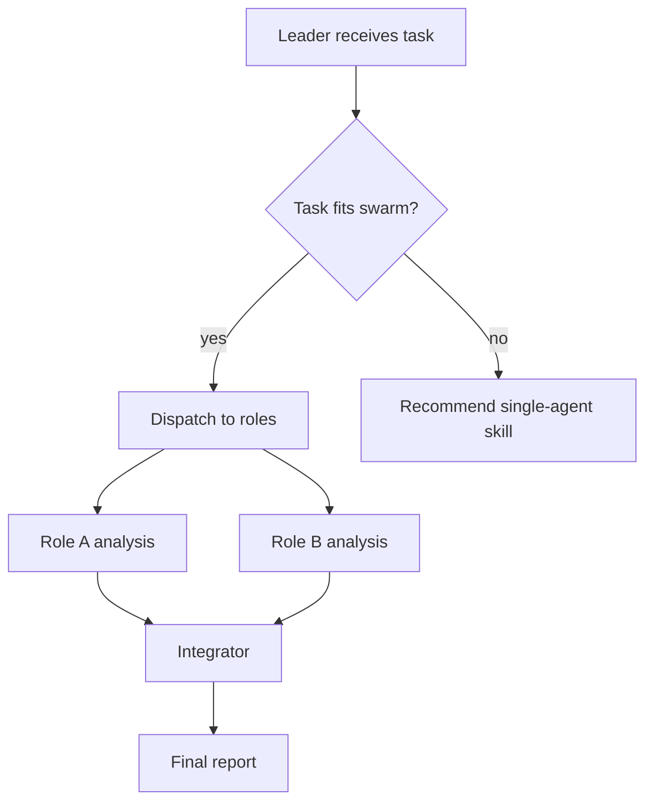

# Swarm Skills Technical Specification

## 1. Standard Positioning

A Swarm Skill is the multi-role extension of the Agent Skills standard.

A normal Agent Skill targets a single Agent and describes:

> How one Agent should read knowledge, execute workflows, call scripts, and produce results when it encounters a certain class of tasks.

A Swarm Skill targets a multi-Agent team and describes:

> How a group of Agents should divide work, collaborate, hand off, constrain behavior, handle failures, and summarize output when they encounter a certain class of complex tasks.

So a Swarm Skill is not just multiple prompts placed together, and it is not simply "start a few more Agents".

Its core purpose is to capture a reusable multi-Agent collaboration pattern as a discoverable, loadable, verifiable, and evolvable capability package.

A Swarm Skill that follows the standard should answer at least five questions:

1. When should this team be called?
2. Which roles exist in the team, and what are their responsibility boundaries?
3. How do these roles collaborate: in parallel, in sequence, in cross-review, or in a mixed flow?
4. How does the team handle resource limits, member failures, output conflicts, or oversized inputs?
5. Which existing Skills, tools, or external resources does each role depend on?

---

## 2. Scope of Use

A Swarm Skill is only necessary when a single Agent is structurally insufficient.

If a normal Agent Skill can already complete the task reliably, forcing a team structure only adds cost, context noise, and integration risk.

The standard groups valid Swarm Skill scenarios into three categories.

### 2.1 Cross-review from multiple viewpoints

When a task needs multiple independent judgment perspectives, a single Agent playing multiple roles in sequence easily creates a "same-source viewpoint" problem.

Examples:

- In code review, readability, performance, and security reviewers should discover issues independently.
- In technical design review, architecture, SRE, security, and product representatives should comment from different risk angles.
- In paper review simulation, supporters, opponents, and experiment auditors should not share the same prior assumptions.

The value of this kind of Swarm Skill lies in keeping roles isolated and perspectives different, so the team does not become "one Agent speaking in different tones".

### 2.2 Parallel decomposition

When a task can naturally be split into multiple independent subtasks, multi-Agent parallelism reduces wait time and lowers the risk of cross-contamination between contexts.

Examples:

- Competitive analysis across multiple platforms.
- Reading multiple papers in parallel.
- Parallel macro, industry, financial, and risk analysis in due diligence.
- Generating a large report by chapter and then merging it.

The key here is not role-playing, but subtask splitting, parallel scheduling, and final integration.

### 2.3 Professional pipeline

When a task has clear stages and each stage needs different professional capability or a quality gate, a Swarm Skill can freeze those boundaries.

Examples:

- Paper sharing: read paper -> break down method -> audit experiments -> generate team email.
- Short-video production: topic selection -> script -> storyboard -> title copy -> platform adaptation.
- Incident postmortem: information gathering -> timeline reconstruction -> root cause analysis -> action item definition.

The key here is stage handoff, quality gates, and failure handling, not simple parallelism.

---

## 3. Standard File Structure

A Swarm Skill is a folder. The entry point is still `SKILL.md`, but compared with a normal Agent Skill, it adds role, workflow, constraint, and dependency files.

A complete Swarm Skill in Markdown-spec form usually includes:

```text
example-swarm/
├── SKILL.md
├── roles/
│   ├── role-a.md
│   ├── role-b.md
│   └── role-c.md
├── workflow.md
├── bind.md
└── dependencies.yaml
```

If the collaboration flow can be determined in advance, an executable orchestration script can also be added:

```text
example-swarm/
├── SKILL.md
├── roles/
├── workflow.md
├── bind.md
├── dependencies.yaml
└── scripts/
    └── workflow.py
```

If the user only needs a minimal executable SwarmFlow workflow and does not need a full role spec, the script-only form is also allowed:

```text
example-workflow-swarm/
├── SKILL.md
└── scripts/
    └── workflow.py
```

These three forms correspond to:

1. Markdown spec: complete team collaboration spec, default form.
2. Markdown spec + SwarmFlow: complete team collaboration spec plus executable orchestration.
3. Script-only SwarmFlow: minimal executable workflow for fixed-flow automation.

---

## 4. `SKILL.md` Entry Standard

`SKILL.md` is the entry file for a Swarm Skill.

It allows the system to discover the team before runtime and load the full team spec when needed.

### 4.1 Frontmatter

The frontmatter of `SKILL.md` should at least include:

```yaml
---
name: example-swarm
description: |
  Creates a multi-role team for a specific class of tasks.
  Use when the task needs independent roles, parallel decomposition, or staged collaboration.
  Do NOT use when a single-agent skill is sufficient.
version: "0.1"
kind: swarm-skill
roles:
  - id: role-a
    purpose: Handles one clearly bounded responsibility.
  - id: role-b
    purpose: Handles another clearly bounded responsibility.
---
```

Among these fields:

- `name` should match the directory name and is usually kebab-case.
- `description` should briefly explain what it is, when to use it, and when not to use it.
- `kind` should be marked as `swarm-skill`.
- `roles` should list the team roles and correspond one-to-one with the files under `roles/`.
- Each role's `purpose` should be short and not a long responsibility essay.

### 4.2 Body structure

The body of `SKILL.md` should at least contain:

- `## Workflow`: explains how the team starts working and points to `workflow.md` or `scripts/workflow.py`.
- `## Roles`: lists the roles and explains their place in the team.
- `## Files`: lists the files included in the Swarm Skill and when they should be read.

`SKILL.md` should not carry all details. It is the entry and index, not a giant prompt with all roles, flows, constraints, and dependencies squeezed into one file.

---

## 5. Role File Standard

Each file under `roles/` defines one team role.

The goal of a role file is not to make the Agent "speak in a different tone", but to give each member a clear responsibility, boundary, output format, and collaboration interface.

Each role file should contain at least five sections.

### 5.1 `## Identity`

Role identity.

The first line should be a motto that can reliably anchor the role's stance, for example:

```markdown
> *"I am trying to break this design before production breaks it."*
```

The purpose of this motto is to prevent multiple roles from converging into the same way of thinking.

If two roles could swap mottos, the role boundary is usually not clear enough.

### 5.2 `## Success Criteria`

Success criteria.

This section explains what counts as done for the role, including its focus areas, judgment criteria, and the output content that must be covered.

For example, a security review role should explicitly focus on permissions, injection, sensitive information, and dependency risks, rather than vaguely saying "check security issues".

### 5.3 `## Boundary`

Role boundary.

This section must state both:

- `Forbidden`: what this role should not do.
- `Mandatory`: what this role must do.

Boundary is the core of a Swarm Skill.

Without boundaries, roles will overlap. If the boundaries are too narrow, the role cannot make a useful judgment.

### 5.4 `## Output Schema`

Output format.

Roles should output in a stable structure so the Leader or later stages can integrate results.

The output can be a Markdown template or a JSON-schema-like structure.

The key is to make sure downstream consumers know:

- Which fields will always appear.
- Which content is evidence.
- Which content is judgment.
- Which content the Leader needs to summarize or arbitrate.

### 5.5 `## Inline Persona for Teammate`

Inline role prompt.

Not every runtime automatically reads role files. Therefore, the role file should include a complete prompt that can be pasted directly into a teammate Agent.

When dispatching tasks, the Leader can inline this prompt into the member task so that the member keeps the same role even if it cannot access the file directly.

---

## 6. `workflow.md` Workflow Standard

`workflow.md` describes how the team collaborates.

It focuses on the main flow, not on resource budgets or exception details. Resource limits, timeouts, and failure handling belong in `bind.md`.

A valid `workflow.md` should contain at least three parts.

### 6.1 `## Overview`

The overview should include a Mermaid flowchart that shows:

- How the Leader receives the task.
- Which roles run in parallel.
- Which roles hand off work in sequence.
- Which nodes perform integration.
- Where quality gates or fallback paths exist.

Example:



### 6.2 `## Detailed Steps`

The detailed steps should explain, for each step:

- Who executes it.
- What the input is.
- What the output is.
- Whether it is serial or parallel.
- What the quality gate is.
- If the quality gate fails, whether the system should retry, degrade, request more information, or mark the result incomplete.

Every workflow step should answer "who is responsible for this output".

### 6.3 `## Acceptance Criteria`

Acceptance criteria define what counts as success for one team run.

For example:

- All required roles have produced structured outputs.
- The Leader's summary preserves disagreements instead of flattening them.
- The output covers the key dimensions requested by the user.
- Failed members or missing evidence are clearly marked.
- The final result matches the agreed format.

---

## 7. `bind.md` Constraint Standard

`bind.md` describes team-level constraints.

It answers:

> How should this team be constrained in terms of resources, behavior, and failure scenarios?

Anything with numbers, budgets, exception branches, fallback strategies, or retry rules should go into `bind.md` first.

### 7.1 Resource Constraints

Resource constraints should at least specify:

- Maximum number of parallel members.
- Total wall-clock budget.
- Total token budget.
- Whether each role has a different budget.
- Whether oversized inputs should be chunked, sampled, or degraded.

Resource constraints make the Swarm Skill not just an ideal workflow, but something that can run in a real environment with control.

### 7.2 Behavioral Constraints

Behavior constraints define team-level rules.

Examples:

- Whether the Leader may fill in content that a member did not finish.
- Whether members can see other members' outputs.
- Whether the cross-review stage should be isolated first and visible later.
- Whether the Leader must preserve conflicting viewpoints.
- Whether the final report must cite evidence sources.

These rules are different from a single role's `Boundary`. Role boundaries constrain the member itself; behavioral constraints constrain the team as a whole.

### 7.3 Failure Handling

Failure handling must cover two kinds of problems:

1. Member failure: timeout, empty output, invalid format, tool-call failure.
2. Input overload: oversized files, too many tasks, insufficient context, incomplete evidence.

The standard approach is not to pretend failures never happen, but to define how they are surfaced:

- Whether to retry.
- How many times to retry.
- Whether to skip the member.
- Whether to degrade to a single Agent or shrink the scope.
- How missing information should be marked in the final report.

---

## 8. `dependencies.yaml` Dependency Standard

`dependencies.yaml` records the local Skills, CLI tools, MCP services, or external resources that each role depends on.

Its purpose is not to pile up dependencies, but to make team capabilities auditable, portable, and explainable.

The standard requires:

- `skills` and `tools` should be recorded separately.
- Only a capability with a `SKILL.md` counts as a Skill.
- CLI commands, MCP services, and external programs are tools and should not be written as Skills.
- Even when there are no dependencies, you should still explicitly write empty lists so it is clear that the check was done.
- Dependencies declared in the `SKILL.md` frontmatter should match `dependencies.yaml`.

Example:

```yaml
skills:
  - id: web-research
    source: local
    required: false

tools:
  - id: python
    source: system
    required: false

roles:
  - id: literature-researcher
    skills:
      - web-research
    tools: []
  - id: data-analyst
    skills: []
    tools:
      - python
```

After normalization, the system can determine:

- Whether a role is missing a required tool.
- Whether a team capability can still run after being moved to a new environment.
- Whether it is worth searching community Skills for enhancement.

---

## 9. SwarmFlow Executable Orchestration Standard

SwarmFlow is the executable orchestration layer inside a Swarm Skill.

It does not replace Swarm Skills. Instead, when the workflow can be determined in advance, it writes the collaboration topology into `scripts/workflow.py`.

In one sentence:

> Swarm Skill defines how the team collaborates; SwarmFlow ensures the defined collaboration flow runs reliably.

Tasks suitable for SwarmFlow usually have:

- Fixed stages.
- Clear inputs and outputs.
- Parallelizable subtasks.
- Stable summary nodes.
- Definable failure handling.

Tasks not suitable for SwarmFlow usually include:

- Open-ended discussion.
- Heavy live questioning.
- Multi-round debates and free interaction.
- Tasks where the relationship between roles changes every time.

If `scripts/workflow.py` exists, it should stay consistent with `workflow.md` and `bind.md`:

- Stage names must match.
- Parallel or serial topology must match.
- Failure handling must match.
- The script should not hide extra flows that the docs do not describe.

---

## 10. Creation, Conversion, and Modification

The Swarm Skill standard supports three lifecycle operations.

### 10.1 Creation

When a user proposes a new complex task and that task meets the multi-viewpoint, parallel decomposition, or professional pipeline conditions, a new Swarm Skill can be created.

The creation process should first ask:

> Where exactly is a single Agent not enough?

If that question cannot be answered clearly, the Swarm Skill may be created too early.

### 10.2 Conversion

When an existing single-Agent Skill already implies multiple roles, multiple stages, or multiple quality gates, it can be converted into a Swarm Skill.

The core of conversion is not to split files for the sake of splitting files, but to identify the responsibilities mixed inside the original Skill:

- Which parts are independent roles?
- Which parts are sequential stages?
- Which checks should be parallel?
- What is lost in the single-Agent form?

Conversion is only valuable when the benefit of team-ification can be explained clearly.

### 10.3 Modification

A Swarm Skill can continue to evolve after creation.

Common modifications include:

- Adding or removing roles.
- Adjusting role boundaries.
- Changing the workflow topology.
- Adding failure-handling rules.
- Adding or removing dependencies.
- Upgrading the Markdown spec into an executable version with SwarmFlow.

After every modification, structural consistency should be revalidated.

---

## 11. Validation Standard

A Swarm Skill should support both automated validation and manual review.

### 11.1 Automated validation

Automated validation focuses on structural errors such as:

- Whether required files exist.
- Whether the `SKILL.md` frontmatter contains the required fields.
- Whether `kind` is `swarm-skill`.
- Whether the directory name matches `name`.
- Whether the `roles/` files match the roles in the frontmatter.
- Whether each role file contains the required sections.
- Whether `workflow.md` contains overview, detailed steps, and acceptance criteria.
- Whether `bind.md` contains resource constraints, behavioral constraints, and failure handling.
- Whether `dependencies.yaml` matches the dependencies declared in `SKILL.md`.
- If `workflow.py` exists, whether the script is syntactically valid and has the required entry points.

The goal of automated validation is to make Swarm Skills machine-checkable capability packages, not loose documents.

### 11.2 Manual review

Manual review focuses on semantic quality, such as:

- Does this team really need to exist?
- Do roles overlap?
- Will different roles converge to the same opinion?
- Can the workflow really run, or does it only work on paper?
- Does the failure handling cover real edge cases?
- Is the output structure easy for downstream use?
- Are the dependencies necessary, or do they bind the team too tightly to a specific environment?

Automated validation can catch format problems, but it cannot replace design judgment.

---

## 12. Standardization Value

The value of the Swarm Skills standard is not just to provide a "multi-Agent feature", but to provide a way to capture team capability that is evaluable, reviewable, and reusable.

It allows the system to present four kinds of capability consistently:

### 12.1 Reusability

A successful multi-Agent collaboration no longer stays only in one conversation trajectory; it can be captured as a standard folder.

Later, when similar tasks appear, the system can load this team directly.

### 12.2 Explainability

Roles, boundaries, workflows, dependencies, and failure handling are all written to files.

Developers or users can inspect:

- Why these roles are needed.
- What each role is responsible for.
- How the Leader integrates results.
- How the system handles exceptions.

This is easier to review than only showing a single run result.

### 12.3 Verifiability

A Swarm Skill is not an arbitrary prompt collection; it is a capability package with structural constraints.

The system can use validators to check whether the files are complete, whether the roles are consistent, whether dependencies are declared, and whether the script is compliant.

This helps move multi-Agent collaboration from "experience showcase" to "engineering standard".

### 12.4 Evolvability

A Swarm Skill can work together with the online self-evolution mechanism.

When real use exposes new boundaries, new failure modes, or new user preferences, the system can record experience, propose modifications, and update the team spec after user confirmation.

So a Swarm Skill is not just a static document generated once. It is a team capability unit that can keep improving.

---

## 13. Relationship to Related Concepts

### 13.1 Agent Skill

An Agent Skill is the capability standard for a single Agent.

It captures a single Agent's professional knowledge, operating procedures, scripts, templates, and references.

Swarm Skill inherits the "discover on demand, load on demand, package as a folder" idea from Agent Skills, but expands it to multi-role team collaboration.

### 13.2 Team mode

Team mode is the runtime form of multi-Agent collaboration.

It can temporarily assemble multiple Agents to complete one task.

A Swarm Skill stores a reusable Team collaboration pattern so the next run does not need to assemble the team from scratch.

### 13.3 SwarmFlow

SwarmFlow is the executable orchestration mechanism.

When a Swarm Skill's collaboration flow is stable enough, SwarmFlow can turn the flow into a script.

So SwarmFlow is the executable layer of a Swarm Skill, not a separate alternative concept.

### 13.4 `swarmskill-creator`

`swarmskill-creator` is the companion tool for creating, converting, and modifying Swarm Skills.

It is itself an Agent Skill, but its output is a Swarm Skill.

It is responsible for:

- Deciding whether the task really needs a team.
- Choosing an appropriate collaboration mode.
- Designing roles and boundaries.
- Generating `workflow.md`, `bind.md`, and `dependencies.yaml`.
- Generating `scripts/workflow.py` when needed.
- Running validation to ensure the structure is compliant.

Users usually do not need to hand-write the complete standard files; they can generate and iterate them through `swarmskill-creator`.

---

## 14. Minimal Compliance Checklist

A complete Swarm Skill should satisfy at least the following:

- `SKILL.md` exists and contains valid frontmatter.
- `kind` is marked as `swarm-skill`.
- The directory name matches `name`.
- `description` explains what it is, when to use it, and when not to use it.
- Each role has a corresponding file under `roles/`.
- Each role file contains identity, success criteria, boundary, output format, and inline persona.
- `workflow.md` describes the team topology, steps, and acceptance criteria.
- `bind.md` describes resource constraints, behavioral constraints, and failure handling.
- `dependencies.yaml` describes the Skills and tools each role depends on.
- If `scripts/workflow.py` is included, the script must be consistent with the flow and failure handling described in the docs.
- Revalidate after every modification.

If a capability package only contains multiple prompts, but no role boundaries, workflow, constraints, or dependency declarations, it should not be considered a compliant Swarm Skill.

---

## 15. Summary

The essence of Swarm Skills is to turn multi-Agent collaboration from ad hoc dispatching into a standardized capability.

It writes the questions of "who does what", "how they collaborate", "how failures are handled", "what capability they depend on", and "how to validate" directly into the file system, so multi-Agent teams are no longer just assembled at runtime, but can be discovered, reused, reviewed, executed, and evolved.

Swarm Skills can serve as an important standardized carrier for openJiuwen's self-evolution capability:

- Agent Skills capture the professional capability of a single Agent.
- Swarm Skills capture the collaboration capability of a multi-Agent team.
- SwarmFlow turns stable collaboration flows into executable orchestration.
- Online self-evolution keeps these capabilities improving in real use.

Together, these four parts form openJiuwen's technical path from "being able to complete tasks" to "being able to capture capability, reuse capability, and improve capability".
