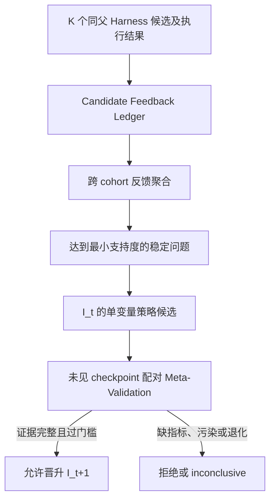

# RSI 第二阶段改造报告：Candidate Feedback 驱动的 Improver 演化

## 1. 状态与目标

- 开始日期：2026-08-10
- 当前状态：代码完成，机制级测试通过，等待真实 `K>1` Meta-Train / Meta-Test 实验
- 前置能力：第一阶段同父候选实验层和 Candidate Feedback Ledger v1
- 核心目标：把多轮候选级反馈转化为可版本化、可比较、可拒绝的 Improver 策略修改
- 兼容边界：未配置策略文件时使用冻结的 `I0`；现有 `K=1` 单 Harness 原子流程行为不变

本阶段不是再增加一个 Agent。被递归改进的对象是当前 Improver 的候选生成约束、候选排序权重和选择预算。每次运行都记录 Improver 版本与策略摘要，因而能够回答“哪一版改进器生成并选择了这个 Harness”。

## 2. 完成的闭环



### 2.1 Feedback Aggregation

系统严格读取一个或多个 Ledger v1，重新校验 cohort 可比性，并汇总：

- Best-of-K、Top-m Gain、Selection Regret；
- 高收益候选落在 Top-m 外、全部候选无正收益和重复候选；
- Skill / Tool 激活失败与不同修改面的目标回退；
- 候选静态排序特征与真实收益的隔离配对关系；
- 每类证据的 available / missing / not-instrumented / not-evaluated 分布。

缺失或未插桩的数据只进入 availability 统计，不会被折算成失败。稳定问题必须在至少两个独立 cohort 中复现，才能提出 Improver 修改候选。

### 2.2 Versioned Improver Policy

`VersionedImproverPolicy` 是递归不可变快照，保存：

- `version_id`、`parent_version_id` 和训练 Ledger 摘要；
- 候选排序权重、候选生成约束和选择预算；
- 产生修改的 evidence refs；
- 完整内容的确定性 SHA-256 摘要。

每个候选只修改一个策略字段，不能原地覆盖父版本。默认 `I0` 精确复现第一阶段排序权重，且不向 Planner 注入额外生成约束。

### 2.3 策略真实接入

策略不只写入报告，而是进入现有执行链：

- Planner 只读取冻结的 generation directives 和 budget policy，不读取同 cohort 的执行结果；
- Ranker 使用当前版本的四个静态特征权重计算候选优先级；
- `budget_policy.top_m` 决定有资格晋升的预测 Top-m，Top-m 外候选仅做影子评测；
- 影子评测保留完整 Best-of-K 证据，并使 Selection Regret 成为真实可学习信号；
- cohort manifest、candidate gate、Ledger、state、report 都记录版本和策略摘要；
- resume 指纹包含策略摘要，避免用另一版 Improver 继续旧 cohort。

### 2.4 Paired Meta-Validation

Meta-Validation 支持两种模式：

- `offline_rerank`：只验证 Top-m 与 Selection Regret，永远不能晋升完整 Improver；
- `live_generation`：比较真实重新生成的候选，要求完整的 Best-of-K、Top-m、Selection Regret、最终 Harness 单位预算收益、回退率和基础设施失败率。

两侧必须逐 checkpoint 冻结 Base Harness、Failure Evidence、模型、K、Top-m、Token / Tool / Runtime Budget、Verifier 和协议。Meta-Train checkpoint 污染、`K=1`、策略身份缺失、两侧策略摘要相同或任何必需指标缺失，都会得到 rejected / inconclusive，而不是发布新版本。

## 3. 子任务与验收

| 编号 | 工作项 | 负责人 | 状态 | 产物 |
| --- | --- | --- | --- | --- |
| P2-A | Feedback 严格汇总与稳定问题诊断 | 子 Agent `p2_feedback` | 完成并验收 | `feedback_analysis.py` 及测试 |
| P2-B | 不可变 Policy、版本和候选修改 | 子 Agent `p2_policy` | 完成并验收 | `policy.py` 及测试 |
| P2-C | 配对 Meta-Validation 和晋升门禁 | 子 Agent `p2_validation` | 完成并验收 | `meta_validation.py` 及测试 |
| P2-D | Policy 接入生成、Ranker、预算和 Ledger | 主 Agent | 完成并验收 | 主控制流、配置和集成测试 |
| P2-E | 操作入口、回归和报告 | 主 Agent | 完成并验收 | CLI、文档和测试记录 |

## 4. 代码产物

- `openjiuwen/rsi/improver_evolution/feedback_analysis.py`
- `openjiuwen/rsi/improver_evolution/policy.py`
- `openjiuwen/rsi/improver_evolution/meta_validation.py`
- `openjiuwen/rsi/single_harness/candidate_feedback.py`
- `openjiuwen/rsi/single_harness/iterative.py`
- `openjiuwen/rsi/member_optimizer/action_planner.py`
- `examples/rsi/evolve_improver_policy.py`
- `examples/rsi/run_workbuddy_office_single_harness.py`

## 5. 操作入口

从真实 Meta-Train Ledger 生成候选策略：

```powershell
uv run python examples/rsi/evolve_improver_policy.py propose `
  --ledger <run-a-candidate_feedback_ledger.yaml> `
  --ledger <run-b-candidate_feedback_ledger.yaml> `
  --output-dir .office_runs/improver_evolution/meta_train_001
```

运行候选策略时，在原 WorkBuddy 命令上增加：

```powershell
--sibling-candidate-count 3 `
--improver-policy-ref <candidate-policy.yaml>
```

对未见 checkpoint 做严格配对验证：

```powershell
uv run python examples/rsi/evolve_improver_policy.py validate `
  --baseline-results <i0-meta-test-results.yaml> `
  --candidate-results <candidate-meta-test-results.yaml> `
  --mode live_generation `
  --output .office_runs/improver_evolution/meta_validation.yaml
```

命令只生成候选与验证报告，不会自动覆盖当前 Improver。发布 `I_{t+1}` 必须以 live Meta-Validation 的 eligible 结果为证据。

## 6. 验收结果

- [x] 多 Ledger 输入经过 schema 和可比性校验。
- [x] 缺失、未插桩或未评测证据不被当作失败。
- [x] 稳定问题达到最小 cohort 支持度后才产生候选。
- [x] Policy 不可变、可序列化、有父版本和内容摘要。
- [x] 默认 `I0` 保留单 Harness 原子能力。
- [x] generation、ranking 和 Top-m selection budget 均接入真实控制流。
- [x] Ledger 与运行状态记录 Improver 身份。
- [x] 离线重排不能触发完整 Improver 晋升。
- [x] Meta-Validation 拒绝污染、不配对、`K=1` 和缺指标证据。
- [x] 定向测试和 Ruff 通过。

完整 RSI 单元回归：`849 passed, 3 skipped`。Ruff 与 `git diff --check` 均通过。

## 7. 当前证据边界

第二阶段的机制已经可运行，但目前不能声称已经得到更强的 `I1`。正在运行的全量任务是 `K=1`，只能验证单 Harness 原子能力，不能产生 Best-of-K 或 Selection Regret。下一步必须使用多个真实 `K>=3` Meta-Train cohort 生成策略候选，再在未参与生成的 checkpoint 上分别运行 `I0` 和候选策略。只有 live 配对结果通过晋升门禁，才能把候选发布为下一版 Improver。

## 8. 变更日志

### 2026-08-10

- 完成跨 cohort 反馈分析、版本化 Policy 与候选生成。
- 完成离线 / 在线配对 Meta-Validation 和晋升证据门禁。
- 将策略接入 Planner、Ranker、Top-m 晋升预算、Ledger 和 resume 身份。
- 增加策略生成与验证命令入口，保留默认 `I0` 和 `K=1` 兼容行为。
