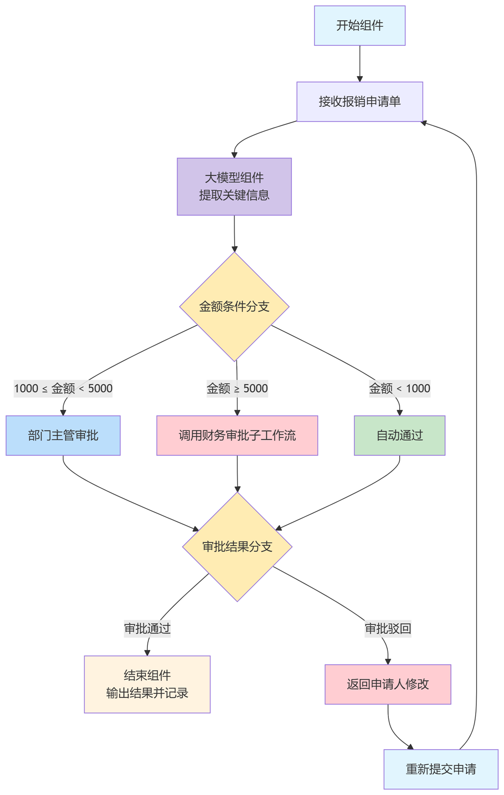

工作流（Workflow）是指多个组件或Agent按照预先设计的编排流程进行有序协作，从而完成复杂任务的一种机制，旨在提升复杂任务的处理效率与稳定性。随着大语言模型能力的提升，单一模型虽具备一定推理和规划能力，但在面对长链路、多步骤或跨领域任务时，常出现遗漏、错误或上下文丢失等问题。此外，实际任务往往需要结合多种能力（如知识检索、API调用、数据处理）协同完成，而缺乏流程化编排的模型调用，难以保证任务的稳定性和可重复性。因此，引入工作流，将任务拆解并合理编排，使各组件各司其职、紧密衔接，是实现系统化智能、构建可落地大模型应用的关键基础。

工作流的核心优势包括：

* 结构化与可控性：将复杂任务拆解为步骤化流程，降低执行过程的不确定性。
* 模块化与复用：不同功能的组件可按需组合，形成灵活可复用的任务管线。
* 稳定性与成功率提升：通过明确的执行顺序与错误处理机制，减少大模型“幻觉”或流程中断。
* 可扩展性：工作流易于与外部系统（数据库、工具API等）集成，支持更复杂的应用场景。
* 可观测性与优化：通过对各步骤的监控与反馈，可持续优化任务执行效果。

## 基本功能

在openJiuwen开发框架中，工作流的构建依赖于控制组件和功能组件两类核心组件。控制组件负责流程的执行控制与编排逻辑，而功能组件则提供具体的能力支持，如大模型调用、提问器、意图识别、工具插件和知识库访问等。通过将这两类组件灵活组合，可构建出功能完整、可独立运行的工作流。

基础的工作流执行控制能力为复杂工作流的构建提供了坚实的支撑，使得各类功能组件能够在流程中灵活编排，实现条件化、并行化、循环化与层次化的执行逻辑，从而满足多样化的业务需求。具体来说，这些基础控制能力包括：

* 开始/结束：用于定义工作流的启动点和终止点，标识流程的生命周期范围。
* 条件分支：基于分支组件或其他具备判断能力的功能组件（如意图识别组件），按照设定条件动态选择后续的执行路径，实现逻辑分支。
* 分支并行：当某个组件后接多个分支时，这些分支可在默认情况下并行执行，从而提升流程的效率。
* 循环：通过条件连接，可跳转回特定的前置组件，从而实现循环逻辑。若需要对局部流程进行循环，可基于定制化的循环组件实现更精细的控制。
* 跳转：可根据执行结果动态决定下一个执行节点，使工作流更加灵活可控。
* 工作流调用：工作流可调用并执行子工作流，从而实现复杂流程的分层与复用。

## 应用场景示例

### 智能客服问答工作流

应用场景：用户向企业客服系统提问，系统需要自动理解问题并给出准确答复。提升客服效率，减少人工成本，同时保障用户体验。

工作流逻辑：

1. 开始组件 → 接收用户问题。
2. 意图识别组件 → 判断问题类别（如“常见问题”、“业务咨询/售后问题”、“无法解答/投诉反馈”）。
3. 条件分支：
   * 若是“常见问题”，进入 知识库检索组件，返回标准答案；
   * 若是“业务咨询/售后问题”，涉及业务操作，则调用工具插件（如订单查询API）获取数据；
   * 若是“无法解答/投诉反馈”，则转接人工。
4. 大模型组件 → 对答案润色并生成自然语言回复。
5. 结束组件 → 返回给用户。

   

      
   

### 智能文档处理与总结工作流

应用场景：批量处理和总结长文档（如合同、论文、报告）。显著减少人工阅读时间，实现快速的结构化信息提取与总结。

工作流逻辑：

1. 开始组件 → 接收待处理文档。
2. 循环组件 → 对文档进行分段处理。
3. 大模型组件 → 对每一段落进行提取与摘要。
4. 分支并行：同时执行关键词抽取和风险点识别。
5. 条件分支 → 根据分析结果选择不同的后续动作（如“发现风险 → 生成风险报告”，“无风险 → 生成简要总结”）。
6. 工作流调用 → 调用汇总子工作流，将各段结果合并。
7. 结束组件 → 输出最终总结或报告。

  

    
  

### 企业内部自动化审批流程

应用场景：员工提交费用报销申请，系统需要自动审核并决定是否通过。减少人工审核工作量，缩短流程时长，提高合规性与透明度。

工作流逻辑：

1. 开始组件 → 接收报销申请单。
2. 大模型组件 → 提取关键信息（如报销金额）。
3. 条件分支：
   * 若报销金额 < 1000 → 自动通过。
   * 若报销金额 >= 1000 且 < 5000 → 跳转至 部门主管审批（人工交互或自动消息推送）。
   * 若报销金额 >= 5000 → 调用 财务审批子工作流。
4. 条件分支：
   * 若审批被驳回，返回申请人修改并重新提交。
   * 若审批通过，完成流程
5. 结束组件 → 输出审批结果并记录到系统。

   

      
   

