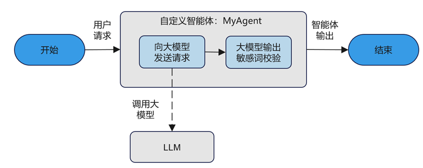

本章节演示了如何基于openJiuwen快速开发自定义智能体。该示例构建的智能体能够调用大模型服务，并且识别大模型输出结果中可能包含的敏感词。通过示例，你将会了解到如下信息：

- 如何继承`AgentConfig`基类，实现自定义智能体的配置类。
- 如何重写`BaseAgent`基类的初始化方法`__init__`，实现自定义智能体的初始化方法。
- 如何实现`BaseAgent`基类定义的批执行抽象接口`invoke`，异步批执行自定义智能体的具体业务逻辑。

# 应用设计流程

本章节设计了一个自定义智能体，实现了一个更安全的智能体：能够基于预置敏感词校验输出答案。为了实现该智能体，开发者需要：

- 设计自定义智能体的配置类。
- 在智能体的初始化方法`__init__`，向智能体配置预设的敏感词列表。
- 在自定义智能体的批执行抽象接口`invoke`中，实现智能体的业务逻辑：结合智能体的默认系统提示词和用户请求，构造调用大模型输入；进而调用大模型服务，并等待获取大模型的返回；最终基于智能体配置的敏感词列表，校验大模型输出，保障智能体不输出恶意信息。

  <div align="center">
    
  </div>

# 前提条件

Python的版本应高于或者等于Python 3.11版本，建议使用3.11.4版本，使用前请检查Python版本信息。

# 安装openJiuwen

用户可选择创建虚拟环境进行openJiuwen的安装，安装命令如下：

```bash
pip install -U openjiuwen
```

# 实现自定义智能体的配置类

为了实现一个智能体能够调用大模型服务，并且识别大模型输出结果中可能包含的敏感词，除了`AgentConfig`中定义的基础配置项（如智能体的`id`、`version`、`description`等），还需要添加自定义配置（具体包括自定义调用大模型的配置信息`model`和自定义的敏感词列表`sensitive_words`）。示例代码如下：

```python
import os
from typing import Optional, List
from pydantic import Field

from openjiuwen.core.foundation.llm import ModelConfig, BaseModelInfo
from openjiuwen.core.single_agent import AgentCard, BaseAgent

API_BASE = os.getenv("API_BASE", "your api url")
API_KEY = os.getenv("API_KEY", "your api token")
MODEL_NAME = os.getenv("MODEL_NAME", "your model name")
MODEL_PROVIDER = os.getenv("MODEL_PROVIDER", "your model provider")

class MyAgentCard(AgentCard):
    model: Optional[ModelConfig] = Field(default=None)
    sensitive_words: List[str] = Field(default_factory=list)


def create_model_config() -> ModelConfig:
    """通过环境变量获取大模型相关的配置信息"""
    return ModelConfig(
        model_provider=MODEL_PROVIDER,
        model_info=BaseModelInfo(
            model=MODEL_NAME,
            api_base=API_BASE,
            api_key=API_KEY,
            temperature=0.7,
            top_p=0.9,
            timeout=30,
        ),
    )

# 创建自定义智能体配置信息的对象
my_agent_card = MyAgentCard(
    id="my_agent_id",
    name="my_agent",
    description="我的自定义智能体",
    model=create_model_config(),  # 配置大模型相关参数信息
    sensitive_words=["自定义敏感词列表"]
)
```

其中，大模型服务的配置信息通过`create_model_config`方法读取环境变量，包括模型提供商（`MODEL_PROVIDER`）、模型名称（`MODEL_NAME`）、大模型服务调用路径（`API_BASE`）和大模型服务认证鉴权信息（`API_KEY`），完成对大模型服务调用对象的配置。

# 实现初始化方法

接下来，开发者需要实现自定义智能体的初始化方法，支持创建自定义智能体的对象。`BaseAgent` 基类的初始化方法为智能体提供了初始化 `Session`、配置管理 `Config` 的能力。除此之外，自定义智能体除了调用 `BaseAgent` 基类的初始化方法，还需要根据大模型的配置信息创建大模型调用对象，并初始化配置的敏感词列表。具体示例如下：

```python
from openjiuwen.core.foundation.llm import (
    Model, ModelClientConfig, ModelRequestConfig
)
from openjiuwen.core.single_agent import AgentCard, BaseAgent

class MyAgent(BaseAgent):
    def __init__(self, agent_card: AgentCard):
        # 初始化配置信息
        super().__init__(agent_card)
        # 获取大模型配置
        self._model_config = agent_card.model
        # 使用 Model + ModelClientConfig / ModelRequestConfig 创建大模型调用对象
        client_config = ModelClientConfig(
            client_provider=self._model_config.model_provider,
            api_key=self._model_config.model_info.api_key,
            api_base=self._model_config.model_info.api_base,
            timeout=self._model_config.model_info.timeout,
            verify_ssl=False,
        )
        request_config = ModelRequestConfig(
            model=self._model_config.model_info.model_name,
            temperature=self._model_config.model_info.temperature,
            top_p=self._model_config.model_info.top_p,
        )
        self._llm = Model(
            model_client_config=client_config,
            model_config=request_config,
        )
        # 初始化配置自定义敏感词列表
        self._sensitive_words = agent_card.sensitive_words

    def configure(self, config) -> 'BaseAgent':
        pass
```

# 实现invoke方法

本示例中的智能体具备以下功能：能够调用大模型服务，并且识别大模型输出结果中可能包含的敏感词。

`invoke`方法用于调用大模型。调用前先将用户输入封装为`HumanMessage`，结合自定义智能体自带的系统提示词`SystemMessage`，作为大模型的输入，得到大模型的返回结果。最后校验大模型的输入中是否包含了自定义的敏感词，一旦大模型输出中含有自定义的敏感词，则输出一段固定话术：对不起，无法回答您的问题。示例代码如下：

```python
from openjiuwen.core.foundation.llm import UserMessage, SystemMessage
from openjiuwen.core.single_agent import Session
from openjiuwen.core.single_agent import BaseAgent

class MyAgent(BaseAgent):
        async def invoke(self, inputs: Dict, session: Session | None = None):
        # inputs是自定义智能体的输入，以llm_inputs为键，用户输入信息作为用户提示词
        user_message = UserMessage(content=inputs.get("llm_inputs", "")).model_dump(exclude_none=True)
        # 自定义智能体的默认系统提示词
        system_message = SystemMessage(content="你是一个AI助手").model_dump(exclude_none=True)
        # 大模型输入包括：系统提示词和用户提示词
        llm_input_messages = [system_message, user_message]
        # 调用模型的异步执行方法方法得到模型的输出
        res = await self._llm.invoke(model=self._model_config.model_info.model_name, messages=llm_input_messages)
        llm_output = res.content
        for word in self._sensitive_words:
            if word in llm_output:
                return "对不起，无法回答您的问题。"
        # 如果大模型输出不包含敏感词，则直接返回大模型输出内容
        return llm_output
```
# 实现stream方法

`stream`方法用于实现智能体的流式调用能力，返回异步迭代器以支持实时响应。在本示例中，为简化实现，该方法直接复用`invoke`的完整处理逻辑，将最终结果以单次流式块形式返回。示例代码如下：

```python
from typing import AsyncIterator, Any

from openjiuwen.core.session.stream.base import StreamMode

class MyAgent(BaseAgent):
    async def stream(self,
            inputs: Any,
            session: Optional[Session] = None,
            stream_modes: Optional[List[StreamMode]] = None
    ) -> AsyncIterator[Any]:
        content = await self.invoke(inputs)
        yield {"type": "answer", "content": content}
```

# 运行自定义智能体

开发者完成自定义智能体的相关实现后，可以调用`invoke`方法、实现异步非流式地运行自定义智能体，示例代码如下：

```python
import asyncio

# 创建自定义智能体的对象
my_agent = MyAgent(my_agent_config)

inputs = {"llm_inputs": "写一个笑话"}
res = asyncio.run(my_agent.invoke(inputs))
print(res)
```

# 完整示例

综合以上步骤，你可以基于 `AgentConfig + Model/ModelClientConfig/ModelRequestConfig` 实现一个完全自定义的智能体，并通过 `invoke/stream` 对外提供同步与流式能力。实际业务中可以在此基础上叠加 Session 管理（如使用 `Session` 读取配置、写入状态、输出流式调试信息等），具体接口请参考 `Session` 章节与 Runner 的高阶用法示例。

```python
import asyncio
import os
from pydantic import Field
from typing import Optional, List, Dict, AsyncIterator, Any

from openjiuwen.core.foundation.llm import (
    ModelConfig, BaseModelInfo, UserMessage, SystemMessage,
    Model, ModelClientConfig, ModelRequestConfig
)
from openjiuwen.core.single_agent import Session
from openjiuwen.core.session.stream.base import StreamMode
from openjiuwen.core.single_agent import AgentCard, BaseAgent

API_BASE = os.getenv("API_BASE", "your api url")
API_KEY = os.getenv("API_KEY", "your api key")
MODEL_NAME = os.getenv("MODEL_NAME", "your model name")
MODEL_PROVIDER = os.getenv("MODEL_PROVIDER", "your model provider")

class MyAgentCard(AgentCard):
    model: Optional[ModelConfig] = Field(default=None)
    sensitive_words: List[str] = Field(default_factory=list)


def create_model_config() -> ModelConfig:
    """通过环境变量获取大模型相关的配置信息"""
    return ModelConfig(
        model_provider=MODEL_PROVIDER,
        model_info=BaseModelInfo(
            model=MODEL_NAME,
            api_base=API_BASE,
            api_key=API_KEY,
            temperature=0.7,
            top_p=0.9,
            timeout=30,
        ),
    )

# 创建自定义智能体配置信息的对象
my_agent_card = MyAgentCard(
    id="my_agent_id",
    name="my_agent",
    description="我的自定义智能体",
    model=create_model_config(),  # 配置大模型相关参数信息
    sensitive_words=["自定义敏感词列表"]
)

class MyAgent(BaseAgent):
    def configure(self, config) -> 'BaseAgent':
        pass

    def __init__(self, agent_card: AgentCard):
        # 初始化配置信息
        super().__init__(agent_card)
        # 获取大模型配置
        self._model_config = agent_card.model
        # 使用 Model + ModelClientConfig / ModelRequestConfig 创建大模型调用对象
        client_config = ModelClientConfig(
            client_provider=self._model_config.model_provider,
            api_key=self._model_config.model_info.api_key,
            api_base=self._model_config.model_info.api_base,
            timeout=self._model_config.model_info.timeout,
            verify_ssl=False,
        )
        request_config = ModelRequestConfig(
            model=self._model_config.model_info.model_name,
            temperature=self._model_config.model_info.temperature,
            top_p=self._model_config.model_info.top_p,
        )
        self._llm = Model(
            model_client_config=client_config,
            model_config=request_config,
        )
        # 初始化配置自定义敏感词列表
        self._sensitive_words = agent_card.sensitive_words

    async def invoke(self, inputs: Dict, session: Session | None = None):
        # inputs是自定义智能体的输入，以llm_inputs为键，用户输入信息作为用户提示词
        user_message = UserMessage(content=inputs.get("llm_inputs", "")).model_dump(exclude_none=True)
        # 自定义智能体的默认系统提示词
        system_message = SystemMessage(content="你是一个AI助手").model_dump(exclude_none=True)
        # 大模型输入包括：系统提示词和用户提示词
        llm_input_messages = [system_message, user_message]
        # 调用模型的异步执行方法方法得到模型的输出
        res = await self._llm.invoke(model=self._model_config.model_info.model_name, messages=llm_input_messages)
        llm_output = res.content
        for word in self._sensitive_words:
            if word in llm_output:
                return "对不起，无法回答您的问题。"
        # 如果大模型输出不包含敏感词，则直接返回大模型输出内容
        return llm_output

    async def stream(self,
            inputs: Any,
            session: Optional[Session] = None,
            stream_modes: Optional[List[StreamMode]] = None
    ) -> AsyncIterator[Any]:
        content = await self.invoke(inputs)
        yield {"type": "answer", "content": content}

# 创建自定义智能体的对象
my_agent = MyAgent(agent_card=my_agent_card)

inputs = {"llm_inputs": "写一个笑话"}
res = asyncio.run(my_agent.invoke(inputs))
print(res)
```

最终输出结果为：

```
为什么程序员不喜欢在夏天出门？

因为他们害怕“中暑”（中暑的拼音是 zhòng shǔ，听起来像“中数”——他们整天都在处理“中数”问题，比如数组下标从0开始还是从1开始，已经够头疼了！）😂
```
