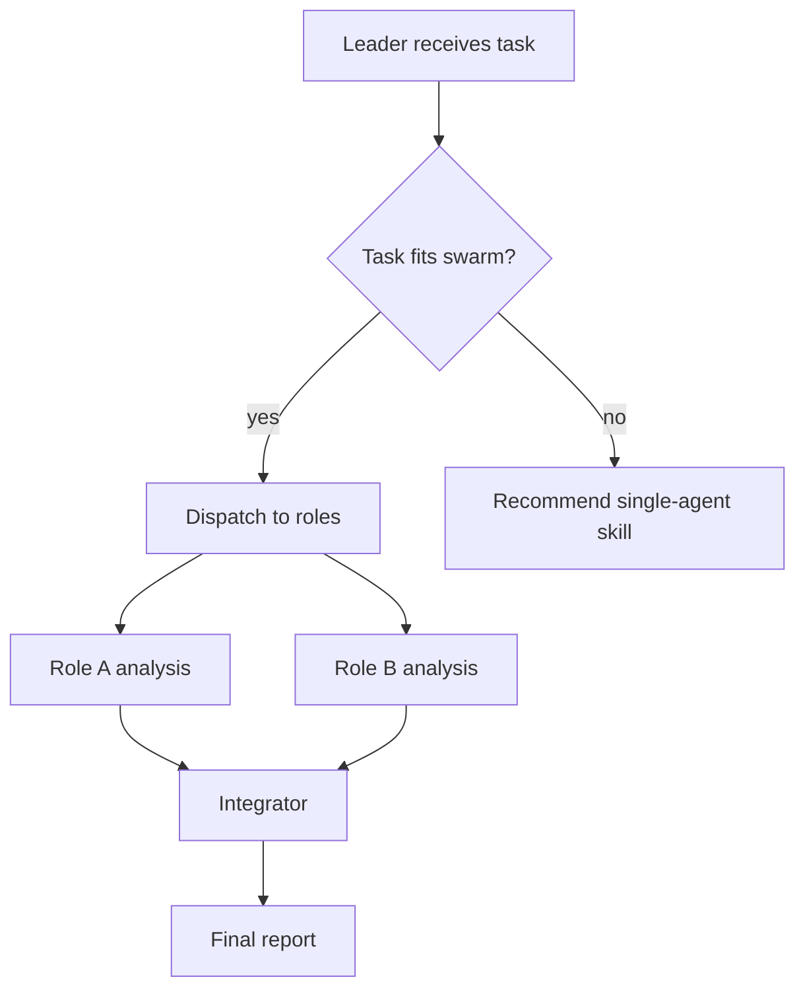

# Swarm Skills 技术标准说明

## 1. 标准定位

Swarm Skill 是 Agent Skills 标准的多角色扩展。

普通 Agent Skill 面向单个 Agent，描述的是：

> 一个 Agent 在遇到某类任务时，应当如何读取知识、执行流程、调用脚本和产出结果。

Swarm Skill 面向多 Agent 团队，描述的是：

> 一组 Agent 在遇到某类复杂任务时，应当如何分工、协作、交接、约束、失败处理和汇总输出。

因此，Swarm Skill 不是简单地把多个 Prompt 放在一起，也不是“多开几个 Agent”。

它的核心是把一次可复用的多 Agent 协作模式沉淀成一个可发现、可加载、可校验、可演进的标准能力包。

一个符合标准的 Swarm Skill 至少应当回答五个问题：

1. 这支团队什么时候应该被调用？
2. 团队中有哪些角色，每个角色的职责边界是什么？
3. 这些角色如何协作，是并行、串行、交叉审查，还是混合流程？
4. 团队在资源受限、成员失败、输出冲突或输入过大时如何处理？
5. 每个角色依赖哪些已有 Skills、工具或外部资源？

---

## 2. 适用边界

Swarm Skill 只在单 Agent 结构性不足时才有必要。

如果一个普通 Agent Skill 已经可以稳定完成任务，强行拆成团队反而会增加成本、上下文噪声和集成风险。

标准中将 Swarm Skill 的合理使用场景归纳为三类。

### 2.1 多视角交叉审查

当任务需要多个相互独立的判断视角时，单 Agent 轮流扮演多个角色容易产生“视角同源”问题。

例如：

- 代码审查中，可读性、性能、安全三个 reviewer 应当独立发现问题。
- 技术方案评审中，架构、SRE、安全、产品代表应当从不同风险面提出意见。
- 论文审稿模拟中，支持者、反对者、实验审计者不应共享同一套先验。

这类 Swarm Skill 的价值在于保持角色隔离和立场差异，避免团队变成“同一个 Agent 的多种语气”。

### 2.2 并行分解

当任务天然可以拆成多个独立子任务时，多 Agent 并行可以减少等待时间，并降低上下文互相污染。

例如：

- 多平台竞品分析。
- 多篇论文并行阅读。
- 金融尽调中的宏观、行业、财务、风险并行研判。
- 大型报告按章节并行生成，再统一整合。

这类 Swarm Skill 的关键不是角色扮演，而是子任务切分、并行调度和最终整合。

### 2.3 专业流水线

当任务有清晰阶段，并且每个阶段需要不同专业能力或质量门时，Swarm Skill 可以固化阶段边界。

例如：

- 论文分享：阅读论文 → 方法拆解 → 实验审计 → 组内邮件生成。
- 短视频生产：选题 → 脚本 → 分镜 → 标题文案 → 平台适配。
- 事故复盘：信息收集 → 时间线还原 → 根因分析 → 改进项制定。

这类 Swarm Skill 的关键是阶段交接、质量门和失败处理，而不是简单并行。

---

## 3. 标准文件结构

Swarm Skill 是一个文件夹。入口仍然是 `SKILL.md`，但相比普通 Agent Skill，它增加了角色、工作流、约束和依赖等文件。

一个完整 Markdown 规范形态的 Swarm Skill 通常包含：

```text
example-swarm/
├── SKILL.md
├── roles/
│   ├── role-a.md
│   ├── role-b.md
│   └── role-c.md
├── workflow.md
├── bind.md
└── dependencies.yaml
```

如果该团队协作流程可以提前确定，还可以增加可执行编排脚本：

```text
example-swarm/
├── SKILL.md
├── roles/
├── workflow.md
├── bind.md
├── dependencies.yaml
└── scripts/
    └── workflow.py
```

如果用户只需要一个最小可执行 SwarmFlow 工作流，而不需要完整角色规范，也允许采用 script-only 形态：

```text
example-workflow-swarm/
├── SKILL.md
└── scripts/
    └── workflow.py
```

这三种形态分别对应：

1. Markdown spec：完整团队协作规范，默认形态。
2. Markdown spec + SwarmFlow：完整团队协作规范，加可执行编排。
3. Script-only SwarmFlow：最小可执行工作流，适合固定流程自动化。

---

## 4. `SKILL.md` 入口标准

`SKILL.md` 是 Swarm Skill 的入口文件。

它负责让系统在运行前发现这支团队，并在需要时加载完整团队规范。

### 4.1 Frontmatter

`SKILL.md` 的 frontmatter 应至少包含：

```yaml
---
name: example-swarm
description: |
  Creates a multi-role team for a specific class of tasks.
  Use when the task needs independent roles, parallel decomposition, or staged collaboration.
  Do NOT use when a single-agent skill is sufficient.
version: "0.1"
kind: swarm-skill
roles:
  - id: role-a
    purpose: Handles one clearly bounded responsibility.
  - id: role-b
    purpose: Handles another clearly bounded responsibility.
---
```

其中：

- `name` 应与目录名一致，通常使用 kebab-case。
- `description` 应简短说明是什么、什么时候用、什么时候不用。
- `kind` 应标记为 `swarm-skill`。
- `roles` 应列出团队角色，并与 `roles/` 下的文件一一对应。
- 每个角色的 `purpose` 只写短目的，不写长篇职责说明。

### 4.2 正文结构

`SKILL.md` 正文至少应包含：

- `## Workflow`：说明团队如何开始工作，并指向 `workflow.md` 或 `scripts/workflow.py`。
- `## Roles`：列出角色清单，解释每个角色在团队中的位置。
- `## Files`：列出本 Swarm Skill 包含的文件及读取时机。

`SKILL.md` 不应承载所有细节。它是入口和索引，不是把全部角色、流程、约束都塞进一个大 Prompt。

---

## 5. 角色文件标准

`roles/` 目录下每个文件定义一个团队角色。

角色文件的目标不是让 Agent “换一种语气说话”，而是给每个成员建立清晰的职责、边界、产出格式和协作接口。

每个角色文件至少应包含五个部分。

### 5.1 `## Identity`

角色身份。

第一行应是一句能稳定角色立场的 motto，例如：

```markdown
> *"I am trying to break this design before production breaks it."*
```

这句 motto 的作用是防止多个角色收敛成同一种思考方式。

如果两个角色的 motto 可以互换，通常说明角色边界不够清楚。

### 5.2 `## Success Criteria`

成功标准。

该部分说明角色怎样才算完成任务，包括关注点、判断标准和必须覆盖的输出内容。

例如安全审查角色应明确关注权限、注入、敏感信息、依赖风险，而不是泛泛写“检查安全问题”。

### 5.3 `## Boundary`

角色边界。

该部分必须同时说明：

- `Forbidden`：这个角色不应该做什么。
- `Mandatory`：这个角色必须做什么。

边界是 Swarm Skill 的核心。

如果没有边界，多个角色会互相覆盖；如果边界过窄，角色又无法完成有价值的判断。

### 5.4 `## Output Schema`

输出格式。

角色应以稳定结构输出，便于 Leader 或后续阶段整合。

输出可以是 Markdown 模板，也可以是 JSON schema 风格的结构。

关键是让下游知道：

- 哪些字段一定会出现。
- 哪些内容是证据。
- 哪些内容是判断。
- 哪些内容需要 Leader 汇总或仲裁。

### 5.5 `## Inline Persona for Teammate`

可内联角色提示词。

并不是所有运行环境都会自动读取角色文件。因此，角色文件需要提供一段可直接粘贴给 teammate Agent 的完整提示词。

Leader 在分发任务时，可以把这段提示词内联进成员任务，保证成员即使不直接访问文件，也能保持角色一致性。

---

## 6. `workflow.md` 工作流标准

`workflow.md` 描述团队如何协作。

它关注主流程，而不是资源预算和异常细节。资源限制、超时、失败处理应放在 `bind.md`。

一个合格的 `workflow.md` 至少应包含三部分。

### 6.1 `## Overview`

概览应包含 Mermaid 流程图，展示：

- Leader 如何接收任务。
- 哪些角色并行执行。
- 哪些角色串行交接。
- 哪些节点负责整合。
- 何处存在质量门或降级路径。

示例：



### 6.2 `## Detailed Steps`

详细步骤应说明每一步：

- 执行者是谁。
- 输入是什么。
- 输出是什么。
- 是串行还是并行。
- 质量门是什么。
- 如果质量门失败，应重试、降级、请求补充信息，还是标记为不完整。

工作流的每一步都应能回答“谁对这个产出负责”。

### 6.3 `## Acceptance Criteria`

验收标准说明一次团队运行怎样才算成功。

例如：

- 所有必需角色均已产出结构化结果。
- Leader 汇总保留了分歧，而不是抹平分歧。
- 输出覆盖了用户要求的关键维度。
- 失败成员或缺失证据被明确标记。
- 最终结果符合约定格式。

---

## 7. `bind.md` 约束标准

`bind.md` 描述团队级约束。

它回答的是：

> 这支团队在资源、行为和失败场景下应当如何被约束？

凡是带有数字、预算、异常分支、降级策略、重试规则的内容，都应优先放入 `bind.md`。

### 7.1 Resource Constraints

资源约束至少应说明：

- 最大并行成员数。
- 总 wall-clock 预算。
- 总 token 预算。
- 单角色是否有不同预算。
- 输入过大时是否分块、抽样或降级。

资源约束使 Swarm Skill 不只是“理想流程”，而是能在真实运行环境中可控执行。

### 7.2 Behavioral Constraints

行为约束定义团队级规则。

例如：

- Leader 是否允许直接补写成员没有完成的内容。
- 成员是否能看到其他成员输出。
- 交叉审查阶段是否先隔离、后互相可见。
- Leader 是否必须保留冲突观点。
- 最终报告是否必须标注证据来源。

这些规则不同于单个角色的 `Boundary`。角色边界约束“成员自己”，行为约束约束“团队整体”。

### 7.3 Failure Handling

失败处理必须覆盖两类问题：

1. 成员失败：超时、输出为空、格式不合格、工具调用失败。
2. 输入超限：文件过大、任务过多、上下文不足、证据不完整。

标准做法不是假装失败不会发生，而是规定失败如何被呈现：

- 是否重试。
- 重试几次。
- 是否跳过该成员。
- 是否降级为单 Agent 或缩小范围。
- 最终报告中如何标记缺失信息。

---

## 8. `dependencies.yaml` 依赖标准

`dependencies.yaml` 记录每个角色依赖的本地 Skills、命令行工具、MCP 服务或外部资源。

它的目的不是堆砌依赖，而是让团队能力可审计、可迁移、可解释。

标准要求：

- `skills` 和 `tools` 应分开记录。
- 一个有 `SKILL.md` 的能力才属于 Skill。
- CLI 命令、MCP 服务、外部程序属于工具，不应写成 Skill。
- 即使没有依赖，也应显式写空列表，表示已经检查过。
- `SKILL.md` frontmatter 中声明的角色依赖，应与 `dependencies.yaml` 保持一致。

示例：

```yaml
skills:
  - id: web-research
    source: local
    required: false

tools:
  - id: python
    source: system
    required: false

roles:
  - id: literature-researcher
    skills:
      - web-research
    tools: []
  - id: data-analyst
    skills: []
    tools:
      - python
```

依赖标准化后，系统可以判断：

- 一个角色是否缺少必要工具。
- 某个团队能力迁移到新环境后是否还能运行。
- 是否值得搜索社区 Skills 进行增强。

---

## 9. SwarmFlow 可执行编排标准

SwarmFlow 是 Swarm Skill 中的可执行编排层。

它不是替代 Swarm Skill，而是在流程可以提前确定时，把协作拓扑写成 `scripts/workflow.py`。

一句话概括：

> Swarm Skill 规定团队如何协作；SwarmFlow 负责让确定的协作流程稳定执行。

适合生成 SwarmFlow 的任务通常具有：

- 固定阶段。
- 明确输入输出。
- 可并行的子任务。
- 稳定的汇总节点。
- 可定义的失败处理。

不适合生成 SwarmFlow 的任务通常包括：

- 开放式讨论。
- 高度依赖临场追问。
- 多轮辩论和自由交互。
- 角色之间关系每次都会变化的任务。

如果存在 `scripts/workflow.py`，它应与 `workflow.md` 和 `bind.md` 保持一致：

- 阶段名称一致。
- 并行或串行拓扑一致。
- 失败处理一致。
- 不应在脚本中隐藏文档没有描述的额外流程。

---

## 10. 创建、转换与修改

Swarm Skill 标准支持三类生命周期操作。

### 10.1 创建

当用户提出一个新的复杂任务，并且该任务满足多视角、并行分解或专业流水线条件时，可以创建新的 Swarm Skill。

创建过程应先判断：

> 单 Agent 当前到底在哪个结构点上不够用？

如果这个问题回答不清楚，说明创建 Swarm Skill 可能过早。

### 10.2 转换

当一个已有单 Agent Skill 中已经隐含多个角色、多个阶段或多个质量门时，可以转换为 Swarm Skill。

转换的核心不是把文件拆多，而是识别原 Skill 中混在一起的职责：

- 哪些是独立角色？
- 哪些是顺序阶段？
- 哪些检查应该并行？
- 单 Agent 形态下丢失了什么？

只有当“团队化带来的收益”能够被清楚说明时，转换才有价值。

### 10.3 修改

Swarm Skill 创建后可以继续调整。

常见修改包括：

- 新增或删除角色。
- 调整角色边界。
- 修改工作流拓扑。
- 增加失败处理规则。
- 增加或删除依赖。
- 将 Markdown 规范升级为带 SwarmFlow 的可执行版本。

每次修改后都应重新校验结构一致性。

---

## 11. 校验标准

Swarm Skill 应支持自动校验和人工审查两层检查。

### 11.1 自动校验

自动校验关注结构性错误，例如：

- 必需文件是否存在。
- `SKILL.md` frontmatter 是否包含必要字段。
- `kind` 是否为 `swarm-skill`。
- 目录名是否与 `name` 一致。
- `roles/` 文件是否与 frontmatter 中的角色一致。
- 角色文件是否包含必要章节。
- `workflow.md` 是否包含概览、详细步骤和验收标准。
- `bind.md` 是否包含资源约束、行为约束和失败处理。
- `dependencies.yaml` 是否与 `SKILL.md` 中声明的依赖一致。
- 如果存在 `workflow.py`，脚本是否语法合法且包含必要入口。

自动校验的目标是让 Swarm Skill 成为可机器检查的能力包，而不是一组松散文档。

### 11.2 人工审查

人工审查关注语义质量，例如：

- 这支团队是否真的有必要存在？
- 角色之间是否职责重叠？
- 不同角色是否会收敛成同一种观点？
- 工作流是否能真实运行，而不是只在文档里成立？
- 失败处理是否覆盖真实边界情况？
- 输出结构是否便于下游使用？
- 依赖是否必要，是否过度绑定特定环境？

自动校验可以发现格式错误，但不能替代设计判断。

---

## 12. 标准化价值

Swarm Skills 标准的意义不只是提供一个“多 Agent 功能点”，而是提供一套可评测、可审查、可复用的团队能力沉淀方法。

它使系统能够稳定呈现四类能力：

### 12.1 可复用性

一次成功的多 Agent 协作不再只停留在一次对话轨迹中，而可以沉淀为标准文件夹。

之后遇到相似任务时，系统可以直接加载这支团队。

### 12.2 可解释性

角色、边界、工作流、依赖和失败处理都被写入文件。

开发者或用户可以检查：

- 为什么需要这些角色。
- 每个角色负责什么。
- Leader 如何整合结果。
- 系统如何处理异常。

这比只展示一次运行结果更容易审查。

### 12.3 可校验性

Swarm Skill 不是任意 Prompt 集合，而是有结构约束的能力包。

系统可以通过校验器检查文件是否完整、角色是否一致、依赖是否声明、脚本是否合规。

这有助于把多 Agent 协作从“经验展示”推进到“工程标准”。

### 12.4 可演进性

Swarm Skill 可以与在线自演进机制结合。

当团队在真实使用中暴露新边界、新失败模式或新用户偏好时，系统可以记录经验、提出修改建议，并在用户确认后更新团队规范。

因此，Swarm Skill 不只是一次性生成的静态文档，而是可持续改进的团队能力单元。

---

## 13. 与相关概念的关系

### 13.1 Agent Skill

Agent Skill 是单 Agent 能力标准。

它沉淀的是一个 Agent 的专业知识、操作流程、脚本、模板和参考资料。

Swarm Skill 继承 Agent Skill 的“按需发现、按需加载、文件夹封装”思想，但扩展到多角色团队协作。

### 13.2 Team 模式

Team 模式是多 Agent 协作的运行形态。

它可以临时组织多个 Agent 完成一次任务。

Swarm Skill 则是把可复用的 Team 协作方式保存下来，使下一次不必重新临场组队。

### 13.3 SwarmFlow

SwarmFlow 是可执行编排机制。

当 Swarm Skill 的协作流程足够稳定时，可以用 SwarmFlow 把流程写成脚本。

因此，SwarmFlow 是 Swarm Skill 的可执行层，而不是与 Swarm Skill 并列的替代概念。

### 13.4 `swarmskill-creator`

`swarmskill-creator` 是创建、转换和修改 Swarm Skills 的配套工具。

它本身是一个 Agent Skill，但它的产物是 Swarm Skill。

它负责：

- 判断任务是否真的需要团队。
- 选择合适的协作模式。
- 设计角色和边界。
- 生成 `workflow.md`、`bind.md`、`dependencies.yaml`。
- 必要时生成 `scripts/workflow.py`。
- 运行校验器，确保结构合规。

用户通常不需要手写完整标准文件，可以通过 `swarmskill-creator` 生成并迭代。

---

## 14. 最小合规清单

一个完整 Swarm Skill 至少应满足以下条件：

- `SKILL.md` 存在，包含合法 frontmatter。
- `kind` 标记为 `swarm-skill`。
- 目录名与 `name` 一致。
- `description` 能说明是什么、什么时候用、什么时候不用。
- `roles/` 中每个角色都有对应文件。
- 每个角色文件包含身份、成功标准、边界、输出格式和可内联提示词。
- `workflow.md` 描述团队拓扑、步骤和验收标准。
- `bind.md` 描述资源约束、行为约束和失败处理。
- `dependencies.yaml` 描述角色依赖的 Skills 和工具。
- 如果包含 `scripts/workflow.py`，脚本与文档中的流程和失败处理一致。
- 修改后必须重新校验。

如果某个能力包只是包含多个 Prompt，但没有角色边界、工作流、约束和依赖声明，它不应被视为合格的 Swarm Skill。

---

## 15. 总结

Swarm Skills 的本质，是把多 Agent 协作从一次性调度变成标准化能力。

它将“谁来做”“如何协作”“如何失败处理”“依赖什么能力”“怎样校验”这些问题显式写入文件系统，使多 Agent 团队不再只是运行时临场组织，而是可以被发现、复用、审查、执行和演进。

Swarm Skills 可以作为 openJiuwen 自演进能力的重要标准化载体：

- Agent Skill 沉淀单个 Agent 的专业能力。
- Swarm Skill 沉淀多 Agent 团队的协作能力。
- SwarmFlow 将稳定协作流程转化为可执行编排。
- 在线自演进让这些能力在真实使用中持续改进。

这四者共同构成 openJiuwen 从“会完成任务”走向“会沉淀能力、复用能力、改进能力”的技术路径。
