# Team Organization 开发文档


## 1. 目标、范围与非目标

Team Organization（简称 Organization）是在既有 Team 之上的跨 Team 协作层。每个 Team 的 Leader 以组织成员身份协作；Team 内部如何管理 teammate、拆分本地任务，不属于 Organization 的职责。

系统应提供：

- 组织创建、成员加入/退出和 owner 管理；
- 共享任务池：创建、认领、委派、开始、完成、失败、审核；
- 根任务可选择逐层责任汇总或内置 Summary Team 汇总；
- 可持久化、可确认的 Leader-to-Leader inbox；
- 事件驱动的 Leader 唤醒，以及重启后的补偿扫描；
- 可审计的任务、消息和事件记录。

本方案不规定：

- Team 内部 Leader/teammate 的调度算法；
- LLM 的业务决策或任务具体执行方式；
- 特定消息中间件、数据库或 Runner 框架；
- 跨数据库分布式事务。一个 Organization 的成员必须访问同一份组织数据存储。

## 2. 设计原则

1. **Leader 是组织协作主体。** 组织级命令只由 Leader 调用；Leader 再通过 Team 内部机制组织本地执行。
2. **持久化状态优先。** 任务、审核和消息先写入数据库；事件只负责通知和唤醒，不能作为唯一事实来源。
3. **状态变化可审计。** 每个影响任务或消息生命周期的动作都应留下活动事件。
4. **显式失败。** 任务失败是正式终态，必须带失败原因和可选产物上下文；不得仅记录日志后继续把任务当作正常进行。
5. **可靠 inbox。** 定向 Leader 消息必须可查询、可确认、可在重启后重新投递，不能因一次 topic 投递而丢失。
6. **运行时只协调，不替代决策。** 运行时可以按事件唤醒 Leader，但“是否认领、如何修复、是否回复”由 Leader 的业务逻辑决定。
7. **根任务决定汇总方式。** Root Leader 在创建根任务时选择汇总模式；组织内置的 Summary Team 只在第三方汇总模式中承担最终整合工作。

## 3. 总体模块图

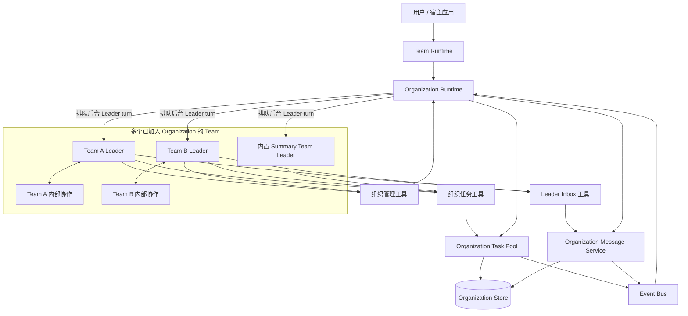

| 模块 | 职责 |
|---|---|
| Organization Runtime | 管理成员绑定、启动内置 Summary Team、订阅事件、去重排队并执行后台 Leader turn。 |
| Organization Task Pool | 维护任务状态机、分配、审核、汇总模式、汇总来源和活动审计。 |
| Organization Message Service | 保存 Leader 消息、投递 inbox 事件、查询未读消息和确认已读。 |
| Organization Store | 保存组织、成员、任务、审核、消息和活动事件，是恢复时的真实来源。 |
| Event Bus | 抽象 Pub/Sub 通知通道；可替换为内存、消息队列或跨进程实现。 |
| Team Runtime / TeamBackend | 使 Leader 具备组织工具，并将组织级任务交给 Team 内部执行；Organization 启动时负责拉起内置 Summary Team。 |

### 3.1 推荐文件架构
以下目录树是目标实现的职责边界：

```text
openjiuwen/agent_teams/organization/
├── __init__.py
├── schema.py
├── events.py
├── task_pool.py
├── message_service.py         
├── manager.py
├── pool.py
├── runtime.py
└── tools.py
```

| 文件 | 主要功能 | 应暴露/承担的接口 | 不应承担的职责 |
|---|---|---|---|
| `__init__.py` | Organization 子包的公共入口。 | 导出领域模型、`OrganizationRuntime`、`OrganizationTaskPool`、`OrganizationMessageService` 等稳定 API。 | 不放业务逻辑，不导出私有工具基类。 |
| `schema.py` | 统一定义领域模型、状态枚举和存储记录。 | `Organization`、`OrganizationMember`、`OrganizationTask`、`TaskAggregationConfig`、`TaskReview`、`LeaderMessage`、`MessageReceipt`、`TaskStatus`、`ReviewStatus`。 | 不读写数据库，不发布事件，不做运行时调度。 |
| `events.py` | 定义事件名、topic 规则和统一事件包装。 | `OrgTopic`、`OrgEventMessage`、任务/审核/消息事件 payload。 | 不保存事件正文，不决定业务状态。 |
| `task_pool.py` | 组织任务池和审核/汇总能力。 | 创建根任务并确定汇总模式、创建并定向委派 Summary Task、认领、委派、开始、完成、失败、审核、查询、汇总来源绑定；任务状态校验和任务审计。 | 不直接驱动 LLM/Leader turn；不保存 Leader inbox 的读取确认。 |
| `message_service.py` | 可靠 Leader inbox。 | 发送、按 ID 获取、列出未读、确认收件状态、恢复未读消息；消息审计和定向/广播投递。 | 不承担任务分配、任务状态迁移或 Team 内部消息。 |
| `manager.py` | 单个 Organization 的轻量 facade。 | 创建/读取组织、注册成员、组合 Task Pool 和 Message Service、暴露订阅/发布入口。 | 不维护全局缓存，不管理多个 Team 的后台执行队列。 |
| `pool.py` | 进程内 manager registry。 | 按 `(store, organization_id, session_id)` 获取、清理或移除 manager。 | 不作为持久化来源；进程重启后不依赖其恢复状态。 |
| `runtime.py` | Organization 运行时协调器。 | 绑定/解绑 Team、启动并绑定内置 Summary Team、订阅事件、消息去重、后台 Leader turn 队列、恢复与补偿扫描。 | 不直接实现任务 SQL，也不替 Leader 作业务决策。 |
| `tools.py` | 将组织能力暴露给 Leader 的结构化工具。 | 组织管理、任务协作、Leader inbox 三类 `org_*` 工具及输入 schema。 | 不承载核心业务状态；调用应委托给 manager、task pool 或 message service。 |

与该目录协作但不属于其内部的模块：`agent_teams/runtime/` 负责 Team 生命周期，`agent_teams/messager/` 提供事件总线实现，`agent_teams/tools/` 提供 Team 内部工具基础设施。Organization 不应重新实现它们。

## 4. 领域模型与状态机

### 4.1 核心数据

| 实体 | 关键字段 | 说明 |
|---|---|---|
| Organization | `organization_id`、`owner_team_id`、`summary_team_id`、`metadata` | 协作边界、owner 与内置 Summary Team 信息。 |
| OrganizationMember | `organization_id`、`team_id`、`leader_id`、`capabilities` | 一个 Team 在组织中的 Leader 身份及能力集合。 |
| OrganizationTask | `task_id`、`parent_task_id`、`root_task_id`、`status`、`assignment`、`aggregation`、`output_context` | 跨 Team 工作项，可组成任务树；根任务保存汇总模式。 |
| TaskReview | `task_id`、`reviewer_team_id`、`review_status`、`verdict` | 子任务完成后的验收记录。 |
| SummarySource | `summary_task_id`、`source_task_id`、`required` | 汇总任务与其来源任务的关联。 |
| LeaderMessage | `message_id`、`from_team_id`、`to_team_id`、`content`、`created_at` | 可靠 inbox 消息正文；广播时正文仍只存储一次。 |
| MessageReceipt | `message_id`、`recipient_team_id`、`recipient_leader_id?`、`read_at`、`handled_at` | 每个收件 Team 的独立收件/确认状态；解决广播消息不能共享单一 `read_at` 的问题。 |
| OrganizationEvent | `event_id`、`event_type`、`payload`、`created_at` | 审计与外部观测使用的轻量活动记录。 |

### 4.2 Task Pool 任务管理 Schema

Task Pool 的核心是 `OrganizationTask`。为便于开发实现，建议采用以下 schema：

```python
class TaskCreator:
    creator_type: Literal["client", "team_leader"]
    creator_id: str
    organization_id: str
    team_id: str | None


class TaskAssignment:
    assignment_type: Literal["unassigned", "claimed", "delegated"]
    team_id: str | None
    leader_id: str | None
    assigned_by_team_id: str | None
    assigned_at: int | None


class TaskOutputSpec:
    spec_type: str = "inline"
    spec_uri: str | None
    description: str | None
    inline_rules: list[str]


class TaskOutputContext:
    result_uri: str | None
    result_hash: str | None
    result_type: str | None
    description: str | None


class TaskAggregationConfig:
    mode: Literal["HIERARCHICAL", "SUMMARY_TEAM"]
    summary_team_id: str | None       # SUMMARY_TEAM 时等于 Organization 的内置 Summary Team
    summary_task_id: str | None       # SUMMARY_TEAM 时由框架创建
    final_output_task_id: str | None  # 最终结果所在任务


class OrganizationTask:
    task_id: str
    parent_task_id: str | None
    root_task_id: str
    created_by: TaskCreator
    status: Literal[
        "OPEN", "DELEGATED", "WAITING_SOURCES", "CLAIMED", "IN_PROGRESS",
        "COMPLETED", "FAILED", "CANCELLED", "EXPIRED",
    ]
    created_at: int
    updated_at: int
    title: str
    description: str
    task_type: str | None
    required_capabilities: list[str]
    assignment: TaskAssignment
    aggregation: TaskAggregationConfig | None  # 仅根任务必填
    output_spec: TaskOutputSpec | None
    output_context: TaskOutputContext | None
    output_abstract: str | None
    failure_reason: str | None       # FAILED 时必填
    failed_at: int | None            # FAILED 时必填
    metadata: dict[str, Any]


class TaskReview:
    review_id: str
    task_id: str
    reviewer_team_id: str
    review_status: Literal["PENDING", "ACCEPTED", "REJECTED", "NEEDS_REVISION"]
    verdict: str | None
    required_changes: list[str]
    created_at: int
    updated_at: int


class TaskSource:
    summary_task_id: str
    source_task_id: str
    source_role: str | None
    required: bool
    created_at: int
```

字段使用说明：

| Schema | 作用 |
|---|---|
| `TaskCreator` | 记录任务由用户还是某个 Leader 创建，以及创建它的 Team。子任务审核依赖 `team_id`。 |
| `TaskAssignment` | 记录任务是否无人认领、已认领或已委派，以及当前由哪个 Team/Leader 负责。 |
| `TaskOutputSpec` | 创建任务时声明期望交付物，例如内联结果、文件 URI、接口说明或验收规则。 |
| `TaskOutputContext` | 完成或失败时提交实际产物的位置、类型、摘要说明等。 |
| `TaskAggregationConfig` | 根任务的汇总方式；第三方汇总时记录内置 Summary Team、框架创建的 Summary Task 与最终结果任务。 |
| `OrganizationTask` | Task Pool 中的主记录；`parent_task_id` 和 `root_task_id` 构成任务树，只有根任务携带 `aggregation`。 |
| `TaskReview` | 父 Team 对完成子任务的验收记录。 |
| `TaskSource` | 汇总任务引用的来源任务；可在来源执行前绑定，只有满足完成条件的必需来源才会使汇总任务启动。 |

### 4.3 任务状态机

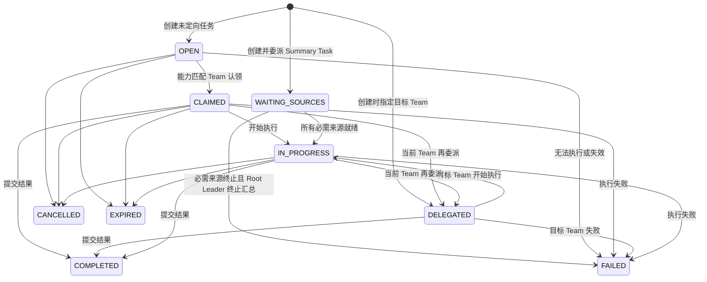

状态约束：

- 创建任务必须带至少一个 `required_capabilities`；
- 只有 `OPEN + UNASSIGNED` 的任务可被认领；
- 只有被分配的 Team 可以 `start`、`complete` 或 `fail`；
- 父任务完成前，其直接子任务必须全部 `COMPLETED` 且审核为 `ACCEPTED`；
- 子任务由创建它的父 Team 审核；
- `WAITING_SOURCES` 只用于框架创建并已定向委派的 Summary Task；所有必需来源完成并通过审核后才能开始执行；
- `FAILED` 是终态。需要重试时，创建新的修复任务或显式的 retry 记录，不复用失败任务。

### 4.4 任务汇总机制

根任务由创建它的 Root Leader 选择汇总模式。该选择决定最终结果由谁产出，不改变普通任务的创建、认领、委派、失败和审核规则。

| 模式 | 适用情况 | 最终输出责任 |
|---|---|---|
| `HIERARCHICAL` | 父任务必须使用直接子任务结果继续加工。 | 每层父 Team 汇总自己的直接子任务；最终由 Root Leader 完成根任务。 |
| `SUMMARY_TEAM` | 多个任务结果相对正交，需要统一结构、表达和结论。 | 内置 Summary Team 完成框架创建并直接委派给它的 Summary Task；Root Leader 将该任务结果返回给用户。 |

#### 4.4.1 内置 Summary Team 的启动与成员关系

Organization 创建或恢复时，Runtime 必须先确保配置的内置 Summary Team 已启动，再把它作为普通 `OrganizationMember` 加入组织。它拥有 `summary` capability、组织任务工具和 Leader inbox 工具，与其他 Team 使用同一份 Organization Store。

```text
create / resume Organization
  → 启动内置 Summary Team
  → 注册为 OrganizationMember（capability: summary）
  → 注入组织工具并订阅 task / inbox topic
  → Organization 对外可用
```

内置 Summary Team 是 Organization 的基础设施成员，不负责主动认领普通开放任务；只有收到直接委派的 Summary Task，或显式收到其他任务委派时才执行。

#### 4.4.2 逐层责任汇总（HIERARCHICAL）

父 Team 创建子任务后，只追踪自己的直接子任务。所有直接子任务完成并审核通过后，父 Team 读取其结果、完成自己的父任务；该过程逐层向上，直到 Root Leader 完成根任务。

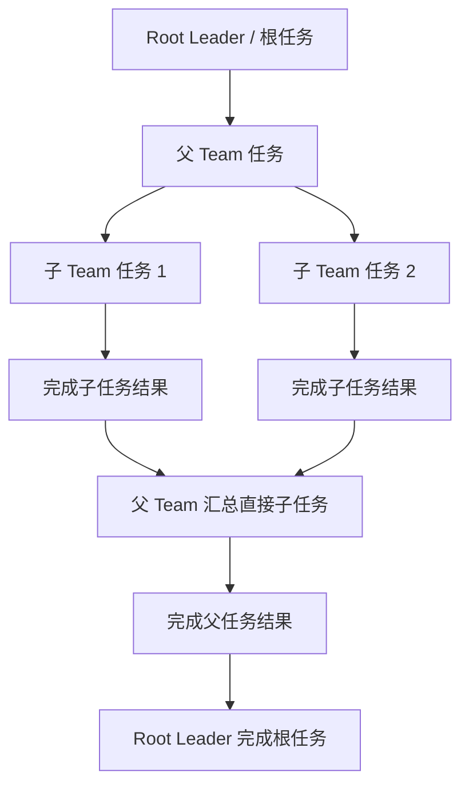

#### 4.4.3 第三方 Summary Team 汇总（SUMMARY_TEAM）

Root Leader 创建根任务时选择 `SUMMARY_TEAM`。框架立即创建一个 `summary_task`，并**直接委派给组织内置 Summary Team**，初始状态为 `WAITING_SOURCES`。Root Leader 再把需要进入最终汇总的任务绑定为来源；所有必需来源就绪后，Runtime 唤醒 Summary Team 执行汇总。

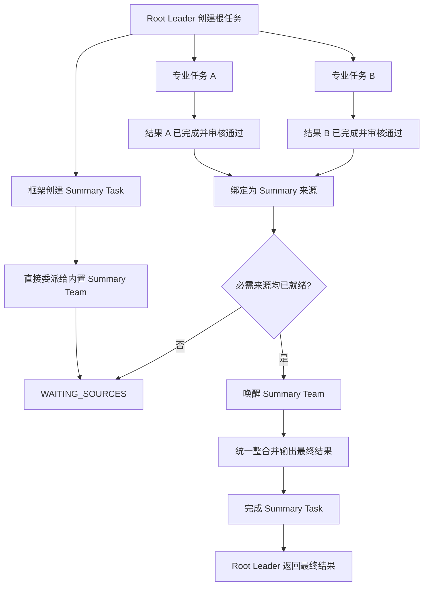

规则：

- `summary_team_id` 必须等于 Organization 的内置 Summary Team；不能改为普通 Team；
- Root Leader 通过 `org_attach_summary_sources` 显式指定来源任务，Summary Team 不扫描整个 Task Pool；
- `required=true` 的来源必须已 `COMPLETED`，且有审核记录时必须为 `ACCEPTED`；
- 任一必需来源失败时，Runtime 发布失败通知并唤醒 Root Leader；Root Leader 可创建补充任务、替换来源或终止根任务；
- Summary Team 不负责复杂评分模型；发现内容缺失或冲突时，使用既有任务工具创建补充任务，完成后再继续汇总。

#### 4.4.4 汇总模式的配置约束

- 仅创建根任务的 Root Leader 可以设置 `aggregation.mode`；子任务不设置该字段；
- 根任务创建后、尚未创建任何工作子任务前，Root Leader 可以显式调整模式；之后禁止直接切换；
- `HIERARCHICAL` 的 `final_output_task_id` 为根任务 ID；`SUMMARY_TEAM` 的 `final_output_task_id` 为 Summary Task ID；
- 根任务状态对用户呈现为完成的前提：对应 `final_output_task_id` 已 `COMPLETED`。

## 5. 核心类图


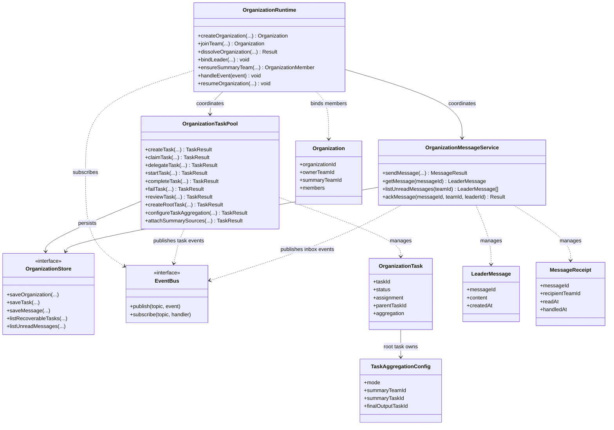

## 6. Org Level Tools

### 6.1 组织管理工具

组织管理工具只允许 Leader 调用。它们改变的是“谁属于组织”，而不是“谁做哪项工作”。

| 工具 | 何时使用 | 关键输入 | 返回与副作用 | 约束 |
|---|---|---|---|---|
| `org_create_organization` | 当前 Team 希望成为一个新协作组织的 owner 时。 | `organization_id`、`display_name?`、`description?`、`summary_team_spec`。 | 创建 Organization、注册当前 Leader 为 owner/member、启动并注册内置 Summary Team，并返回完整组织信息。 | 同一 Team 同一时刻只能绑定一个活动 Organization；Summary Team 启动失败则组织创建失败。 |
| `org_invite_team` | owner 希望把一个已激活的 Team 纳入组织时。 | `organization_id`、`team_id` | 注册目标 Team 的 Leader 与 capabilities，向目标 Team 注入组织能力并发布加入事件。 | 仅 owner 可调用；目标 Team 必须能访问相同的 Organization Store。 |
| `org_list_available_teams` | 邀请前查询当前 session 中有哪些可用 Team 时。 | 可选过滤条件，如能力标签。 | 返回 Team ID、Leader、capabilities 和是否已加入其他组织。 | 只读，不改变成员关系。 |
| `org_view_organization` | 需要确认 owner、成员、能力或组织元数据时。 | `organization_id` | 返回组织详情和成员 roster。 | 只读；非成员是否可见由部署权限策略决定。 |
| `org_dissolve_organization` | 组织任务已结束且不再需要成员绑定时。 | `organization_id` | 解绑成员、取消订阅、清理组织数据，返回清理结果。 | 仅 owner 可调用；应拒绝仍有非终态任务的解散，或要求显式 `force`。 |

休眠 Team 模板发现和自动激活不属于 MVP 工具集；如需支持，应作为 `org_list_configured_teams` 与 `org_activate_and_invite_team` 的增强功能实现。

### 6.2 任务协作工具

任务工具只改变 OrganizationTask 和审核/汇总关系。正式工作分派必须使用这些工具，不能用 Leader 消息替代。

| 工具 | 何时使用 | 关键输入 | 返回与副作用 | 约束 |
|---|---|---|---|---|
| `org_view_tasks` | 认领前、执行前或排障时查询任务。 | `action=list/open/assigned/get`、`task_id?`、`status?`、分页参数。 | 返回任务摘要或完整任务，包含状态、分配、依赖和输出。 | 只读；读取单任务时应校验组织归属。 |
| `org_create_task` | 创建根任务、子任务，或一开始就指定目标 Team 的任务。 | 标题、描述、`required_capabilities`、`parent_task_id?`、目标 Team/Leader 可选；根任务增加 `aggregation_mode`。 | 保存 `OPEN` 或 `DELEGATED` 任务；根任务选择 `SUMMARY_TEAM` 时，框架同时创建并直接委派 `summary_task` 给内置 Summary Team。 | 能力集合不能为空；仅 Root Leader 可设置 `aggregation_mode`；子任务必须继承正确的 `root_task_id`。 |
| `org_configure_task_aggregation` | Root Leader 在尚未开始拆分工作前需要调整根任务汇总方式时。 | `root_task_id`、`aggregation_mode`。 | 更新根任务汇总配置；切换到 `SUMMARY_TEAM` 时创建并直接委派 Summary Task。 | 仅根任务创建者可调用；一旦已创建工作子任务或已绑定来源即拒绝修改。 |
| `org_claim_task` | 某 Team 能力满足开放任务且决定承担时。 | `task_id`。 | 原子更新 `OPEN -> CLAIMED`，设置 Team/Leader 分配信息，发布认领事件。 | 仅允许 `OPEN + UNASSIGNED`；并发竞争时只有一个 Team 成功。 |
| `org_delegate_task` | 当前承担 Team 发现任务应交给另一个 Team 时。 | `task_id`、目标 Team、目标 Leader 可选。 | 更新为 `DELEGATED`，记录委派方并向目标 inbox 发布任务事件。 | 调用者必须是当前分配 Team；终态任务不可委派。 |
| `org_update_task(action=start)` | 当前 Team 准备开始已认领/已委派工作时。 | `task_id`。 | 更新为 `IN_PROGRESS`。 | 不发布完成/失败事件；只能由被分配 Team 调用；Summary Task 只能在来源就绪后由 Runtime 唤醒启动。 |
| `org_update_task(action=complete)` | 当前 Team 已产出最终结果时。 | `task_id`、`output_context`、`output_abstract`。 | 校验父子门禁后更新为 `COMPLETED`，保存结果并发布完成事件。 | 父任务的直接子任务必须全部完成且审核通过。 |
| `org_update_task(action=failed)` | 当前 Team 判断任务不可恢复、无法继续或交付失败时。 | `task_id`、`failure_reason`、`output_context?`。 | 更新为 `FAILED`，持久化失败原因和已有产物，发布失败事件。 | `FAILED` 是终态；重试须创建修复任务或显式 retry，不得静默重开原任务。 |
| `org_view_child_tasks` | 父 Team 需要检查子任务推进情况时。 | `parent_task_id`、`only_mine?`。 | 返回直接子任务及其状态、分配和审核摘要。 | 只读；默认只返回当前 Team 创建的子任务。 |
| `org_view_pending_reviews` | 父 Team 收到子任务完成/失败事件后决定是否验收时。 | 分页参数。 | 返回等待当前 Team 审核的完成子任务及结果。 | 失败子任务不应伪装成待接受结果，应走失败处理策略。 |
| `org_review_task` | 父 Team 对已完成子任务做验收时。 | `task_id`、`ACCEPTED/REJECTED/NEEDS_REVISION`、`verdict?`、`required_changes?`。 | 保存审核结果并发布审核事件。 | 仅任务创建 Team 可审核；未完成任务不可审核。 |
| `org_create_summary_task` | 仅用于独立的非根任务汇总。根任务的第三方汇总由 `org_create_task(aggregation_mode=SUMMARY_TEAM)` 自动创建。 | 标题、描述、来源任务可选。 | 创建可直接委派的汇总任务。 | 不得替代根任务的自动 Summary Task；指定内置 Summary Team 时应使用直接委派。 |
| `org_attach_summary_sources` | Root Leader 为自动创建的 Summary Task 指定最终汇总来源时。 | `summary_task_id`、`source_task_ids`、`required?`、`source_role?`。 | 保存来源关联；所有必需来源就绪后发布 `org_summary_sources_ready`。 | 仅 Root Leader 可为根任务的 Summary Task 绑定来源；来源必须属于同一根任务；执行完成且有审核记录时，审核必须为 `ACCEPTED`。 |
| `org_view_summary_sources` | 汇总 Team 执行前读取已绑定的来源任务和产物时。 | `summary_task_id`。 | 返回汇总任务、来源任务、输出和审核信息。 | 只读。 |

### 6.3 Leader Inbox 工具

Leader inbox 用来记录 Team Leader 之间的沟通。它不负责派发工作；要派发工作，请使用任务工具。

| 工具 | 用来做什么 | 什么时候调用 | 输入 | 返回/变化 |
|---|---|---|---|---|
| `org_send_leader_message` | **发一条新消息。** | 要告诉其他 Team API 约定、依赖、阻塞或验收要求时。 | `content`、目标 Team/Leader 可选。 | 创建消息，返回 `message_id`，通知目标 Team。 |
| `org_get_leader_message` | **查看一条指定消息。** | 已经拿到某个 `message_id`，需要看它的完整内容时。 | `message_id`。 | 返回这条消息的正文、发送方和当前处理状态；不会把消息标记为已处理。 |
| `org_list_leader_messages` | **查看收件箱列表。** | 不知道有哪些待处理消息，或者 UI 要展示 inbox 时。 | `unread_only?`、分页参数。 | 返回多条消息的列表；不改变消息状态。 |
| `org_ack_leader_message` | **确认消息已处理。** | 已经根据消息完成回复、建任务，或确认无需处理时。 | `message_id`、处理结果可选。 | 将当前 Team 对这条消息标记为“已处理”；重复通知不会再次唤醒该 Team。 |

最常见的接收流程只有四步：

```text
收到消息通知（message_id）
  → get：读取这一条消息
  → 处理：回复、创建任务，或确认无需动作
  → ack：标记本 Team 已处理
```

简单区分：`send` 是发新消息，`get` 是打开一条已知消息，`list` 是浏览多条消息，`ack` 是处理完后的确认。消息事件只传递 `message_id`，正文仍从 Store 查询；广播消息由每个接收 Team 分别确认。

### 6.4 事件协议

事件使用统一包装：

```text
OrgEventMessage = {
  event_type: string,
  payload: object,
  sender_id: string
}
```

| 事件 | 必要 payload | 作用 |
|---|---|---|
| `org_task_created` | `task_id`、能力需求引用 | 发现能力匹配的 Team。 |
| `org_task_claimed` | `task_id`、认领 Team | 唤醒认领 Team 继续执行。 |
| `org_task_delegated` | `task_id`、目标 Team | 唤醒目标 Team 执行。 |
| `org_task_completed` | `task_id` | 触发父任务审核和后续任务匹配。 |
| `org_task_failed` | `task_id`、失败 Team、失败摘要 | 触发父 Team 或 owner 进行修复、重派。 |
| `org_task_review_requested` | `task_id`、父任务、审核 Team | 通知父 Team 审核。 |
| `org_task_reviewed` | `task_id`、审核结论 | 更新父任务推进条件。 |
| `org_summary_sources_ready` | `summary_task_id` | 所有必需来源就绪，唤醒内置 Summary Team。 |
| `org_summary_source_failed` | `summary_task_id`、`source_task_id`、失败摘要 | 通知 Root Leader 补充、替换来源或终止根任务。 |
| `org_summary_completed` | `root_task_id`、`summary_task_id` | 通知 Root Leader 读取并返回最终汇总结果。 |
| `org_leader_message` | `message_id`、目标 Team | 投递可靠 Leader inbox。 |
| `org_team_joined` / `org_team_left` | `team_id` | 更新成员与观测视图。 |

## 7. 核心流程

### 7.1 创建组织并加入 Team

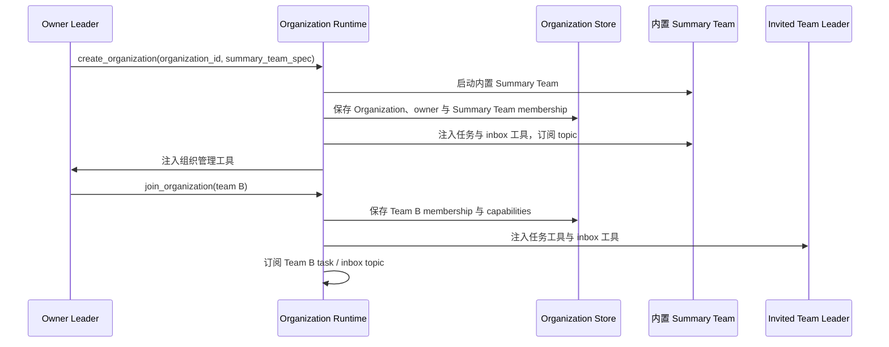

### 7.2 任务认领、完成与失败

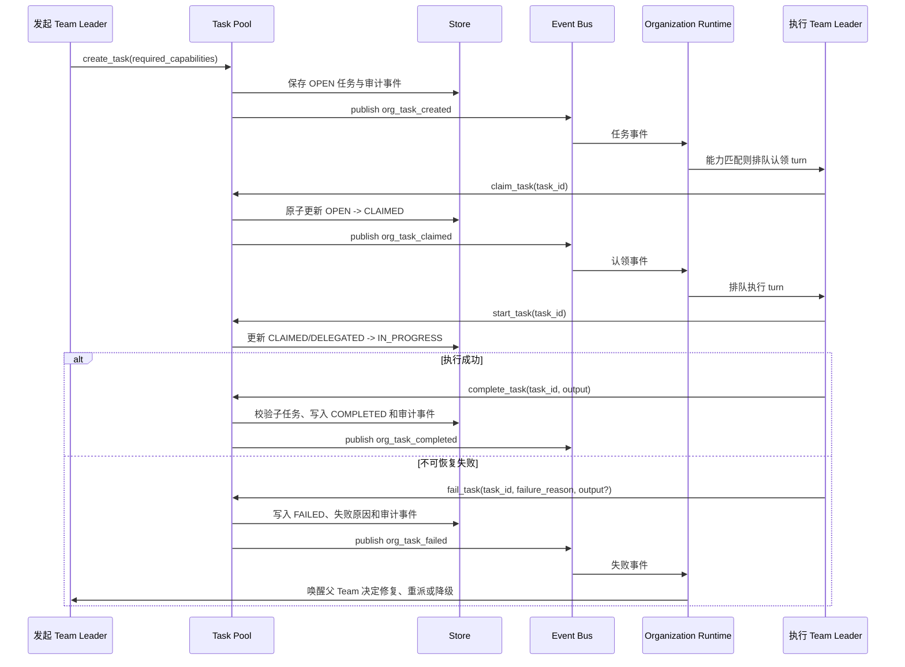

`failure_reason` 应足以让父 Team 或 owner 判断下一步：创建修复任务、委派给其他 Team、降低交付范围，或结束根任务并向用户报告失败。

### 7.3 子任务审核与修复

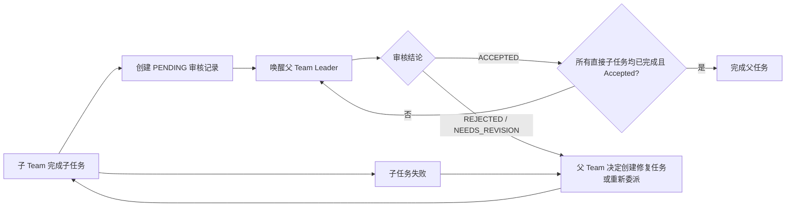

“创建多少个修复任务”是业务策略，不由Task Pool隐式限制。若产品需要限制次数，应在任务 metadata 中保存 `retry_count` / `retry_limit`，并由 Task Pool 强制校验。

### 7.4 第三方 Summary Team 汇总

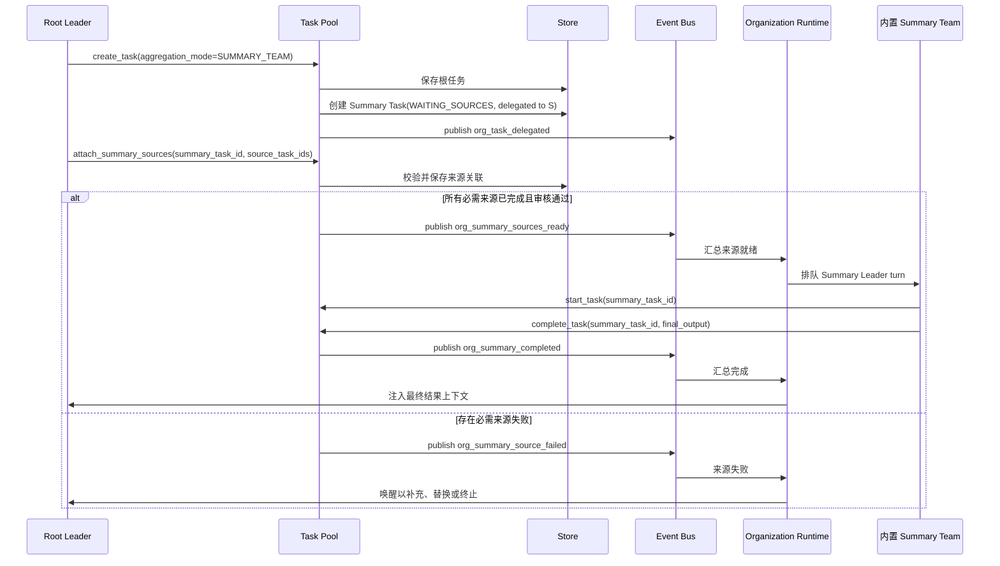

Root Leader 不需要等待 Summary Team 自主认领：Summary Task 在根任务创建时已经直接委派给内置 Summary Team。Root Leader 只负责定义来源任务；Summary Team 只处理已绑定来源的最终整合。

### 7.5 Leader 消息投递、处理与确认

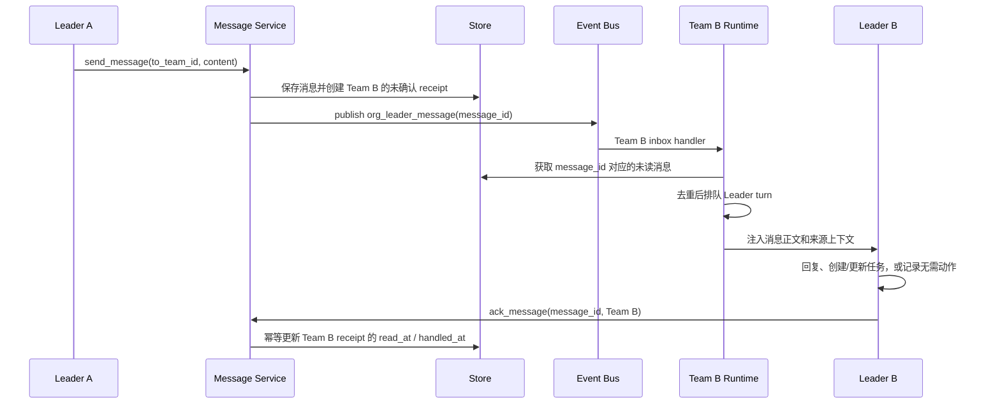

处理规则：

- 已确认消息不再重复投递；
- runtime 应按 `message_id` 去重，避免重复事件导致多个 Leader turn；
- Leader turn 失败、未执行或进程中断时不得确认消息；恢复扫描会再次投递未读消息；
- 广播消息为每个目标 Team 建立独立收件状态，避免一个 Leader 的确认覆盖其他 Leader；
- 正式工作分派仍使用任务接口，消息只用于契约、依赖、阻塞与协商。

## 8. 可靠性：恢复与补偿扫描

本节属于 MVP。因为事件总线可能丢失通知、重复投递，且运行时可能重启，所以必须通过持久化状态补偿，而非依赖事件历史。

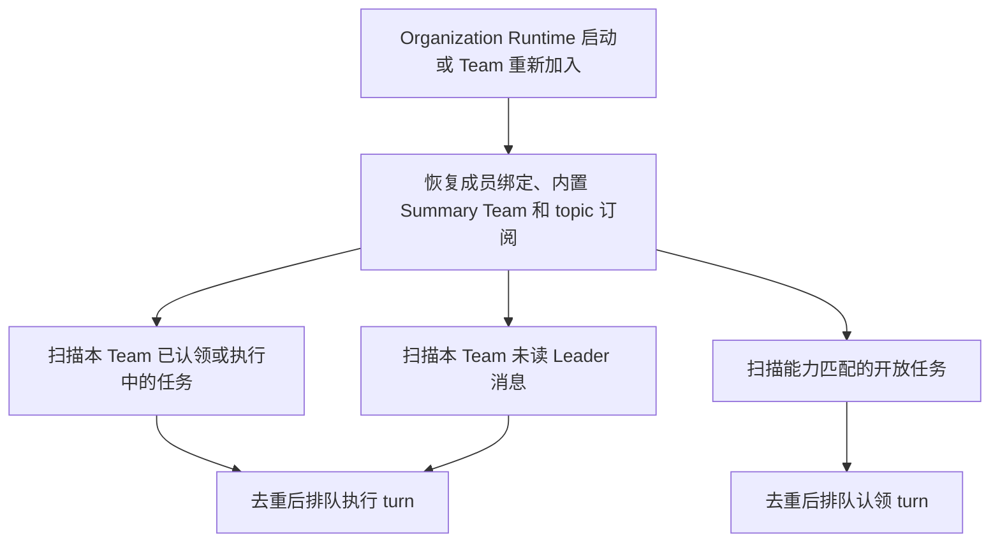

最小恢复要求：

- 任务状态、消息状态和审核状态必须可持久化查询；
- 重启后恢复 `CLAIMED` / `IN_PROGRESS` 任务的处理机会；
- 重启后确保内置 Summary Team 已启动，并恢复 `WAITING_SOURCES` Summary Task 的来源就绪检查；
- 重启后重新投递未确认的 Leader 消息；
- 所有事件处理必须容忍重复；任务状态转换和消息确认必须幂等。

增强阶段可增加退避重试、死信队列、任务租约、执行超时、跨多个 Organization 的恢复策略和更丰富的观测指标。
