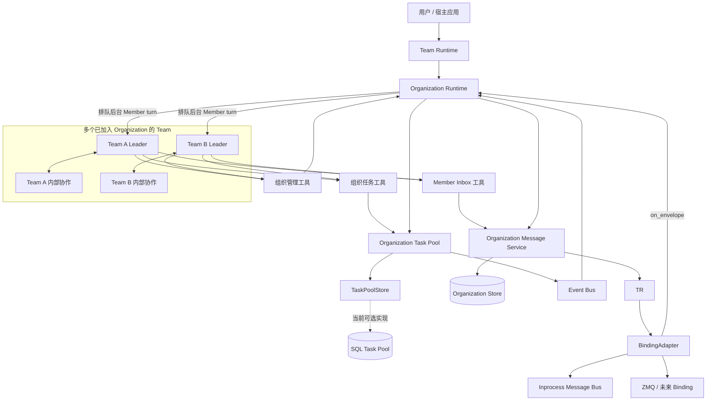
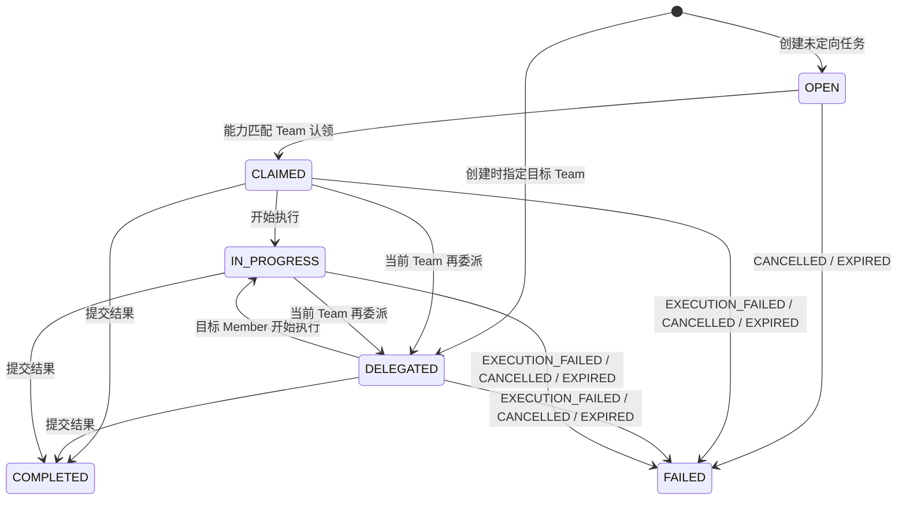
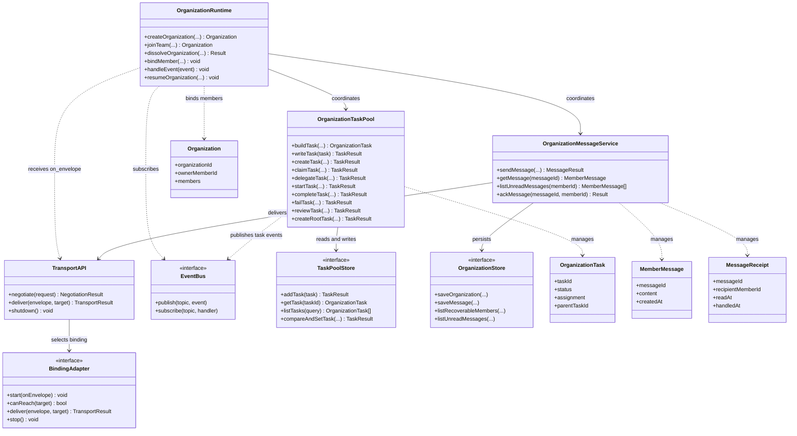
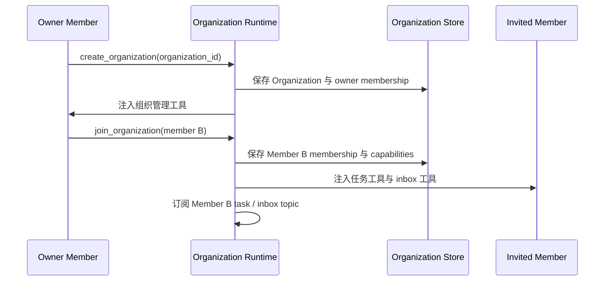
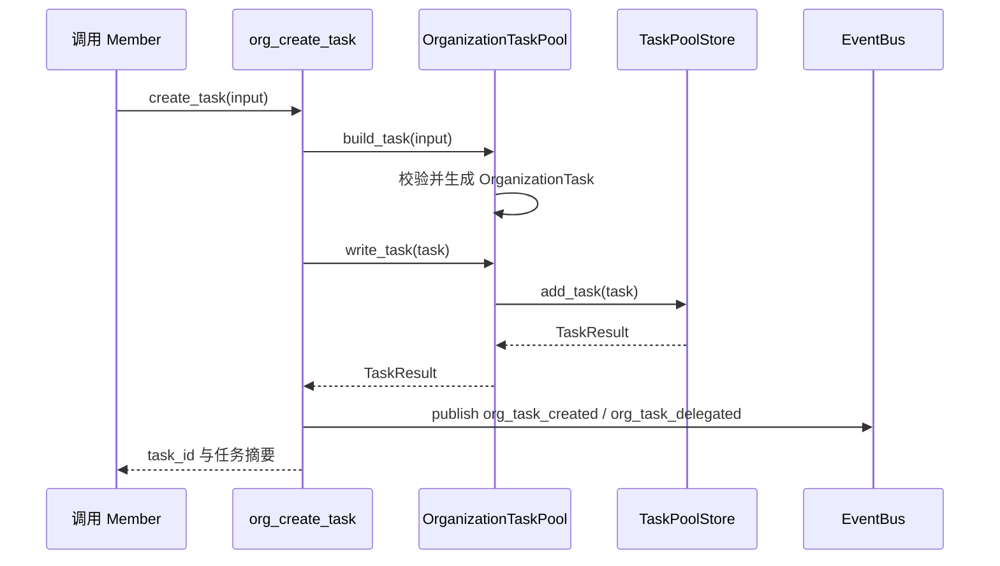
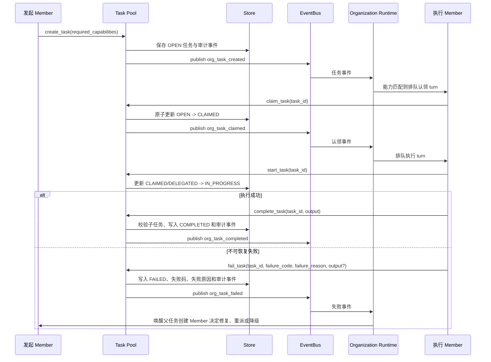
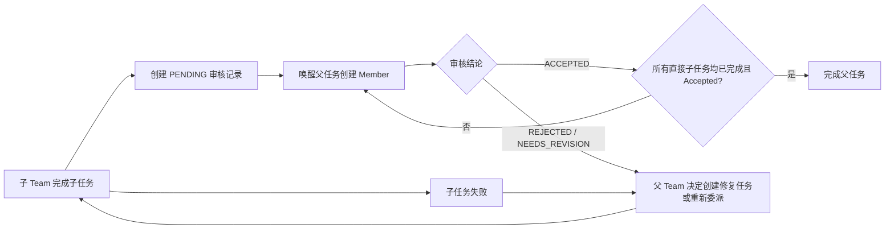
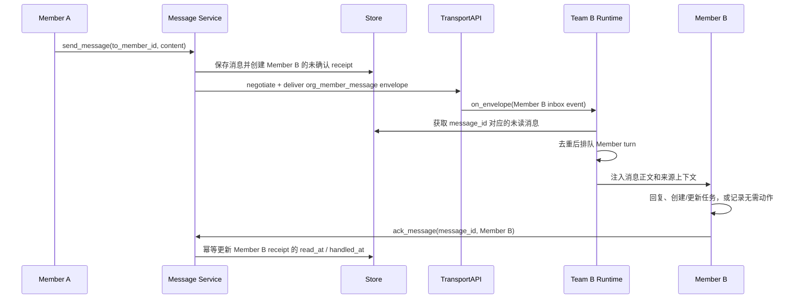
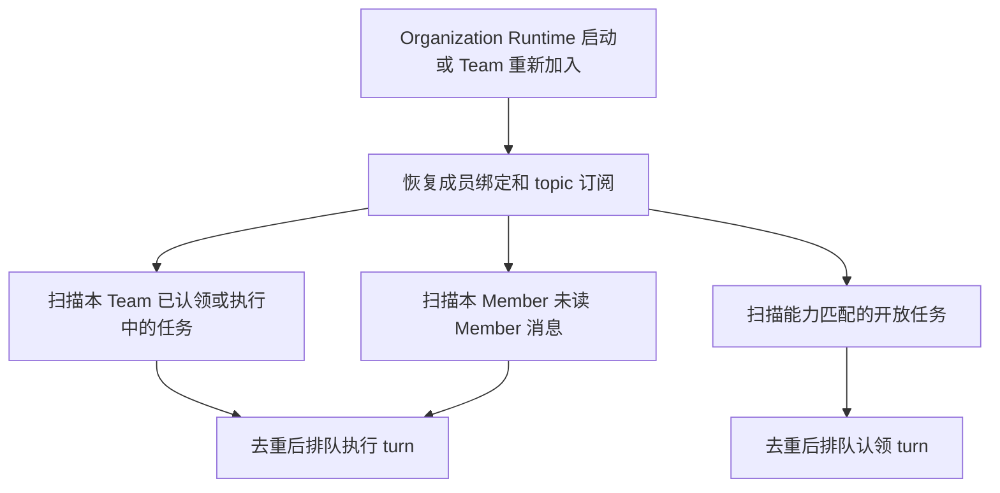

# Team Organization 开发文档


## 1. 目标、范围与非目标

Team Organization（简称 Organization）是在既有 Team 之上的跨 Team 协作层。可以邀请已有的Team的Leader或者其他Agent以member形式加入，内部协作逻辑是针对组织内已有Organization Member的一种分布式的协作。

系统应提供：

- 组织创建、成员加入/退出和 owner 管理；
- 共享任务池：创建、认领、委派、开始、完成、失败、审核；
- 父子任务、定向委派和逐层责任汇总；
- 可持久化、可确认的 Member-to-Member inbox；
- 事件驱动的 Member 唤醒，以及重启后的补偿扫描；
- 可审计的任务、消息和事件记录。

本方案不规定：

- Team 内部 Leader/teammate 的调度算法；
- LLM 的业务决策或任务具体执行方式；
- 特定消息中间件、数据库或 Runner 框架；
- 跨数据库分布式事务。一个 Organization 的成员必须访问同一份组织数据存储。

## 2. 设计原则

1. **Member 是组织协作主体。** Org Level命令只由 Member 调用；
2. **持久化状态优先。** 任务、审核和消息先写入数据库；事件只负责通知和唤醒，不能作为唯一事实来源。
3. **状态变化可审计。** 每个影响任务或消息生命周期的动作都应留下活动事件。
4. **显式失败。** 任务失败是正式终态，必须带失败原因和可选产物上下文；不得仅记录日志后继续把任务当作正常进行。
5. **可靠 inbox。** 定向 Member 消息必须可查询、可确认、可在重启后重新投递，不能因一次 topic 投递而丢失。
6. **运行时只协调，不替代决策。** 运行时可以按事件唤醒 Member，但“是否认领、如何修复、是否回复”由 Member 的业务逻辑决定。
7. **扩展汇总不固化。** 框架只提供任务创建、定向委派和父子任务关系；开发者可将汇总工作创建为普通任务并委派给任意具备汇总能力的 Member。

## 3. 总体模块图



| 模块 | 职责 |
|---|---|
| Organization Runtime | 管理成员绑定、订阅事件、去重排队并执行后台 Member turn。 |
| Organization Task Pool | 维护任务状态机、分配、审核和活动审计；通过 Task Pool 存储接口读写任务。 |
| TaskPoolStore | Task Pool 的存储抽象；当前可由 SQL 实现，未来可替换为其他存储或远程服务。 |
| Organization Message Service | 保存 Member 消息、投递 inbox 事件、查询未读消息和确认已读。 |
| Organization Store | 保存组织、成员、消息和活动事件，是恢复时的真实来源；任务的持久化由 `TaskPoolStore` 负责。 |
| Event Bus | Task Pool 的任务事件通道；负责将任务创建、认领、委派、完成等事件交给 Runtime。 |
| TransportAPI | Member-to-Member 消息的传输抽象；直接对接现有 Message Bus，并为未来 binding 预留协商与投递接口。 |
| BindingAdapter | 具体消息传输 binding 的适配器；当前适配 Inprocess Message Bus，未来可加入 ZMQ 等实现。 |
| Team Runtime / TeamBackend | 使 Leader 具备组织工具，并将组织级任务交给 Team 内部执行。 |

### 3.1 推荐文件架构
以下目录树是目标实现的职责边界：

```text
openjiuwen/agent_teams/organization/
├── __init__.py
├── schema.py
├── events.py
├── transport_api.py            # Protocol Layer 的通信抽象
├── transport_adapter.py        # BindingAdapter 协议与具体适配器
├── task_pool.py
├── task_pool_store.py           # Task Pool 存储抽象
├── task_pool_sql.py             
├── message_service.py         
├── manager.py
├── pool.py
├── runtime.py
└── tools.py
```

| 文件 | 主要功能 | 应暴露/承担的接口 | 不应承担的职责 |
|---|---|---|---|
| `__init__.py` | Organization 子包的公共入口。 | 导出领域模型、`OrganizationRuntime`、`OrganizationTaskPool`、`OrganizationMessageService` 等稳定 API。 | 不放业务逻辑，不导出私有工具基类。 |
| `schema.py` | 统一定义领域模型、状态枚举和存储记录。 | `Organization`、`OrganizationMember`、`OrganizationTask`、`TaskReview`、`MemberMessage`、`MessageReceipt`、`TaskStatus`、`ReviewStatus`。 | 不读写数据库，不发布事件，不做运行时调度。 |
| `events.py` | 定义事件名、topic 规则和统一事件包装。 | `OrgTopic`、`OrgEventMessage`、`TransportEnvelope`、任务/审核/消息事件 payload。 | 不保存事件正文，不决定业务状态。 |
| `transport_api.py` | Member 消息的 Protocol Layer 入口。 | `TransportAPI` 的构造、协商、投递和关闭。 | 不参与 Task Pool 的写入或任务事件投递，不做消息去重或端到端 ACK。 |
| `transport_adapter.py` | Transport binding 适配层。 | `BindingAdapter`、Inprocess 与 ZMQ 等具体 adapter。 | 不决定最佳 binding，不解释 Organization 事件。 |
| `task_pool.py` | 组织任务池应用服务。 | 构造任务、调用 `TaskPoolStore` 写入任务、认领、委派、开始、完成、失败、审核和查询；任务状态校验和审计。 | 不直接依赖 SQL/数据库实现，不直接驱动 LLM/Member turn。 |
| `task_pool_store.py` | Task Pool 的可替换存储接口。 | `add_task`、`get_task`、`list_tasks`、`compare_and_set_task` 等原子读写能力。 | 不解释任务业务规则，不发布事件。 |
| `task_pool_sql.py` | Task Pool 的 SQL 实现。 | 实现 `TaskPoolStore`；将任务和审计持久化到数据库。 | 不成为唯一实现；未来可替换为内存、远程服务或队列实现。 |
| `message_service.py` | 可靠 Member inbox。 | 发送、按 ID 获取、列出未读、确认收件状态、恢复未读消息；消息审计和定向/广播投递。 | 不承担任务分配、任务状态迁移或 Team 内部消息。 |
| `manager.py` | 单个 Organization 的轻量 facade。 | 创建/读取组织、注册成员、组合 Task Pool 和 Message Service、暴露订阅/发布入口。 | 不维护全局缓存，不管理多个 Team 的后台执行队列。 |
| `pool.py` | 进程内 manager registry。 | 按 `(store, organization_id, session_id)` 获取、清理或移除 manager。 | 不作为持久化来源；进程重启后不依赖其恢复状态。 |
| `runtime.py` | Organization 运行时协调器。 | 绑定/解绑 Team、订阅事件、消息去重、后台 Member turn 队列、恢复与补偿扫描。 | 不直接实现任务存储，也不替 Leader 作业务决策。 |
| `tools.py` | 将组织能力暴露给 Member 的结构化工具。 | 组织管理、任务协作、Member inbox 三类 `org_*` 工具及输入 schema。 | 不承载核心业务状态；调用应委托给 manager、task pool 或 message service。 |

与该目录协作但不属于其内部的模块：`agent_teams/runtime/` 负责 Team 生命周期，`agent_teams/messager/` 提供当前 Inprocess Message Bus 等底层传输实现，`agent_teams/tools/` 提供 Team 内部工具基础设施。Organization 通过 `BindingAdapter` 接入它们，不应直接依赖具体实现。

## 4. 领域模型与状态机

### 4.1 核心数据

| 实体 | 关键字段 | 说明 |
|---|---|---|
| Organization | `organization_id`、`owner_member_id`、`metadata` | 协作边界与 owner 信息。 |
| OrganizationMember | `organization_id`、`member_id`、`capabilities` | 一个成员在组织中的身份及能力集合。 |
| OrganizationTask | `task_id`、`parent_task_id`、`root_task_id`、`status`、`assignment`、`output_context` | 跨 Team 工作项，可组成任务树。 |
| TaskReview | `task_id`、`reviewer_member_id`、`review_status`、`verdict` | 子任务完成后的验收记录。 |
| MemberMessage | `message_id`、`from_member_id`、`to_member_id`、`content`、`created_at` | 可靠 inbox 消息正文；广播时正文仍只存储一次。 |
| MessageReceipt | `message_id`、`recipient_member_id`、`read_at`、`handled_at` | 每个收件成员的独立收件/确认状态；解决广播消息不能共享单一 `read_at` 的问题。 |
| OrganizationEvent | `event_id`、`event_type`、`payload`、`created_at` | 审计与外部观测使用的轻量活动记录。 |

### 4.2 Task Pool 任务管理 Schema

Task Pool 的核心是 `OrganizationTask`。为便于开发实现，建议采用以下 schema：

```python
class TaskCreator:
    creator_type: Literal["client", "member"]
    creator_id: str
    organization_id: str
    member_id: str | None


class TaskAssignment:
    assignment_type: Literal["unassigned", "claimed", "delegated"]
    member_id: str | None
    assigned_by_member_id: str | None
    assigned_at: int | None


class TaskOutputSpec:
    spec_type: str = "inline"
    spec_uri: str | None
    description: str | None
    inline_rules: list[str]


class TaskOutputContext:
    result_uri: str | None
    result_hash: str | None
    result_type: str | None
    description: str | None


class OrganizationTask:
    task_id: str
    parent_task_id: str | None
    root_task_id: str
    created_by: TaskCreator
    status: Literal[
        "OPEN", "DELEGATED", "CLAIMED", "IN_PROGRESS",
        "COMPLETED", "FAILED",
    ]
    created_at: int
    updated_at: int
    title: str
    description: str
    task_type: str | None
    required_capabilities: list[str]
    assignment: TaskAssignment
    output_spec: TaskOutputSpec | None
    output_context: TaskOutputContext | None
    output_abstract: str | None
    failure_code: Literal[
        "EXECUTION_FAILED", "CANCELLED", "EXPIRED",
    ] | None                         # FAILED 时必填
    failure_reason: str | None        # FAILED 时必填，补充人类可读原因
    failed_at: int | None             # FAILED 时必填
    metadata: dict[str, Any]


class TaskReview:
    review_id: str
    task_id: str
    reviewer_member_id: str
    review_status: Literal["PENDING", "ACCEPTED", "REJECTED", "NEEDS_REVISION"]
    verdict: str | None
    required_changes: list[str]
    created_at: int
    updated_at: int


```

字段使用说明：

| Schema | 作用 |
|---|---|
| `TaskCreator` | 记录任务由用户还是某个成员创建，以及创建成员的 `member_id`。 |
| `TaskAssignment` | 记录任务是否无人认领、已认领或已委派，以及当前由哪个成员负责。 |
| `TaskOutputSpec` | 创建任务时声明期望交付物，例如内联结果、文件 URI、接口说明或验收规则。 |
| `TaskOutputContext` | 完成或失败时提交实际产物的位置、类型、摘要说明等。 |
| `OrganizationTask` | Task Pool 中的主记录；`parent_task_id` 和 `root_task_id` 构成任务树；失败时用 `failure_code` 区分具体失败类型。 |
| `TaskReview` | 父任务创建成员对完成子任务的验收记录。 |

### 4.3 任务状态机



状态约束：

- 创建任务必须带至少一个 `required_capabilities`；
- 只有 `OPEN + UNASSIGNED` 的任务可被认领；
- 只有被分配的成员可以 `start`、`complete` 或 `fail`；
- 父任务完成前，其直接子任务必须全部 `COMPLETED` 且审核为 `ACCEPTED`；
- 子任务由创建它的父任务创建成员审核；
- `FAILED` 是唯一失败终态；`failure_code` 必须为 `EXECUTION_FAILED`、`CANCELLED` 或 `EXPIRED` 之一。需要重试时，创建新的修复任务或显式的 retry 记录，不复用失败任务。

失败码说明：

| `failure_code` | 使用时机 |
|---|---|
| `EXECUTION_FAILED` | 被分配 Member 在执行过程中确认无法完成任务。 |
| `CANCELLED` | 用户、owner 或具有取消权限的系统操作主动终止任务。 |
| `EXPIRED` | 任务超过 deadline、租约或允许执行时长，由系统终止。 |

### 4.4 汇总与高级协作扩展

框架不内置 Summary Team、汇总任务类型或汇总来源模型。开发者若需要第三方汇总（例如自定义 Summary Team），可使用普通任务能力实现：创建一条具备 `summary` 能力要求的任务，通过 `org_delegate_task` 定向委派给自行提供的汇总 Member，并在任务描述或 `output_context` 中传入待整合的任务结果。

逐层责任汇总无需额外框架能力：父任务创建成员读取其直接子任务的已验收结果，完成父任务后继续向上提交。任何更复杂的汇总、评估、来源快照或专用 Summary Team 生命周期，均作为开发者在本架构之上实现的扩展特性。

## 5. 核心类图




## 6. Org Level Tools

### 6.1 组织管理工具

组织管理工具只允许 Organization Member 调用。它们改变的是“谁属于组织”，而不是“谁做哪项工作”。

| 工具 | 何时使用 | 关键输入 | 返回与副作用 | 约束 |
|---|---|---|---|---|
| `org_create_organization` | 当前 Member 希望成为一个新协作组织的 owner 时。 | `organization_id`、`display_name?`、`description?`。 | 创建 Organization、注册当前 Member 为 owner，并返回完整组织信息。 | 汇总 Team 等高级能力由开发者基于普通成员和任务委派机制扩展。 |
| `org_invite_member` | owner 希望把一个已激活的 Member 纳入组织时。 | `organization_id`、`member_id` | 注册目标 Member 的 capabilities，向目标 Member 注入组织能力并发布加入事件。 | 仅 owner 可调用；目标 Member 必须能访问相同的 Organization Store。 |
| `org_list_available_members` | 邀请前查询当前 session 中有哪些可用 Member 时。 | 可选过滤条件，如能力标签。 | 返回 Member ID、capabilities 和是否已加入其他组织。 | 只读，不改变成员关系。 |
| `org_view_organization` | 需要确认 owner、成员、能力或组织元数据时。 | `organization_id` | 返回组织详情和成员 roster。 | 只读；非成员是否可见由部署权限策略决定。 |
| `org_dissolve_organization` | 组织任务已结束且不再需要成员绑定时。 | `organization_id` | 解绑成员、取消订阅、清理组织数据，返回清理结果。 | 仅 owner 可调用；应拒绝仍有非终态任务的解散，或要求显式 `force`。 |

休眠 Team 模板发现和自动激活不属于 MVP 工具集；如需支持，应作为 `org_list_configured_teams` 与 `org_activate_and_invite_team` 的增强功能实现。

### 6.2 任务协作工具

任务工具只改变 OrganizationTask 和审核/汇总关系。正式工作分派必须使用这些工具，不能用 Member 消息替代。

| 工具 | 何时使用 | 关键输入 | 返回与副作用 | 约束 |
|---|---|---|---|---|
| `org_view_tasks` | 认领前、执行前或排障时查询任务。 | `action=list/open/assigned/get`、`task_id?`、`status?`、分页参数。 | 返回任务摘要或完整任务，包含状态、分配、依赖和输出。 | 只读；读取单任务时应校验组织归属。 |
| `org_create_task` | 创建根任务、子任务，或一开始就指定目标 Member 的任务。 | 标题、描述、`required_capabilities`、`parent_task_id?`、目标 `member_id?`。 | 先构造并校验 `OrganizationTask`，再通过 `TaskPoolStore.add_task` 写入 Task Pool；成功后发布创建或委派事件。 | 能力集合不能为空；子任务必须继承正确的 `root_task_id`；工具不得直接依赖某种数据库。 |
| `org_claim_task` | 某 Member 能力满足开放任务且决定承担时。 | `task_id`。 | 原子更新 `OPEN -> CLAIMED`，设置 Member 分配信息，发布认领事件。 | 仅允许 `OPEN + UNASSIGNED`；并发竞争时只有一个 Member 成功。 |
| `org_delegate_task` | 当前承担 Member 发现任务应交给另一个 Member 时。 | `task_id`、目标 `member_id`。 | 更新为 `DELEGATED`，记录委派方并向目标 inbox 发布任务事件。 | 调用者必须是当前分配 Member；终态任务不可委派。 |
| `org_update_task(action=start)` | 当前 Member 准备开始已认领/已委派工作时。 | `task_id`。 | 更新为 `IN_PROGRESS`。 | 不发布完成/失败事件；只能由被分配 Member 调用。 |
| `org_update_task(action=complete)` | 当前 Member 已产出最终结果时。 | `task_id`、`output_context`、`output_abstract`。 | 校验父子门禁后更新为 `COMPLETED`，保存结果并发布完成事件。 | 父任务的直接子任务必须全部完成且审核通过。 |
| `org_update_task(action=failed)` | 当前 Member 判断任务不可恢复、无法继续或交付失败时。 | `task_id`、`failure_code`、`failure_reason`、`output_context?`。 | 更新为 `FAILED`，持久化失败码、失败原因和已有产物，发布失败事件。 | `FAILED` 是终态；`failure_code` 必填；重试须创建修复任务或显式 retry，不得静默重开原任务。 |
| `org_view_child_tasks` | 父任务创建 Member 需要检查子任务推进情况时。 | `parent_task_id`、`only_mine?`。 | 返回直接子任务及其状态、分配和审核摘要。 | 只读；默认只返回当前 Member 创建的子任务。 |
| `org_view_pending_reviews` | 父任务创建 Member 收到子任务完成/失败事件后决定是否验收时。 | 分页参数。 | 返回等待当前 Member 审核的完成子任务及结果。 | 失败子任务不应伪装成待接受结果，应走失败处理策略。 |
| `org_review_task` | 父任务创建 Member 对已完成子任务做验收时。 | `task_id`、`ACCEPTED/REJECTED/NEEDS_REVISION`、`verdict?`、`required_changes?`。 | 保存审核结果并发布审核事件。 | 仅任务创建 Member 可审核；未完成任务不可审核。 |


### 6.3 Member Inbox 工具

Member inbox 用来记录 Organization Member 之间的沟通。它不负责派发工作；要派发工作，请使用任务工具。

| 工具 | 用来做什么 | 什么时候调用 | 输入 | 返回/变化 |
|---|---|---|---|---|
| `org_send_member_message` | **发一条新消息。** | 要告诉其他 Member API 约定、依赖、阻塞或验收要求时。 | `content`、目标 `member_id?`。 | 创建消息，返回 `message_id`，通知目标 Member。 |
| `org_get_member_message` | **查看一条指定消息。** | 已经拿到某个 `message_id`，需要看它的完整内容时。 | `message_id`。 | 返回这条消息的正文、发送方和当前处理状态；不会把消息标记为已处理。 |
| `org_list_member_messages` | **查看收件箱列表。** | 不知道有哪些待处理消息，或者 UI 要展示 inbox 时。 | `unread_only?`、分页参数。 | 返回多条消息的列表；不改变消息状态。 |
| `org_ack_member_message` | **确认消息已处理。** | 已经根据消息完成回复、建任务，或确认无需处理时。 | `message_id`、处理结果可选。 | 将当前 Member 对这条消息标记为“已处理”；重复通知不会再次唤醒该 Member。 |

最常见的接收流程只有四步：

```text
收到消息通知（message_id）
  → get：读取这一条消息
  → 处理：回复、创建任务，或确认无需动作
  → ack：标记本 Member 已处理
```

简单区分：`send` 是发新消息，`get` 是打开一条已知消息，`list` 是浏览多条消息，`ack` 是处理完后的确认。消息事件只传递 `message_id`，正文仍从 Store 查询；广播消息由每个接收 Member 分别确认。

### 6.4 TransportAPI 通信接口

Organization 的 Protocol Layer 不直接依赖当前的 Inprocess Message Bus，而是经 `TransportAPI` 发送和接收 Member-to-Member 的 `TransportEnvelope`。`org_send_member_message` 先持久化消息和 receipt，再调用 `TransportAPI` 投递。Task Pool 的写入、状态迁移和任务事件不经过 `TransportAPI`，仍由 `TaskPoolStore` 与 `EventBus` 负责。

```python
class TransportAPI:
    """Protocol Layer 看到的 Transport Layer 接口。"""

    def __init__(
        self,
        adapters: list[BindingAdapter],
        on_envelope: Callable[[TransportEnvelope], Awaitable[None]],
    ) -> None: ...

    async def negotiate(
        self, request: NegotiationRequest,
    ) -> NegotiationResult: ...

    async def deliver(
        self,
        envelope: TransportEnvelope,
        target: DataInterface,
    ) -> TransportResult: ...

    async def shutdown(self) -> None: ...
```

其中 `TransportEnvelope` 至少携带 `request_id`、事件类型、payload 与发送方身份；`DataInterface` 携带 `binding` 与目标地址。`request_id` 是上层进行去重和 ACK 关联的稳定键。

构造时，`TransportAPI` 以 `binding_type` 建立 adapter 注册表，依次执行 `adapter.start(on_envelope)`，并汇总各 adapter 的状态变化。`on_envelope` 由 Protocol Layer 在构造时注入；收到信封后由 Runtime 分发给对应 Member，不支持运行时动态替换回调。

`negotiate()` 取本地和远端 `dataInterfaces` 的 binding 名称交集，按 `BINDING_PRIORITY` 选择最佳 binding；v1 不做版本协商。当前只需由配置文件判断双方是否同进程：同进程选择 `inprocess`，跨进程选择 `zmq`。最终可达性仍由 `deliver()` 调用 `adapter.can_reach(target)` 时检查。

`deliver()` 根据 `target.binding` 选择 adapter：可达时调用 `adapter.deliver(envelope, target)`，不可达时返回 `TransportResult(status=FAILED)`。`target` 可以来自 `negotiate()` 的输出，也可以来自用户组队配置等外部已知地址；该接口只承载 Member-to-Member 消息，不承担任务写入、任务状态迁移或任务事件分发。

约束：

- `DELIVERED` 仅表示单跳投递成功；Relay 场景的端到端确认由 Protocol Layer 的 ACK/receipt 机制负责；
- Transport 不保证消息去重；网络重试可能重复投递同一个 `envelope.request_id`，上层负责幂等和去重；
- `shutdown()` 依次调用所有 adapter 的 `stop()`，并且必须幂等；关闭后实例不可复用。

### 6.5 事件协议

事件使用统一包装：

```text
OrgEventMessage = {
  event_type: string,
  payload: object,
  sender_id: string
}
```

| 事件 | 必要 payload | 作用 |
|---|---|---|
| `org_task_created` | `task_id`、能力需求引用 | 发现能力匹配的 Team。 |
| `org_task_claimed` | `task_id`、认领 `member_id` | 唤醒认领 Member 继续执行。 |
| `org_task_delegated` | `task_id`、目标 `member_id` | 唤醒目标 Member 执行。 |
| `org_task_completed` | `task_id` | 触发父任务审核和后续任务匹配。 |
| `org_task_failed` | `task_id`、失败 `member_id`、`failure_code`、失败摘要 | 触发父任务创建 Member 或 owner 进行修复、重派。 |
| `org_task_review_requested` | `task_id`、父任务、审核 `member_id` | 通知审核 Member 审核。 |
| `org_task_reviewed` | `task_id`、审核结论 | 更新父任务推进条件。 |
| `org_member_message` | `message_id`、目标 `member_id` | 投递可靠 Member inbox。 |
| `org_member_joined` / `org_member_left` | `member_id` | 更新成员与观测视图。 |

## 7. 核心流程

### 7.1 创建组织并加入 Team



### 7.2 `org_create_task` 的两步实现

`org_create_task` 固定分为两步，不能把“构造任务”与某种具体数据库写入实现耦合：

```text
1. build_task：校验工具输入，生成完整的 OrganizationTask 领域对象。
2. task_pool_store.add_task：将领域对象写入当前 Task Pool 实现。
```



`TaskPoolStore` 是存储边界。当前实现可以是 `task_pool_sql.py` 的数据库实现；未来可以替换为内存、远程任务服务或其他存储介质，而无需修改 `org_create_task` 的输入协议和任务领域模型。

### 7.3 任务认领、完成与失败



`failure_code` 用于区分失败类型，`failure_reason` 用于补充具体原因。两者应足以让父任务创建 Member 或 owner 判断下一步：创建修复任务、委派给其他 Member、降低交付范围，或结束根任务并向用户报告失败。

### 7.4 子任务审核与修复



“创建多少个修复任务”是业务策略，不由Task Pool隐式限制。若产品需要限制次数，应在任务 metadata 中保存 `retry_count` / `retry_limit`，并由 Task Pool 强制校验。

### 7.5 Member 消息投递、处理与确认



处理规则：

- 已确认消息不再重复投递；
- runtime 应按 `message_id` 去重，避免重复事件导致多个 Member turn；
- Member turn 失败、未执行或进程中断时不得确认消息；恢复扫描会再次投递未读消息；
- 广播消息为每个目标 Member 建立独立收件状态，避免一个 Member 的确认覆盖其他 Member；
- 正式工作分派仍使用任务接口，消息只用于契约、依赖、阻塞与协商。

## 8. 可靠性：恢复与补偿扫描

本节属于 MVP。因为 Transport 可能投递失败、重复投递，且运行时可能重启，所以必须通过持久化状态补偿，而非依赖传输历史。



最小恢复要求：

- 任务状态、消息状态和审核状态必须可持久化查询；
- 重启后恢复 `CLAIMED` / `IN_PROGRESS` 任务的处理机会；
- 重启后重新投递未确认的 Member 消息；
- 所有事件处理必须容忍重复；任务状态转换和消息确认必须幂等。

增强阶段可增加退避重试、死信队列、任务租约、执行超时、跨多个 Organization 的恢复策略和更丰富的观测指标。
