# Booking.com Navigation Skill

## Overview
This skill guides you through the process of searching for and reviewing hotel accommodations on the Booking.com mobile site via Chrome. 

## Workflow

### Phase 1: Accessing the Website
1. **Open Chrome**: Tap the Chrome icon on the phone's home screen.
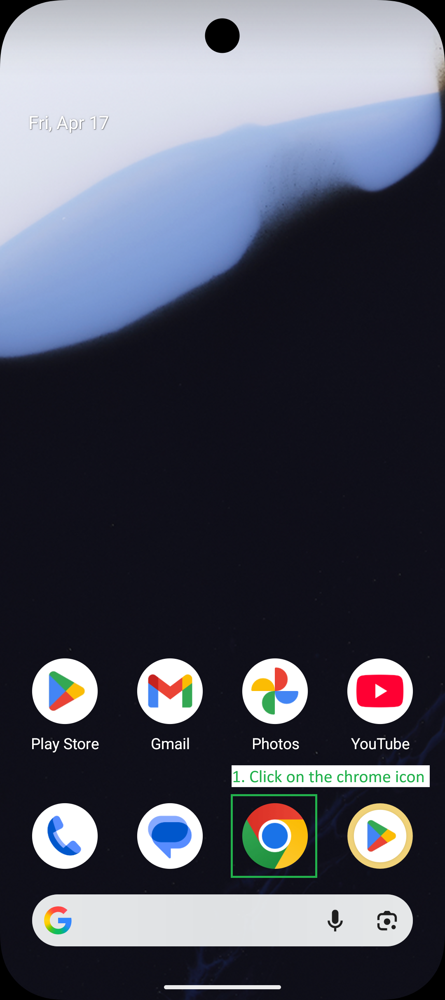
2. **Navigate to Search**: Tap the search bar (labeled "Search Google or type URL"). 
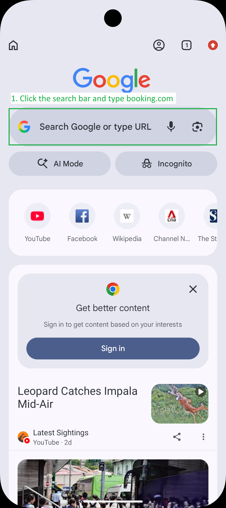
    > [!IMPORTANT]
    > Do not click the Google icon itself; focus on the text field.
3. **Go to Booking.com**: Type "booking.com" and press Enter, or select the official link from the results.
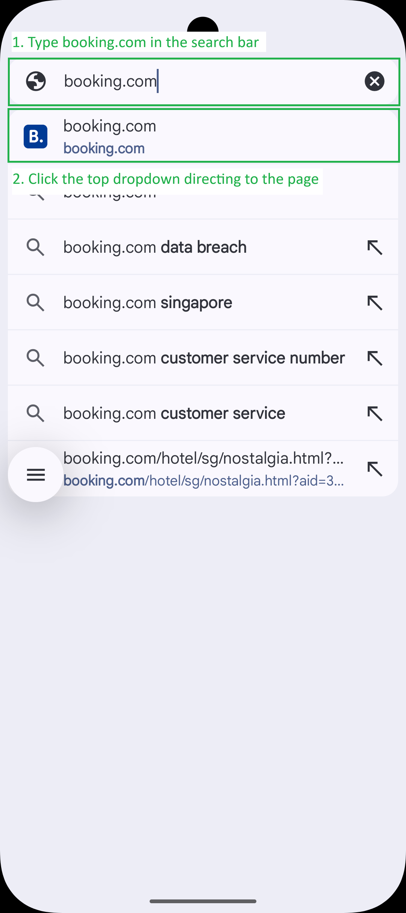

### Phase 2: Configuring Search Parameters
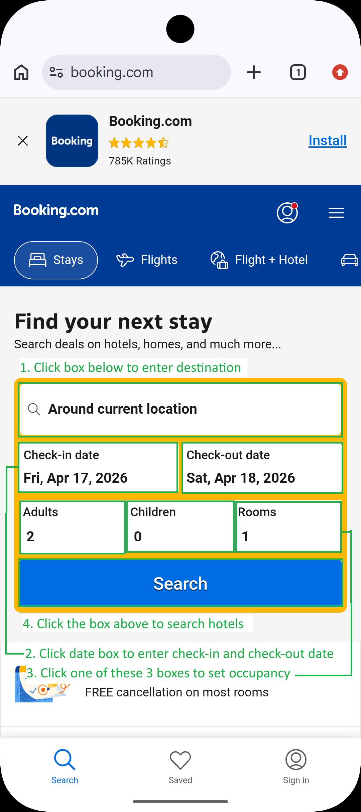

1. **Enter Destination**: Tap the destination search bar (usually says "Around your location" or "Enter destination").

2. **Select Location**: Type the destination name and select the correct match from the suggestions.
3. **Select Dates**:
    - The calendar usually opens automatically. Tap the **Check-in date**, then tap the **Check-out date**.
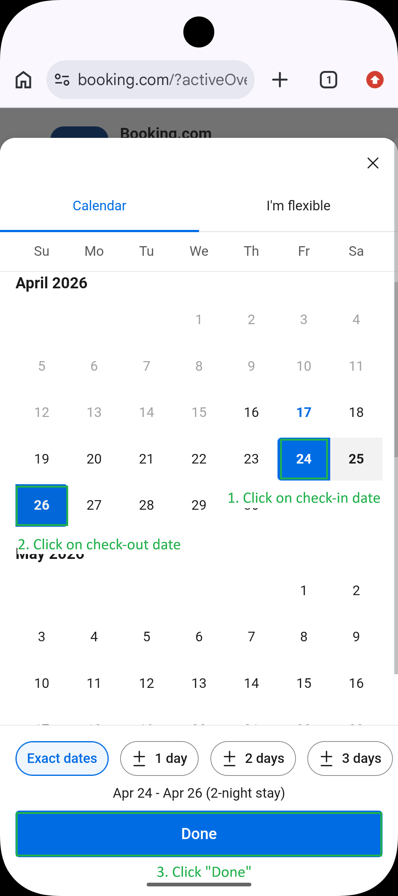
    - If it doesn't open, tap the **Check-in date** box manually.
    - Tap **Done** to confirm.
4. **Set Occupancy**:
    - Tap the box showing "Adults", "Children", or "Rooms".
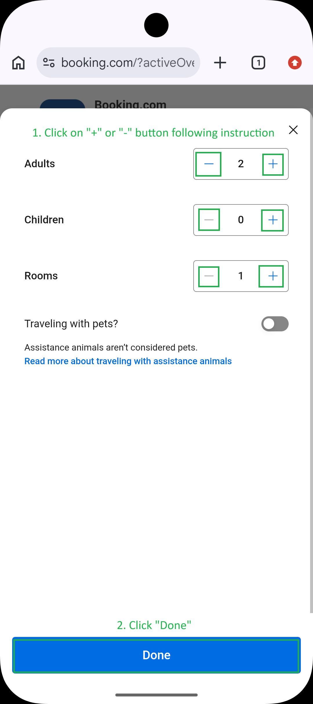
    - Use the **"+"** or **"-"** buttons to adjust the counts as per instructions.
    - Tap **Done**.
5. **Execute Search**: Tap the **Search** button.

### Phase 3: Browsing and Selection
1. **Browse Results**: Scroll down the search results page to see matching hotels.
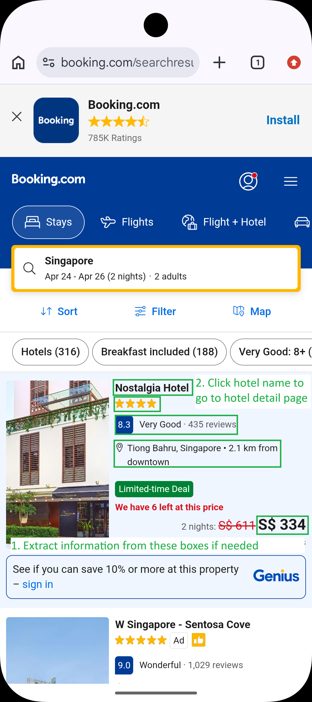
2. **Select Hotel**: Tap on the **hotel name** or image to view its detailed page.

### Phase 4: Extracting Hotel Details
When asked for a summary, look for the following information on the hotel details page:
- **Header Info**: Name, location, rating, and review count are available at the top.
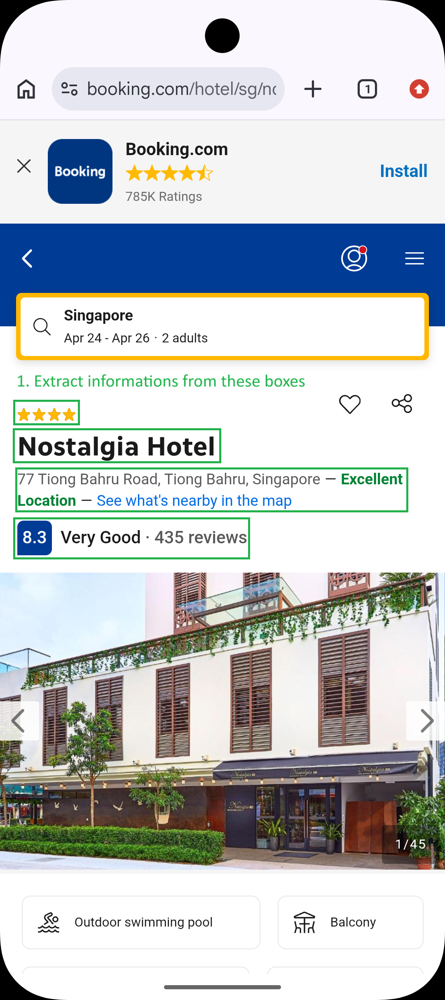
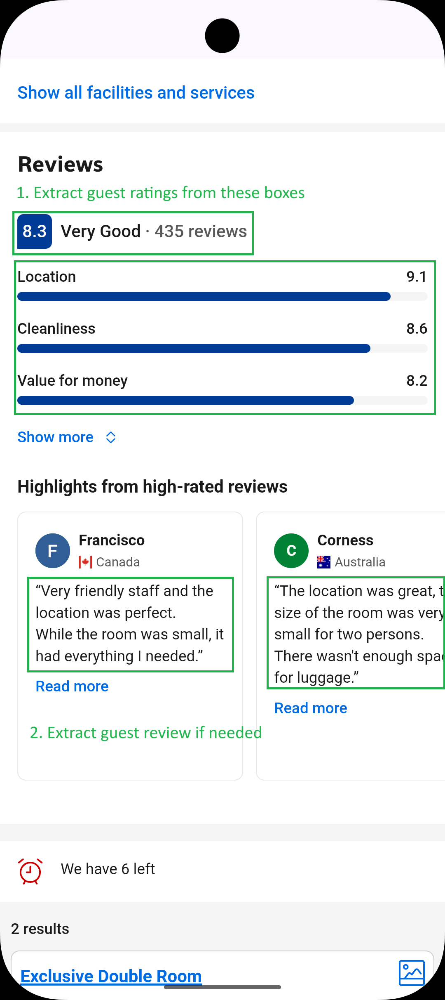
- **Facilities**: Scroll down **once** to find the facilities/amenities section.
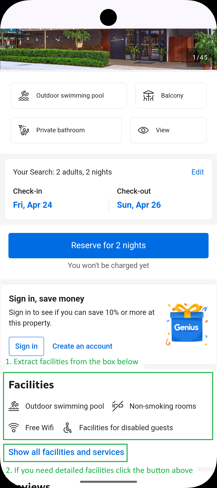
- **Pricing & Rooms**: Scroll down **twice** to view specific room types and their prices.
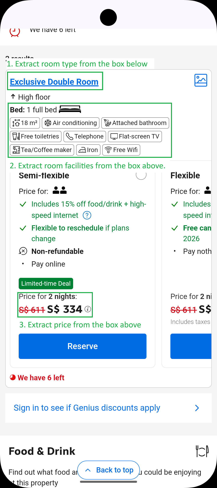

## Tips & Troubleshooting
- **Dynamic Elements**: UI elements may shift slightly. Always look for text labels like "Check-in" or "Search".
- **Pop-ups**: Close any "Sign in" or "Save big" pop-ups that might obstruct the view.
- **Scroll for Visibility**: If a button like "Done" or "Search" is not visible, it may be hidden by the on-screen keyboard; try scrolling or pressing the back button to dismiss the keyboard.
