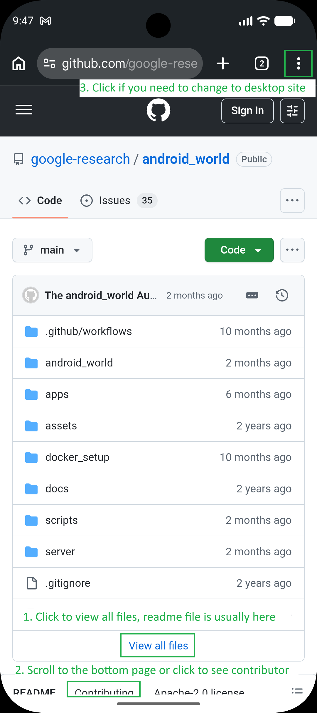
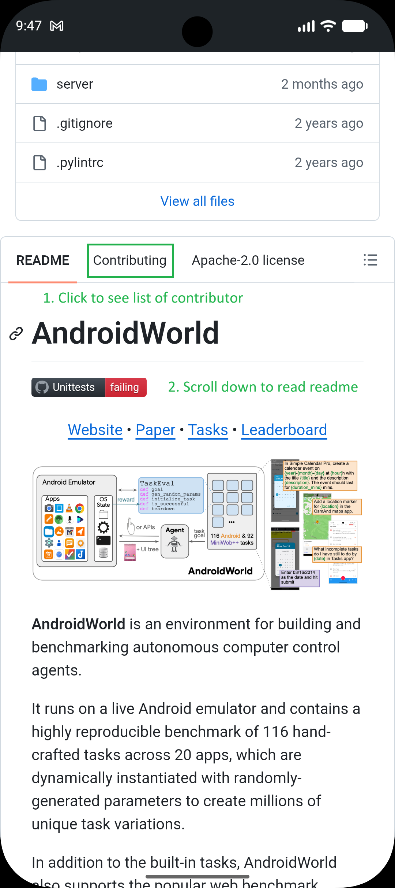
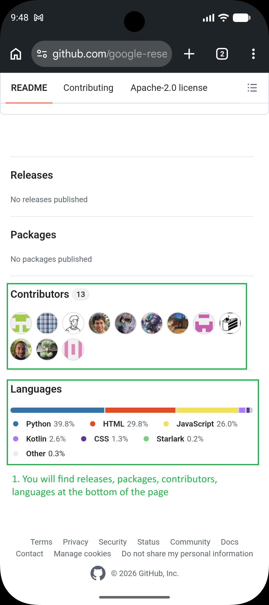
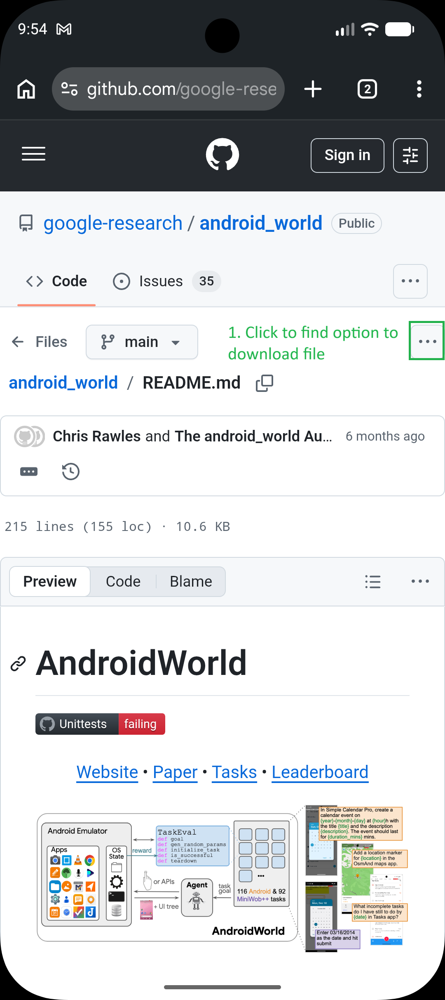
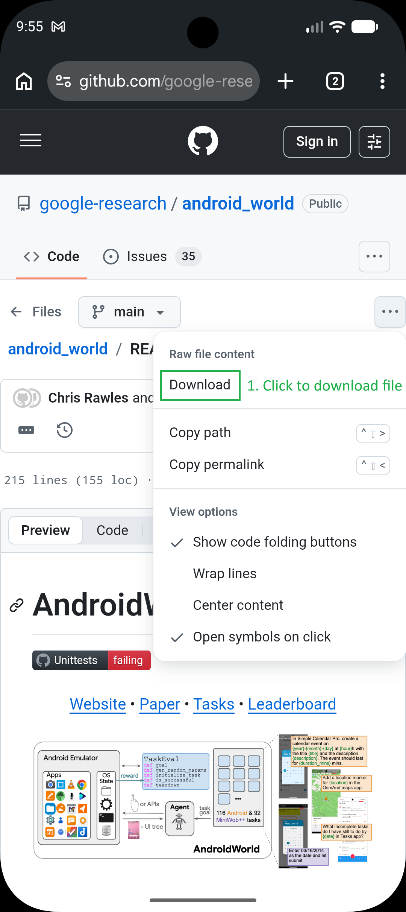
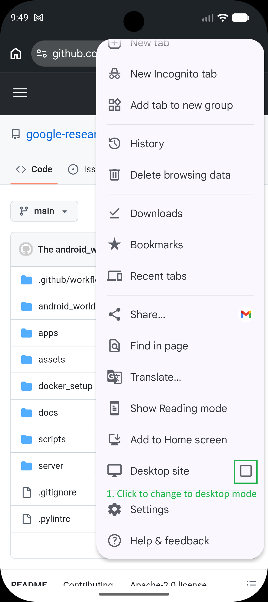
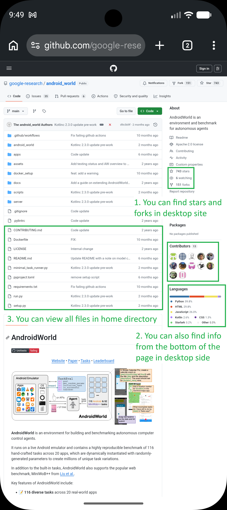

# GitHub.com (mobile) navigation skill

## When to use this skill

Apply this workflow when you need to gather **public repository information** while interacting with **GitHub’s mobile website** in a phone browser (typically Chrome). This covers **finding and reading repo content**, **locating contributors and language stats**, and **enabling desktop layout** when the mobile UI hides details such as fork and star counts.

Do **not** treat this skill as instructions for `git` commands, GitHub CLI, or authenticated API usage unless the user explicitly asks for those.

## Mobile vs desktop site

- **Default mobile view** is optimized for small screens. You can still open the file list, read `README.md`, scroll to repository metadata at the bottom, and use the file **overflow (⋮) menu** next to a file name (e.g. download).
- **Desktop site mode** reuses GitHub’s wide layout: **fork and star counts** often appear near the top or in the right-hand column, and the **full file tree / repository overview** is easier to scan. Enable it when the user asks for forks, stars, or a layout that matches the desktop site.

## Repository landing page (mobile)

1. **File list and “View all files”**  
   On the repository home, GitHub shows the latest commit context and a list of files and folders. Use **“View all files”** (or equivalent entry to the full tree) when you need to see everything in the **repository root**, not only the few items visible above the fold.

2. **README**  
   The **README** preview usually appears **below** the file list. Scroll down to read the full document; long READMEs require continued scrolling.

3. **Contributing and lower sections**  
   Scroll further to find UI affordances such as **“Contributing”** (or similar links to contribution guidance). The exact label may vary by repo; if the user asks for contributors, you can either scroll the landing page to the bottom or open **Contributing** and then scroll that page—contributor-related summaries often appear in the **lower part** of these views.

4. **Bottom-of-page metadata**  
   Near the **bottom** of the landing or Contributing-style pages, GitHub typically surfaces blocks such as **Releases**, **Packages**, **Contributors**, and **Languages**. Use this area to answer questions like “who contributes,” “what languages,” or “are there releases/packages,” without assuming every repo has all blocks populated.

## Viewing a specific file (e.g. README.md)

1. **Open the file**  
   From the file list, tap a file name (for example **README.md**). GitHub navigates to the **file view**: rendered Markdown for `.md` files, or raw-oriented layout for other types.

2. **Overflow menu (three dots)**  
   On the file screen, find the **three-dot (⋮) control** aligned with the **file name / title bar** (the horizontal bar that identifies the current file). Open it to access actions such as **Download** or other file-level options GitHub exposes on mobile.

3. **Reading and copying content**  
   Scroll vertically through the file body to read or extract the full text. For very long files, continue scrolling until the end of the rendered content.

## Downloading the current file

From the **file view**, open the **⋮ menu** next to the file title and choose **Download** (or the equivalent action) to save the **currently displayed revision** of that file. This is for **single-file** retrieval from the web UI, not for cloning the repository.

## Enabling desktop site mode (Chrome on Android)

Use this when mobile layout omits information the user needs (commonly **forks** and **stars**, or a denser repository header).

1. Tap the **three-dot menu** in **Chrome’s** top-right corner (browser menu, not necessarily a control inside GitHub’s own header).
2. In the dropdown, scroll until you find the **“Desktop site”** toggle (wording may be **“Desktop site”** or **“Request desktop site”** depending on Chrome version).
3. **Enable** the checkbox / toggle. The tab reloads with a desktop-style viewport; GitHub may reflow so that **stars, forks**, and other header details appear similarly to the desktop website.
4. To return to mobile layout, open the same menu and **turn off** desktop site.

## Desktop site layout — what to look for

After desktop mode is active:

- **Forks and stars** usually appear in the **repository header** area, often on the **right** or adjacent to the repo title, depending on GitHub’s current design.
- **Contributors** and **Languages** may still appear in **lower** sections; compare with what you already saw on mobile to avoid duplicate scrolling.
- **File list / “View all files”** remains the entry point for browsing the tree from the repo home.

## Retrieval checklist (no images required)

Use this as a mental map when answering user questions:

| User question | Where to look |
|---------------|----------------|
| Root files and folders | Landing → file list → **View all files** if needed |
| README content | Landing → scroll below file list; or open **README.md** |
| Releases / packages | Scroll to **bottom** of landing or related pages |
| Contributors / languages | **Bottom** sections; desktop mode may duplicate or clarify |
| Forks / stars | Prefer **desktop site mode** + repository header |
| Raw / download one file | File view → **⋮** next to file name → **Download** |

## Tips and troubleshooting

- **Labels move**: GitHub updates copy and layout; rely on **position** (top file list, mid README, bottom metadata, ⋮ beside file name) and **semantics** (Contributors, Languages, Releases), not exact pixel locations.
- **Missing blocks**: Empty or hidden **Releases** / **Packages** is normal for some repos; report what is absent instead of inventing data.
- **Two different “three-dot” menus**: **Chrome’s** menu toggles **desktop site**; **GitHub’s** ⋮ on a **file** row opens **file actions** (e.g. download). Do not confuse them.
- **Scope**: This skill describes **navigation and reading** on github.com; it does not authorize bypassing rate limits, logging in as another user, or accessing private resources without credentials.
