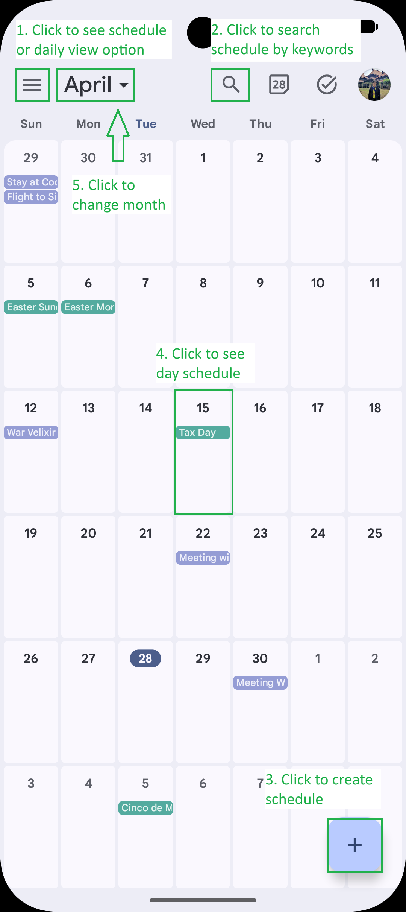
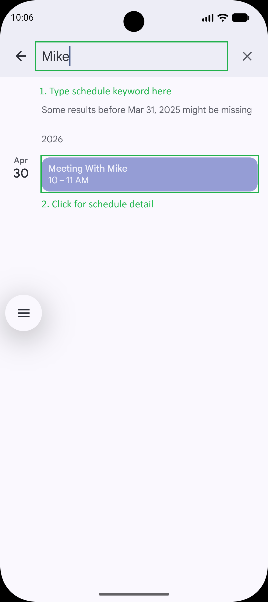
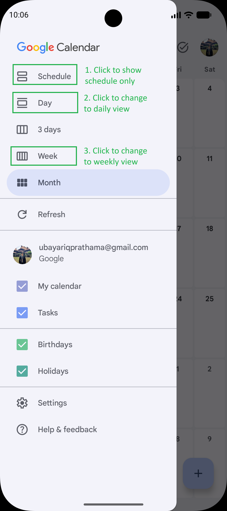
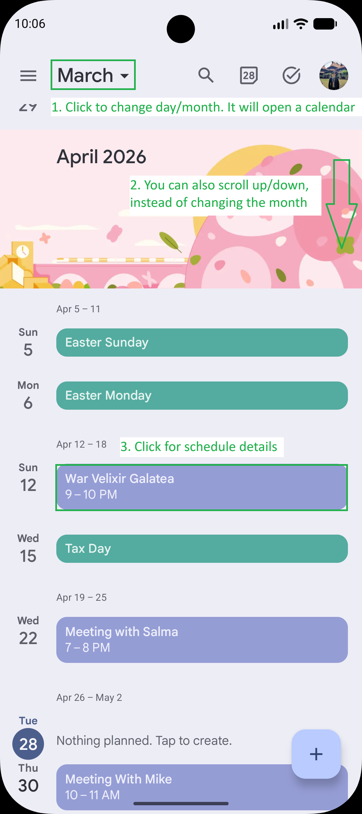
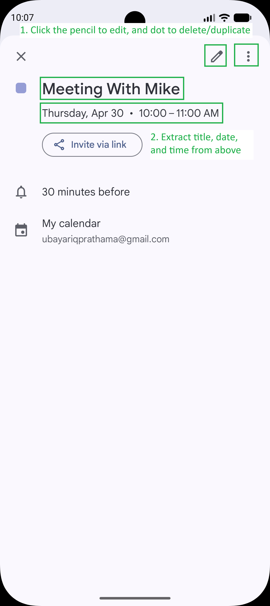
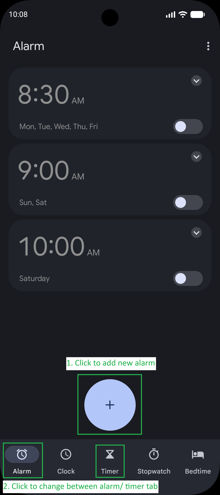
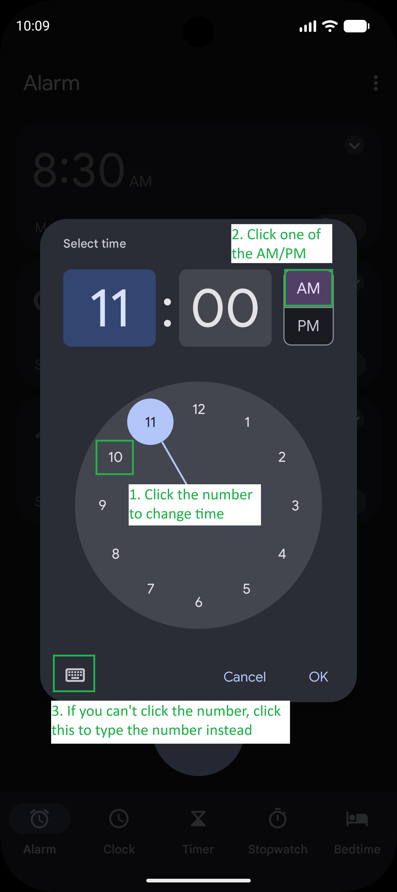
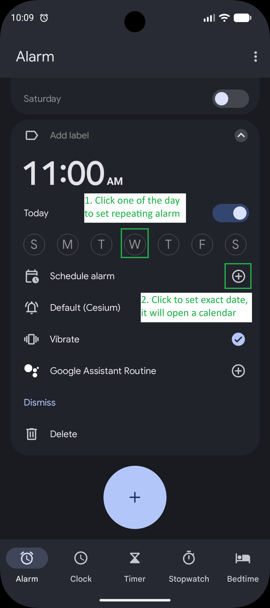

# Scheduling (Calendar + Clock) — mobile GUI skill

## When to use this skill

Apply this workflow when the user wants to:

- **Find** a meeting or appointment (by person name, title, or date) and **use its time** for something else.
- **Set an alarm** (or similar time-based alert) **relative** to a calendar event — e.g. "10 minutes before my meeting with Mike."
- **Open Calendar** to confirm date, time, timezone, or recurrence before acting in **Clock** or another app.

Do **not** assume API or assistant shortcuts unless the user asks; default to **visible GUI steps** (tap, scroll, search fields).

## Principles

1. **Calendar is the source of truth** for *when* the event starts (and sometimes *where* / *title*). Read the **start time** on screen before computing an alarm time.
2. **Clock (Alarms)** is where **alarms** usually live; **Calendar** may offer **reminders** or **notifications** — prefer what the user asked for ("alarm" → Clock when possible).
3. **Compute offsets in your reasoning**, then set the alarm to the **resulting clock time** (e.g. meeting 14:00 → alarm 13:50 for "10 minutes before").
4. **Labels vary** by OEM and app (Google Calendar vs Samsung Calendar vs Apple Calendar). Rely on **semantics**: Search, event details, start time, Add alarm, time picker.

---

## Workflow A — Alarm N minutes before a named meeting (e.g. "Mike")

Use this for requests like: *"Create an alarm 10 minutes before my meeting with Mike."*

### A1. Open Calendar from the home screen

1. From the **home screen** or **app drawer**, open the **Calendar** app (icon is often a date grid; name may be "Calendar," "Google Calendar," or OEM-specific).
2. If Calendar is not on the first page of the drawer, use **search in the app drawer** (if available) and type `calendar`, then open the matching app.

### A2. Locate the meeting (search or browse)

**If the app has a search icon or search bar (common on Google Calendar):**

1. Tap the **search** (magnifying glass) or **search bar** at the top.
2. Type the **person's name** or **distinct keyword** from the title (e.g. `Mike` or `Mike sync`).
3. Submit search (keyboard **Enter** / **Search**, or wait for live results).
4. From **results**, tap the entry that matches the user's description (check **date** and **title** so it is the right occurrence).

**If there is no obvious search:**

1. Switch to the **Schedule** or **Agenda** list view if available (often easier than month grid for scanning).
2. Scroll to the **expected day** (today / tomorrow / this week per user context).
3. Open events that mention the **person** or **topic** until you find the correct one.

### A3. Read the event start time from the details screen

1. On the **event details** screen, find the **start date and time** (and note **timezone** or "all day" if shown).
2. **All-day events**: treat carefully — "10 minutes before" may mean **start of day** or **first scheduled block**; if ambiguous, prefer what the UI shows or ask the user.
3. **Compute** target alarm time:  
   `alarm_time = event_start − N minutes` (handle hour/day rollover mentally).

### A4. Open Clock and create the alarm

1. Use the **Home** button or **gesture** to leave Calendar, then open **Clock** (sometimes grouped with **Alarm** in the same app).
2. Go to the **Alarm** tab (tab bar or bottom navigation).
3. Tap **Add alarm** / **+** / **Create** (wording varies).

4. Set **hour and minute** to match **alarm_time** using the **time picker** (click the number on the clock or use typing option) and confirm AM/PM.

5. **Enable** the alarm (toggle **on** if it was created disabled).
6. After setting the time, set the **date**, if repeating alarm click one of the day, else click shedule alarm and pick exact date.

### A5. Verify before finishing

1. On the alarm list, confirm **one** new alarm at the **correct time** and that it is **ON**.
2. If the user also wanted a **calendar reminder**, say so only after the alarm step — optionally add a **second notification** inside the event (if they asked).

---

## Workflow B — Find "when is my meeting with X?" (Calendar only)

1. Open **Calendar** (same as A1).
2. **Search** or **scroll** to the event (same as A2).
3. Open the event and report **start**, **end**, **timezone**, and **location** / **video link** if visible.

---

## Workflow C — Simple absolute alarm (no calendar lookup)

For *"Set an alarm for 7:00 tomorrow"* without tying to an event:

1. Open **Clock** → **Alarm**.
2. **Add** alarm → set time and, if needed, **repeat** or **date** (some UIs use "tomorrow" via day-of-week repeat — follow the app).
3. Enable and confirm.

---

## Workflow D — Timer vs alarm

- **Timer** (countdown): use when the user says "in 10 minutes" **from now**, not tied to a calendar event.
- **Alarm** (clock time): use for a **specific time of day** or a time **derived from a calendar event**.

---

## Tips and troubleshooting

- **Multiple "Mike" events**: pick the **next upcoming** one unless the user specified a date; if still ambiguous, use the **soonest** that matches and state which date you used.
- **Recurring meetings**: the alarm you set is usually **one-shot**; remind the user they may need **recurring alarms** or **calendar reminders** for every instance.
- **Permissions**: if notifications or alarms are blocked, the UI may show a warning — you cannot fix this without guiding the user to system settings; mention that briefly.
- **DST and timezone**: if the event shows a different zone than local time, use the **local** alarm time equivalent to "10 minutes before" the displayed start in **local** context as shown on device.

## Retrieval checklist

| User intent | Primary app | Key GUI path |
|-------------|-------------|----------------|
| Time of meeting with X | Calendar | Search / agenda → event details → start time |
| Alarm relative to meeting | Calendar then Clock | Event time → compute → Clock → Add alarm |
| Alarm at fixed time | Clock | Alarm tab → Add → time picker |
| Countdown from now | Clock | Timer tab → duration |

