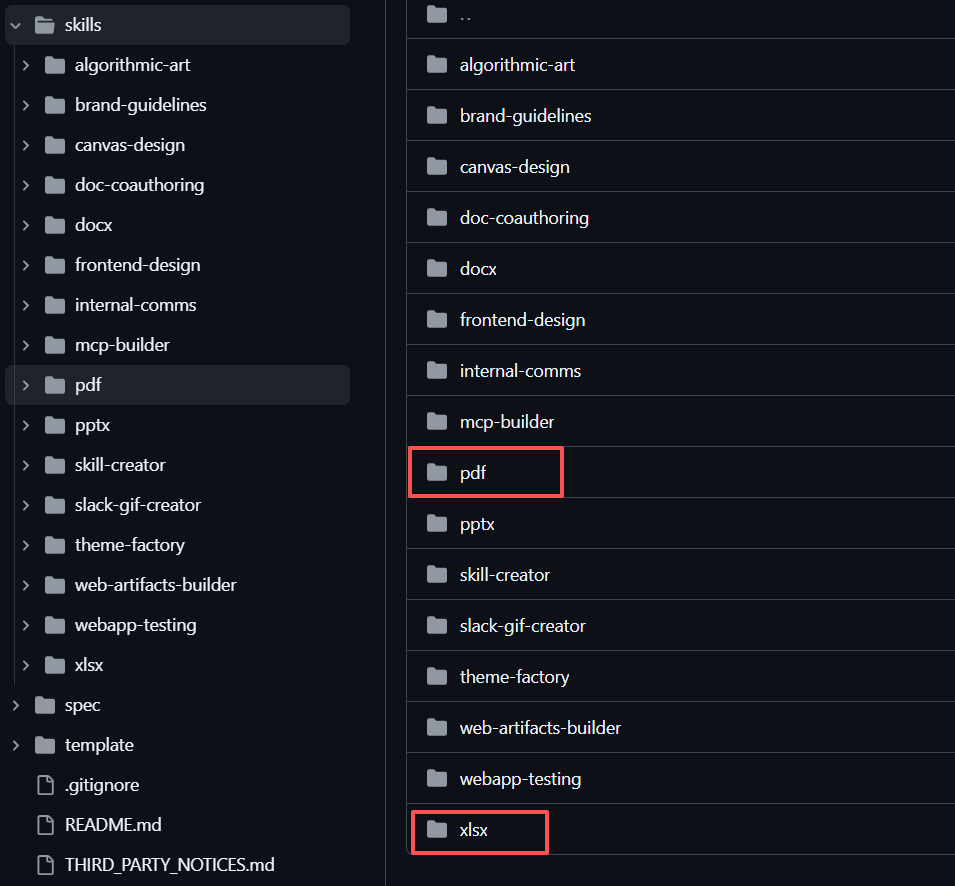
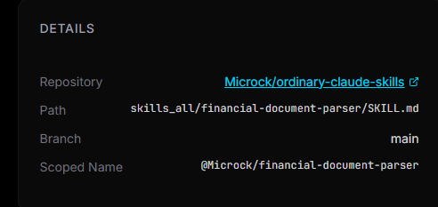
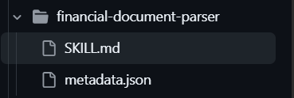

# README（openJiuwen Agent Skill 运行示例）


---
## 1. 配置 .env

在 `main.py` 同级目录放一个 `.env`，至少包含这些：

```env
API_BASE=""
API_KEY="sk-..."
MODEL_PROVIDER=""
MODEL_NAME=""
LLM_SSL_VERIFY="false"
MAX_ITERATIONS=""
SKILLS_DIR=                          
FILES_BASE_DIR=                           
```

字段说明：
- `API_BASE` / `API_KEY`：OpenAI 接口地址和 Key
- `MODEL_PROVIDER`：当前框架支持 `OpenAI` 或 `SiliconFlow`
- `MODEL_NAME`：模型名（必须是服务端认可的 model id，否则会报 *invalid model ID*）
- `LLM_SSL_VERIFY`：`false` 表示关闭证书校验
- `MAX_ITERATIONS`：ReAct 最大迭代次数
- `SKILLS_DIR`：skills-dir 的本地绝对路径
- `FILES_DIR`：提示词里“文件 located at …”使用的路径前缀（用于让模型知道要操作的文件在哪）

---
## 2. 下载并准备 skills

运行前先从git下载技能库，然后把你要用的技能目录放到 `.env` 里配置的 `SKILLS_DIR` 下。


发票处理的skill的链接，：https://www.agentskills.in/marketplace/%40Microck%2Ffinancial-document-parser


点击Repository进入仓库



然后把仓库中的 `skills/`（或其中你需要的具体技能目录）复制到你的 `SKILLS_DIR` 目录里，结构示例：

```text
SKILLS_DIR/
  xlsx/
    SKILL.md
  pdf/
    SKILL.md
  pptx/
    SKILL.md
  ...
```

## 3. 运行前确认

1) 确认 `SKILLS_DIR` 指向的目录存在，并且里面有各技能的 `SKILL.md`。  
2) 确认 `FILES` 里配置的 `local_filepath` 指向的文件真实存在。
3) 确认Query：  在 `main.py` 里找到 `QUERY = (...)` 这一段，把你的问题/指令写在这里即可。 运行脚本时会把 `QUERY` 作为输入传给 agent。

---


## 3. 运行命令

在 `main.py` 所在目录执行：

```bash
python main.py
```
---

