# AgentTeam 架构文档

## 1. 概述

AgentTeam 是一个多智能体协作编排框架，支持多个 AI Agent 以团队形式协同工作。框架以 **Leader–Teammate–HumanAgent** 三种角色组成团队：Leader 负责协调、任务分配与决策；Teammate 自主执行任务并汇报结果；HumanAgent 代表加入团队的人类协作者（HITT）。

核心设计目标：

- **声明式装配** —— 所有团队都通过 `TeamAgentSpec(...).build()` 一条路径创建；不再保留 `create_agent_team` / `recover_agent_team` / `resume_persistent_team` 这类便利工厂
- **Runner 对象池 + 派发** —— `Runner.run_agent_team[_streaming]` / `Runner.interact_agent_team` 经由 `TeamRuntimeManager` 走 9 路 dispatch truth table 决定创建 / 恢复 / 拒绝
- **三视角交互** —— 同一文本输入按 `#` / `$` / `@` 前缀解析成 GodView / Operator / HumanAgent 三种 `InteractPayload`
- **事件驱动协调** —— Agent 通过事件唤醒；poll timer 兜底，避免事件丢失
- **基于角色的工具集** —— Leader / Teammate / HumanAgent 拥有不同工具
- **可插拔基础设施** —— 传输层 / 存储层 / Rail / Worktree backend 通过注册表替换
- **会话隔离与多团队** —— 同一 session 可承载多个 team；动态会话表实现并发零干扰
- **持久化团队** —— 团队可跨 session 持久化，支持 pause / resume / 跨 session 切换
- **多端点模型池** —— `ModelPoolEntry` 配合 `RoundRobin` / `ByModelName` / `Router` 三种分配策略将 LLM 请求分摊到多个端点
- **Stream 跨成员 fan-out** —— inprocess 模式下，每个 teammate 产生的 `TeamOutputSchema` chunk 会带 `(source_member, role)` 标签转投到 leader 的 stream 队列
- **Git Worktree 隔离 + 共享工作区** —— 每个非 leader 成员有独立 worktree；`.team/` 挂载点用于跨成员协同文件、锁与版本
- **可观测性** —— `TeamMonitor` 提供运行态查询 + 事件流

---

## 2. 架构总览

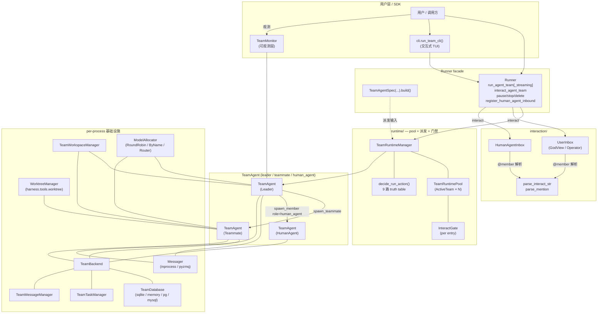

---

## 3. 模块结构

```
openjiuwen/agent_teams/
├── __init__.py                     # 公共 API 导出
├── constants.py                    # 保留成员名：team_leader / human_agent / user
├── context.py                      # session_id contextvars（跨成员/模式共享）
├── i18n.py                         # 运行时硬编码字符串的中英文表
├── paths.py                        # 文件系统布局唯一真相源
├── harness.py                      # TeamHarness（TeamAgent ↔ DeepAgent 唯一适配层）
├── worktree_remote.py              # 跨机器 worktree backend（团队专属）
│
├── schema/                         # 数据模型与 Spec
│   ├── blueprint.py                # TeamAgentSpec / LeaderSpec / TransportSpec / StorageSpec
│   ├── deep_agent_spec.py          # DeepAgentSpec / TeamModelConfig / RailSpec / SubAgentSpec
│   ├── team.py                     # TeamSpec / TeamRole / TeamLifecycle / TeamRuntimeContext / TeamMemberSpec
│   ├── status.py                   # MemberStatus / ExecutionStatus / TaskStatus 状态机
│   ├── events.py                   # TeamTopic / TeamEvent + 所有 EventMessage 子类
│   ├── stream.py                   # TeamOutputSchema（OutputSchema 子类，带 source_member/role）
│   └── task.py                     # TaskSummary / TaskDetail / TaskOpResult / TaskCreateResult
│
├── models/                         # 多模型部署原语
│   ├── pool.py                     # ModelPoolEntry / ModelRouterConfig / inherit_pool_ids
│   └── allocator.py                # Allocation / ModelAllocator / RoundRobin / ByModelName / Router
│
├── agent/                          # TeamAgent 运行时主骨架（四象限拆解）
│   ├── team_agent.py               # TeamAgent(BaseAgent) — 唯一对外类
│   ├── blueprint.py                # TeamAgentBlueprint（frozen 静态数据）
│   ├── state.py                    # TeamAgentState（跨 operator 可变状态）
│   ├── resources.py                # PrivateAgentResources（每实例资源）
│   ├── infra.py                    # TeamInfra（per-process 共享资源）
│   ├── agent_configurator.py       # DeepAgent 装配 + Rail 挂载 + team_mode 派生
│   ├── member.py                   # TeamMember 状态机
│   ├── member_factory.py           # create_member_handle(...)
│   ├── payload.py                  # SpawnPayloadBuilder（spawn 跨进程 wire 格式）
│   ├── spawn_manager.py            # SpawnManager — teammate 进程生命周期 + 心跳 + 重启
│   ├── recovery_manager.py         # 团队级容错与状态对齐
│   ├── session_manager.py          # session checkpoint 读写 + bind/release/unbind
│   ├── stream_controller.py        # StreamController — round 状态 / chunk fan-out / TeamOutputSchema 升级
│   └── coordination/               # 唤醒循环（不做业务决策）
│       ├── kernel.py               # CoordinationKernel — 整体 facade
│       ├── event_bus.py            # EventBus + InnerEventType + poll timer
│       ├── dispatcher.py           # EventDispatcher + DispatcherHost / AgentRoundController / TeamLifecycleController / PollController
│       └── handlers/               # 五个场景 handler
│           ├── agent_lifecycle.py  # USER_INPUT / STANDBY / CLEANED / TOOL_APPROVAL_RESULT
│           ├── member.py           # 6 个 MEMBER_*
│           ├── message.py          # MESSAGE / BROADCAST / POLL_MAILBOX + MEMBER_SHUTDOWN fan-out
│           ├── task_board.py       # TASK_CLAIMED + 4 个 TASK_*
│           └── stale_task.py       # POLL_TASK + 滞留 claim/pending 检测
│
├── rails/                          # 团队 Rail
│   ├── team_policy_rail.py         # 分段式 PromptSection 注入
│   ├── team_tool_rail.py           # 角色化工具注册到 ability_manager
│   ├── first_iteration_gate.py     # 首迭代同步信号
│   └── tool_approval_rail.py       # Teammate 工具审批中断
│
├── prompts/                        # 系统提示词模板 + 装配
│   ├── loader.py                   # load_template / load_shared_template（@cache）
│   ├── policy.py                   # role_policy / build_system_prompt（老装配路径）
│   ├── sections.py                 # TeamSectionName + build_team_*_section（Rail 主力路径）
│   ├── section_cache.py            # MtimeSectionCache — dynamic section 缓存
│   ├── system_prompt.md            # 语言无关占位符模板
│   ├── cn/                         # 中文模板
│   │   ├── leader_policy.md
│   │   ├── teammate_policy.md
│   │   ├── leader_workflow.md
│   │   ├── leader_workflow_predefined.md
│   │   ├── leader_workflow_hybrid.md
│   │   ├── lifecycle_temporary.md
│   │   └── lifecycle_persistent.md
│   └── en/                         # 英文模板（同结构）
│
├── runtime/                        # Runner 对象池 + 派发 + 并发门禁
│   ├── pool.py                     # TeamRuntimePool / ActiveTeam / ActiveTeamInfo / RuntimeState
│   ├── gate.py                     # InteractGate / AdmissionTicket
│   ├── dispatch.py                 # decide_run_action(...) + RunAction / RunActionKind
│   ├── metadata.py                 # session checkpoint 的 per-team 命名空间读写
│   └── manager.py                  # TeamRuntimeManager — activate / pause / interact / stop / release / delete
│
├── interaction/                    # 外部交互入口 + HITT
│   ├── payload.py                  # GodViewMessage / OperatorMessage / HumanAgentMessage / InteractPayload / DeliverResult / HumanAgentInboundEvent
│   ├── router.py                   # parse_interact_str / parse_mention / is_reserved_name
│   ├── user_inbox.py               # UserInbox — broadcast / direct / deliver_to_leader
│   └── human_agent_inbox.py        # HumanAgentInbox — HITT 启用时 human_agent 对外发声
│
├── messager/                       # 传输层
│   ├── base.py                     # MessagerTransportConfig / MessagerPeerConfig / create_messager
│   ├── messager.py                 # Messager 抽象接口
│   ├── inprocess.py                # 共享 _Bus 单例
│   └── pyzmq_backend.py            # ROUTER/DEALER + PUB/SUB
│
├── tools/                          # 团队工具 + 数据库
│   ├── team_tools.py               # TeamTool 基类 + 全部子类 + 角色权限集 + create_team_tools()
│   ├── team.py                     # TeamBackend — 工具背后的编排器
│   ├── task_manager.py             # TeamTaskManager
│   ├── message_manager.py          # TeamMessageManager
│   ├── models.py                   # SQLModel 静态表 + 动态会话表工厂
│   ├── memory_database.py          # InMemoryTeamDatabase + MemoryDatabaseConfig
│   ├── database/                   # 分 DAO 的 SQL 层
│   │   ├── config.py               # DatabaseConfig / DatabaseType（sqlite/postgres/mysql）
│   │   ├── engine.py               # 引擎生命周期 + 动态表 CRUD
│   │   ├── graph.py                # 任务依赖图算法（环检测）
│   │   ├── team_dao.py / member_dao.py / task_dao.py / message_dao.py
│   │   └── __init__.py             # TeamDatabase facade（仅引擎/跨表事务）
│   └── locales/                    # 多语言资源 + descs/<lang>/<tool>.md
│
├── spawn/                          # 队员生成机制
│   ├── inprocess_spawn.py          # asyncio.Task 进程内生成
│   ├── inprocess_handle.py         # InProcessSpawnHandle
│   └── shared_resources.py         # 进程全局 DB / Runtime / messager 单例
│
├── team_workspace/                 # 团队共享工作区
│   ├── models.py                   # TeamWorkspaceConfig / WorkspaceMode / ConflictStrategy
│   ├── manager.py                  # TeamWorkspaceManager（mount / unmount / lock / version）
│   ├── rails.py                    # TeamWorkspaceRail — 拦截 .team/ 文件操作
│   └── tools.py                    # workspace_meta 工具
│
├── memory/                         # 团队 Memory（可选）
│   ├── config.py                   # TeamMemoryConfig
│   ├── manager.py / manager_params.py
│   ├── extractor.py / shared_memory.py
│   └── member_memory_toolkit.py
│
├── monitor/                        # 可观测性
│   ├── models.py                   # TeamInfo / MemberInfo / TaskInfo / MessageInfo / MonitorEvent
│   └── team_monitor.py             # TeamMonitor + create_monitor()
│
├── observability/                  # OpenTelemetry / 日志桥接
│   ├── setup.py / config.py / semconv.py
│   ├── callback_handler.py / monitor_handler.py
│   ├── rail.py / redaction.py / span_context.py
│
├── cli/                            # 交互式 TUI / 斜杠命令
│   ├── app.py                      # run_team_cli(*, specs, yaml_paths, ...)
│   ├── tui.py                      # TeamCli — prompt_toolkit + rich 主循环
│   ├── commands.py                 # /team /session /spec 子命令派发 + 补全
│   ├── routing.py                  # /cmd / ! / 普通文本三分支
│   ├── stream_renderer.py          # 后台 stream task + chunk 渲染
│   ├── inbox_sink.py               # HumanAgent inbound 事件 → console
│   ├── spec_loader.py              # SpecRegistry + load_spec_yaml
│   └── state.py                    # TeamCliState / StreamHandle / WatchBinding
│
└── docs/                           # 设计归档（specs / features）
```

---

## 4. 核心概念

### 4.1 三种角色

```python
class TeamRole(str, Enum):
    LEADER = "leader"           # 协调、分配任务、审批
    TEAMMATE = "teammate"       # 自主执行任务并汇报
    HUMAN_AGENT = "human_agent" # 人类成员（HITT），无 DeepAgent 进程，工具集受限
```

| 维度 | Leader | Teammate | HumanAgent |
|------|--------|----------|-----------|
| 创建 | `TeamAgentSpec(...).build()` 后由 `manager.activate` 入 pool | Leader 调 `spawn_member` 生成 | Leader 调 `spawn_member(role_type='human_agent', ...)` 或在 `predefined_members` 声明 |
| 工具集 | 完整团队管理 + 共享工具 | `claim_task` + 共享工具 | `view_task` + `member_complete_task`（极简） |
| Prompt | 角色策略 + 工作流 + 生命周期 + HITT | 角色策略 + HITT | 由框架内置模板托管，不可指定 model / prompt |
| 进程足迹 | 自带 DeepAgent | 自带 DeepAgent | 无 DeepAgent；状态保持 READY 直到 clean |
| 决策权 | 完整 | 仅执行 | 仅签收消息（人类回复经 `HumanAgentInbox`） |

### 4.2 TeamAgent —— 单一实现 + 四象限拆解

`TeamAgent` 是唯一对外类，所有角色都是它的实例；行为由 `blueprint.role` 切换。组合 `DeepAgent` 而非继承，所有 DeepAgent 访问唯一通过 `TeamHarness`。

字段刻意拆到四个文件，避免 100+ 字段塞一个类（参见 `agent/CLAUDE.md`）：

| 象限 | 文件 | 含义 |
|------|------|------|
| **静态数据** | `agent/blueprint.py` (`TeamAgentBlueprint`, frozen) | 构造时确定、生命周期不变（spec / role / member_name / persona） |
| **运行时可变状态** | `agent/state.py` (`TeamAgentState`) | 只放**跨 operator** 的字段；operator 内部状态留在 operator 自己 |
| **每实例资源** | `agent/resources.py` (`PrivateAgentResources`) | 这个 TeamAgent 独占（DeepAgent / WorktreeManager / MemoryManager） |
| **每进程基础设施** | `agent/infra.py` (`TeamInfra`) | **per-process** 共享（messager / db / team_backend）。leader 和 teammate 跨进程时各持一份 |

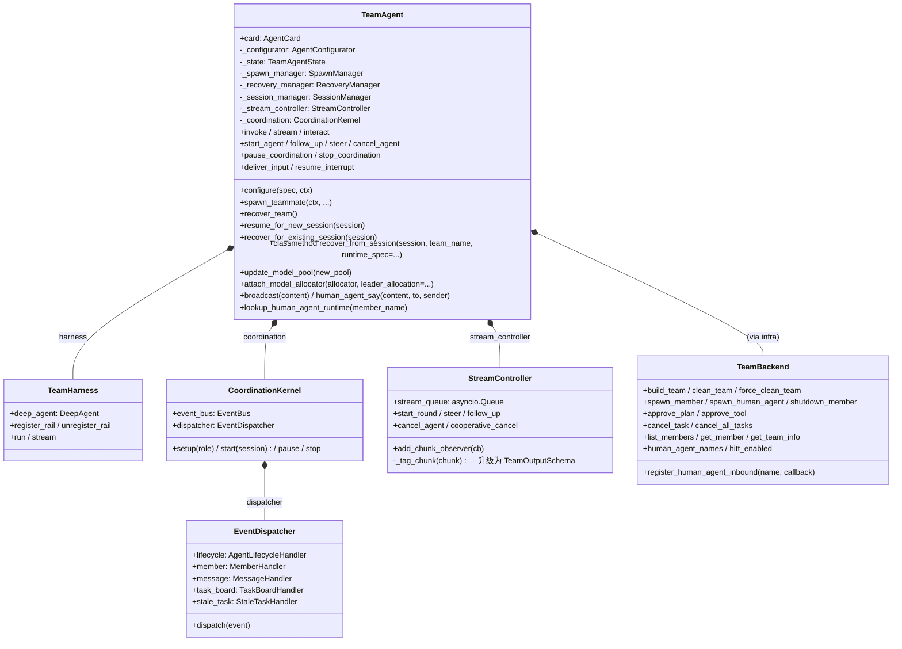

### 4.3 配置两阶段初始化

`TeamAgent.configure(spec, ctx)` 由 `AgentConfigurator` 编排：

```text
Phase 1: setup_infra(spec, ctx)
    ├── 创建 Messager（按 transport 类型）
    ├── 创建 TeamWorkspaceManager（如启用）
    ├── 注册团队工具 → 创建 TeamBackend + TeamTaskManager + TeamMessageManager
    └── 准备 ModelAllocator（构造时已通过 attach_model_allocator 注入）

Phase 2: setup_agent(spec, ctx)
    ├── 通过 TeamHarness.build(...) 构造 DeepAgent
    ├── 挂 TeamToolRail（角色化工具）
    ├── 挂 TeamPolicyRail（分段式 PromptSection）
    ├── 挂 FirstIterationGate（首迭代同步信号；HumanAgent 不挂）
    ├── 挂 TeamWorkspaceRail（如启用）
    ├── 挂 TeamToolApprovalRail（plan_mode + Teammate 时）
    ├── Teammate / HumanAgent 创建 TeamMember 状态对象（Leader 在 BuildTeamTool 之后再建）
    └── 设置 CoordinationKernel（构造 EventBus + EventDispatcher）
```

### 4.4 团队模式（team_mode）

```python
class TeamAgentSpec(BaseModel):
    team_mode: Literal["default", "predefined", "hybrid"] | None = None
```

- `None`（默认）→ `agent_configurator._resolve_team_mode` 自动派生：`predefined_members` 中有**非 HUMAN_AGENT** 成员则 `hybrid`，否则 `default`
- `default`：动态团队，Leader 拥有 `spawn_member` 工具，无预定义成员
- `predefined`：固定成员，从 Leader 工具集移除 `spawn_member`
- `hybrid`：预注册基础成员 + 仍允许动态 `spawn_member`

> 注意：HITT 团队中仅声明 HumanAgent predefined 仍然属于 `default` 模式，Leader 保留 `spawn_member`。

### 4.5 团队生命周期

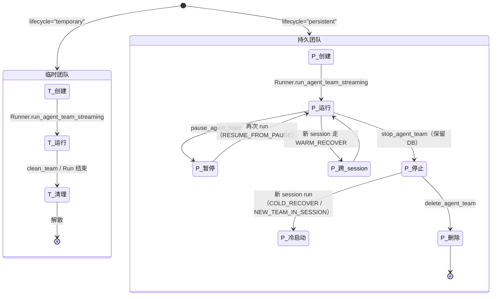

> `RuntimeState`（pool 层）的 `RUNNING / PAUSED` 与 `TeamLifecycle`（temporary / persistent）含义不同：前者是运行时状态，后者是静态团队类型。

---

## 5. 状态机

### 5.1 成员状态（MemberStatus）

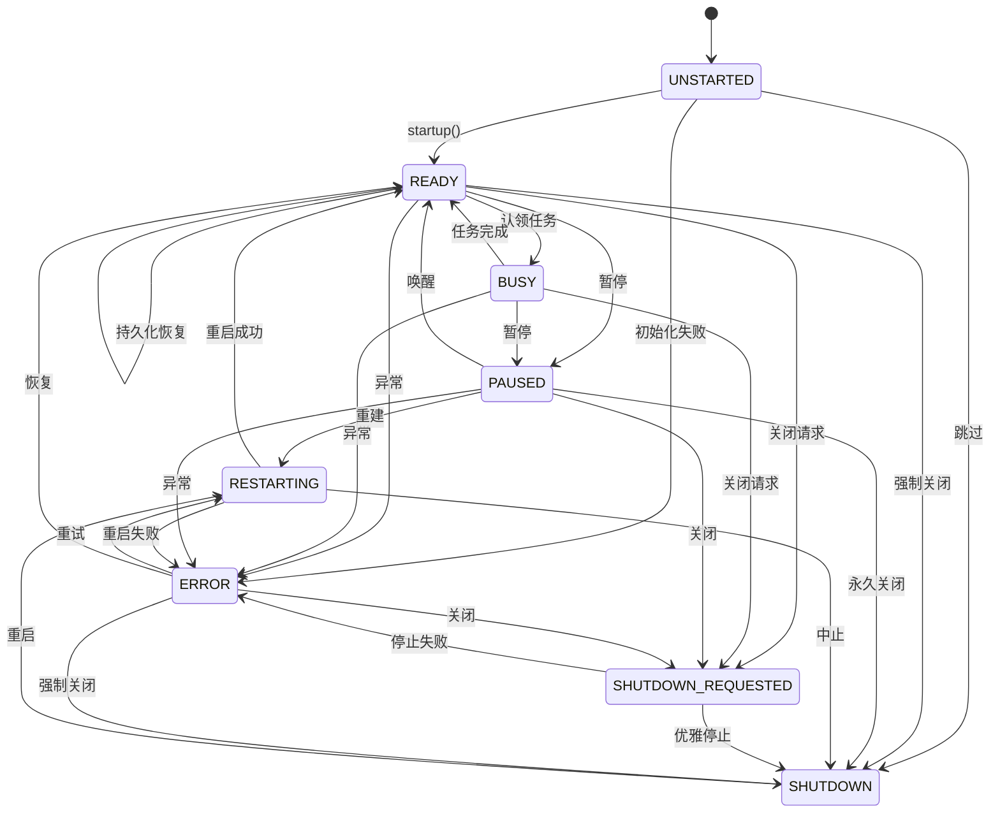

`PAUSED` 是新增态：协程退出但状态保留，可经 `RESTARTING` 重新拉起；与 `SHUTDOWN`（永久退出）区分。`TeamMember.update_status` 对相同新旧态跳过 DB 写入和事件发布，保持幂等。

### 5.2 执行状态（ExecutionStatus）

`IDLE → STARTING → RUNNING → COMPLETING → COMPLETED → IDLE`，分支含 `CANCEL_REQUESTED / CANCELLING / CANCELLED / FAILED / TIMED_OUT`。终态都回到 `IDLE` 以便重用。

### 5.3 任务状态（TaskStatus）

```text
PENDING ──claim──> CLAIMED ──plan_mode? ──> PLAN_APPROVED ──> COMPLETED
   │                  │                                            │
   │                  └─ build_mode ────────────────────────────── ┘
   │
   ├──depends──> BLOCKED ──deps_resolved──> PENDING
   └──cancel──> CANCELLED
```

### 5.4 RuntimeState（pool 层）

```python
class RuntimeState(str, Enum):
    RUNNING = "running"
    PAUSED = "paused"
```

由 `TeamRuntimeManager.pause / activate` 维护；CLI / SDK 通过 `ActiveTeamInfo` 只读快照观察。

---

## 6. 事件驱动协调

### 6.1 CoordinationKernel 总览

唤醒循环负责把传输事件（来自 Messager）与内部 poll 事件（定时器）收成统一的 `CoordinationEvent`，**自身不做业务决策**——所有业务行为由 handler 经三类 narrow protocol 触发：

- `AgentRoundController` —— round 行为（`deliver_input` / `cancel_agent` / `resume_interrupt` / `has_in_flight_round` / `has_pending_interrupt` / `is_agent_running`），由 `TeamHarness` 实现
- `TeamLifecycleController` —— TeamAgent 级生命周期（`shutdown_self`），由 `TeamAgent` 实现
- `PollController` —— poll 控制（`pause_polls` / `resume_polls`），由 `EventBus` 自身实现

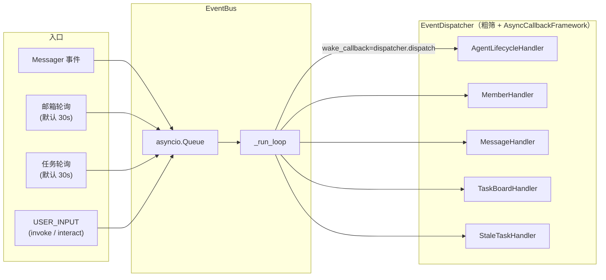

### 6.2 五个场景 Handler

| Handler | 监听事件 | 关键行为 |
|---------|---------|---------|
| `AgentLifecycleHandler` | `USER_INPUT` / `STANDBY` / `CLEANED` / `TOOL_APPROVAL_RESULT` | start round / steer / pause_polls / shutdown_self / resume_interrupt |
| `MemberHandler` | 6 个 `MEMBER_*` | leader 观察所有成员；teammate 仅处理自身；`MEMBER_STATUS_CHANGED → READY/ERROR` 触发滞留 claim nudge |
| `MessageHandler` | `MESSAGE` / `BROADCAST` / `POLL_MAILBOX` + `MEMBER_SHUTDOWN`（fan-out） | 处理未读消息；leader 额外 ack user-bound 消息 + 通知 human-agent inbound；teammate 在 `MEMBER_SHUTDOWN` 自身时 drain 邮箱 |
| `TaskBoardHandler` | `TASK_CLAIMED` + 4 个 `TASK_*` | targeted assignment + `_nudge_idle_agent` |
| `StaleTaskHandler` | `POLL_TASK` | 滞留 claim（默认 120s）+ leader 滞留 PENDING |

`MemberHandler` 与 `StaleTaskHandler` 在 `EventDispatcher.__init__` 共享同一 `stale_claim_throttle` dict，确保同一 stale 窗口内不重复 nudge 同一 task。

### 6.3 内部事件类型

```python
class InnerEventType(str, Enum):
    USER_INPUT = "user_input"
    POLL_MAILBOX = "coordination_poll_mailbox"
    POLL_TASK = "coordination_poll_task"
    SHUTDOWN = "shutdown"

# 统一类型
CoordinationEvent = Union[InnerEventMessage, EventMessage]
```

### 6.4 传输层事件

`schema/events.py` 定义全部事件类型，每种事件有对应 `BaseEventMessage` 子类：

| 分类 | 事件常量 |
|------|---------|
| 团队 | `CREATED` / `CLEANED` / `STANDBY` |
| 成员 | `MEMBER_SPAWNED` / `MEMBER_RESTARTED` / `MEMBER_STATUS_CHANGED` / `MEMBER_EXECUTION_CHANGED` / `MEMBER_SHUTDOWN` / `MEMBER_CANCELED` |
| 任务 | `TASK_CREATED` / `TASK_UPDATED` / `TASK_CLAIMED` / `TASK_COMPLETED` / `TASK_CANCELLED` / `TASK_UNBLOCKED` |
| 消息 | `MESSAGE` / `BROADCAST` |
| 协作 | `PLAN_APPROVAL` / `TOOL_APPROVAL_RESULT` |
| Worktree | `WORKTREE_CREATED` / `WORKTREE_REMOVED` |
| Workspace | `WORKSPACE_ARTIFACT_UPDATED` / `WORKSPACE_CONFLICT` / `WORKSPACE_LOCK_REQUEST` / `WORKSPACE_LOCK_RESPONSE` |

`EventMessage.from_event(...)` 在发送端封装，`EventMessage.get_payload()` 在接收端反序列化为具体子类。`sender_id` 字段用于自环过滤。

---

## 7. Prompt 系统

### 7.1 分段式注入（TeamPolicyRail）

`TeamPolicyRail` 把团队上下文拆成有序 `PromptSection` 注入 DeepAgent 的 `SystemPromptBuilder`：

| 优先级 | Section | 内容 | 适用角色 |
|--------|---------|------|---------|
| P:11 | `team_role` | member_name + 角色策略 | All |
| P:12 | `team_hitt` | HITT 协作规则（当存在 human 成员时） | All |
| P:13 | `team_workflow` | Leader 工作流（按 team_mode 选择模板） | Leader |
| P:14 | `team_lifecycle` | 生命周期策略 | Leader |
| P:15 | `team_persona` | 人设描述 | All |
| P:16 | `team_extra` | 用户自定义 base_prompt | All |
| P:65 | `team_info` | 团队元数据 | All |
| P:66 | `team_members` | 成员关系 | All |

- **静态分段**（role / hitt / workflow / lifecycle / persona / extra）在 `__init__` 一次性构建，每次 `before_model_call` 重新 `add_section`
- **动态分段**（`team_info` / `team_members`）由 `MtimeSectionCache` 包装，先 probe `updated_at`，未变则复用缓存

### 7.2 模板组织

```
prompts/
├── system_prompt.md              # 占位符模板（policy.py 装配路径）
├── cn/                           # 中文
│   ├── leader_policy.md
│   ├── teammate_policy.md
│   ├── leader_workflow.md / leader_workflow_predefined.md / leader_workflow_hybrid.md
│   └── lifecycle_temporary.md / lifecycle_persistent.md
└── en/                           # 英文（同结构）
```

`policy.py`（老路径，`system_prompt.md` 壳模板）和 `sections.py`（Rail 主力路径，独立 PromptSection）读同一批模板。仅占位符或 section 拆分这类结构性变更需要决定落到哪条路径。

---

## 8. 数据模型

### 8.1 数据库 Schema

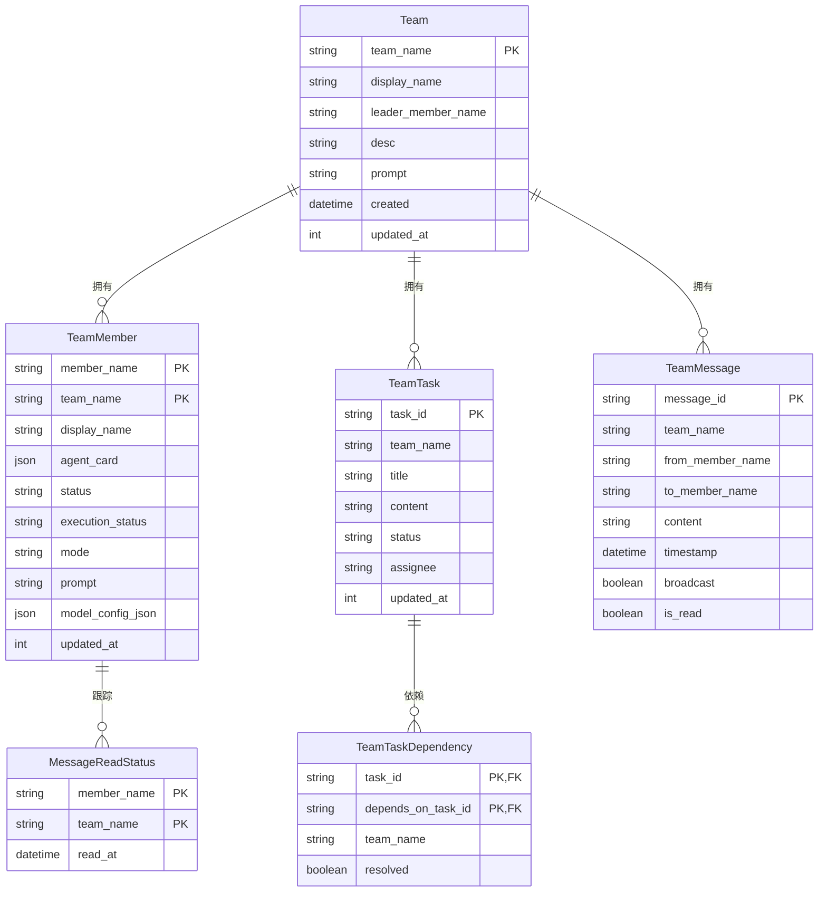

- **静态表**（`Team` / `TeamMember`）：创建一次、跨 session 持久
- **动态表**（`TeamTask` / `TeamTaskDependency` / `TeamMessage` / `MessageReadStatus`）：按 session 创建，表名后缀 `_{session_id}`，并发零干扰

`TeamDatabase` 持有 4 个 DAO（`team` / `member` / `task` / `message`），单表操作走 DAO；跨表事务（如 `force_delete_team_session`）保留在 facade。工具/管理器**永远不直接动 DAO**——经 `TeamBackend` 或对应 manager，保证状态转换 + 事件发布在中心化路径上。

**存储后端**：

| 后端 | 配置类 | 特征 |
|------|--------|------|
| SQLite | `DatabaseConfig(db_type="sqlite")` | WAL 模式，AsyncAdaptedQueuePool，默认 |
| PostgreSQL / MySQL | `DatabaseConfig(db_type="postgresql"/"mysql")` | 共用同一 `DatabaseConfig` |
| 内存 | `MemoryDatabaseConfig` | asyncio.Lock 序列化，单进程，测试友好 |

### 8.2 Session checkpoint 状态结构

```python
state["teams"][team_name] = {
    "spec": ...,                    # TeamAgentSpec.model_dump()
    "context": ...,                 # TeamRuntimeContext.model_dump()
    "model_allocator_state": ...,   # optional
    "lifecycle": "running" | "paused",
}
```

`runtime/metadata.py` 是这个命名空间的唯一访问点（`read_team_namespace` / `merge_team_namespace` / `read_team_names_in_session` / ...）——**永远不要**在 root 上 `update_state({"spec": ...})`。同一 session 可承载多个 team 的状态。

### 8.3 Spec 层级

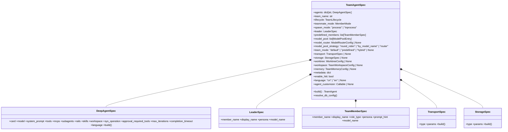

所有 Spec 都是 Pydantic BaseModel，可 `model_dump` 跨进程；不持有 runtime 引用（`agent_customizer` 例外，标 `Field(exclude=True)`，cold-recover 时由 `TeamAgent.recover_from_session(runtime_spec=...)` 重注入）。

### 8.4 TeamAgentSpec 校验铁律

- `agents["leader"]` 必填
- `model_pool` 与 `model_router` **互斥**
- `enable_hitt=False` 且 `predefined_members` 中含 HUMAN_AGENT → `AGENT_TEAM_CONFIG_INVALID`
- `enable_hitt=True` 且无 HUMAN_AGENT predefined → 允许（动态 spawn 路径）
- 预定义成员名不可使用 `RESERVED_MEMBER_NAMES`（`team_leader` / `human_agent` / `user`），但 HUMAN_AGENT 角色 + 任意自定义名允许
- Leader 找不到可用模型（pool 配置但 allocator 与 per-agent model 都为 None）→ build-time 报错并给出修复建议
- `spawn_mode="inprocess"` 且未设 `transport` → 自动填 `TransportSpec(type="inprocess")`

---

## 9. 模型池与分配策略

`models/` 子目录承担多模型部署：

```python
class ModelPoolEntry(BaseModel):
    model_name: str
    api_key: str
    api_base_url: str
    api_provider: str
    description: str | None
    model_id: str                 # 自动 uuid，process-local
    metadata: dict                # client / request 子键 + 自由扩展
```

- **持久化身份**：`(model_name, group_index)` — DB 仅存这个轻量引用；live config 由 `resolve_member_model` 从 in-session pool 重新解析
- **运行时 client 身份**：`model_id` 自动 uuid，surfaced 为 `ModelClientConfig.client_id`，**永不持久化**；pool refresh 时 `inherit_pool_ids` 只对 bit-exact 旧条目继承 model_id，防止凭证轮换后命中 stale client

### 9.1 三种策略

| 策略 | 实现 | 语义 |
|------|------|------|
| `round_robin` | `RoundRobinModelAllocator` | 线性轮转所有 entry，忽略 `model_name` |
| `by_model_name` | `ByModelNameAllocator` | 先在 model_name 组间轮转，组内再轮转 |
| `router` | `RouterAllocator` | 单端点路由：每个 `model_name` 唯一映射；无 hint 返回首项 |

`build_model_allocator(spec, team_spec)` 在 `TeamAgentSpec.build()` 内构造；空池返回 `None`，下游回退到 `TeamAgentSpec.agents[role].model`。

### 9.2 ModelRouterConfig（便利输入）

```python
class ModelRouterConfig(BaseModel):
    api_base_url: str
    api_key: str
    api_provider: str
    model_names: list[str]   # min_length=1，去重 + 非空校验
    metadata: dict
```

`build()` 时通过 `to_pool_entries()` 展开成 `model_pool`，`model_pool_strategy` 强制设为 `"router"`，下游全部走统一 pool 路径。

---

## 10. 消息架构

### 10.1 传输层抽象

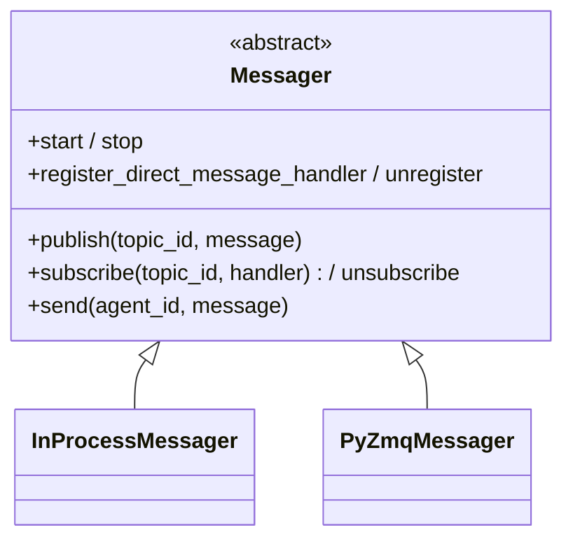

| 后端 | 场景 |
|------|------|
| `inprocess` | 单进程、测试。共享 `_Bus` 单例，零序列化；`sender_id` 防自环 |
| `pyzmq` | 跨进程。ROUTER/DEALER 点对点 + PUB/SUB 广播，可选 XPUB/XSUB 代理 |

### 10.2 Topic 结构

`session:{session_id}:team:{team_name}:{category}`，category ∈ `team` / `task` / `message`。

### 10.3 消息流（点对点 + 广播）

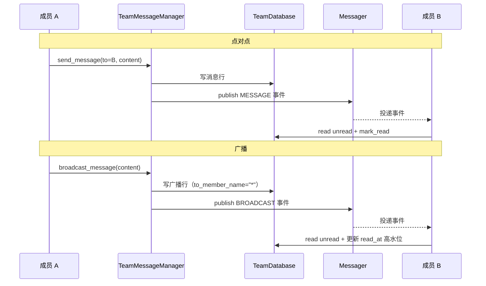

---

## 11. 工具系统

### 11.1 角色化工具

| 工具 | 类 | Leader | Teammate | HumanAgent |
|------|----|--------|----------|-----------|
| `build_team` | `BuildTeamTool` | ✓ | | |
| `clean_team` | `CleanTeamTool` | ✓ | | |
| `spawn_member` | `SpawnMemberTool` | ✓（非 predefined） | | |
| `shutdown_member` | `ShutdownMemberTool` | ✓ | | |
| `approve_plan` | `ApprovePlanTool` | ✓（plan_mode） | | |
| `approve_tool` | `ApproveToolCallTool` | ✓（plan_mode） | | |
| `create_task` | `TaskCreateTool` | ✓ | | |
| `update_task` | `UpdateTaskTool` | ✓ | | |
| `list_members` | `ListMembersTool` | ✓ | | |
| `claim_task` | `ClaimTaskTool` | | ✓ | |
| `member_complete_task` | `MemberCompleteTaskTool` | | | ✓ |
| `view_task` | `ViewTaskToolV2` | ✓ | ✓ | ✓ |
| `send_message` | `SendMessageTool` | ✓ | ✓ | |
| `workspace_meta` | `WorkspaceMetaTool` | ✓ | ✓ | ✓（按 workspace 开启） |

```python
LEADER_ONLY_TOOLS = {"build_team", "clean_team", "spawn_member", "shutdown_member",
                     "approve_plan", "approve_tool", "create_task", "update_task", "list_members"}
MEMBER_ONLY_TOOLS = {"claim_task"}
SHARED_TOOLS      = {"view_task", "send_message", "workspace_meta"}
HUMAN_AGENT_TOOLS = {"view_task", "member_complete_task"}
LEADER_TOOLS = LEADER_ONLY_TOOLS | SHARED_TOOLS
MEMBER_TOOLS = MEMBER_ONLY_TOOLS | SHARED_TOOLS
```

`predefined` 模式下 `spawn_member` 从 Leader 工具集移除；`teammate_mode != "plan_mode"` 时移除 `approve_plan` / `approve_tool`。

Worktree 工具（`enter_worktree` / `exit_worktree`）已下沉到 `openjiuwen.harness.tools.worktree`，由 `TeamToolRail` 在 `WorktreeManager` 可用时挂载。

### 11.2 工具输出契约

所有 `TeamTool` 子类 `invoke()` 返回 `ToolOutput`；工厂用 `_wrap_invoke_with_logging` 包装：

1. 调试日志
2. 调 `tool.map_result(output)` 产出 model-facing 文本
3. 包成 `MappedToolOutput`，其 `__str__` 就是 LLM 看到的 `ToolMessage.content`

`map_result` 策略：纯文本确认 / 结构化文本行 / detail 文本 / 文本 + 行为引导（如 `claim_task(completed)` 自动追加 "Call view_task now…" 维持自主任务循环）/ 默认 JSON。

### 11.3 描述即行为契约

每个工具描述包含：

- **何时使用**（per-action use case 枚举）
- **行为约束**（不要做什么）
- **成本信号**（如 broadcast 标注 expensive）
- **入口工具** 还需带完整 workflow 规范（如 `build_team`）

长文案落 `tools/locales/descs/<lang>/<tool>.md`，通过 `PromptTemplate` 加载 + `{{placeholder}}` 插值。

---

## 12. Git Worktree 隔离

通用 `WorktreeManager` 实现已下沉到 `openjiuwen.harness.tools.worktree`，由 DeepAgent 与 Team 共用。Team 侧只保留三件事：

1. `TeamAgentSpec.worktree` (`WorktreeConfig`) 配置；`agent_configurator.create_worktree_manager` 在非 LEADER 角色上构造 `WorktreeManager`
2. **Workspace 视图软链由 team 侧管**：`create_worktree_manager` 注入翻译适配器，把 `WorktreeCreatedEvent` / `WorktreeRemovedEvent` 路由到 `TeamWorkspaceManager.mount_worktree` / `unmount_worktree`，在共享 workspace 下维护 `.worktree/{slug}` 软链。单 agent 不订阅该事件、软链物理不存在
3. `worktree_remote.py`：跨机器 backend，调用方需要时直接构造 `WorktreeManager(backend=RemoteWorktreeBackend(...))`，不走 backend registry

### 12.1 生命周期策略

| 策略 | 行为 |
|------|------|
| `AUTO` | temporary → 短暂；persistent → 持久 |
| `EPHEMERAL` | 成员关闭立即移除 |
| `DURABLE` | 显式清理或超过 `cleanup_after_days` 后清理 |

---

## 13. 团队共享工作区

`TeamWorkspaceManager` 通过 `.team/{team_name}` 挂载点提供跨成员文件共享。

### 13.1 模式

| 模式 | 说明 |
|------|------|
| `LOCAL` | 单机：符号链接挂载 + 内存锁 |
| `DISTRIBUTED` | 每节点独立 clone，git push/pull 同步，leader 协调锁 |

### 13.2 冲突策略

| 策略 | 说明 |
|------|------|
| `LOCK` | 文件级锁，单写者 |
| `MERGE` | git 并发写入 + 冲突报告 |
| `LAST_WRITE_WINS` | 无检测，后写覆盖 |

### 13.3 TeamWorkspaceRail

拦截 `.team/` 前缀的文件操作：
- 读取前节流 pull（DISTRIBUTED）
- 写入前检查文件锁
- 写入后自动提交 + 发布 `WORKSPACE_ARTIFACT_UPDATED`

---

## 14. 队员生成机制

### 14.1 模式

| 模式 | 实现 | 说明 |
|------|------|------|
| `inprocess` | `inprocess_spawn()` → `asyncio.Task` | 共享事件循环；`contextvars.copy_context()` 传播 session_id |
| `process` | `Runner.spawn_agent` | 子进程，ZMQ 通信，跨平台 |

### 14.2 共享资源

进程内生成的成员共享 `spawn/shared_resources.py` 的进程全局单例：

```python
get_shared_runtime() -> TeamRuntime
get_shared_db(config) -> TeamDatabase | InMemoryTeamDatabase
cleanup_shared_resources() -> None
```

### 14.3 故障恢复

`SpawnManager._restart_teammate` 采用 `2^attempt` 指数退避（默认 max=3），失败标记 `ERROR`。健康检查由 `SpawnConfig(health_check_timeout, health_check_interval)` 配置。

### 14.4 Stream chunk 跨成员 fan-out（inprocess）

每个 `StreamController` 在 chunk 入 queue 前调 `_tag_chunk` 升级为 `TeamOutputSchema(source_member, role)`，再 fan-out 给 `_chunk_observers`。inprocess 模式下，`SpawnManager._wire_inprocess_chunk_forward` 给每个新 teammate 的 `StreamController` 挂 forward observer，把 chunk 转投 leader 的 `stream_queue`，让 `Runner.run_agent_team_streaming` 对外流出全成员 chunk。

- observer 抛错自动 detach 不阻塞主流
- teardown 时由 `cleanup_teammate` 反注册
- subprocess 模式不挂 observer（不同进程不共享对象），扩展点已留好（messager-driven observer）

---

## 15. 三视角交互（interaction/）

### 15.1 三种 InteractPayload

```python
GodViewMessage(body)                          # 直达 leader DeepAgent
OperatorMessage(body, target=None)            # 以 user 身份说话；target=None 广播
HumanAgentMessage(body, sender, target=None)  # 以注册的 human_agent 成员说话
InteractPayload = Union[GodViewMessage, OperatorMessage, HumanAgentMessage]
```

`DeliverResult(ok, message_id, reason)` 统一返回；失败 reason 为短 token（`not_active` / `gate_closed` / `human_agent_not_enabled` / `unknown_human_agent` / ...）。

### 15.2 文本前缀解析

`parse_interact_str(raw)` 在 `Runner.interact_agent_team` 收到 `str` 时**一次性解析**：

| 前缀 | 解析结果 |
|------|---------|
| `# body` | `GodViewMessage(body)` |
| `$<name> body` | `HumanAgentMessage(body, sender=name)` |
| `... @<member> ...` | 多收件人 fan-out（每个 `@member` 一条 payload，同一 gate ticket 下分发） |
| `@all` / `@*` | 折叠成单条广播 |
| 其他 | `GodViewMessage(body=raw)` |

CLI / runtime 都只解析一次——CLI 不重复解析，避免 `# # body` 双重 strip。

### 15.3 调用链

```text
Runner.interact_agent_team(payload, *, team_name, session_id)
  └── manager.interact
        ├── parse_interact_str(str) → [InteractPayload, ...]
        ├── _resolve_entry(team_name, session_id) — 取 pool entry
        ├── entry.interact_gate.admit() — 拿到 ticket 或 gate_closed
        └── _dispatch_payload(agent, payload)
              ├── GodView → UserInbox.deliver_to_leader(agent.deliver_input, body)
              ├── Operator(target=None) → UserInbox(backend.message_manager).broadcast
              ├── Operator(target=x) → UserInbox(backend.message_manager).direct(x)
              └── HumanAgent → HumanAgentInbox(backend, msg_mgr, lookup).send(body, to, sender)
                    ├── HumanAgentNotEnabledError → DeliverResult.failure("human_agent_not_enabled")
                    └── UnknownHumanAgentError → DeliverResult.failure("unknown_human_agent")
```

### 15.4 HITT（Human in the Team）

`enable_hitt` 是分层开关：

- **Spec 层**（`TeamAgentSpec.enable_hitt`）= 能力天花板。`True` 才允许 HITT；`False` 禁所有 human-agent 创建
- **Build 层**（`build_team(enable_hitt=...)`）= 运行时实例开关。`None` 继承 spec；`True` 要求 spec=True；`False` 即使 spec=True 也覆盖

人类成员来源：

- **静态**：`TeamAgentSpec.predefined_members` 含 `role_type=HUMAN_AGENT`（自定 member_name，可多人）；不再隐式注入默认 `human_agent`
- **动态**：leader 调 `spawn_member(role_type='human_agent', ...)`；禁止传 `model_name` / `prompt`

运行约束：

1. 保留名 `human_agent` 仅用作动态 spawn 默认名；自定义 HUMAN_AGENT 成员名可避此名
2. HumanAgent 走标准 UNSTARTED → spawn 流程，但工具集仅 `HUMAN_AGENT_TOOLS`；rail 装配剥离 `FirstIterationGate` 与 `TeamToolApprovalRail`
3. 任务 `assignee` 指向 human-agent 且 CLAIMED 时，`UpdateTaskTool` 拒绝 reassign / cancel
4. 发给 human-agent 的点对点消息 `is_read=True`；广播后 human-agent `read_at` 立即跟进
5. `TeamPolicyRail` 注入 `team_hitt` section（P:12），按 role 下达 leader / teammate / human_agent 行为约束。section 注入条件来自 `backend.hitt_enabled()` 反映 effective flag，不依赖 roster

`HumanAgentInboundEvent(member_name, sender, body, broadcast, message_id, timestamp)` 通过 `Runner.register_human_agent_inbound(team_name, session_id, member_name, callback)` 推给业务层，让外部 UI / 通讯渠道把团队消息送达对应的人类用户。

---

## 16. Runner Facade + Runtime 派发

### 16.1 公共入口表面

`Runner` facade（参见 `runtime/CLAUDE.md`）只暴露：

| 方法 | 用途 |
|------|------|
| `Runner.run_agent_team(agent_team, session=...)` / `_streaming(...)` | 运行入口；`agent_team` 接 `str \| TeamAgentSpec`（默认 agent_teams 路径）或 `str \| BaseTeam`（`base=True`） |
| `Runner.interact_agent_team(payload, *, team_name, session_id)` | 三视角交互；bare str 走 GodView 便捷形式 |
| `Runner.pause_agent_team(*, team_name, session_id)` | 暂停（保留状态，可 resume） |
| `Runner.stop_agent_team(*, team_name, session_id)` | 停止（保留 DB，pool 移除） |
| `Runner.delete_agent_team(team_name, session_ids, *, force=False)` | 删除 DB / checkpoint / 文件系统 |
| `Runner.release(session_id, *, force=False)` | 释放 session 动态表 |
| `Runner.list_active_teams()` | `list[ActiveTeamInfo]` 只读快照 |
| `Runner.register_human_agent_inbound(*, team_name, session_id, member_name, callback)` | 注册 team→user 通知回调 |
| `Runner.get_agent_team_monitor(*, team_name, session_id)` | 取 `TeamMonitor` |

无 `create_agent_team` / `recover_agent_team` / `resume_persistent_team` —— 这些便利工厂已物理删除。**新增配置一律走 `TeamAgentSpec`**，扩参数列表是 hack，扩 Spec 才是设计。

### 16.2 派发决策（9 路 truth table）

`decide_run_action(...)` 是纯函数；输入 `(team_in_db, team_in_session, pool_entry, target_session_id, target_team_name)`，输出 `RunAction(kind, require_spec, reason)`：

| team_in_db | team_in_session | pool_entry | same_session? | kind |
|------------|----------------|-----------|--------------|------|
| False | False | None | — | `CREATE` |
| False | False | present | — | `REJECT_INCONSISTENT` |
| False | True | — | — | `REJECT_ORPHANED` |
| True | False | None | — | `NEW_TEAM_IN_SESSION` |
| True | True | None | — | `COLD_RECOVER` |
| True | True | present | yes (RUNNING) | `REJECT_RUNNING` |
| True | True | present | yes (PAUSED) | `RESUME_FROM_PAUSE` |
| True | True | present | no | `WARM_RECOVER` |
| True | False | present | any | `NEW_TEAM_IN_SESSION_WARM` |

`TeamRuntimeManager._apply_action` 按 kind 执行副作用：

- `CREATE` → `spec.build()` + 入 pool
- `NEW_TEAM_IN_SESSION` → `spec.build()` + `agent.resume_for_new_session(session)` + 入 pool
- `COLD_RECOVER` → `TeamAgent.recover_from_session(session, team_name, runtime_spec=spec)` + `agent.recover_team()` + 入 pool
- `NEW_TEAM_IN_SESSION_WARM` → `agent.resume_for_new_session(session)` + `entry.state = RUNNING` + reset gate
- `WARM_RECOVER` → `agent.recover_for_existing_session(session)` + 切 session
- `RESUME_FROM_PAUSE` → `entry.state = RUNNING` + reset gate
- `REJECT_*` → 直接返回 `TeamRuntimeActivation` 带原 entry（log warning）

### 16.3 TeamRuntimePool

```python
class RuntimeState(str, Enum):
    RUNNING = "running"
    PAUSED = "paused"

@dataclass(slots=True)
class ActiveTeam:
    team_name: str
    agent: TeamAgent
    current_session_id: str
    state: RuntimeState
    interact_gate: InteractGate

@dataclass(frozen=True, slots=True)
class ActiveTeamInfo:                     # 只读快照（剥离 agent / gate）
    team_name: str
    current_session_id: str
    state: RuntimeState
    gate_closed: bool
```

- Pool key 是 **`team_name`**（唯一）：同一 team 切 session 走 `recover_for_existing_session` warm path，**不会**出现多 entry
- 同一 session 多 team 通过多个 entry 共享 session_id 自然支持
- Pool 只持 Leader：teammate / human-agent 走 `Runner.run_agent_team*(member=True)` 入口，跳过 activate/dispatch，**不入 pool**
- `manager.register_instance` 这类"已 build 实例 → pool"的快捷入口已删除——pool 写入语义只剩 `spec → manager.activate` 一条

### 16.4 InteractGate

每个 `ActiveTeam` 自带 `InteractGate`：

```text
OPEN    --admit()---------->  OPEN, inflight++
OPEN    --close_and_drain()->  CLOSING --(inflight==0)--> DRAINED
CLOSING --admit()---------->  None (rejected → DeliverResult.failure("gate_closed"))
*       --consume_done(t)-->  inflight--; signal drained when zero
```

- `run_agent_team_streaming` 退出 finally 调 `_close_team_interact_gate` 关 gate
- warm 路径 activate 时 `gate.reset()`
- 静止前置：`release_session` / `delete_team` 在仍有 entry 时报 `AGENT_TEAM_BUSY_INVALID`，需先 `stop_team` 或加 `force=True`

### 16.5 Stream 生命周期与 OuterLoop 解耦

`Runner.run_agent_team_streaming` 不会因 leader DeepAgent 单轮 OuterLoop 完成就结束。stream 终止由 team 层显式动作触发：`pause_agent_team` / `stop_agent_team` / `clean_team`（或退出 finally）。leader OuterLoop 跑完会 idle 等下一个 wake-up；dispatcher 仍在调度，pool entry 仍 RUNNING。基于"OuterLoop 完成 = stream 结束 = entry 失活"的判断都是错的——`interact_agent_team` 返回 `not_active` 时先查 entry 是否在 pool 里。

---

## 17. 执行流程

### 17.1 端到端：创建 → 执行 → 收尾

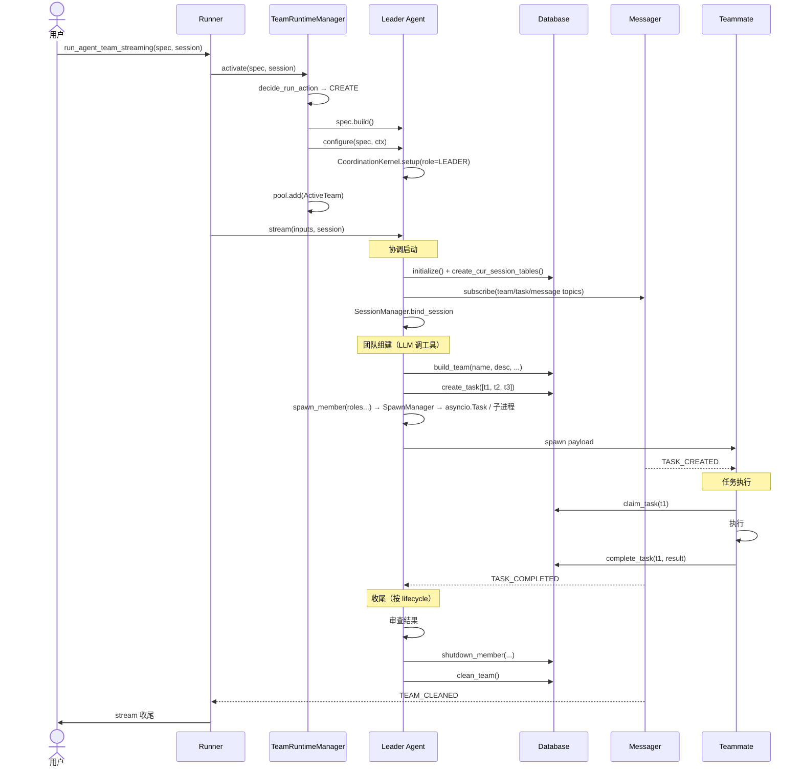

### 17.2 Plan 模式审批流

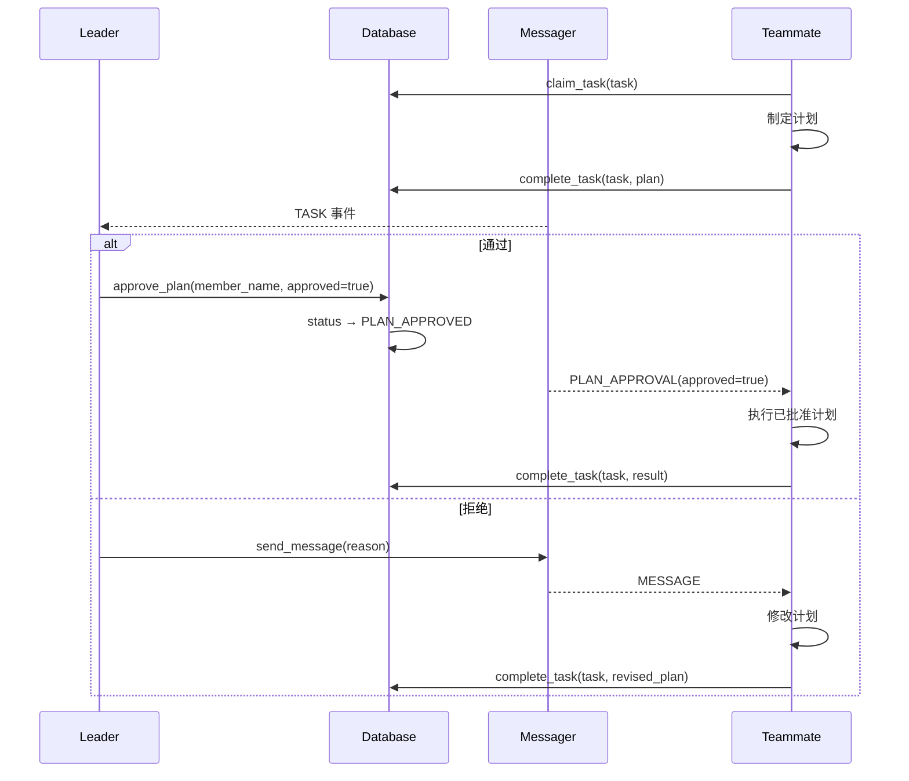

### 17.3 工具审批流（TeamToolApprovalRail）

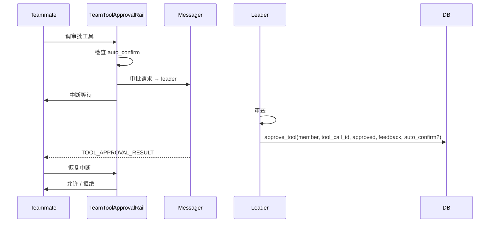

### 17.4 持久化团队跨 session 切换（WARM_RECOVER）

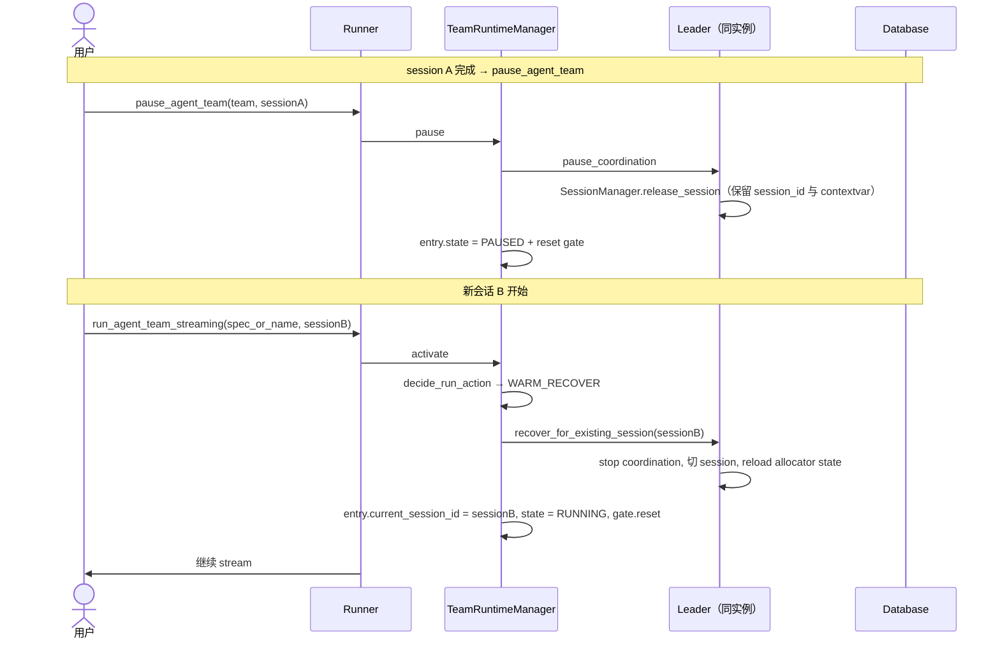

### 17.5 三视角交互一次成功投递

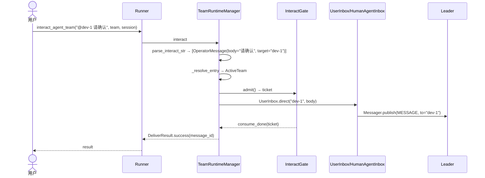

---

## 18. 注册表与扩展点

### 18.1 可插拔基础设施

| 注册表 | 函数 | 内置实现 |
|--------|------|---------|
| 传输层 | `register_transport(name, cls)` | `inprocess` / `pyzmq` |
| 存储层 | `register_storage(name, cls)` | `sqlite` / `postgresql` / `mysql` / `memory` |
| Rail | `register_rail_type(name, cls)` | `task_planning` / `skill_use` / `subagent` / `filesystem` / `context_engineering` / `token_tracking` / `tool_tracking` / `ask_user` / `confirm_interrupt` |
| Tool | `register_tool_type(name, cls)` | `web_search` / `web_fetch` |
| Worktree backend | `register_worktree_backend(name, factory)` | `git` |

`TransportSpec` / `StorageSpec` 通过 type 字符串 + 注册表解析具体实现。注册采用延迟加载（`_ensure_builtin_infra_registered`），首次使用填充。

### 18.2 扩展示例

```python
from openjiuwen.agent_teams.schema.blueprint import register_transport, register_storage

register_transport("redis", RedisTransportConfig)
register_storage("postgres", PostgresStorageConfig)
```

---

## 19. 会话隔离

每次团队运行通过 `context.py` 的 `set_session_id(...)` ContextVar 绑定会话：

```python
# spawn/context 路径
token = set_session_id("abc123")

# 动态表名由 session_id 派生
team_task_abc123
team_task_dependency_abc123
team_message_abc123
message_read_status_abc123
```

多个并发团队运行可共享同一数据库而互不干扰。静态表（`Team` / `TeamMember`）跨 session 共享，代表持久团队结构。

进程内生成的队员通过 `contextvars.copy_context()` 传播 session_id，确保异步任务间隔离。

---

## 20. 可观测性（TeamMonitor）

### 20.1 查询 API

| 方法 | 返回 |
|------|------|
| `get_team_info()` | `TeamInfo` |
| `get_members(status=None)` | `list[MemberInfo]` |
| `get_member(name)` | `MemberInfo` |
| `get_tasks(status=None)` | `list[TaskInfo]` |
| `get_messages(to=None, from_=None)` | `list[MessageInfo]` |

### 20.2 事件流

```python
monitor = await Runner.get_agent_team_monitor(team_name=..., session_id=...)
await monitor.start()
async for event in monitor.events():
    ...
await monitor.stop()
```

Monitor 注册为 Leader TeamAgent 的事件监听器，把内部 `EventMessage` 转换为 `MonitorEvent`。返回模型均为纯 Pydantic BaseModel，与 SQLModel 解耦。

### 20.3 OpenTelemetry / 日志桥接

`observability/` 子目录承担：

- `setup.py` / `config.py` —— 初始化与配置
- `callback_handler.py` / `monitor_handler.py` —— DeepAgent + Team 事件转 OTel span
- `rail.py` —— 注入到 DeepAgent 的观察 rail
- `semconv.py` / `redaction.py` —— 语义约定 + 敏感数据脱敏
- `span_context.py` —— 跨 async 任务的 span 传播

---

## 21. CLI（交互式 TUI）

`cli.run_team_cli(*, specs, yaml_paths, input_iter=None, manage_runner=True)` 是公共入口：

```python
import asyncio
from openjiuwen.agent_teams.cli import run_team_cli

asyncio.run(run_team_cli(yaml_paths=["team.yaml"]))
```

### 21.1 输入路由

```text
input := "/cmd args..." | "! shell-cmd" | <plain text>

/cmd  → SLASH_COMMANDS[head] → sub-action handler
! ... → asyncio.subprocess 直通
plain → Runner.interact_agent_team(text, team_name=active, session_id=active)
        └ runtime.parse_interact_str 决定 GodView / Operator / HumanAgent
```

字面 `/foo` 给 leader：用 `# /foo` 显式 GodView，不需要 escape。

### 21.2 斜杠命令域

| 域 | 子命令 |
|----|-------|
| `/team` | `start` / `stop` / `pause` / `resume` / `delete` / `switch` / `list` / `watch` / `monitor` |
| `/session` | `new` / `switch` / `release` |
| `/spec` | `load` / `list` / `show` / `add` |

每个 `_cmd_*` 直接调对应 `Runner` facade；二级 tab 补全由 `SlashCompleter` 提供。

### 21.3 铁律

- CLI 不重新 `parse_interact_str`——`runtime.manager.interact` 在 str 路径已调过一次
- 取消时序：`/team stop` / `switch` 先 `stop_agent_team`（关 gate + teardown），再 `task.cancel()`
- `gate_closed` ≠ team 死了：通常是 stream 退出 finally。CLI 提示用户等 wakeup 或 `/team resume`
- 静止前置：`/session release` / `/team delete` 在仍有活跃 entry 时报 `AGENT_TEAM_BUSY_INVALID`
- 所有打印走 `cli.state.console`（rich `Console`），避免撕裂 prompt_toolkit 输入区
- prompt_toolkit / rich 是软依赖（`cli` extras），别让它们渗到非 CLI 模块成为硬 import

---

## 22. 关键设计决策

| 决策 | 理由 |
|------|------|
| 删除 factory wrapper | `TeamAgentSpec(...).build()` + `Runner` facade 是唯一公共路径；扩参数列表是 hack，扩 Spec 才是设计 |
| TeamAgent 单一实现 + 四象限拆解 | 减少代码重复；leader / teammate / human_agent 共享 80% 基础设施；按"跨 operator / 跨实例 / 跨进程"维度分文件，避免一个类塞 100+ 字段 |
| TeamHarness 唯一 DeepAgent 适配 | 替换 DeepAgent 为远程 / 分布式调度只改 harness；业务代码保持调用面 |
| 9 路 dispatch truth table | 把 (DB / session / pool / 同 session) 状态映射成确定动作；纯函数 + 无副作用，IO 在 manager 上游收集 |
| Pool 只持 leader | teammate / human-agent 走 `member=True` spawn 入口跳 activate；pool 入口语义只剩一条（spec → activate），避免双入口下的 stale state |
| InteractGate 与 run cycle 对齐 | `run` 结束关 gate（拒绝后续 interact）；warm 路径 reset 让新 cycle 重新放行 |
| Stream 与 OuterLoop 解耦 | leader OuterLoop 单轮完成不代表 stream 结束；终止由 team 层显式动作触发 |
| 三视角文本前缀解析在一处 | `parse_interact_str` 只在 `manager.interact` 调一次，CLI 透传；避免 `# # body` 双重 strip |
| 角色化工具 + 描述即契约 | 每个 ToolCard 描述含 use-case / 行为约束 / 成本信号；入口工具（`build_team`）承载完整 workflow，避免 system prompt 重复 |
| 分段式 Prompt 注入 | `TeamPolicyRail` 把团队上下文拆成有序 `PromptSection`；动态段经 mtime cache 稳态代价极低 |
| 事件驱动 + 轮询混合 | 事件低延迟；30s poll 兜底防丢失 |
| 动态会话表 | 避免 schema 膨胀；并发零干扰 |
| 注册表模式 | 新增传输 / 存储 / Rail / Worktree backend 无需改核心 |
| FirstIterationGate | 同步外部代码与 agent 就绪状态，防止 `steer()` / `follow_up()` 在 round 启动前发生竞态 |
| 幂等状态更新 | `TeamMember.update_status` 相同新旧态跳过 DB 写入和事件，对恢复 / 重启场景至关重要 |
| 进程全局共享资源 | 进程内 spawn 的成员共享 DB / Runtime / Messager 单例，避免连接膨胀 |
| Worktree 通用实现下沉 | `harness/tools/worktree` 由 deepagent + team 共用；team 侧只保留配置 + workspace mount 适配器 + 跨机器 backend |
| Stream chunk 升级为 TeamOutputSchema | 不污染 core `OutputSchema`；子类带 `source_member` / `role` 让团队层消费者归属每个 chunk |
| Spec 状态按 team 分桶 | `state["teams"][team_name]` 命名空间；同一 session 承载多 team 状态；读写一律走 `runtime/metadata.py` |
| 模型池 + 三策略 | 多端点部署原语；`router` 是单端点多模型的便利配置；`(model_name, group_index)` 持久化身份 + 运行时自动 uuid client id |

---

## 23. 公共 API

```python
# 装配入口
TeamAgentSpec(...).build() -> TeamAgent

# Runner facade（运行 / 交互 / 生命周期）
Runner.run_agent_team(agent_team, session=None)
Runner.run_agent_team_streaming(agent_team, session=None)
Runner.interact_agent_team(payload, *, team_name, session_id)
Runner.pause_agent_team(*, team_name, session_id)
Runner.stop_agent_team(*, team_name, session_id)
Runner.delete_agent_team(team_name, session_ids, *, force=False)
Runner.release(session_id, *, force=False)
Runner.list_active_teams() -> list[ActiveTeamInfo]
Runner.register_human_agent_inbound(*, team_name, session_id, member_name, callback)
Runner.get_agent_team_monitor(*, team_name, session_id) -> TeamMonitor | None

# CLI
cli.run_team_cli(*, specs=None, yaml_paths=None, input_iter=None, manage_runner=True)

# 核心类型（agent_teams.__init__ 导出）
TeamAgent
TeamAgentSpec / LeaderSpec / TeamMemberSpec / TransportSpec / StorageSpec / DeepAgentSpec
TeamSpec / TeamRuntimeContext
TeamRuntimeManager / TeamRuntimeActivation / RunAction / RunActionKind

# 三视角交互
GodViewMessage / OperatorMessage / HumanAgentMessage / InteractPayload
HumanAgentInboundEvent / DeliverResult
UserInbox / HumanAgentInbox
HumanAgentNotEnabledError / UnknownHumanAgentError
parse_mention / is_reserved_name

# 模型池
ModelPoolEntry

# 流
TeamOutputSchema

# 枚举与常量
TeamRole              # LEADER / TEAMMATE / HUMAN_AGENT
TeamLifecycle         # TEMPORARY / PERSISTENT
MemberStatus          # UNSTARTED / READY / BUSY / PAUSED / RESTARTING /
                      # SHUTDOWN_REQUESTED / SHUTDOWN / ERROR
ExecutionStatus       # IDLE / STARTING / RUNNING / COMPLETING / COMPLETED / ...
TaskStatus            # PENDING / CLAIMED / PLAN_APPROVED / COMPLETED / CANCELLED / BLOCKED
MemberMode            # BUILD_MODE / PLAN_MODE
TeamEvent             # 全部事件常量
DEFAULT_LEADER_MEMBER_NAME / HUMAN_AGENT_MEMBER_NAME / USER_PSEUDO_MEMBER_NAME / RESERVED_MEMBER_NAMES

# 消息传输
Messager / MessagerTransportConfig / MessagerPeerConfig
InProcessMessager / PyZmqMessager
create_messager()

# 生成机制
InProcessSpawnHandle
MemoryDatabaseConfig

# 可观测性
TeamMonitor / create_monitor()
TeamInfo / MemberInfo / TaskInfo / MessageInfo
MonitorEvent / MonitorEventType
```

> 已删除（不再是公开 API）：`create_agent_team` / `recover_agent_team` / `resume_persistent_team`。Cold-recover 的低层入口 `TeamAgent.recover_from_session(session, team_name, runtime_spec=spec)` + `await agent.recover_team()` 仅供运维脚本绕过 Runner 直接拿 leader 实例时使用，常规应用一律走 `Runner.run_agent_team_streaming(agent_team=spec, session=...)`。
