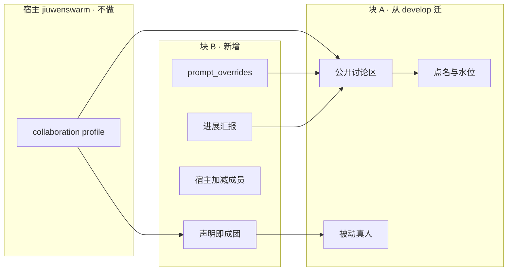
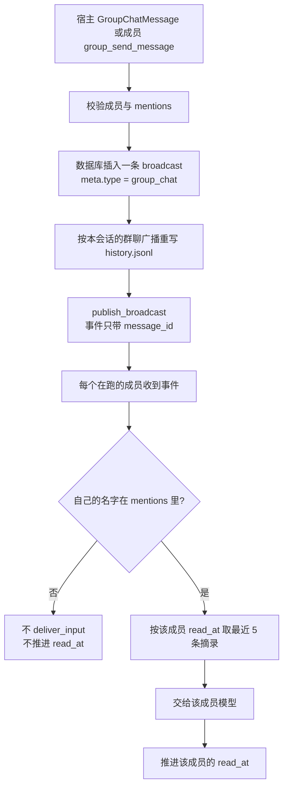
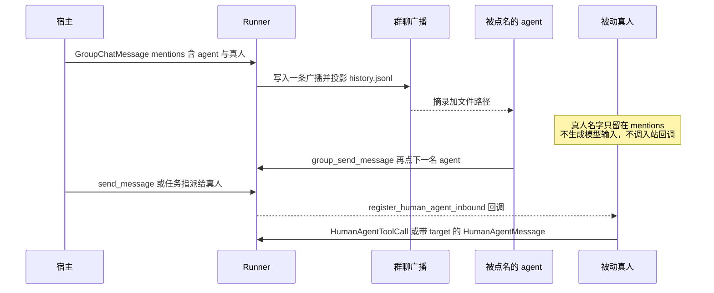
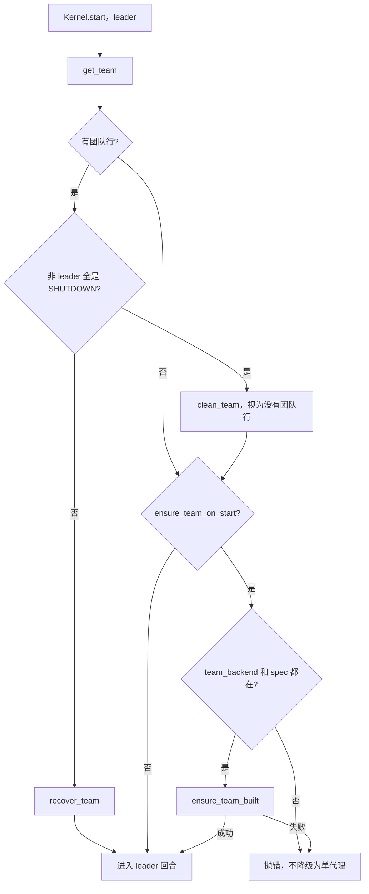

# 多智能体项目空间 · agent-core 需求开发说明

| 项 | 值 |
|---|---|
| 状态 | 块 A 与块 B 已按本文实现 |
| 基线 | `dev-stable` @ `117b9d9d1`，分支 `feat/project-space-agent-core` |
| 迁移依据 | 块 A 依据 `develop` 的 `docs/specs/S_28`（2026-09-30）及 `group_chat/`。块 B 参考 caozhenhua 工作区的门面，差异见 B6 |
| 范围 | 只做 `agent-core`。jiuwenswarm 的 profile、讨论结束判定、项目级记忆，以及 relay-claw 的页面，不在本文 |

产品要的是项目空间里的多智能体协作。agent-core 只提供团队运行时。需求分成两块：

| 块 | 内容 | 来源 |
|---|---|---|
| A. 迁移改造 | 公开讨论区、点名、数据库广播加水印、`history.jsonl` 投影、被动真人 | `develop` 已有，按 `dev-stable` 的运行时接进来 |
| B. 新增 | 声明即成团、提示词可插拔、宿主加减成员、进展汇报 | `dev-stable` 与 `develop` 都没有的宿主能力 |

不采用这些已放弃的做法：`enable_group_chat`、`group_context_tail`、以 `history.json` 为底账、`.notified.json`、离线直写邮箱的 `post_group_message` / `post_member_input`、宿主任意指定 `sender`。



---

## 0. 已有能力，本次不重做

`dev-stable` 上这些已经可用，新接口只扩展、不替换：

| 能力 | 入口 |
|---|---|
| 跑团队 | `Runner.run_agent_team` / `run_agent_team_streaming` |
| 后续输入 | `Runner.interact_agent_team` |
| 带 avatar 的真人 | `role_type="human_agent"`，`enable_hitt=True` |
| 团队找真人 | `Runner.register_human_agent_inbound` |
| 真人说话 | `HumanAgentMessage`。`target is None` 驱动 avatar，不写邮箱；`target` 为 `all` 或 `*` 才是内部广播；具名 `target` 是私信 |
| 按成员名配能力 | `agents[member_name]` 优先于 `agents["teammate"]`、`agents["leader"]`，`AgentConfigurator.resolve_agent_spec` 已实现 |
| 任务型协作 | `build_team`、任务板、`send_message` 保持原语义 |

`HumanAgentMessage` 的 dataclass 注释写「`target=None` 即广播」，与 `HumanAgentInbox` 不符。本次以 inbox 实现为准，不改这条路由。

---

## A. 从 develop 迁移（定稿）

这一块的底账跟 develop 的 `group_chat/`：数据库一条广播，`history.jsonl` 只是投影。caozhenhua 工作区里同一功能走的是 `history.json` 加 `.notified.json` 加定向私信，那套存储和叫醒不迁。点名校验和被动真人的角色模型可以沿用，接到这条广播链上。

和 caozhenhua 的差异集中在 A5。开发时按 A4 的顺序改，不要先搬 `tools/group_conversation.py`。

### A1. 公开讨论区

同一 `team_name`、同一 `session_id` 共用一份公开记录。底账是数据库里的一条广播：正文、发送者、`mentions`、附件引用都在这一行。`history.jsonl` 是投影，不是第二份底账。

投影的意思：文件按数据库里的群聊广播重新生成，一行一条 JSON，给成员 `read_file`。文件可以丢，下次同步再从数据库生成。已读水位不写进文件。

路径：

```text
{team_home}/{team}/team-workspace/conversations/<team-scope>/<session-scope>/history.jsonl
```

`team_home` 即 `paths.team_home`。默认 workspace 是其下的 `team-workspace`（与现有 `team_memory_dir` 的父目录相同）。spec 提供了 `workspace.root_path` 时，历史放在那个根下的 `conversations/`。`team-scope` / `session-scope` 用现成的 `_safe_segment` 再加 sha256，避免会话号里的分隔符逃出目录。自定义根登记在 `{team_home}/{team}/conversation-workspaces/{sha256(session_id)}.json`。已有会话不允许换根。

拒绝符号链接。Windows 上不要用 `resolve()` 前后字符串是否相等来判断，路径规范化会误伤正常目录。确认目标不是符号链接，并且仍落在该会话目录内。

每行字段：`message_id`、`team_name`、`session_id`、`client_message_id`、`sender`、`sender_name`、`content`、`timestamp`、`mentions`、`attachments`。附件只存引用，不复制文件内容。引用对象允许 `name`、`path`，二者都可缺，但必须是 JSON 对象。

`meta` 至少包含 `type=group_chat`、`client_message_id`、`session_id`、`sender_name`、`mentions`、`attachments`。投影只收 `meta.session_id` 等于当前会话的行。develop 的同步会把该团队全部群广播都打上「当前 session」写进同一个文件，这里改掉，两个会话不能合成一份历史。

同步在跨进程锁内按 `message_id` 合并磁盘上已有行和数据库行，按 `(timestamp, message_id)` 排序后原子替换。格式用 JSON Lines，不使用外层 JSON 数组。锁和原子写放在 `group_chat/conversation.py` 内：用仓库已有的 `filelock.FileLock`，同目录临时文件加 `os.replace`。当前分支没有 develop 的 `skill/file_lock.py` 和 `team_workspace/frontmatter.atomic_write`，不要为了这一块把那两个模块整份搬过来。

没有团队行时拒绝，原因 `invalid_group_chat`。本块不调用 `build_team`。develop 的 `deliver_group_message` 会在缺行时自己建队，那会改变 `dev-stable` 上「等 leader 调工具」的现有团队。自动成团留给块 B 的 `ensure_team_on_start`。

#### 宿主输入

不新增离线投递接口。首次运行把同一结构放进 `inputs["query"]`，之后走 `interact_agent_team`。

```python
payload = {
    "type": "group_chat",
    "body": "请看这个方案",
    "client_message_id": "msg-001",
    "mentions": ["writer"],
    "attachments": [{"name": "brief.txt", "path": "/shared/brief.txt"}],
}

async for chunk in Runner.run_agent_team_streaming(
    agent_team=spec,
    inputs={"query": payload},
    session=session,
):
    ...

result = await Runner.interact_agent_team(
    payload,
    team_name="jiuwen_team",
    session_id="sess_xxx",
)
```

Python 侧也可以直接构造 `GroupChatMessage`。

| 字段 | 类型 | 必填 | 说明 |
|---|---|---|---|
| `type` | `str` | 线协议必填 | 固定 `"group_chat"`。dataclass 本身无此字段 |
| `body` | `str` | 是 | 正文。无正文且无附件则拒绝 |
| `client_message_id` | `str` | 是 | 同一 team/session 内的幂等键，最长 255 |
| `mentions` | `tuple[str, ...]` | 否 | 成员名，默认空。不解析正文里的 `@` |
| `attachments` | `tuple[dict, ...]` | 否 | 附件引用，默认空 |

未知字段拒绝。作者固定为 `user`，调用方不能传 `sender`。

`client_message_id` 生成稳定 `message_id`（`uuid5(team, session, client_message_id)`）。相同 ID 且内容一致：不重复插入，重新同步投影，再发布同一条广播事件；各成员已有 `read_at` 挡住重复喂模型。相同 ID 但发送者、正文、`mentions` 或附件不同：失败。

#### 返回

扩展现有 `DeliverResult`，增加可选 `data`。群聊成功时：

| `data` 字段 | 含义 |
|---|---|
| `message` | 归档后的公开消息 |
| `duplicate` | 是否命中已有 `client_message_id` |
| `notified_members` | 允许唤醒的 agent 名单，不是已读回执 |
| `context_path` | `history.jsonl` 绝对路径 |

`ok=True` 只表示归档和事件发布完成，不表示成员已经读完或做完。

流式首包：成功输出 `team.group_message.accepted`，载荷带上 `data`。失败沿用 `team.interact.failed`。

`invoke` / `stream` 会一直读到队列里的 `None`。leader 不在 `notified_members` 里时，确认包发出后关闭流，宿主不必等 leader 模型。leader 被点名时不关，让随后的邮箱摘录继续驱动这一轮。非法的 `group_chat` 字典在进 leader 模型之前就失败，不要把整个字典塞进 `pending_user_query` 或 `enqueue_user_input`。群聊输入的 `pending_user_query` 置空，避免记忆管道拿到字典。

失败原因沿用稳定 token：`invalid_group_chat`、`group_chat_delivery_failed`。未知或已离队的 mention 使整次请求失败，不退回 leader。



### A2. 点名

`mentions` 是成员名列表，最多 100 个，去重后按原顺序保留。名字必须是已登记且未离队的成员，或字面量 `user`。

| 被点名者 | 行为 |
|---|---|
| leader、teammate、bridge、external_cli、human_agent | 进入 `notified_members`，按水位生成摘录并交给模型 |
| `passive_human` | 写入 `mentions`，不生成模型输入，也不因此调用入站回调 |
| `user` | 写入 `mentions`，不生成模型输入 |

摘录固定 5 条：该成员 `read_at` 之后、本次触发消息之前的最近 4 条，加上本次触发消息。候选只含本会话的群聊行。每条正文最多 2000 字，并带截断标记、附件数量和 `history.jsonl` 路径。没有可配置条数。触发消息不在窗口内时追加，不要替换窗口边缘的一条。

水位复用现有 `MessageReadStatus.read_at`。这列是团队加成员一条高水位，表上没有 session。运行时一个团队同时只绑一个会话，摘录再按 `meta.session_id` 过滤。换会话之后，旧会话里比水位更早的群消息不再喂模型。不要为这一块加新水位表，也不要另写 `.notified.json`。

`read_at` 是高水位：标了较新的广播，更早的广播就算已读。群聊投递必须按时间从旧到新，一次一条，成功 `deliver_input` 之后再推进水位。当前 `MessageHandler` 对普通邮件是「最新优先、一批标已读」。没有群聊未读时保持这个行为。一旦未读里有群聊行，这次排空改成从旧到新一次一条，避免后一条先标已读、前面的群消息被盖掉。被点名但尚未投递成功的消息不推进该成员水位。

无 mention 的消息不推进任何成员的水位，也不阻挡 `has_unread_messages`。群广播只有「角色不是 `passive_human`、名字在 `mentions` 里、水位还没盖住、且属于当前会话」才算未读。普通广播的原规则不变：非发送者、未到 `SHUTDOWN`、水位未覆盖。

Leader 未被点名时仍扫描未读群消息的 `mentions`，拉起其中 `UNSTARTED` 或 `ERROR` 的成员。这是启动，不是把正文先交给 leader。leader 自己不在 `mentions` 里时，`get_broadcast_messages` 不把这行返回给他。`UNSTARTED` 走现有 `startup_member`。`ERROR` 用现有 `try_transition_member_status` 收到 `RESTARTING`，再走 `SpawnManager.restart_teammate`。`passive_human` 不进这个列表。`spawn_teammate` 见到这个角色直接跳过，避免恢复路径误起 harness。

成员公开回复使用工具 `group_send_message`，与宿主输入共用归档和通知。作者绑定当前 `member_name`。`human_agent` 与 `passive_human` 不注册该工具。

| 参数 | 必填 | 说明 |
|---|---|---|
| `content` | 是 | 正文 |
| `client_message_id` | 是 | 稳定 ID，重试复用原记录 |
| `mentions` | 否 | 成员名数组 |

### A3. 被动真人

从 `develop` 迁入 `TeamRole.PASSIVE_HUMAN = "passive_human"`。无 harness、无模型、注册即 `READY`。不能使用文件和 Shell。

`enable_hitt=False` 时，`predefined_members` 含 `human_agent` 或 `passive_human` 都在 `build()` 抛 `AGENT_TEAM_CONFIG_INVALID`。

Leader 在 `hitt_enabled()` 时多一个工具 `spawn_passive_human`，参数只有 `member_name`、`display_name`、`desc`。没有 `model_name` 和 `prompt`。

真人回团队仍走 `interact_agent_team`：

| payload | 行为 |
|---|---|
| `HumanAgentToolCall(sender, tool_name, tool_args)` | 仅 `passive_human`。运行时以其身份执行白名单工具，结果同步返回 |
| `HumanAgentMessage(sender, body, target="某成员")` | 私信 |
| `HumanAgentMessage(sender, body, target="all" \| "*")` | 内部广播，不进公开讨论区 |
| `HumanAgentMessage(sender, body, target=None)` | `passive_human` 失败，原因 `passive_member_no_avatar`。`human_agent` 仍驱动 avatar |

`HumanAgentToolCall` 白名单 `PASSIVE_HUMAN_TOOLS`：

| 工具 | 自主模式 | 调度模式 |
|---|---|---|
| `view_task` | 有 | 有 |
| `send_message` | 有 | 换成只向 leader / user 汇报的形态 |
| `member_complete_task` | 有 | 有 |
| `verify_task` | 有 | 有 |
| `claim_task` | 有 | 无 |

成功时扩展 `DeliverResult`：`output` 为工具文本，`data` 为工具结构化结果。失败 token 包括 `tool_not_permitted:<名>`、`unknown_human_agent`、`passive_member_no_avatar`、`tool_passthrough_avatar_not_supported`。

不要把 `passive_human` 并进 `human_agent_names()`。`HumanAgentInbox` 用这个名单解析发送者，缺省时还会拿名单里的第一个去驱动 avatar。并进去之后，被动真人会被当成 avatar。avatar 名单保持只含 `human_agent`。另加 `is_passive_human`。工具透传先认被动真人，再拒绝 avatar，其余是 `unknown_human_agent`。

关停和任务锁要算上被动真人。`shutdown_member` 对仍持有进行中任务的真人拒绝非强制关闭；这道检查扩到 `passive_human`，避免任务没人收尾。只扩这道判断，不扩 avatar 名单。

定向发给真人的邮箱消息继续走已有 `register_human_agent_inbound`。该注册接受 `human_agent` 和 `passive_human`。公开群广播在 `_notify_human_agent_inbound` 里直接返回，不因为「是广播」就通知所有真人。定向消息，以及原来的内部广播，仍按可达真人通知；被动真人加进这两条的收件人，不加进公开群。公开群的 `mentions` 不唤醒被动真人。

执行器为该 `sender` 单独建 `TeamTaskManager` 和 `TeamMessageManager`，不改 leader 自己的 manager。当前分支的 `make_translator` 没有 `ws_cache` 参数，`TeamTool` 也没有 `render_for_llm`。工具文本用现有的 `map_result`。调度模式下的汇报形态直接用 `tool_factory._SEND_MESSAGE_CLASS[("scheduled", "member")]`，也就是现成的 `ReportToLeaderTool`。执行器缓存在 leader 的 `TeamBackend` 上，不改 `ActiveTeam` 的池结构。`dispatch_payloads` 今天不携带池条目，挂在 backend 上才能让首次 `query` 和后续 `interact` 走同一条路径。



### A4. 开发顺序

按这个顺序改。每步都有可以单独跑的测试，不要先把 caozhenhua 的 `tools/group_conversation.py` 拷进来再改。

1. 路径和投影。`paths.py` 增加 `team_workspace_dir`、`group_conversation_dir`、`group_conversation_registry_dir`。新增 `schema/conversation.py` 和 `group_chat/conversation.py`。先测：写入、按 `message_id` 合并、删文件后再同步、两个 session 不会写进同一个文件、符号链接被拒绝。
2. 归档。`group_chat/handler.py` 的 `post_message`：校验、`uuid5`、`create_message(broadcast=True, meta=...)`、按会话投影、`publish_broadcast`。`MessageManager.broadcast_message` 里现成的发布抽成 `publish_broadcast`，避免插第二行。`TeamBackend.bind_group_session` 挂在 `SessionManager.bind_session`，leader 和成员进程都会走到。没有团队行就失败。
3. 读取过滤。`MessageDao.get_broadcast_messages`、`has_unread_messages` 加上面的群聊规则。补 `get_broadcast_read_at`、`get_unread_group_members`。普通广播的现有单测必须仍然通过。
4. 宿主入口。`GroupChatMessage`、`DeliverResult.data` / `output`。`interact` 在外部事件之后识别 `type=group_chat`。`TeamAgent.invoke` / `stream` 在把 `query` 交给 leader 之前识别同一结构。`_initial_leader_route_payloads` 对现有字符串和 `InteractiveInput` 的行为保持不变。
5. 叫醒。新增 `GroupMessageHandler`。`EventDispatcher` 对消息类事件只注册一个路由：事件是群聊广播，或未读里还有群聊行时走群处理器，否则仍走 `MessageHandler`。两个处理器不要同时注册，否则同一条广播会投递两遍。保留现有的 `activate_and_flush` 启动延迟。`_format_message` 覆盖时保留 `suppress_reply_hint`。leader 拉起 `UNSTARTED` / `ERROR`。摘录替换模型输入。leader 未被点名时关闭流。
6. 成员工具。`group_send_message` 进入 leader 和普通成员的共享工具集，参数含必填的 `client_message_id`。`human_agent` 的工具集不加它。补中英文工具说明，缺文件时 `make_translator` 会在装配期抛错。现有「HITT 关闭时没有 `spawn_human_agent`」的断言同步加上 `spawn_passive_human`。
7. 被动真人。`TeamRole.PASSIVE_HUMAN`，`TeamMemberSpec.role_type` 加上这个字面量。`enable_hitt=False` 时 `build()` 拒绝预定义的 avatar 和被动真人。`build_team` 的队友循环跳过该角色，注册为 `READY`。`spawn_passive_human` 只在 `hitt_enabled()` 时出现在 leader 工具里。`HumanAgentToolCall`、`passive_member_no_avatar`、入站回调对群广播直接返回。预定义团队的 exclude 列表加上 `spawn_passive_human`。

本块不改 `ensure_team_on_start`、`prompt_overrides`、`Runner.spawn_team_member` / `remove_team_member`、`get_progress_report`。

### A5. 与 caozhenhua 版本的差异

caozhenhua 工作区按 2026-09-28 的文档实现。下面这些不迁。

| 点 | caozhenhua | 本块 |
|---|---|---|
| 底账 | `history.json` JSON 数组 | 数据库广播，`meta.type=group_chat` |
| 投影 | 文件就是底账，删了不能恢复 | `history.jsonl`，可从数据库再生成 |
| 水位 | `.notified.json`，与邮箱 `is_read` 各走各的 | 现有广播 `read_at` |
| 叫醒 | 给每个被点名者发定向 `send_message`，正文是摘录 | 一条 `publish_broadcast`，读取时按 `mentions` 过滤，摘录在投递时生成 |
| 开关 | `enable_group_chat` | 没有开关。输入类型是 `group_chat` 就走这条链路 |
| 摘录条数 | `group_context_tail`，1 到 20 | 固定 5 |
| 重试 | 文件里已有相同 ID 就直接返回，不再补发私信 | 内容一致则重写投影并再发广播，水位挡住重复喂模型 |
| 窗口 | 触发消息不在窗口内时替换边缘一条，会少一条 | 追加触发消息，不替换 |
| 宿主入口 | `post_group_message`，可离线，可指定 `sender` | 只走 `inputs["query"]` 和 `interact_agent_team`，作者固定 `user` |
| 成员工具 | 只有 `content`、`mentions`，ID 内部随机 | `content`、必填 `client_message_id`、可选 `mentions`，作者是当前成员 |
| 缺团队行 | 视调用路径而定 | 拒绝，不自动 `build_team` |
| 会话 | 文件按 session 分目录，这点保留 | 同样分目录，并且 `meta.session_id` 参与投影过滤 |

可以沿用的部分：点名去重、最多 100、未知或已离队整次失败、`user` 和 `passive_human` 不进 `notified_members`；摘录字段（截断 2000、截断标记、附件数量、历史路径）；路径里的 scope 和会话登记；被动真人的 `READY`、HITT 门、`spawn_passive_human`、`passive_member_no_avatar`、按发送者身份执行白名单工具。这些规则落到上面的广播链，不落到文件底账。

---

## B. 新增

这一块挂在 `TeamAgentSpec` 和 `Runner` 上。公开讨论区找不到团时仍返回 `invalid_group_chat`，不在那条路径上建团。

caozhenhua 工作区已经有这四项的一版实现。下面按当前 `feat/project-space-agent-core` 的代码写开发顺序。能对上的接入点沿用，B6 列出要改掉的行为。

### 开发顺序

按这个顺序做，每一步都能单独测：

1. **规格字段。** `TeamAgentSpec` 增加 `ensure_team_on_start`、`team_desc`、`prompt_overrides`。`TeamMemberSpec` 增加可选 `agent_spec`。`prompt_overrides` 在 `TeamAgentSpec.build()` 里校验。这一步不改变运行时。
2. **提示词替换。** 在 `build_team_static_sections` 返回前应用覆盖。`TeamPolicyRail` 和 `build_team_member_system_prompt` 都经过这个函数。
3. **声明即成团。** 改 `Kernel.start` 和 `TeamBackend.build_team` 的“团已存在”分支。
4. **宿主加减成员。** 在 `team_runner.py` 增加两个门面，内部调用现有 `spawn_human_agent`、`spawn_passive_human`、`spawn_member`、`auto_start_member`、`shutdown_member`。
5. **进展汇报。** 新增只读服务，再挂到 `Runner.get_progress_report`。

### B1. 声明即成团

现有团队仍由 leader 调用 `build_team`。项目空间要在开跑前成团，用新字段控制，默认关闭，避免改变已有团队。字段放在 `lifecycle` 附近。

```python
class TeamAgentSpec:
    ensure_team_on_start: bool = False
    team_desc: str = ""
```

`Kernel.start` 里 leader 的探测已经存在：`host.role == LEADER` 且 `team_backend` 存在时 `get_team`；非 leader 全是 `SHUTDOWN` 则 `clean_team` 并把 `team_row_present` 置假，否则 `recover_team`。这段保持不动。探测结束之后再看旗标。

| `ensure_team_on_start` | 探测结束后有团行 | 行为 |
|---|---|---|
| `False` | 否 | 保持现状，leader 第一轮自己调 `build_team` |
| `True` | 否 | `await host.ensure_team_built()` |
| 任意 | 是 | 不重建 |

旗标为真时的调用要放在 `if team_backend is not None` 外面。这个条件为假时现有分支直接跳过，缺后端会静默变成单代理。

`TeamAgent.ensure_team_built`：

- `team_backend is None` 或 `spec is None`：抛 `RuntimeError`。
- 调用现有 `backend.build_team(display_name=spec.team_name, desc=spec.team_desc, leader_display_name=leader.display_name, leader_desc=leader.desc, overrides=None)`。leader 规格缺失时，显示名用 `"Team Leader"`，描述用 `""`。
- `overrides=None` 表示能力开关沿用 spec 上限。名册不用再传，`build_team` 读 backend 上已经装好的 `predefined_members`，其中的 `human_agent` / `passive_human` 仍走现有 HITT 分支。
- `build_team` 末尾已有的 `on_team_built` 会写入团队已创建状态。这里不要再调一次。
- 建团异常继续往上抛。`Kernel.start` 不捕获，`invoke` / `stream` 失败，leader 不进入模型回合。

**团已存在时的工具。** 现在 `create_team` 失败会抛 `RuntimeError`。改成：能力上限校验之后、改写 `self._enable_hitt` 和 `create_team` 之前，若 `team_exists(team_name)` 为真，直接返回。不改名册、不改描述、不套用这次传入的开关。`BuildTeamTool` 仍返回 `success=True`，`display_name` 读库里的原值。第一次调用、库里没有行时，仍走现在的创建路径。

全员停机后的 `clean_team` 会把团行清掉。旗标为真时，下一次 `Kernel.start` 会重新建团。这是探测顺序的结果。



### B2. 提示词可插拔

```python
class TeamAgentSpec:
    prompt_overrides: dict[str, str] = {}
```

键是 section 名，值是整段替换正文。空字符串表示该 section 不渲染。未出现的 section 用框架默认。未知键在 `TeamAgentSpec.build()` 抛 `AGENT_TEAM_CONFIG_INVALID`，列出非法名和合法名。

当前 `TeamSectionName` 没有 `ALL`。补一个只含下面九个常量的集合，`build()` 的校验读这个集合，不要在校验函数里再写一份名单。合法名就是这九个：

| section | 谁有 | 建议 |
|---|---|---|
| `team_identity` | 外部 CLI 成员 | 一般不覆盖 |
| `team_role` | leader、teammate，以及 human / bridge 变体 | 可覆盖、可关 |
| `team_hitt` | 打开 `enable_hitt` 时的 leader / teammate / human_agent | 可覆盖、可关 |
| `team_bridge` | bridge 本人 | 可覆盖、可关 |
| `team_workflow` | 仅 leader | 可覆盖、可关 |
| `team_dispatch` | leader 与 teammate | 可覆盖、可关 |
| `team_lifecycle` | 仅 leader | 可覆盖、可关 |
| `team_extra` | 全员，内容即 `base_prompt` | 不通过本字段关；留空则 section 不出现 |
| `team_inbound_tags` | 全员 | 不建议关，关掉后模型读不懂入站 XML |

角色归属仍由框架决定。覆盖 `team_workflow` 只影响本来会渲染它的角色。关掉提示词不关掉 rail 和工具：关 `team_dispatch` 不会把自主认领变成调度指派。

应用函数放在 `prompts/sections.py`，在 `build_team_static_sections` 收齐非空段之后调用，再返回。`build_team_member_system_prompt` 已经调用它，外部 CLI 因此一起生效。

- 字典为空则原样返回。
- 某一段的名字在字典里且值为 `""`：从列表去掉。
- 非空：用新的 `PromptSection` 换掉正文，`priority` 保持原段。标题由调用方写进字符串。
- 字典里有一个名字，但这个角色本来就没生成该段：跳过，不补一段。

`TeamPolicyInput` 增加 `prompt_overrides` 字段。`agent_configurator.py` 里 `TEAM_POLICY` 的 params 在现有 `base_prompt` 旁传入 `spec.prompt_overrides`。`TeamPolicyRail._build_static_sections` 把它交给 `build_team_static_sections`。不要在 rail 里再写第二套替换。

`team_extra` 的默认正文仍是 `base_prompt`；只有键存在且值为 `""` 时这段才不出现。`team_inbound_tags` 允许被替换。实现不对空字符串做特殊拒绝；调用方应保留这段，否则模型读不懂入站 XML。测试覆盖“空字符串去掉一段之后，对应工具仍在”。

### B3. 宿主加减成员

Leader 工具保留。下面两个是宿主门面，团队必须已在目标 session 上运行。

```python
async def spawn_team_member(
    spec: TeamMemberSpec,
    team_name: str,
    session: str | AgentTeamSession | None = None,
) -> dict[str, Any]:
    """返回 {"ok": bool, "reason": str}。"""

async def remove_team_member(
    team_name: str,
    member_name: str,
    session: str | AgentTeamSession | None = None,
    force: bool = False,
) -> dict[str, Any]:
    """软停。返回 {"ok": bool, "reason": str}。"""
```

方法加在 `team_runner.py` 的 `interact_agent_team` 旁，并加与其他团队方法相同的模块级包装。当前分支没有 `_resolve_team_session_id`：补一个静态方法，`str` 原样返回，`AgentTeamSession` 取 `get_session_id()`，`None` 得到 `None`。

**团必须正在跑。** `pool.get(team_name)` 的条目要存在。`session` 解析出 id 时，还要等于 `current_session_id`。否则 `ok=False`，`reason="team_not_active"`。`session` 省略时，用池里这一场。`team_backend is None` 时 `reason="team_backend_unavailable"`。`spec` 不是 `TeamMemberSpec` 时 `ok=False`，原因写明实际类型。成功时 `reason=""`。

`spawn_team_member` 的 `spec.role_type`：

| `role_type` | 做法 |
|---|---|
| `teammate` | `UNSTARTED`、按 `model_name` 分配模型、`spawn_member`，然后 `auto_start_member` |
| `human_agent` | `spawn_human_agent`，成功后 `auto_start_member` |
| `passive_human` | `spawn_passive_human`，保持 `READY`，不调用 `auto_start_member` |
| `leader`、`bridge_agent`、`worker`、`external_agent` | `ok=False`，`reason="unsupported_role_type"` |

HITT 关闭时，`spawn_human_agent` / `spawn_passive_human` 已经返回带 `enable_hitt=False` 的失败原因。门面把 `MemberOpResult.reason` 原样放进返回值。预定义团会从 leader 工具列表拿掉 `spawn_teammate`、`spawn_human_agent`、`spawn_passive_human`；这个门面是宿主调用，不受那份排除列表影响，仍受 HITT 和成员名校验约束。

重名时后端返回失败，门面 `ok=False`，原因沿用后端的 already exists。不要把重名改成成功。

`TeamMemberSpec` 增加可选 `agent_spec: DeepAgentSpec | None`。类型从 `schema/deep_agent_spec.py` 引用，避免 `schema/team.py` 和 `schema/blueprint.py` 循环导入。`BridgeMemberSpec` 会继承该字段；桥接成员仍走原有 leader 工具，不走这个门面。

有值时，在 `auto_start_member` 之前写入当前 leader 的 `spec.agents[member_name]`。`resolve_agent_spec` 已经优先查这个键。`SpawnPayloadBuilder` 在 leader 配置时拿到的是同一份 spec；实现时确认拉起成员时读取的是 `agents` 字典，而不是初始化时的拷贝。写完后调用现有 `RecoveryManager.persist_leader_config`，否则冷启动从 session bucket 恢复时会退回角色默认模型。

注册成功但 `auto_start_member` 失败：`ok=False`，`reason` 写明该成员已注册但未能启动。名册行保留。宿主要先 `remove_team_member` 再重试。不要在失败分支里删行。

`remove_team_member` 是软停：成员不再运行，也不能再被点名；名册行和历史保留。

- 先 `get_member`。成员不存在，或状态已在 `MEMBER_DEPARTED_STATUSES`（`SHUTDOWN` / `SHUTDOWN_REQUESTED`）：`ok=True`，`reason=""`。这一步要在 `shutdown_member` 之前做，因为后者对不存在的成员返回失败。
- 其他状态调用现有 `shutdown_member(member_name, force=force)`，把 `MemberOpResult` 转成返回字典。
- 真人名下有 `PLANNING` / `IN_PROGRESS` / `IN_REVIEW` 任务且 `force=False` 时，现有停机锁会拒绝。`is_live_human_agent` 已经把被动真人算进去，门面不要再写一套任务查询。
- 停机后公开讨论再点名该成员，块 A 会返回 `invalid_group_chat`。这里不要加第二套点名校验。

### B4. 进展汇报

按需调用，不落库，不常驻。

```python
async def get_progress_report(
    *,
    team_name: str,
    session_id: str,
    scope: str = "all",
    member_name: str | None = None,
) -> str:
    """返回一段文字，覆盖目标、计划、进度、进展质量。"""
```

| 参数 | 说明 |
|---|---|
| `scope` | `team` 只写整体；`member` 按成员展开；`all` 两者都写。其他值拒绝 |
| `member_name` | 只看该成员。不传则覆盖 `scope` 要求的全体 |

材料至少包括：团队 `team_desc` 与 leader 描述、任务板、成员名册与状态、该会话的 `history.jsonl`。没有公开记录时仍可根据任务板作答。

返回字符串是给宿主直接展示的。失败与「确实还没有进展」分开：

| 情况 | 结果 |
|---|---|
| `scope` 非法 | `ValueError` |
| 团队或会话没有可恢复的 spec | 稳定错误，原因 `team_not_found` |
| 配了汇报但没有可用模型 | 稳定错误，原因 `report_model_unavailable` |
| 有团队但没有任务、没有讨论、没有成员产出 | 返回明确的「暂无进展」，不调用模型 |

`scope="member"` 且指定了 `member_name` 时，只展开该成员，整体段可省略。`member_name` 省略时，展开 `scope` 要求的全体。

实现放在新的 `agent_teams/progress_report/service.py`。`Runner.get_progress_report` 只负责解析 spec 和转交错误。判定顺序：

1. `scope` 不是 `team`、`member`、`all`：`ValueError`。这一步不读库。
2. 解析 spec。池里有该团且 leader 的 spec 存在时用池中的 spec，否则用现有 `_resolve_spec_from_session_bucket(team_name, session_id)`。两者都没有：`ValueError("team_not_found")`。汇报不要求团正在跑，也不因为池里的会话和入参不一致就拒绝。
3. 只读收集材料。有任务、有本场 `history.jsonl` 记录，或有成员产出，才算有材料。三者都没有：返回「暂无进展」，不调用模型。
4. 有材料但建不出模型：`ValueError("report_model_unavailable")`。模型顺序：`agents["leader"].model`，其次 `agents["teammate"].model`，其次 `model_pool[0]`。
5. 材料拼好后一次模型调用，按目标、计划、进度、进展质量四段作答。材料里没有的段落写「材料不足」，不编造成员发言。

| 来源 | 读什么 |
|---|---|
| 团队行 | `display_name`、`desc`（声明即成团时来自 `team_desc`）、`leader_member_name` |
| 名册 | 成员名、`display_name`、`desc`、`status`、`role` |
| 任务板 | 状态、标题、描述、负责人 |
| 本场公开讨论 | `GroupConversationLog(team_name, session_id).read()` |

文件不存在就当作没有公开讨论。不扫描每个成员的私有 checkpoint。数据库用 `spec.resolve_db_config()` 打开，读完关闭。

### B6. 与 caozhenhua 版本的差异

caozhenhua 的门面位置（`team_runner.py` 的 `spawn_team_member` / `remove_team_member` / `get_progress_report`）、`prompt_overrides` 的空字符串语义、`session` 归一成 id、以及 spawn 前写入 `spec.agents[member_name]`，这几项保持同一形状。下面按当前分支改。

| 点 | caozhenhua | 本方案 |
|---|---|---|
| `ensure_team_built` 缺后端 | `team_backend is None` 时直接 `return`，leader 会当成单代理继续跑 | 抛 `RuntimeError`，不进入模型回合 |
| `ensure_team_built` 缺 spec | 用 `"agent_team"` / `"Team Leader"` 一类默认值继续 `build_team` | `spec is None` 抛错 |
| 团已存在时的 `build_team` | 注释写“只在没有团行时调用”，工具本身在 `create_team` 失败时仍抛 `RuntimeError` | 工具显式成功返回，名册、描述和本次开关都不改 |
| 提示词段名单 | `TeamSectionName.ALL` 已存在 | 当前分支没有 `ALL`，按现有九个常量补上 |
| 覆盖应用点 | `build_team_static_sections` 返回前的 `_apply_prompt_overrides` | 加在同一位置。当前分支还没有这个覆盖函数；params 从 `agent_configurator.py` 的 `TEAM_POLICY` 传入 |
| 加减成员的会话 | `pool.get(team_name)`，仅当解析出 session id 时才比 `current_session_id` | 相同。本分支池的 `get` 仍是按团名取一条。当前没有 `_resolve_team_session_id`，按同样规则补上 |
| 被动真人 | 门面已有分支：`spawn_passive_human` 后直接返回，不 `auto_start_member` | 沿用这个分支，接到块 A 已落地的 `spawn_passive_human` |
| 不支持的角色 | `reason` 为 `unsupported role_type: {role}` | 稳定值 `unsupported_role_type` |
| 真人停机锁 | 注释写 avatar 和 passive 都算 | 沿用块 A 已扩展的 `is_live_human_agent`，门面不再查任务 |
| 找不到成员的 `remove` | 门面先判断，不存在或已离队则 `ok=True`、`reason=""` | 保持这个顺序。不改 `shutdown_member` 对 leader 工具的“找不到即失败” |
| 启动失败后的名册行 | 行留下，再次 spawn 报已存在 | 保持。原因写明已注册但未启动 |
| `agent_spec` 的持久化 | 只写入内存中的 `spec.agents` | 写入后再 `persist_leader_config`，冷启动仍能命中 |
| 汇报的空结果 | spec 缺失、模型缺失、没有 leader 私有历史，三处都返回「暂无进展」 | 三者分开：`team_not_found`、`report_model_unavailable`、真正无材料才返回「暂无进展」 |
| 汇报材料 | 从每个成员的 checkpoint 恢复私有对话；没有 leader 历史就当空 | 本场 `history.jsonl` 加任务板和名册。没有公开讨论时仍可根据任务板作答 |
| 汇报结构 | map-reduce，多次模型调用 | 材料拼好后一次调用。空材料不调用模型 |
| 与块 A 的边界 | 同一工作区里讨论区投递和建团写在一起 | 讨论区投递已完成，且不会建团。本块不改 `post_message`、水位和投影 |

---

## 验收

块 A 至少覆盖：无 mention 只归档且不挡完成判定；点名后只该成员收到 5 条摘录，触发消息是追加而不是替换；未知或已离队 mention 整次失败；相同 `client_message_id` 且内容一致不插第二行，内容不一致失败；删掉 `history.jsonl` 后能从本会话的数据库行投影回来；两个 session 不写进同一个文件；没有团队行时不自动 `build_team`；`passive_human` 出现在 `mentions` 里不被叫醒，群广播也不进真人入站回调；`group_send_message` 与宿主输入进入同一条广播，作者分别是当前成员和 `user`；leader 未被点名时流在确认包之后结束，同时未启动或出错的被点名成员仍会被拉起。

块 B 至少覆盖：`ensure_team_on_start=False` 时旧团队仍等 leader 调 `build_team`；为 `True` 且建队失败，或 `team_backend is None` 时，调用方看到错误，leader 不会当单代理跑完；团行已在时再调 `build_team` 返回成功，名册和描述不变；未知 `prompt_overrides` 键失败；空字符串去掉对应 section 且工具仍在，该角色本来没有的段不会被补出来；重复 `spawn_team_member` 失败，重复 `remove_team_member` 成功，真人（含被动真人）持有进行中任务且未强制时拒绝；汇报在无模型、无团队、暂无进展三种情况下结果不同，无进展不调用模型。

普通团队的 `send_message`、任务板和 `human_agent` 的 avatar 驱动保持现有单测通过。
