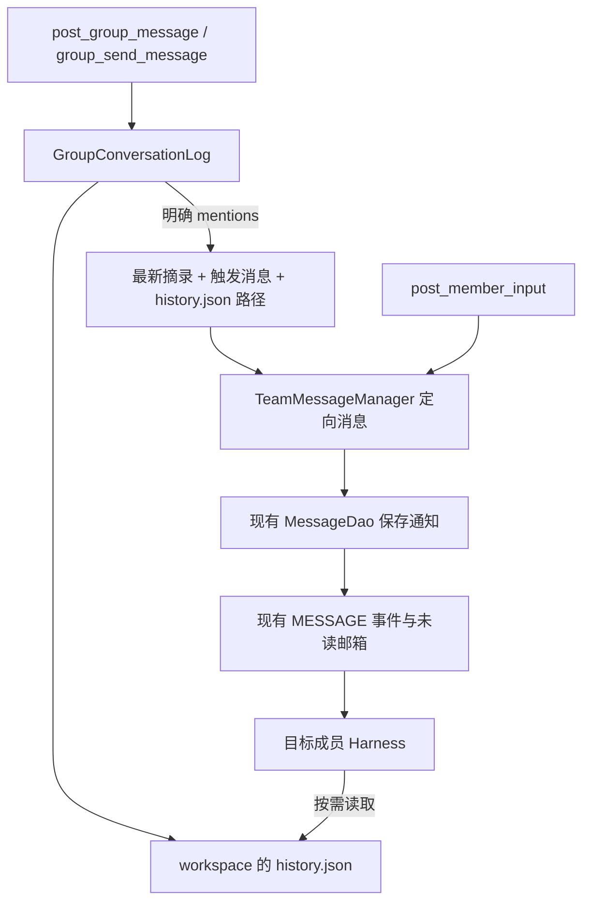

# 群消息文件归档与成员通知

| 项 | 值 |
|---|---|
| 日期 | 2026-09-17 |
| 范围 | `openjiuwen/agent_teams`、Runner 团队接口 |
| 接口规约 | [S_28 群聊文件与成员输入](../specs/S_28_group-conversation-and-delegation.md) |

## 1. 整体结构

完整公开聊天记录保存在 team workspace，按团队和会话隔离，每个会话使用一个 `history.json`。没有明确 @ 成员的消息只归档；被 @ 的成员收到最新几条增量摘录、本次触发消息和历史文件路径，需要更多上下文时自行调用 `read_file`。

通知通过现有 `TeamMessageManager` 定向消息发送。它先保存消息，再发布 `MESSAGE` 事件，由现有邮箱处理和未读扫描交给目标成员。


```mermaid
flowchart TD
    G[post_group_message / group_send_message] --> F[GroupConversationLog]
    F --> W[workspace 的 history.json]
    F -->|明确 mentions| N[最新摘录 + 触发消息 + history.json 路径]
    N --> M[TeamMessageManager 定向消息]
    I[post_member_input] --> M
    M --> D[现有 MessageDao 保存通知]
    D --> E[现有 MESSAGE 事件与未读邮箱]
    E --> H[目标成员 Harness]
    H -->|按需读取| W
```

公开聊天文件是历史记录，邮箱消息是唤起专家所需的短通知。两者各自承担自己的职责。

## 2. 组件职责

| 组件 | 职责 |
|---|---|
| `GroupConversationLog` | 向 `history.json` 追加公开消息、读取尾部记录、保存成员最近通知时间 |
| 现有原子文件写入与文件锁 | 保护文件完整性和同一请求的归档去重 |
| `TeamMessageManager` / `MessageDao` | 保存定向通知，复用成员、团队、会话和未读状态 |
| `Messager` / `MessageHandler` | 发布通知事件、扫描未读消息并交给成员 |
| `Runner` | 为宿主提供群消息归档和指定成员输入入口 |

Agent 的发言使用 `group_send_message`，发送者和目标群由实际运行上下文绑定。公开群消息不会自动转成团队广播。

## 3. 文件归档与增量摘录

历史位于有效 team workspace 的 `conversations/<团队隔离目录>/<会话隔离目录>/history.json`。文件顶层是 JSON 数组，每个元素保存一条消息的 ID、毫秒时间、发送者、正文、mentions 和附件引用。路径中的团队与会话标识经过安全处理。

每次追加在文件锁内读取现有数组、检查重复 ID、追加消息，再通过现有原子写入替换文件，读者看到完整的 JSON。成员通知时间单独保存在同目录的 `.notified.json`，不混入聊天数组。

`client_message_id` 在同一个 team/session 内标识公开消息。相同 ID 与内容复用已有归档，改变发送者、正文、mentions 或附件则报冲突。重复请求返回 `duplicate=True`，不再次发送通知。

每个成员在该会话中保留一个最近成功写入通知的时间。再次被 @ 时，从该时间之后到本次触发消息之间取最新几条：

```text
上次通知时间 < 消息时间 <= 本次触发时间
```

首次通知从时间 0 开始。本次 @ 消息始终包含在摘录内；`group_context_tail` 默认 5，范围 1–20。摘录中每条正文最多 2,000 字符，完整正文与附件引用仍在历史文件中。

通知与 SDK 的 `context_path` 都提供 `history.json` 的绝对文件路径。Agent 按需直接调用 `read_file`，每次 @ 不另生成历史副本。成员通知时间只表示短通知已写入邮箱，不表示专家已经阅读或完成任务。

时间使用现有毫秒时钟。并发通知可以覆盖重叠区间，同毫秒消息没有额外的严格顺序；完整历史始终可从 `history.json` 读取。

## 4. 消息与生命周期边界

群通知、普通成员输入、专家团任务和结果共用现有定向邮箱。`post_member_input` 返回 `queued` 表示消息已经写入邮箱，模型处理沿用现有 `deliver_input` 链路。接口不等待专家处理或返回业务结果。

文件归档、邮箱写入和成员通知时间写入是独立操作，不构成一个事务。中途失败时，历史文件可能已经存在，部分通知也可能已经入队。使用相同 `client_message_id` 重试会复用历史文件并跳过通知，不保证补齐首次请求中未发送的通知。平台按需要显式重新通知，并使用自己的 `run_id` 等业务标识关联任务和结果。

事件发布失败时，已保存的消息保留在邮箱中。leader 在 `MESSAGE` 和邮箱轮询时启动或恢复存在未读定向消息的 `UNSTARTED` / `ERROR` 成员，成员的既有未读扫描继续处理。处理状态采用现有邮箱语义：交给 Harness 后标记已读，没有额外的持久收件回执。进程在内存排队与上下文保存之间崩溃，仍可能造成输入丢失或重试重复。

离线输入只归档和写邮箱。宿主使用 Runner 的现有生命周期入口启动或恢复团队，并保证目标成员可以消费邮箱。无需为群聊配置专用 checkpoint。

暂停和停止保留公开历史。显式删除团队或会话时清理相应归档和成员通知时间，邮箱沿用现有数据库清理流程。自定义 workspace 的位置登记用于离线调用和清理；读写双方必须能访问同一历史路径。

## 5. SDK 与配置

```python
spec.enable_group_chat = True
spec.group_context_tail = 5
```

`enable_group_chat` 默认 `False`，控制公开群消息能力和模型工具。定向成员输入使用原有邮箱。

以下示例以团队和成员已经登记为前提：

```python
from openjiuwen.core.runner import Runner

result = await Runner.post_group_message(
    "请研究这个方案",
    team_name=team_name,
    session_id=session_id,
    client_message_id="message-002",
    mentions=["research_proxy"],
    db_config=db_config,
    workspace_path=workspace_path,
)

notice = await Runner.post_member_input(
    "研究任务的补充条件……",
    team_name=team_name,
    session_id=session_id,
    member_name="research_proxy",
    db_config=db_config,
)
# notice: {"message_id": "...", "status": "queued"}
```

活跃运行时使用自身数据库和有效 workspace。离线调用需要 `db_config`；公开群历史可通过 `workspace_path` 指定自定义位置，未指定时使用已登记位置或默认位置。SDK 的 `mentions` 使用成员 ID，不解析正文中的 `@` 文本；`user` 和被动人类成员不会收到模型通知。

宿主负责调用者认证、目标授权和团队生命周期。完整签名和返回语义见 [S_28](../specs/S_28_group-conversation-and-delegation.md)。

## 6. jiuwenswarm 专家团代理

jiuwenswarm 用群 manifest 中的 `proxy_teams` 绑定大群代理人与目标专家团。大群代理人通过 `run_team` 将任务交给独立团队会话；后台 Leader 用 `submit_team_result` 保存结果并回传。`manage_team_run` 用于查询、补充或取消同一个大群代理人发起的执行。

平台在 session metadata 中保存执行关联，用 TeamManager 和 Runner 管理运行，用 `post_member_input` 发送任务、补充和结果。返回 `queued` 只表示通知入队；是否完成任务，以平台保存的执行结果为准。

大小团队各自使用明确的 team/session/member 和会话历史文件。目标绑定、任务归属、执行 ID 与结果关联由平台处理，core 只向指定成员的邮箱写入消息。后台代理执行沿用平台的同宿主 `inprocess` 运行约束。

当前 jiuwenswarm 的 `chat.send` 使用 Team 消息路由，普通用户无 @ 输入交给 Leader。公开群消息行为由宿主接入 `post_group_message`；平台说明位于 jiuwenswarm 仓库 `docs/zh/专家团代理执行实现.md`。

## 7. 验证范围

验证重点是：归档去重与内容冲突、team/session 路径隔离、无 @ 只归档、定向通知、按成员时间生成摘录、离线写邮箱及历史清理。成员运行和通知处理复用现有邮箱测试；模拟运行时测试不替代真实模型与平台 UI 的端到端验收。


## 2026-09-24：统一输入与群聊模块

当前接口契约以 [S_28](../specs/S_28_group-conversation-and-delegation.md) 为准。
公开输入使用 `type=group_chat` / `GroupChatMessage`，首条 run 输入和后续 interact
共用 runtime 派发及 `group_chat/handler.py`。群聊文件实现与工具分别位于
`group_chat/conversation.py` 和 `group_chat/tools.py`，现有邮箱消费者保持不变。
两个独立 Runner 投递接口及其离线直写分支已移除，宿主通过现有运行入口启动或恢复团队。
jiuwenswarm 保存会话的 `conversation_mode`，在两个 Team 输入入口透传结构化消息，
没有 mentions 的首条请求以归档确认结束，无须等待 Leader 模型输出。


## 2026-09-29：复用广播存储与消费水位

当前契约见 [S_28](../specs/S_28_group-conversation-and-delegation.md)。

- 决策：每条公开消息写一条现有 DB 广播，history.json 为投影，发布既有 BROADCAST 事件。群聊消费者只处理明确 mentions，投递成功后推进原有广播 read_at；定时轮询和外部收件箱遵循同一筛选。
- 决策：从 read_at 到触发消息取近期摘录，保留触发消息并给出完整文件路径。无 @ 不写模型上下文，不推进水位，也不阻塞团队完成。
- 拒绝的方案：继续维护 .notified.json 和额外定向通知会形成两套消费进度与重复存储，所以移除；没有新增队列、序列号或 Runner 投递 API。
- 验证：覆盖无 mentions、逐成员增量、首条触发、投递失败水位、幂等重试、文件恢复、离线成员启动、真实事件唤醒、外部收件箱及普通团队回归。
- 边界：沿用时间戳精度与非事务投递；不增加恰好一次协议。文件同步读取全量历史，后续确有大群负载时再优化。

回归结果：670 passed、19 skipped；覆盖群聊、数据库、外部 CLI、Team、Runner 和统一输入派发。


### 2026-09-29：删除残留文件筛选与重复输入准备

删除仅供测试使用的文件时间窗口筛选及单会话删除包装；测试直接检查 JSON，清理统一走 delete_registered。invoke/stream 共用初始输入准备，群聊筛选仍只在 DB 消费链路实现。保留历史同步与恢复语义，不为精简引入新的管理层。


## 2026-09-30：按消息类型分类，固定近期摘录

决策：移除 enable_group_chat/group_context_tail，type=group_chat 是唯一群聊路由标记，摘录固定 5 条。工具统一注册；数据库按每条广播的 metadata 筛选收件人，启动扫描和完成判定同样遵循 mentions。混合批次按时间消费，共用既有 read_at。

拒绝的方案：团队开关与消息类型重复声明，容易遗漏配置；可配置摘录条数没有当前需求。没有增加第二套广播水位。测试覆盖普通消息和群聊混用、失败不跳过早先 @、固定 5 条摘录以及外部工具注册。

## 2026-09-30：群历史使用 JSON Lines

决策：历史写入 `history.jsonl`，每个 JSON 对象占一行，正文换行由 JSON 转义。读取逐行解析，保留原有文件锁、原子替换和消息 ID 去重。

拒绝的方案：继续使用整个 JSON 数组不符合逐行检索需求；本次不同时改为追加写入，以保留既有同步与恢复语义。已有 DB 消息会在下次同步时生成 JSONL，旧 `history.json` 不自动删除。

验证：覆盖多条消息、中文、多行正文、引号、Unicode 分隔符和重复发送；群聊通知、工具说明及设计规约同步使用新路径。

## 2026-09-30：独立群聊消费 handler

决策：将群聊消费策略集中到 group_chat/message_handler.py 的 GroupMessageHandler。派发层根据消息选择普通或群聊 handler，每次只调用一个；原 MessageHandler 移除群聊判断，群聊子类复用生命周期、桥接和中断投递流程。

拒绝的方案：同时广播给两个邮箱 handler 会重复消费或让普通广播提前推进共享水位；复制整个通用处理循环会重复维护退出和中断规则。群聊策略按时间逐条读取并标记消费，普通消息混入时保持同一顺序。

验证：覆盖事件唤醒、轮询选择、投递失败水位、混合广播及原有退出行为。

## 2026-09-30：清理重复包装和分支

移除 MessageHandler 对 DAO 已去重成员的二次去重，普通 handler 恢复原实现。工具注册直接构造 GroupSendMessageTool，删除只返回单元素列表的工厂包装。摘录固定 5 条，删除可变条数的遗留分支；保留并发文件合并和投递后更新水位。

验证：相关回归 267 passed、19 skipped。

## 2026-09-30：群聊启动扫描与普通邮箱分离

将早期提交 6dfda0121 中加入普通 MessageHandler 的启动扫描迁至 GroupMessageHandler.start_mentioned_members。DAO 更名为 get_unread_group_members，仅查询未消费的群聊 mentions，删除定向消息的补偿扫描。广播触发和 Leader 轮询均可启动被 @ 的成员，Leader 自己无需被 @；普通消息仍由既有发送工具和交互入口启动收件人。

检查旧提交残留：独立 Runner 投递接口、群聊配置开关和第二套通知水位已移除；当前归档依赖的会话绑定与 workspace 登记保留。本次不改普通 MESSAGE 自唤醒和无 transport 的消息管理器行为。

验证：197 passed、19 skipped，覆盖普通邮箱不启动其他成员、群聊事件唤醒，以及 Leader 未被 @ 时轮询拉起 UNSTARTED/ERROR 专家。
