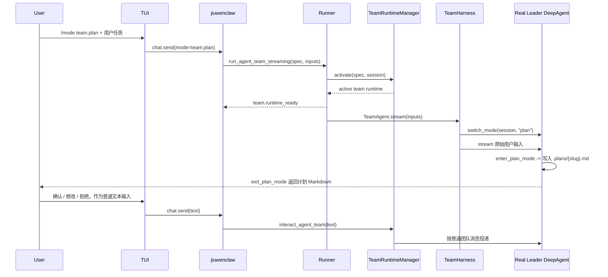
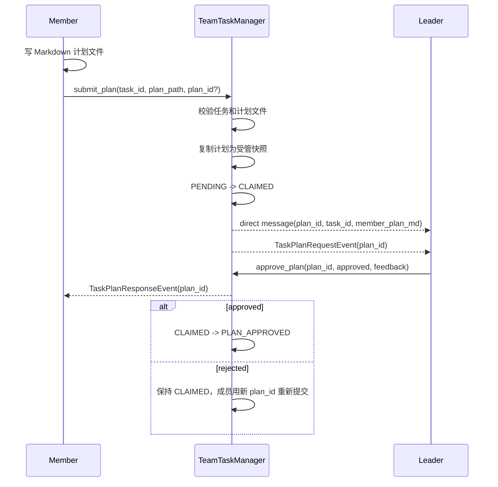
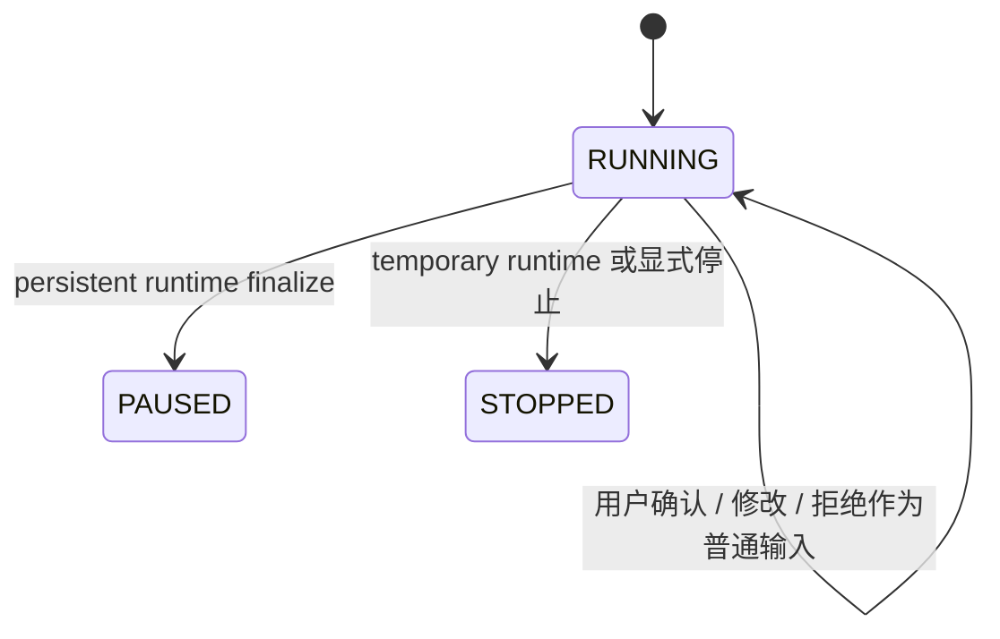
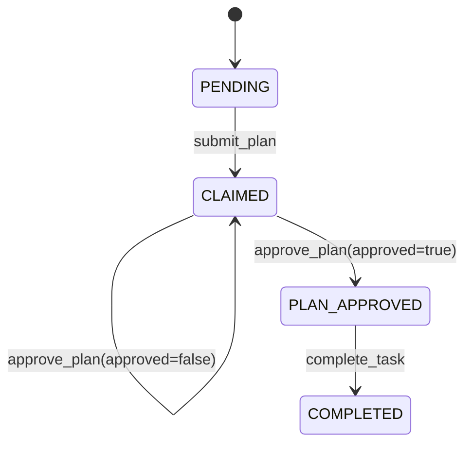

# Team.plan 团队计划模式

## 元信息

| 项 | 值 |
|---|---|
| 日期 | 2026-05-27 |
| 类型 | feature |
| 范围 | `TeamHarness`、`TeamRuntimeManager`、`TeamTaskManager`、team plan tools、team plan events |
| 测试基线 | 文档更新；本次未运行测试 |
| Refs | `S_17_team-plan.md` |

## 背景

`team.plan` 要解决的是团队执行前和成员执行前的计划确认问题，但不能为 Team 层再造一套和单 agent plan 模式不一致的审批控制流。

最终收敛为两条链路：

1. **Team-level Leader plan**：真实 Leader DeepAgent 直接进入单 agent plan 模式，用已有 `enter_plan_mode` / `exit_plan_mode` 产出计划并和用户交互。用户确认、修改、拒绝都作为普通后续输入进入团队运行时。
2. **Member-level task plan**：当 `teammate_mode="plan_mode"` 时，成员先写 Markdown 计划文件，再调用 `submit_plan(task_id, plan_path, plan_id?)` 提交给 Leader。Leader 使用 `approve_plan(plan_id, ...)` 按计划版本审批。

默认配置保持保守：

- `enable_team_plan=True`：仅由请求模式写入 spec；`/mode team.plan` 下让 Leader 先进入计划模式，YAML 中不配置该字段。
- `teammate_mode="build_mode"`：成员默认直接执行；需要成员计划审批时由 YAML / spec 显式改为 `plan_mode`。

## 配置入口

`TeamAgentSpec.enable_team_plan` 只控制 Leader 是否在当前 run 的首轮被 seed 到单 agent plan 模式。它不是 YAML 配置项、不是 Runner 层审批开关，也不会注册独立 pending approval future。

`TeamAgentSpec.teammate_mode` 控制成员执行方式：

| 值 | 行为 |
|---|---|
| `build_mode` | 成员领取任务后可直接执行，不要求提交 member plan。 |
| `plan_mode` | 成员必须先调用 `submit_plan` 提交计划，Leader `approve_plan` 通过后才能继续实现。 |

Claw 不再向 Core 传 `metadata.team_plan` 参数包。`plan_id`、`plans_dir`、`workspace_root`、`request_id`、`channel_id` 等信息不作为请求参数传入；Core 从 workspace/session 上下文推导运行目录，并在需要时生成 id。

## Team-level Leader Plan

Team-level plan 复用单 agent `code.plan` 的核心流程：真实 Leader 进入 plan 模式，自己产出团队规划。这里没有临时 planning clone，也没有 Runner 外挂审批 gate。

这条链路不使用：

- `TeamRuntimeManager._plan_approvals`
- `waiting_user_approval` runtime 分支
- `chat.ask_user_question(source=team_plan_approval)`
- 独立 planning agent / planning clone

## Member-level Task Plan

Member-level plan 是成员任务执行前的内部团队审批。它只在 `teammate_mode="plan_mode"` 时启用。

`submit_plan` 自己负责更新 DB/index、复制 Markdown、发布事件并给 Leader 发消息；不再把“提交后通知 Leader”的动作放到 rail/gate 里。

## 产物

| 范围 | 路径 |
|---|---|
| 单 agent plan / Team-level Leader plan | `{leader_workspace}/.plans/{slug}.md` |
| Member task plan 快照 | `{plans_dir}/{team_plan_id}/tasks/{task_id}/plans/{plan_id}.md` |
| Team plan 轻量索引 | `{plans_dir}/index.json` |

计划正文只保存在 Markdown 文件中。`index.json` 只记录计划路径、状态、revision、审批结果引用等索引信息；DB 仍是任务状态和审批状态的权威来源。

不得重新引入以下 per-plan JSON 正文文件：

- `leader_plan.json`
- `manifest.json`
- `approval.json`

## 状态机

Team runtime 状态不因为 Team-level plan 额外进入审批态：

`teammate_mode="plan_mode"` 下的成员任务状态：

`build_mode` 下没有 `PLAN_APPROVED` 前置要求，成员按既有 build 流程完成任务。

## 决策

- **Leader 使用真实上下文做 Team-level plan**：团队规划依赖 Leader 对成员、任务拆分和团队策略的判断，不能用无状态临时 clone 替代。
- **用户审批复用单 agent plan 交互**：Team-level plan 的确认、修改、拒绝都通过普通 `interact_agent_team(text)` 回到 Leader，而不是新增 Team 专用 ask-user gate。
- **Member plan 以 `plan_id` 为审批维度**：同一个 `task_id` 可以多次提交计划，每次提交是一个独立 `plan_id`。Leader 审批的是某个计划版本，不是笼统审批任务。
- **计划正文走 Markdown 文件，不走工具参数正文**：`submit_plan` 只传 `plan_path`，避免把大段计划正文塞进工具调用参数和事件 payload。
- **`submit_plan` 是成员工具**：成员需要通过工具调用把计划提交到团队任务系统，提交成功后系统才能 claim task、建快照、发 Leader 消息和事件。

## 验证

建议覆盖以下回归：

- `TeamAgentSpec.enable_team_plan` 默认关闭，`teammate_mode` 默认 `build_mode`。
- `/mode team.plan` 时 Claw 在 spec 中设置 `enable_team_plan=true`，普通 `/mode team` 不设置。
- `teammate_mode=build_mode` 时不暴露/不要求 member `submit_plan` / Leader `approve_plan`。
- `teammate_mode=plan_mode` 时成员未 `submit_plan` 不允许完成任务。
- `submit_plan` 只接受 `plan_path`，不会接收计划正文参数。
- Leader 审批按 `plan_id` 命中具体 member plan。
- 拒绝 member plan 后任务保持 `CLAIMED`，成员必须用新的 `plan_id` 重新提交。
- Team-level plan 不注册 runtime pending approval future，用户确认走普通 `interact_agent_team(text)`。

