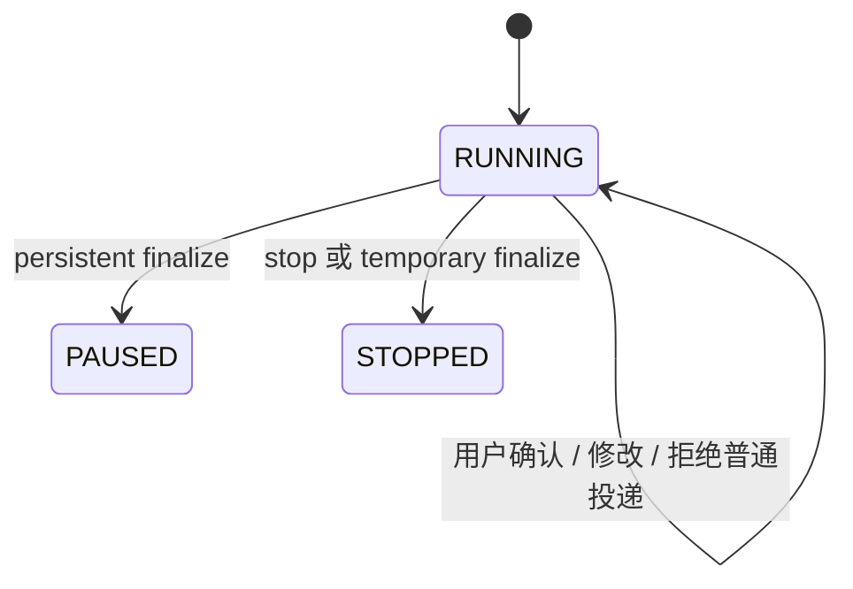
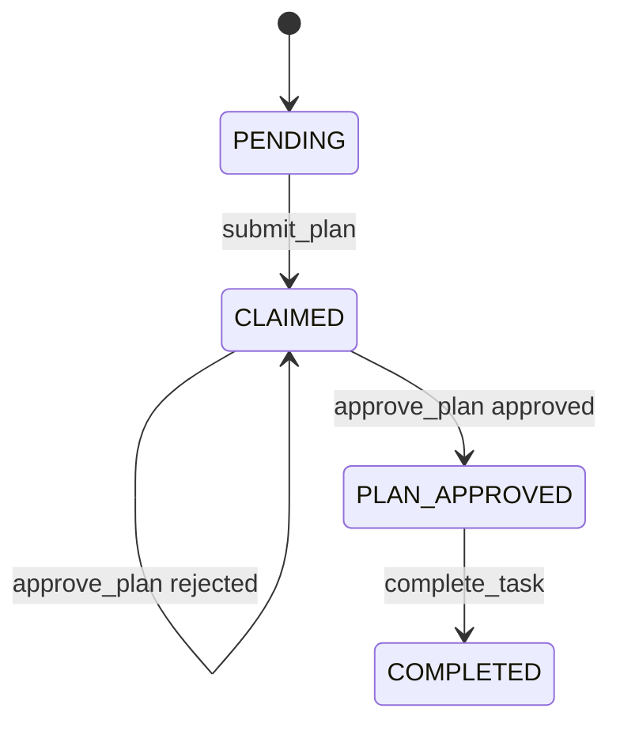

# Team.plan 运行时规约

## 元信息

| 项 | 值 |
|---|---|
| 类型 | spec |
| 关联模块 | `schema/blueprint.py`、`runtime/team_plan.py`、`harness.py`、`tools/team_tools.py`、`tools/task_manager.py`、`schema/events.py` |
| 最近一次修订日期 | 2026-05-27 |
| 关联 feature | `F_21_team-plan.md` |

## 范围 / 边界

**管：**

- `TeamAgentSpec.enable_team_plan` 与 `TeamAgentSpec.teammate_mode` 的语义。
- Team-level Leader plan 如何复用单 agent plan 模式。
- Member-level task plan 如何提交、快照、通知、审批。
- 计划文件、索引、事件、任务状态的契约。

**不管：**

- 单 agent `enter_plan_mode` / `exit_plan_mode` 的内部实现。
- Claw/TUI 如何展示 Markdown 计划正文。
- 模型如何撰写计划正文。
- team DB 的底层存储实现。

## 术语

| 术语 | 含义 |
|---|---|
| `enable_team_plan` | `TeamAgentSpec` 字段。为 `true` 时，Leader 首轮进入单 agent plan 模式。 |
| `teammate_mode` | 成员执行模式，取值为 `build_mode` 或 `plan_mode`。 |
| `team_plan_id` | Member plan 快照的命名空间，由 Core 从 team/session 上下文推导或生成。 |
| `task_id` | 团队任务系统里的稳定任务 ID。一个任务可以有多个计划版本。 |
| `plan_id` | Member plan 提交 ID，也是 Leader 审批的主 key。 |
| `member_plan_md` | Core 复制后的受管 Markdown 快照路径。 |

## 不变量

1. Team-level Leader plan 必须使用真实 Leader DeepAgent，不创建 planning clone。
2. Team-level plan 必须复用单 agent plan 模式，不注册独立 Team 审批 future。
3. 用户对 Leader plan 的确认、修改、拒绝必须作为普通后续输入进入 `interact_agent_team(text)`。
4. Member plan 审批必须以 `plan_id` 为维度；`task_id` 只表示计划归属的任务。
5. `submit_plan` 不接收计划正文，只接收成员已写好的 Markdown 文件路径。
6. 计划正文只落 Markdown 文件，不生成 per-plan JSON 正文文件。
7. DB 是任务状态和审批状态的权威来源，`index.json` 只是轻量索引。

## 配置契约

`TeamAgentSpec` 暴露两个公开开关：

```python
enable_team_plan: bool = False
teammate_mode: str = "build_mode"
```

`enable_team_plan=True` 表示 Leader 在首轮模型调用前进入 `DeepAgentState.plan_mode.mode == "plan"`。它只影响 Team-level Leader plan，不影响成员是否要提交计划。该字段由调用方按请求模式写入 spec，例如 Claw 在 `/mode team.plan` 时设置为 `true`；它不是 YAML 配置项。

`teammate_mode` 控制成员侧：

- `build_mode`：成员直接执行任务，不需要 `submit_plan` / `approve_plan`。
- `plan_mode`：成员执行前必须 `submit_plan`，Leader 通过 `approve_plan` 后才能进入实现阶段。

Core 不读取 `metadata.team_plan` 来获取 `plan_id`、`plans_dir`、`workspace_root`、`request_id` 或 `channel_id`。

## Team-level Planning 契约

Team-level plan 的顺序必须是：

1. `TeamRuntimeManager.activate()` 创建或恢复 team runtime。
2. `Runner.run_agent_team_streaming()` 发出 `team.runtime_ready`。
3. `TeamAgent.stream()` 启动 Leader 协调轮。
4. `StreamController` 调用 `TeamHarness.run_streaming(...)`。
5. `TeamHarness` 创建 child `AgentSession` 并执行 `pre_run()`。
6. 如果当前角色是 Leader 且 `enable_team_plan=True`，`TeamHarness` 调用 `DeepAgent.switch_mode(session, "plan")`。
7. 真实 Leader DeepAgent 收到原始用户输入，按单 agent plan prompt/tool 流程运行。
8. `enter_plan_mode` 创建或复用 `{leader_workspace}/.plans/{slug}.md`。
9. `exit_plan_mode` 将计划 Markdown 返回给用户，并恢复原模式。
10. 用户后续确认、修改或拒绝，作为普通文本输入经 `interact_agent_team(text)` 投递。

禁止在 Team-level plan 中使用以下机制：

- `TeamRuntimeManager._plan_approvals`
- `waiting_user_approval`
- `chat.ask_user_question(source=team_plan_approval)`
- Runner 专用 `_iter_leader_plan_user_approval` gate
- 临时 planning agent / planning clone

## Interact 契约

`TeamRuntimeManager.interact()` 的输入语义：

- `str`：普通用户输入，按团队消息路由投递给 Leader 或被点名成员。
- `InteractiveInput`：只在 Leader 已存在单 agent interrupt 时交给 `TeamAgent.resume_interrupt()`。

如果当前没有 pending interrupt，`InteractiveInput` 必须返回失败，例如 `unsupported_interactive_input`。Team-level plan 的用户确认不应该依赖 `InteractiveInput`。

## Member-level Submit Plan 契约

`submit_plan` 是成员工具，输入 schema 为：

| 字段 | 必填 | 含义 |
|---|---|---|
| `task_id` | 是 | 成员准备执行的任务 ID。 |
| `plan_path` | 是 | 成员已写好的 Markdown 计划文件路径；相对路径按 Core 当前 cwd 解析。 |
| `plan_id` | 否 | 成员计划版本 ID；不传时由 Core 生成。 |

`submit_plan` 不允许接收 `plan` 正文参数，也不允许把计划正文塞进事件 payload。

`TeamTaskManager.submit_plan()` 必须按以下顺序处理：

1. 校验调用者是 `PLAN_MODE` member。
2. 校验 `task_id` 存在。
3. 校验任务状态是 `PENDING`，或已经由同一 member `CLAIMED`。
4. 生成或清洗 `plan_id`。
5. 拒绝重复 `plan_id`。
6. 解析并校验 `plan_path` 指向真实文件。
7. 如果任务仍是 `PENDING`，先 claim 到当前 member。
8. 将 Markdown 复制到受管快照路径。
9. 更新 `plans/index.json`。
10. 发布 `TaskPlanRequestEvent`。
11. 给 Leader 发送 direct message，包含 `member_name`、`task_id`、`plan_id`、`member_plan_md`。
12. 返回 `task_id`、`plan_id`、`status`、`member_plan_md`、`leader_message_id` 等结果。

## Leader 审批契约

`approve_plan` 按一个 `plan_id` 审批一个 member plan 版本。

`TeamTaskManager.approve_plan()` 必须：

1. 通过 `plan_id` 查找 member plan 记录。
2. 拒绝不存在、已审批、过期或与任务状态不一致的 plan。
3. 要求关联任务当前为 `CLAIMED`。
4. 要求 `member_plan_md` 快照文件存在。
5. `approved=True` 时，将任务推进到 `PLAN_APPROVED`。
6. `approved=False` 时，任务保持 `CLAIMED`，成员必须用新的 `plan_id` 重新提交。
7. 更新 `plans/index.json`。
8. 发布 `TaskPlanResponseEvent`。

`task_id` 仍然需要保留，因为它表达计划属于哪条任务、任务由谁认领以及后续完成哪个任务；但审批主 key 必须是 `plan_id`。

## 产物契约

| 产物 | 路径 |
|---|---|
| Team-level Leader plan | `{leader_workspace}/.plans/{slug}.md` |
| Member plan 快照 | `{plans_dir}/{team_plan_id}/tasks/{task_id}/plans/{plan_id}.md` |
| Team plan 索引 | `{plans_dir}/index.json` |

`index.json` 只保存轻量索引信息，例如 plan id、task id、member、路径、审批状态、feedback、latest plan per task。它不保存另一份计划正文。

不得创建：

- `leader_plan.json`
- `manifest.json`
- `approval.json`

## 事件契约

Member plan 使用两个事件：

| 事件 | 生产者 | 语义 |
|---|---|---|
| `TaskPlanRequestEvent` | `TeamTaskManager.submit_plan()` | 成员提交了一个待 Leader 审批的计划版本。 |
| `TaskPlanResponseEvent` | `TeamTaskManager.approve_plan()` | Leader 已对某个 `plan_id` 做出批准或拒绝。 |

Team-level Leader plan 不使用这些事件；它属于 Leader 的单 agent plan 模式输出。

不得重新引入旧事件：

- `TaskPlanSubmittedEvent`
- `TaskPlanApprovedEvent`
- `TaskPlanRejectedEvent`

## 状态机

Team runtime：



`teammate_mode="plan_mode"` 下的任务：



`teammate_mode="build_mode"` 下，成员不经过 `PLAN_APPROVED` 前置状态。

## 回归清单

- `TeamAgentSpec.enable_team_plan` 默认 `False`。
- `TeamAgentSpec.teammate_mode` 默认 `build_mode`。
- `enable_team_plan=true` 只开启 Leader plan-mode seed。
- `teammate_mode=build_mode` 时不要求成员提交计划。
- `teammate_mode=plan_mode` 时成员未提交计划不能完成任务。
- Team-level plan 不注册 runtime pending approval future。
- Team-level plan 的用户确认走普通 `interact_agent_team(text)`。
- `submit_plan` 只接收 `task_id`、`plan_path`、`plan_id?`。
- `submit_plan` 内部负责通知 Leader，不依赖 rail/gate。
- `approve_plan` 以 `plan_id` 审批具体计划版本。
- 拒绝计划后任务保持 `CLAIMED`，成员必须重新提交新 `plan_id`。
- 计划正文只存在 Markdown 文件中。

