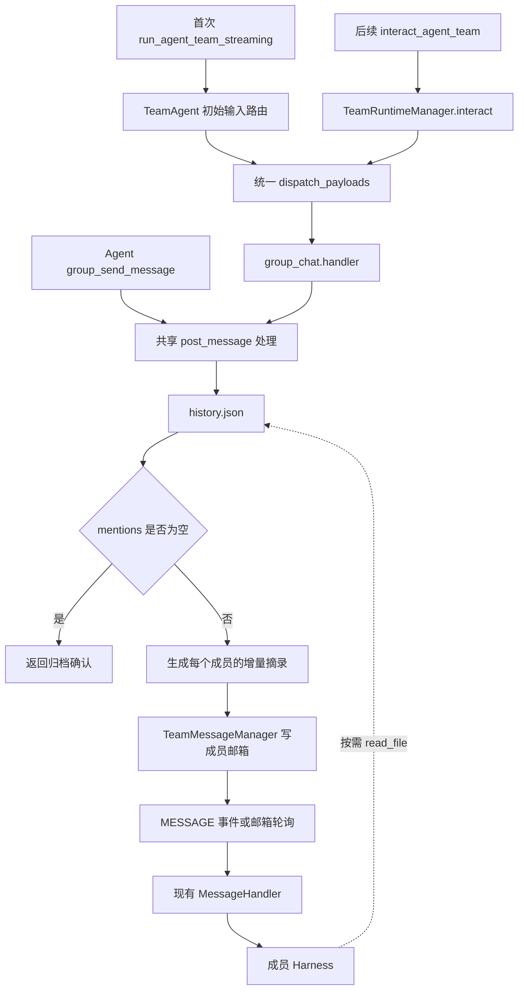

# S_28 群聊输入与文件归档

最近修订：2026-09-24。关联特性：[F_112](../features/F_112_group-conversation-and-delegation.md)。

## 职责与入口

群聊公开消息保存在团队 workspace 的 `history.json` 中。没有 mentions 时只归档；有 mentions 时，将增量讨论摘录和历史文件路径投递给指定专家。普通团队广播仍沿用原有语义。

core 通过现有 Runner 入口接收结构化群聊消息。首次运行使用 `run_agent_team_streaming` 的 `inputs.query`，后续输入使用 `interact_agent_team` 的 payload。两者进入相同的群聊处理函数。

```python
payload = {
    "type": "group_chat",
    "body": "请分析前面的讨论",
    "client_message_id": "msg-001",
    "mentions": ["expert_1"],
    "attachments": [],
}

# 已激活的团队
result = await Runner.interact_agent_team(
    payload, team_name="research", session_id="discussion-1",
)

# 首次启动或恢复时，通过现有运行接口传入同一消息结构
async for chunk in Runner.run_agent_team_streaming(
    agent_team=spec, inputs={"query": payload}, session=session,
):
    ...
```

`GroupChatMessage` 定义在 `interaction/payload.py`，并加入 `InteractPayload`。Python 调用方也可直接构造该类型作为 interact 的输入。team/session 由入口参数与运行时绑定确定；宿主输入的作者为 `user`，Agent 工具的作者由当前成员身份绑定，消息不能指定任意作者。

`mentions` 是明确的成员名称列表。core 不解析正文中的 `@名字`，不把未知 mentions 回退到 Leader。不存在或已离开的成员导致请求失败；真人收件人不触发 Agent 通知。

`DeliverResult.ok` 表示本次处理成功，`data` 包含公开消息记录、是否重复、通知成员列表和历史路径。它不表示专家已经阅读或完成任务。首条输入处理成功时，流中输出 `team.group_message.accepted`，失败时输出既有 `team.interact.failed`。

## core 模块与调用链

```text
agent_teams/
  group_chat/
    conversation.py   # 文件归档、历史读取、通知时间、清理
    handler.py        # 初始化、校验、归档、生成摘录、投递通知
    tools.py          # group_send_message 工具和角色提示入口
  interaction/
    payload.py        # 统一输入类型、type 字段解析、DeliverResult
```



群聊处理函数通过 TeamBackend 获取当前 workspace、会话和邮箱。TeamBackend 保留薄的上下文绑定与转发方法。消息模型、路径和国际化文案使用现有公共模块；配置、工具注册、会话绑定与清理在原来的接入位置调用群聊模块。

新群尚无数据库名册时，群聊输入处理复用 `build_team` 登记 Leader 和预配置成员，不把公开消息作为 Leader 的模型输入。指定专家必须已登记或来自预配置名册；群聊消息不会让模型自动创建缺失专家。

群聊通知使用现有的普通成员邮箱。MessageHandler 无需新增群聊分类分支：它消费的是已经确定收件人的通知。未启动成员由既有未读扫描和 `auto_start_member` 链路启动。

## 配置与历史

| TeamAgentSpec 字段 | 默认值 | 职责 |
|---|---|---|
| enable_group_chat | False | 启用群聊入口与 group_send_message 工具 |
| group_context_tail | 5 | 每次通知最多包含的近期消息数，范围 1–20 |

Agent 使用 `group_send_message(content, client_message_id, mentions=[])` 发表公开回复，与宿主输入复用同一归档和通知逻辑。

公开历史按 team/session 隔离：

```text
conversations/<team-scope>/<session-scope>/
  history.json
  .notified.json
```

`history.json` 是包含全部公开消息的 JSON 数组。每条记录包含消息 ID、team/session、客户端消息 ID、发送者及显示名、正文、mentions、附件引用、毫秒时间戳。附件不复制内容。追加时在文件锁内读数组并追加，通过原子替换写回。

同一会话的 `client_message_id` 用于去重：内容相同返回已有消息，内容冲突报错。`.notified.json` 记录每个成员最近一次成功入邮箱的群通知时间，不是阅读回执。

每次点名某成员时，取 `(该成员上次通知时间, 本条消息时间]` 内最新的 `group_context_tail` 条消息，并保留本次触发消息。每条摘录正文最多 2,000 字符，同时提供截断标记、附件数量和完整历史路径。Agent 按需读取 `history.json`。

## jiuwenswarm 到 core

jiuwenswarm 的会话元数据 `conversation_mode` 确定交互模式，默认 `team`。新 Team 会话的首次请求可传 `params.conversation_mode="group_chat"`，服务端保存绑定；后续请求省略该参数即可。已有会话不允许切换，普通 Team 的 `mode` 配置保持原有含义。

```json
{
  "mode": "team",
  "conversation_mode": "group_chat",
  "client_message_id": "msg-001",
  "mentions": ["expert_1"]
}
```

这是宿主请求参数示例，正文沿用原有聊天输入字段。`client_message_id` 未提供时使用 request_id；重试需要复用同一个 ID。没有独立的群聊页面，当前接入位于服务端 Team 消息入口。

`agent_adapter/group_chat.py` 校验会话模式并构造 core payload；`team_helpers.py` 根据会话绑定启用 spec 的群聊配置，将原始正文和上传文件引用交给该转换函数。群聊输入绕过 Leader 提示包装、成员文本前缀和普通斜杠命令处理。

- 首条：`chat.send → process_team_message_stream → run_agent_team_streaming → 初始输入路由 → group_chat.handler`。
- 后续：`chat.send → process_team_message_stream → TeamManager.interact → interact_agent_team → group_chat.handler`。
- 无 mentions：后续输入收到成功返回即可结束；首条等待归档确认事件后结束发送请求，后台团队流继续保留。
- 有 mentions：专家通过现有邮箱接收通知，回复通过既有团队事件流处理。

后台 heartbeat/cron 沿用原有自动任务输入，公开群聊分类应用于用户聊天输入。

## 生命周期与故障边界

统一 interact 入口要求团队运行时已激活。宿主通过现有 run/恢复流程建立运行时，再投递输入；没有离线直写邮箱的独立 Runner 接口。普通成员定向输入使用现有 `OperatorMessage(body=..., target=...)`。

时间增量复用毫秒时钟，不新增序列号；同毫秒和并发消息不承诺严格排序。公开文件、邮箱通知、通知时间更新不是同一事务。归档后通知失败时历史仍保留；相同客户端 ID 重试只返回原记录，不自动补发通知。

暂停或停止团队不删除公开历史。显式删除团队或会话时清理相应历史和位置登记。历史不自动过期，生产者与 Agent 需要访问同一历史文件。
