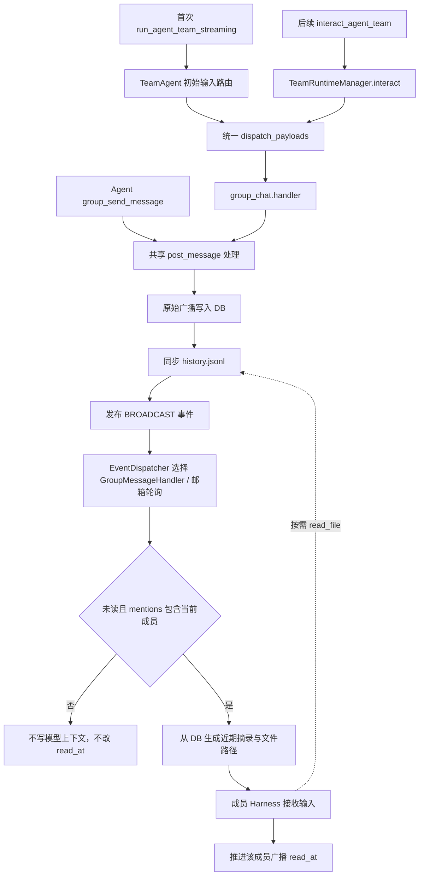

# S_28 群聊输入与文件归档

最近修订：2026-09-30。关联特性：[F_112](../features/F_112_group-conversation-and-delegation.md)。

## 职责与入口

群聊公开消息全部写入现有消息数据库，作为广播记录保存，并同步到团队 workspace 的 `history.jsonl`。所有消息都发布既有 BROADCAST 事件；只有 mentions 中的专家才接收模型输入。没有 mentions 时不写模型上下文，也不推进成员 read_at。普通团队广播仍沿用原有语义。

core 通过现有 Runner 入口接收结构化群聊消息。首次运行使用 `run_agent_team_streaming` 的 `inputs.query`，后续输入使用 `interact_agent_team` 的 payload。两者进入相同的群聊处理函数。

```python
payload = {
    "type": "group_chat",
    "body": "请分析前面的讨论",
    "client_message_id": "msg-001",
    "mentions": ["expert_1"],
    "attachments": [],
}

# 已激活的团队
result = await Runner.interact_agent_team(
    payload, team_name="research", session_id="discussion-1",
)

# 首次启动或恢复时，通过现有运行接口传入同一消息结构
async for chunk in Runner.run_agent_team_streaming(
    agent_team=spec, inputs={"query": payload}, session=session,
):
    ...
```

`GroupChatMessage` 定义在 `interaction/payload.py`，并加入 `InteractPayload`。Python 调用方也可直接构造该类型作为 interact 的输入。team/session 由入口参数与运行时绑定确定；宿主输入的作者为 `user`，Agent 工具的作者由当前成员身份绑定，消息不能指定任意作者。

`mentions` 是明确的成员名称列表。core 不解析正文中的 `@名字`，不把未知 mentions 回退到 Leader。不存在或已离开的成员导致请求失败；真人收件人不触发 Agent 通知。

`DeliverResult.ok` 表示本次处理成功，`data` 包含公开消息记录、是否重复、通知成员列表和历史路径。它不表示专家已经阅读或完成任务。首条输入处理成功时，流中输出 `team.group_message.accepted`，失败时输出既有 `team.interact.failed`。

## core 模块与调用链

```text
agent_teams/
  group_chat/
    conversation.py   # history.jsonl 投影、历史读取和清理
    handler.py        # 校验、广播入库、投影同步、筛选 mentions 和生成摘录
    message_handler.py # 独立群聊消费策略，复用通用投递生命周期
    tools.py          # group_send_message 工具和角色提示入口
  interaction/
    payload.py        # 统一输入类型、type 字段解析、DeliverResult
```


```mermaid
flowchart TD
    S[首次 run_agent_team_streaming] --> I[TeamAgent 初始输入路由]
    R[后续 interact_agent_team] --> M[TeamRuntimeManager.interact]
    I --> D[统一 dispatch_payloads]
    M --> D
    D --> G[group_chat.handler]
    A[Agent group_send_message] --> P[共享 post_message 处理]
    G --> P
    P --> DB[原始广播写入 DB]
    DB --> F[同步 history.jsonl]
    F --> B[发布 BROADCAST 事件]
    B --> H[EventDispatcher 选择 GroupMessageHandler / 邮箱轮询]
    H --> Q{未读且 mentions 包含当前成员}
    Q -->|否| E[不写模型上下文，不改 read_at]
    Q -->|是| C[从 DB 生成近期摘录与文件路径]
    C --> L[成员 Harness 接收输入]
    L --> W[推进该成员广播 read_at]
    L -. 按需 read_file .-> F
```

群聊处理函数通过 TeamBackend 获取当前 workspace、会话和邮箱。TeamBackend 保留薄的上下文绑定与转发方法。消息模型、路径和国际化文案使用现有公共模块；配置、工具注册、会话绑定与清理在原来的接入位置调用群聊模块。

新群尚无数据库名册时，群聊输入处理复用 `build_team` 登记 Leader 和预配置成员，不把公开消息作为 Leader 的模型输入。指定专家必须已登记或来自预配置名册；群聊消息不会让模型自动创建缺失专家。

广播读取根据每条消息的 meta.type 分类：group_chat 仅向 mentions 中的成员投递，普通广播沿用原有收件人规则。派发层每次只选择一个邮箱 handler：群聊事件或待消费广播包含群聊时选择 GroupMessageHandler，普通输入走 MessageHandler。退出中的成员优先沿用通用生命周期判断。

GroupMessageHandler 位于群聊目录，继承 MessageHandler 的生命周期、中断及桥接投递流程，独立覆盖群聊摘录生成与消息顺序。每轮只取时间最早的一条消息，成功标记消费后再生成下一条摘录，避免同批普通广播提前推进共享 read_at。MessageHandler 本身不含群聊判断和分支。事件回调、轮询、退出前 drain 和外部收件箱共用数据库筛选；群聊不额外创建定向通知记录。

`GroupMessageHandler.start_mentioned_members` 在群聊广播和 Leader 邮箱轮询时扫描被 @ 的 UNSTARTED/ERROR 成员，通过既有 auto_start_member 启动。轮询扫描不要求 Leader 自己被 @。普通 MessageHandler 不负责启动扫描，普通消息沿用发送工具和交互入口的启动流程。无 mentions 的广播不阻碍团队完成判定。ExternalTeamClient 的 fetch_inbox 复用相同筛选和摘录；mark_read=False 不推进水位，默认成功构造收件箱条目即标记已读（拉取接口不代表模型已处理）。

## 配置与历史

无需团队群聊开关。输入 type=group_chat 决定该消息走群聊处理，group_send_message 工具统一注册。摘录条数在群聊模块固定为 5，不暴露配置。

Agent 使用 `group_send_message(content, client_message_id, mentions=[])` 发表公开回复，与宿主输入复用同一归档和通知逻辑。

公开历史按 team/session 隔离：

```text
conversations/<team-scope>/<session-scope>/
  history.jsonl
```

`history.jsonl` 是包含全部公开消息的 JSON Lines 文件（每行一条消息）。每条记录包含消息 ID、team/session、客户端消息 ID、发送者及显示名、正文、mentions、附件引用、毫秒时间戳。附件不复制内容。群聊原文直接保存在 DB，文件是在锁内合并消息、原子替换的可读投影；不是按消息生成独立 JSON 文件。文件丢失后可从 DB 重建。

DB 广播行的 content 保存原文，meta 保存 type、client_message_id、sender_name、mentions、attachments。history.jsonl 与 DB 表达相同公开内容，文件没有数据库的消费状态。广播 read_at 沿用既有数据库表，按会话、团队、成员隔离；不使用 `.notified.json`。

同一会话的 client_message_id 生成稳定消息 ID，复用 DB 唯一性去重；内容冲突报错。相同请求重试会同步文件并重新发布同一广播事件，不重复插入原文。notified_members 表示允许被通知的被 @ Agent 列表，不是已送达或已读回执。

每次消费点名消息时，从 DB 取 `(该成员 read_at, 触发消息时间]` 内最新的 5 条公开消息，保留本次触发消息。每条摘录正文最多 2,000 字符，同时提供截断标记、附件数量和完整历史路径。Agent 按需读取 history.jsonl。成功交给 Harness 后，整个窗口视为已提供给成员，即使仅内联最近几条；read_at 不代表模型逐条读完全文。

例如专家 A 在时间 T50 被 @，收到此前讨论的近期摘录和文件路径，成功投递后 read_at=T50。下一次在 T100 被 @，仅从 `(T50,T100]` 选择摘录；专家 B 有自己的 read_at，互不影响。无 @ 的消息不自行推进水位。普通广播与群聊广播共用 read_at；混合使用时，普通广播消费也会推进该水位，较早的群聊全文仍可通过 history.jsonl 检索。

历史文件每行是一个独立 JSON 对象，不使用外层数组或行间逗号；正文换行编码为 `\n`。已有 DB 消息会在下次同步时生成 JSONL，旧 `history.json` 不自动删除。同步仍使用全量合并与原子替换。

## jiuwenswarm 到 core

宿主接入契约如下；core 不依赖 jiuwenswarm 的内部会话存储或 Web 页面。

1. jiuwenswarm 根据用户交互场景构造消息类型，无须设置 core 团队群聊开关。
2. 将正文、client_message_id、mentions 和附件引用构造成 type=group_chat 的 payload；mentions 使用 core 成员名称，不从任意正文隐式推断。
3. 首次输入通过 run_agent_team_streaming 的 inputs.query，后续通过 interact_agent_team 传入同一结构。
4. core 的统一 dispatch_payloads 进入 group_chat.handler，广播入库、同步文件并发布事件。
5. 被 @ 专家的 GroupMessageHandler 生成摘录并交给 Harness；专家公开回复使用 group_send_message，走同一广播链路。

无 mentions 也返回输入接收确认，宿主不应等待 Leader 模型回复。宿主负责身份认证、会话模式绑定、成员名称映射和展示。实际平台接入状态以 jiuwenswarm 仓库为准；本规约描述 core 对宿主的协议。

## 生命周期与故障边界

统一 interact 入口要求团队运行时已激活。宿主通过现有 run/恢复流程建立运行时，再投递输入；没有离线直写邮箱的独立 Runner 接口。普通成员定向输入使用现有 `OperatorMessage(body=..., target=...)`。

时间增量复用毫秒时钟，不新增序列号；同毫秒和时钟回拨不保证逐条消费。DB 写入、文件同步、事件发布与 Harness 接收不是同一事务：文件同步失败保留原文，重试修复投影；事件丢失由既有轮询读取未消费广播。Harness 投递失败不推进该条 read_at；进程在投递后、标记前退出可能导致重复投递，不承诺恰好一次。

暂停或停止团队不删除公开历史。显式删除团队或会话时，沿用数据库清理并删除相应历史及 workspace 位置登记。历史不自动过期，生产者与 Agent 需要访问同一历史文件。当前同步和读取使用全量历史，适用于规模有限的群聊；没有额外缓存或后台同步服务。
