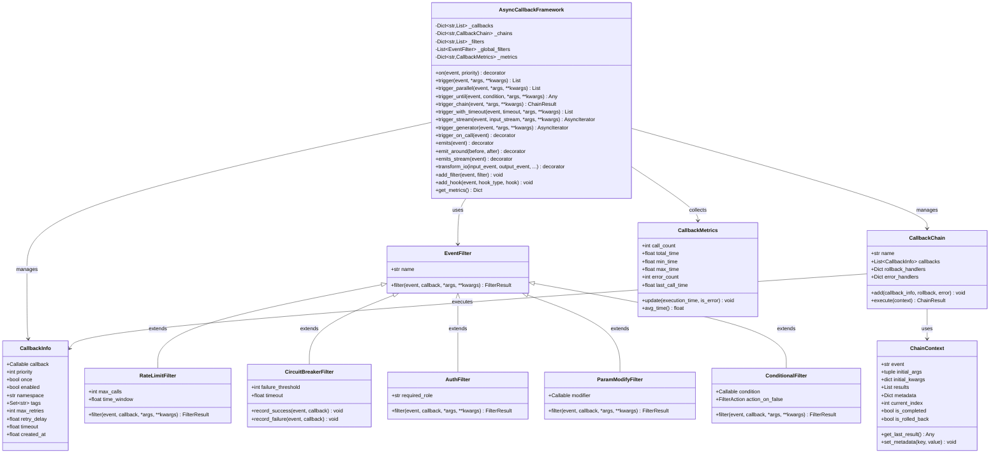
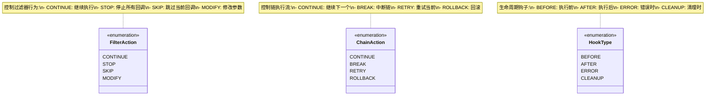
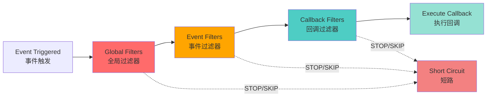
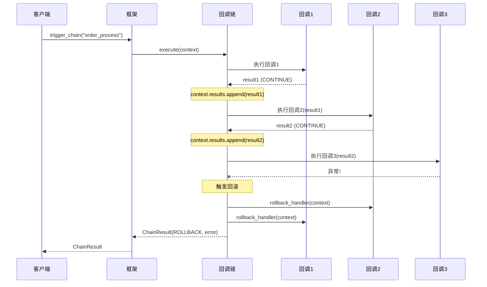
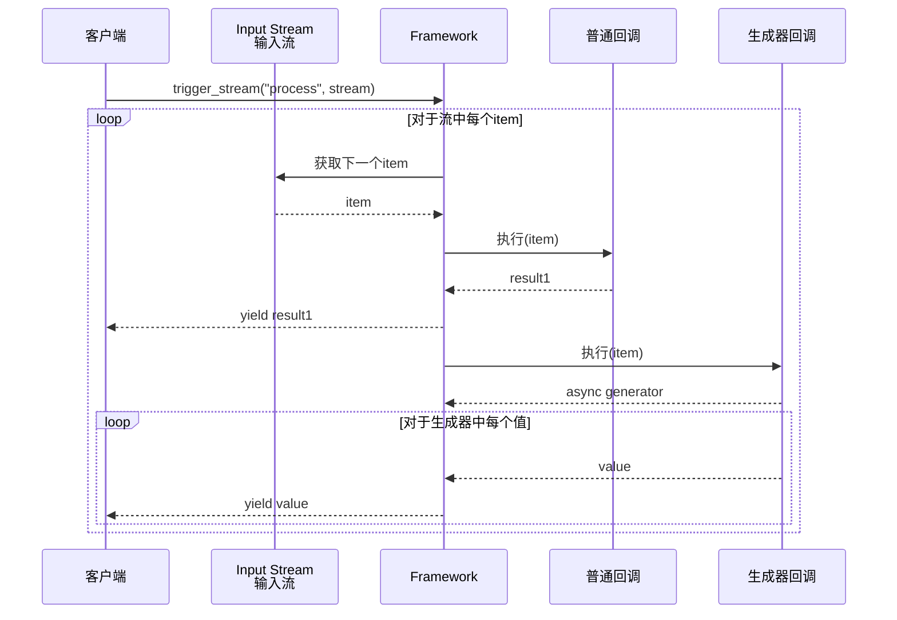
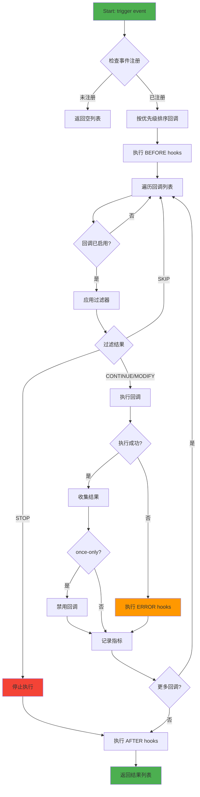
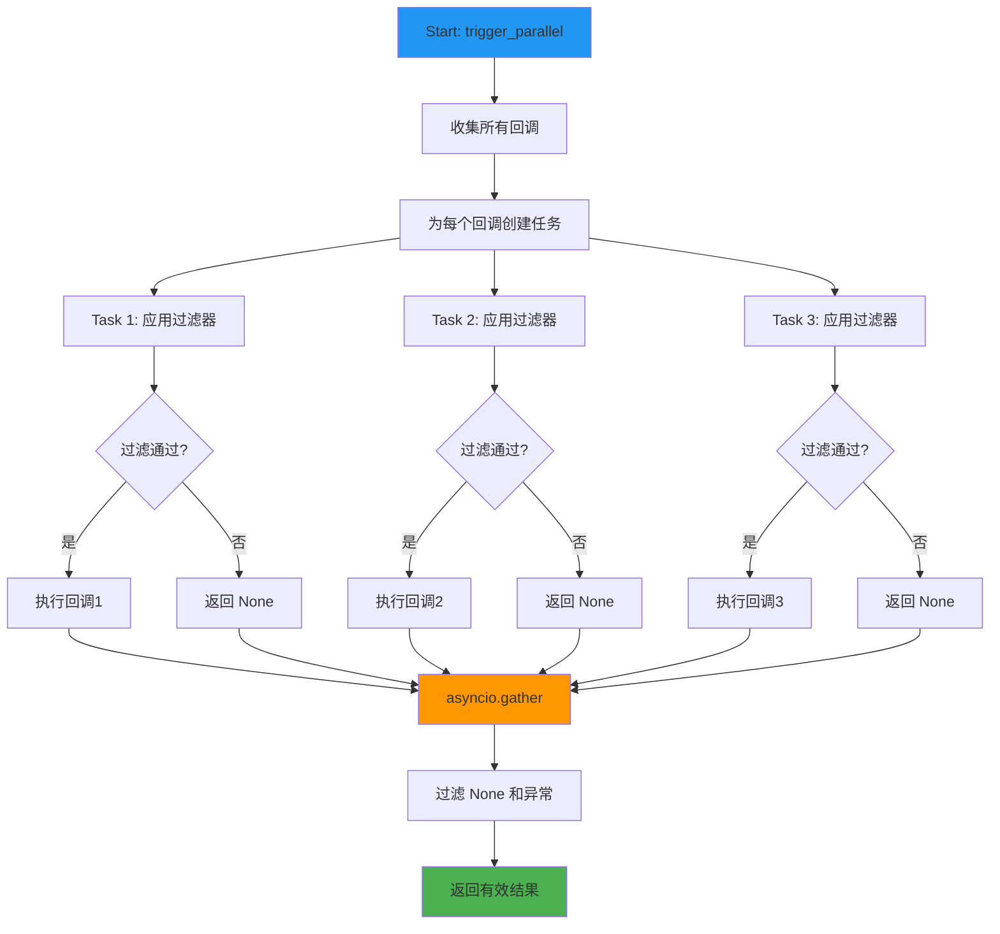
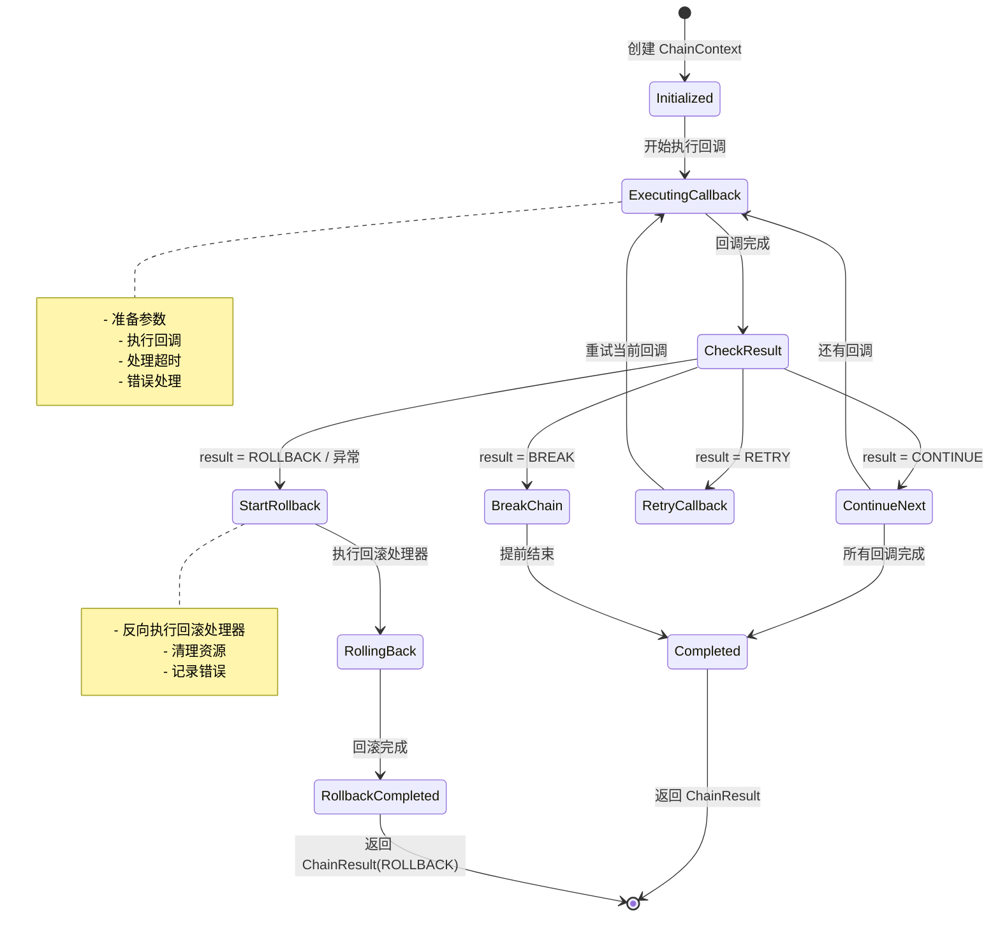
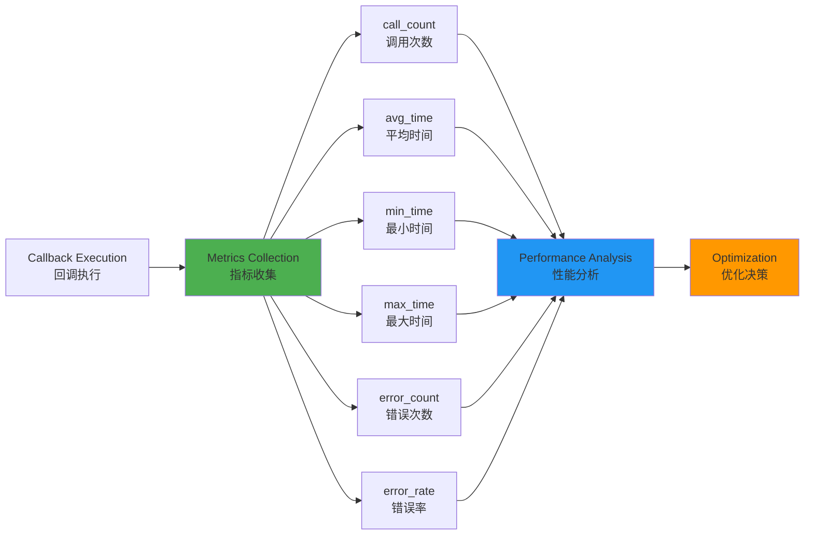

# Async Callback Framework - 设计文档

## 目录

- [1. 概述](#1-概述)
- [2. 架构设计](#2-架构设计)
- [3. 核心组件](#3-核心组件)
- [4. 数据流](#4-数据流)
- [5. 使用指南](#5-使用指南)
- [6. API 参考](#6-api-参考)
- [7. 最佳实践](#7-最佳实践)
- [8. 性能优化](#8-性能优化)

---

## 1. 概述

### 1.1 简介

Async Callback Framework 是一个生产级的异步事件驱动框架，专为 asyncio 环境设计。它提供了强大的回调管理、过滤、链式执行、性能监控等功能。

### 1.2 核心特性

- ✅ **异步优先**: 完全基于 asyncio，支持高并发
- ✅ **优先级控制**: 基于优先级的回调执行顺序
- ✅ **过滤系统**: 8种内置过滤器 + 自定义过滤器
- ✅ **回调链**: 支持数据流转和回滚机制
- ✅ **性能监控**: 内置指标收集和分析
- ✅ **生命周期钩子**: Before/After/Error/Cleanup 钩子
- ✅ **触发模式**: 7种触发模式（顺序/并行/条件/超时/延迟/流式/生成器）
- ✅ **装饰器支持**: 5种自动触发装饰器 + 输入输出变换装饰器（支持事件回调）
- ✅ **异步生成器**: 支持流式输入/输出处理
- ✅ **输入输出变换**: 基于回调或事件的函数入参/返回值变换，支持异步与生成器

### 1.3 模块结构

```
openjiuwen/core/runner/callback/
├── __init__.py          # 公共 API 导出
├── enums.py             # 枚举类型定义
├── models.py            # 数据模型和结构
├── filters.py           # 过滤器实现
├── chain.py             # 回调链实现
├── decorator.py         # 装饰器实现（on/trigger_on_call/emits/emits_stream/emit_around/transform_io）
└── framework.py         # 核心框架类
```

---

## 2. 架构设计

### 2.1 整体架构

```mermaid
graph TB
    subgraph "Client Layer 客户层"
        A[Application Code<br/>应用代码]
    end

    subgraph "API Layer API层"
        B1[@on Decorator<br/>注册装饰器]
        B2[@trigger_on_call<br/>触发装饰器]
        B3[@emits Decorator<br/>发射装饰器]
        B4[@emit_around<br/>环绕装饰器]
        B5[@emits_stream<br/>流式发射装饰器]
        B6[@transform_io<br/>输入输出变换装饰器]
    end

    subgraph "Framework Core 框架核心"
        C[AsyncCallbackFramework<br/>异步回调框架]
    end

    subgraph "Execution Layer 执行层"
        D1[trigger<br/>顺序触发]
        D2[trigger_parallel<br/>并行触发]
        D3[trigger_until<br/>条件触发]
        D4[trigger_chain<br/>链式触发]
        D5[trigger_with_timeout<br/>超时触发]
        D6[trigger_stream<br/>流式触发]
        D7[trigger_generator<br/>生成器触发]
    end

    subgraph "Filter System 过滤系统"
        E1[Global Filters<br/>全局过滤器]
        E2[Event Filters<br/>事件过滤器]
        E3[Callback Filters<br/>回调过滤器]
    end

    subgraph "Callback Chain 回调链"
        F1[Chain Execution<br/>链执行]
        F2[Rollback Handler<br/>回滚处理]
        F3[Error Handler<br/>错误处理]
    end

    subgraph "Monitoring 监控层"
        G1[Metrics Collection<br/>指标收集]
        G2[Event History<br/>事件历史]
        G3[Lifecycle Hooks<br/>生命周期钩子]
    end

    A --> B1
    A --> B2
    A --> B3
    A --> B4
    A --> B5
    A --> B6
    B1 --> C
    B2 --> C
    B3 --> C
    B4 --> C
    B5 --> C
    B6 --> C
    C --> D1
    C --> D2
    C --> D3
    C --> D4
    C --> D5
    C --> D6
    C --> D7
    D1 --> E1
    D2 --> E1
    D3 --> E1
    D4 --> E1
    D5 --> E1
    D6 --> E1
    D7 --> E1
    E1 --> E2
    E2 --> E3
    D4 --> F1
    F1 --> F2
    F1 --> F3
    C --> G1
    C --> G2
    C --> G3

    style C fill:#4CAF50,stroke:#2E7D32,color:#fff
    style E1 fill:#2196F3,stroke:#1565C0,color:#fff
    style F1 fill:#FF9800,stroke:#E65100,color:#fff
    style G1 fill:#9C27B0,stroke:#6A1B9A,color:#fff
```

### 2.2 类图



### 2.3 枚举类型



---

## 3. 核心组件

### 3.1 AsyncCallbackFramework

核心框架类，负责：
- 回调注册和管理
- 事件触发和执行
- 过滤器管理
- 性能监控
- 生命周期管理

**关键特性：**
- 线程安全的回调存储
- 基于优先级的执行顺序
- 多种触发模式
- 完整的错误处理

### 3.2 过滤器系统

#### 3.2.1 过滤器层级



#### 3.2.2 内置过滤器

| 过滤器 | 功能 | 用途 |
|--------|------|------|
| **RateLimitFilter** | 限流 | 防止回调执行过于频繁 |
| **CircuitBreakerFilter** | 熔断 | 失败达到阈值后停止执行 |
| **ValidationFilter** | 验证 | 参数合法性检查 |
| **LoggingFilter** | 日志 | 记录执行日志 |
| **AuthFilter** | 授权 | 基于角色的访问控制 |
| **ParamModifyFilter** | 参数修改 | 转换或增强参数 |
| **ConditionalFilter** | 条件 | 基于条件决定是否执行 |

### 3.3 回调链系统



### 3.4 异步生成器支持

**新增于 v1.1.0**

框架现在完全支持异步生成器（async generator）的输入和输出处理，提供流式数据处理能力。

#### 3.4.1 流式触发架构

```mermaid
graph TB
    subgraph "Stream Input 流式输入"
        A1[Async Input Stream<br/>异步输入流] --> B1[trigger_stream]
        B1 --> C1[Process Each Item<br/>逐项处理]
        C1 --> D1[Yield Results<br/>流式返回结果]
    end

    subgraph "Generator Output 生成器输出"
        A2[trigger_generator] --> B2[Execute Callbacks<br/>执行回调]
        B2 --> C2[Collect Generators<br/>收集生成器]
        C2 --> D2[Aggregate Output<br/>聚合输出]
    end

    subgraph "Auto Stream Events 自动流事件"
        A3[@emits_stream] --> B3[Async Generator Func<br/>异步生成器函数]
        B3 --> C3[Each Yield<br/>每次yield]
        C3 --> D3[Trigger Event<br/>触发事件]
        D3 --> B3
    end

    style B1 fill:#4CAF50,color:#fff
    style A2 fill:#2196F3,color:#fff
    style A3 fill:#FF9800,color:#fff
```

#### 3.4.2 三种核心方法

**1. trigger_stream - 流式输入处理**

```python
async def trigger_stream(
    event: str,
    input_stream: AsyncIterator[Any],
    *args,
    **kwargs
) -> AsyncIterator[Any]
```

- ✅ 处理异步输入流（文件、网络、传感器等）
- ✅ 逐项触发回调，内存高效
- ✅ 支持无限长数据流
- ✅ 回调可返回普通值或异步生成器

**使用场景：**
- 大文件处理（逐行读取）
- 实时日志分析
- 流式数据管道
- 传感器数据处理

**2. trigger_generator - 生成器输出聚合**

```python
async def trigger_generator(
    event: str,
    *args,
    **kwargs
) -> AsyncIterator[Any]
```

- ✅ 聚合所有回调的异步生成器输出
- ✅ 支持混合普通回调和生成器回调
- ✅ 按优先级顺序yield结果
- ✅ 多数据源聚合

**使用场景：**
- 多源数据聚合（数据库+缓存+API）
- 流式 API 响应
- 报表分段生成
- 事件流聚合

**3. emits_stream - 装饰器自动触发**

```python
@framework.emits_stream(event: str, item_key: str = "item")
async def generator_function():
    for item in data:
        yield item  # 自动触发事件
```

- ✅ 装饰异步生成器函数
- ✅ 每次 yield 自动触发事件
- ✅ 原始数据仍正常 yield 给调用者
- ✅ 实现发布-订阅模式

**使用场景：**
- 实时指标发布
- 日志流监控
- 进度通知
- 事件溯源

#### 3.4.3 流式处理时序图



#### 3.4.4 性能特性

| 特性 | 传统批处理 | 流式处理 |
|------|-----------|---------|
| 内存占用 | O(n) - 需加载全部数据 | O(1) - 常量内存 |
| 首字节延迟 | 高 - 等待全部处理 | 低 - 立即开始输出 |
| 适用数据量 | 有限（受内存限制） | 无限（流式处理） |
| 实时性 | 否 | 是 |
| CPU 利用 | 批量集中 | 持续平稳 |

**内存效率示例：**
```python
# ❌ 传统方式 - 需要全部加载到内存
all_data = []
async for item in huge_data_source():
    all_data.append(item)
results = await framework.trigger("process", all_data)  # 内存峰值高

# ✅ 流式处理 - 常量内存
async for result in framework.trigger_stream("process", huge_data_source()):
    await save_result(result)  # 逐个处理，内存平稳
```

#### 3.4.5 错误处理策略

```python
# 流式处理中的错误处理
@framework.on("process_item")
async def processor(item: dict):
    if item['value'] < 0:
        raise ValueError("Invalid value")
    return item['value'] * 2

async def data_stream():
    for i in range(-2, 3):  # -2, -1, 0, 1, 2
        yield {"value": i}

# 错误不会中断流处理
async for result in framework.trigger_stream("process_item", data_stream()):
    print(result)  # 输出: 0, 2, 4 (负值被跳过，错误被记录)
```

**错误行为：**
- ✅ 单个 item 处理失败不中断整个流
- ✅ 错误被记录到日志和指标
- ✅ 后续 item 继续处理
- ✅ 失败的 item 不产生输出

---

## 4. 数据流

### 4.1 事件触发流程



### 4.2 并行触发流程



### 4.3 链式执行流程



---

## 5. 使用指南

### 5.1 快速开始

```python
import asyncio
from openjiuwen.core.runner.callback import AsyncCallbackFramework

# 创建框架实例
framework = AsyncCallbackFramework()

# 注册回调
@framework.on("user_login", priority=10)
async def send_email(username: str):
    print(f"Sending welcome email to {username}")
    return f"email_sent_{username}"

@framework.on("user_login", priority=5)
async def log_activity(username: str):
    print(f"Logging activity for {username}")
    return f"logged_{username}"

# 触发事件
async def main():
    results = await framework.trigger("user_login", username="alice")
    print(f"Results: {results}")

asyncio.run(main())
```

### 5.2 使用过滤器

```python
from openjiuwen.core.runner.callback import (
    AsyncCallbackFramework,
    RateLimitFilter,
    AuthFilter,
)

framework = AsyncCallbackFramework()

# 添加限流过滤器
rate_limiter = RateLimitFilter(max_calls=3, time_window=60.0)
framework.add_filter("api_call", rate_limiter)

# 添加权限过滤器
auth = AuthFilter(required_role="admin")
framework.add_filter("admin_action", auth)

@framework.on("admin_action")
async def delete_user(user_id: str, user_role: str):
    print(f"Deleting user {user_id}")
    return "deleted"

# 需要 admin 角色
await framework.trigger("admin_action", user_id="123", user_role="admin")
```

### 5.3 使用回调链

```python
from openjiuwen.core.runner.callback import (
    AsyncCallbackFramework,
    ChainAction,
    ChainResult,
)

framework = AsyncCallbackFramework()

# 定义回滚处理器
async def rollback_payment(context):
    print("Rolling back payment...")

@framework.on("checkout", priority=30, rollback_handler=rollback_payment)
async def process_payment(order: dict, **kwargs):
    print(f"Processing payment for order {order['id']}")
    order['paid'] = True
    return ChainResult(ChainAction.CONTINUE, result=order)

@framework.on("checkout", priority=20)
async def update_inventory(order: dict, **kwargs):
    print(f"Updating inventory for order {order['id']}")
    if order['quantity'] > 100:
        # 库存不足，触发回滚
        return ChainResult(
            ChainAction.ROLLBACK,
            error=Exception("Insufficient inventory")
        )
    order['inventory_updated'] = True
    return ChainResult(ChainAction.CONTINUE, result=order)

# 执行链
result = await framework.trigger_chain("checkout", order={'id': '123', 'quantity': 150})
if result.action == ChainAction.ROLLBACK:
    print(f"Checkout failed: {result.error}")
```

### 5.4 并行执行

```python
framework = AsyncCallbackFramework()

@framework.on("fetch_data")
async def fetch_from_db():
    await asyncio.sleep(0.5)
    return {"source": "database", "data": [...]}

@framework.on("fetch_data")
async def fetch_from_cache():
    await asyncio.sleep(0.1)
    return {"source": "cache", "data": [...]}

@framework.on("fetch_data")
async def fetch_from_api():
    await asyncio.sleep(0.3)
    return {"source": "api", "data": [...]}

# 并行获取所有数据源（~0.5s 而非 0.9s）
results = await framework.trigger_parallel("fetch_data")
print(f"Got {len(results)} results in parallel")
```

### 5.5 使用装饰器

```python
from openjiuwen.core.runner.callback import AsyncCallbackFramework

framework = AsyncCallbackFramework()

# 自动触发装饰器
@framework.emits("data_processed")
async def process_data(data):
    # 处理数据
    result = {"processed": data}
    return result  # 自动触发 "data_processed" 事件

@framework.on("data_processed")
async def save_result(result):
    print(f"Saving result: {result}")

# 环绕触发装饰器
@framework.emit_around("task_start", "task_end", on_error_event="task_error")
async def important_task(task_id):
    # 自动触发 task_start
    result = await do_work(task_id)
    # 自动触发 task_end
    return result

# 输入输出变换装饰器（支持直接回调或事件回调）
@framework.on("transform_input")
async def normalize_input(*args, **kwargs):
    return (args, {**kwargs, "limit": kwargs.get("limit", 10)})

@framework.on("transform_output")
async def serialize_output(result):
    return json.dumps(result) if isinstance(result, dict) else result

@framework.transform_io(
    input_event="transform_input",
    output_event="transform_output",
)
async def fetch_data(limit: int):
    return {"count": limit}
# 或使用直接回调：transform_io(input_transform=..., output_transform=...)
```

---

## 6. API 参考

### 6.1 AsyncCallbackFramework

#### 6.1.1 构造函数

```python
AsyncCallbackFramework(
    enable_metrics: bool = True,
    enable_logging: bool = True
)
```

**参数：**
- `enable_metrics`: 是否启用性能指标收集
- `enable_logging`: 是否启用日志记录

#### 6.1.2 注册方法

##### on() - 装饰器注册

```python
@framework.on(
    event: str,
    priority: int = 0,
    once: bool = False,
    namespace: str = "default",
    tags: Optional[Set[str]] = None,
    filters: Optional[List[EventFilter]] = None,
    rollback_handler: Optional[Callable] = None,
    error_handler: Optional[Callable] = None,
    max_retries: int = 0,
    retry_delay: float = 0.0,
    timeout: Optional[float] = None
)
```

**参数详解：**

| 参数 | 类型 | 默认值 | 说明 |
|------|------|--------|------|
| event | str | - | 事件名称 |
| priority | int | 0 | 优先级（数字越大优先级越高） |
| once | bool | False | 是否只执行一次 |
| namespace | str | "default" | 命名空间 |
| tags | Set[str] | None | 标签集合 |
| filters | List[EventFilter] | None | 回调专属过滤器 |
| rollback_handler | Callable | None | 回滚处理器 |
| error_handler | Callable | None | 错误处理器 |
| max_retries | int | 0 | 最大重试次数 |
| retry_delay | float | 0.0 | 重试延迟（秒） |
| timeout | float | None | 执行超时（秒） |

##### register() - 编程式注册

```python
await framework.register(
    event: str,
    callback: Callable,
    priority: int = 0,
    ...  # 同 on() 参数
)
```

#### 6.1.3 触发方法

##### trigger() - 顺序触发

```python
results = await framework.trigger(
    event: str,
    *args,
    **kwargs
) -> List[Any]
```

**特点：**
- 按优先级顺序执行
- 应用所有过滤器
- 收集所有结果
- 支持生命周期钩子

##### trigger_parallel() - 并行触发

```python
results = await framework.trigger_parallel(
    event: str,
    *args,
    **kwargs
) -> List[Any]
```

**特点：**
- 并发执行所有回调
- 性能提升 2-3倍（I/O密集型）
- 仍然应用过滤器
- 异常隔离

##### trigger_until() - 条件触发

```python
result = await framework.trigger_until(
    event: str,
    condition: Callable[[Any], bool],
    *args,
    **kwargs
) -> Optional[Any]
```

**特点：**
- 找到满足条件的结果即停止
- 适用于降级/搜索场景
- 按优先级顺序尝试

##### trigger_chain() - 链式触发

```python
result = await framework.trigger_chain(
    event: str,
    *args,
    **kwargs
) -> ChainResult
```

**特点：**
- 数据在回调间流转
- 支持回滚机制
- 错误处理
- 事务性执行

##### trigger_with_timeout() - 超时触发

```python
results = await framework.trigger_with_timeout(
    event: str,
    timeout: float,
    *args,
    **kwargs
) -> List[Any]
```

**特点：**
- 防止执行时间过长
- 超时返回空列表
- SLA 保证

##### trigger_delayed() - 延迟触发

```python
results = await framework.trigger_delayed(
    event: str,
    delay: float,
    *args,
    **kwargs
) -> List[Any]
```

**特点：**
- 延迟指定时间后触发
- 适用于定时任务
- 异步等待

##### trigger_stream() - 流式触发 ⭐ 新增

```python
async for result in framework.trigger_stream(
    event: str,
    input_stream: AsyncIterator[Any],
    *args,
    **kwargs
) -> AsyncIterator[Any]
```

**特点：**
- 处理异步输入流
- 逐项触发回调
- 内存高效（不需加载全部数据）
- 支持无限长数据流
- 回调可返回普通值或异步生成器

**使用场景：**
- 大文件处理
- 实时日志分析
- 流式数据管道
- 传感器数据处理

**示例：**
```python
async def log_stream():
    with open("app.log") as f:
        for line in f:
            yield line.strip()

@framework.on("process_log")
async def analyze_log(line: str):
    if "ERROR" in line:
        return {"level": "error", "line": line}
    return {"level": "info", "line": line}

# 流式处理日志
async for analysis in framework.trigger_stream("process_log", log_stream()):
    if analysis['level'] == 'error':
        await alert_admin(analysis)
```

##### trigger_generator() - 生成器触发 ⭐ 新增

```python
async for item in framework.trigger_generator(
    event: str,
    *args,
    **kwargs
) -> AsyncIterator[Any]
```

**特点：**
- 聚合所有回调的异步生成器输出
- 支持混合普通回调和生成器回调
- 按优先级顺序 yield 结果
- 多数据源聚合

**使用场景：**
- 多源数据聚合（数据库+缓存+API）
- 流式 API 响应
- 报表分段生成
- 事件流聚合

**示例：**
```python
@framework.on("fetch_users")
async def from_database():
    users = await db.query("SELECT * FROM users")
    for user in users:
        yield user

@framework.on("fetch_users")
async def from_cache():
    cache_users = await redis.get_all("user:*")
    for user in cache_users:
        yield user

# 聚合所有数据源
all_users = []
async for user in framework.trigger_generator("fetch_users"):
    all_users.append(user)
```

#### 6.1.4 过滤器方法

```python
# 添加事件过滤器
framework.add_filter(event: str, filter_obj: EventFilter)

# 添加全局过滤器
framework.add_global_filter(filter_obj: EventFilter)

# 添加熔断器
framework.add_circuit_breaker(
    event: str,
    callback: Callable,
    failure_threshold: int = 5,
    timeout: float = 60.0
)
```

#### 6.1.5 钩子方法

```python
framework.add_hook(
    event: str,
    hook_type: HookType,
    hook: Callable
)
```

**HookType 类型：**
- `HookType.BEFORE`: 执行前
- `HookType.AFTER`: 执行后
- `HookType.ERROR`: 错误时
- `HookType.CLEANUP`: 清理时

#### 6.1.6 指标方法

```python
# 获取指标
metrics = framework.get_metrics(
    event: Optional[str] = None,
    callback: Optional[str] = None
) -> Dict[str, Dict[str, Any]]

# 重置指标
framework.reset_metrics()

# 获取慢回调
slow_callbacks = framework.get_slow_callbacks(
    threshold: float = 1.0
) -> List[Dict[str, Any]]
```

#### 6.1.7 装饰器方法

##### trigger_on_call() - 调用时触发

```python
@framework.trigger_on_call(
    event: str,
    pass_result: bool = False,
    pass_args: bool = True
)
async def my_function(*args, **kwargs):
    # 函数调用时触发事件
    return result
```

**参数：**
- `event`: 要触发的事件名
- `pass_result`: 是否将函数结果传递给事件（默认 False）
- `pass_args`: 是否将函数参数传递给事件（默认 True）

##### emits() - 返回时触发

```python
@framework.emits(
    event: str,
    result_key: str = "result",
    include_args: bool = False
)
async def my_function(*args, **kwargs):
    # 函数返回时自动触发事件
    return result
```

**参数：**
- `event`: 要触发的事件名
- `result_key`: 结果在 kwargs 中的键名（默认 "result"）
- `include_args`: 是否包含原始参数（默认 False）

##### emit_around() - 环绕触发

```python
@framework.emit_around(
    before_event: str,
    after_event: str,
    pass_args: bool = True,
    pass_result: bool = True,
    on_error_event: Optional[str] = None
)
async def my_function(*args, **kwargs):
    # before_event 在执行前触发
    result = await do_work()
    # after_event 在执行后触发
    # 如果出错，触发 on_error_event
    return result
```

**参数：**
- `before_event`: 执行前触发的事件名
- `after_event`: 执行后触发的事件名
- `pass_args`: 是否传递参数到事件（默认 True）
- `pass_result`: 是否传递结果到 after_event（默认 True）
- `on_error_event`: 出错时触发的事件名（可选）

##### emits_stream() - 流式触发 ⭐ 新增

```python
@framework.emits_stream(
    event: str,
    item_key: str = "item"
)
async def my_generator():
    for item in data:
        yield item  # 每次 yield 自动触发事件
```

**特点：**
- 装饰异步生成器函数
- 每次 yield 自动触发事件
- 原始数据仍正常 yield 给调用者
- 实现发布-订阅模式

**参数：**
- `event`: 要触发的事件名
- `item_key`: 项目在 kwargs 中的键名（默认 "item"）

**使用场景：**
- 实时指标发布
- 日志流监控
- 进度通知
- 事件溯源

**示例：**
```python
@framework.on("metric_collected")
async def save_metric(item: dict):
    await db.insert_metric(item)

@framework.emits_stream("metric_collected")
async def collect_metrics():
    while True:
        metric = {
            "cpu": get_cpu_usage(),
            "memory": get_memory_usage(),
            "timestamp": time.time()
        }
        yield metric  # 自动触发 metric_collected 事件
        await asyncio.sleep(1)

# 消费生成器
async for metric in collect_metrics():
    # metric_collected 已自动触发
    display_on_dashboard(metric)
```

##### transform_io() - 输入输出变换 ⭐ 新增

```python
@framework.transform_io(
    input_event: Optional[str] = None,
    output_event: Optional[str] = None,
    result_key: str = "result",
    input_transform: Optional[InputTransform] = None,
    output_transform: Optional[OutputTransform] = None,
)
async def my_function(*args, **kwargs):
    # 调用前通过 input_event 或 input_transform 变换参数
    # 返回后通过 output_event 或 output_transform 变换返回值
    return result
```

**两种模式：**

1. **事件模式**：设置 `input_event` / `output_event`。框架在调用前触发 `input_event`，将最后一个回调返回值作为新的 `(args, kwargs)`；在返回后（或生成器每项）触发 `output_event`，将最后一个回调返回值作为变换后的结果。输入事件回调需返回 `(new_args, new_kwargs)`，输出事件回调接收 `result_key=<value>` 并返回新值。
2. **直接回调模式**：设置 `input_transform` / `output_transform`。`input_transform(*args, **kwargs)` 返回 `(new_args, new_kwargs)`；`output_transform(value)` 返回新值。支持同步/异步；对生成器则对每项应用 output 变换。

**参数：**

| 参数 | 类型 | 默认值 | 说明 |
|------|------|--------|------|
| input_event | str | None | 输入变换事件名（与 input_transform 二选一） |
| output_event | str | None | 输出变换事件名（与 output_transform 二选一） |
| result_key | str | "result" | 输出事件触发时传参的键名 |
| input_transform | InputTransform | None | 直接输入变换回调 |
| output_transform | OutputTransform | None | 直接输出变换回调 |

**特点：**
- 支持异步/同步函数及异步/同步生成器
- 事件模式与过滤器、钩子、多回调兼容；取最后一个回调结果作为变换结果

### 6.2 过滤器 API

#### RateLimitFilter

```python
RateLimitFilter(
    max_calls: int,
    time_window: float,
    name: str = "RateLimit"
)
```

**功能：** 限制回调在时间窗口内的执行次数

#### CircuitBreakerFilter

```python
CircuitBreakerFilter(
    failure_threshold: int = 5,
    timeout: float = 60.0,
    name: str = "CircuitBreaker"
)
```

**功能：** 失败次数达到阈值后熔断

**方法：**
- `record_success(event, callback)`: 记录成功
- `record_failure(event, callback)`: 记录失败

#### AuthFilter

```python
AuthFilter(
    required_role: str,
    name: str = "Auth"
)
```

**功能：** 基于角色的访问控制

#### ParamModifyFilter

```python
ParamModifyFilter(
    modifier: Callable[..., tuple],
    name: str = "ParamModify"
)
```

**功能：** 转换回调参数

**modifier 签名：**
```python
def modifier(*args, **kwargs) -> Tuple[tuple, dict]:
    # 返回 (new_args, new_kwargs)
    return new_args, new_kwargs
```

#### ConditionalFilter

```python
ConditionalFilter(
    condition: Callable[..., bool],
    action_on_false: FilterAction = FilterAction.SKIP,
    name: str = "Conditional"
)
```

**功能：** 基于条件决定是否执行

---

## 7. 最佳实践

### 7.1 命名规范

```python
# ✅ 好的事件命名
"user.login"
"order.created"
"payment.processed"

# ❌ 避免的命名
"event1"
"do_something"
"callback"
```

### 7.2 优先级设计

```python
# 高优先级：关键操作
@framework.on("user_login", priority=100)
async def security_check(username):
    # 安全检查必须先执行
    pass

# 中优先级：业务逻辑
@framework.on("user_login", priority=50)
async def create_session(username):
    pass

# 低优先级：辅助操作
@framework.on("user_login", priority=10)
async def send_notification(username):
    pass
```

### 7.3 错误处理

```python
# ✅ 使用错误处理器
async def handle_payment_error(error, context):
    # 记录错误
    log_error(error)
    # 返回默认值
    return {"status": "failed", "reason": str(error)}

@framework.on(
    "process_payment",
    error_handler=handle_payment_error
)
async def process_payment(order_id):
    # 可能失败的操作
    pass
```

### 7.4 性能优化

```python
# ✅ I/O 密集型任务使用并行
results = await framework.trigger_parallel("fetch_all_data")

# ✅ CPU 密集型任务使用顺序
results = await framework.trigger("compute_intensive_task")

# ✅ 为慢回调设置超时
@framework.on("external_api", timeout=5.0)
async def call_slow_api():
    pass
```

### 7.5 过滤器使用

```python
# ✅ 全局过滤器：日志、监控
logger = LoggingFilter()
framework.add_global_filter(logger)

# ✅ 事件过滤器：事件特定规则
rate_limiter = RateLimitFilter(max_calls=10, time_window=60)
framework.add_filter("api_call", rate_limiter)

# ✅ 回调过滤器：回调特定规则
@framework.on("admin_action", filters=[AuthFilter("admin")])
async def sensitive_operation():
    pass
```

### 7.6 命名空间管理

```python
# 按功能模块组织回调
@framework.on("event", namespace="auth")
async def auth_handler():
    pass

@framework.on("event", namespace="billing")
async def billing_handler():
    pass

# 批量注销
await framework.unregister_namespace("auth")
```

---

## 8. 性能优化

### 8.1 性能指标



### 8.2 性能对比

| 场景 | trigger | trigger_parallel | 提升 |
|------|---------|------------------|------|
| 3个 I/O 回调(0.15s each) | 0.45s | 0.20s | 2.25x |
| 5个 API 调用(0.2s each) | 1.0s | 0.25s | 4.0x |
| 10个数据库查询(0.1s each) | 1.0s | 0.15s | 6.7x |

### 8.3 优化建议

#### 8.3.1 选择合适的触发模式

```python
# I/O 密集：使用并行
@framework.on("fetch_data")
async def fetch_from_api1(): ...

@framework.on("fetch_data")
async def fetch_from_api2(): ...

results = await framework.trigger_parallel("fetch_data")  # ✅ 快

# CPU 密集：使用顺序
@framework.on("compute")
async def heavy_computation(): ...

results = await framework.trigger("compute")  # ✅ 正确
```

#### 8.3.2 合理使用过滤器

```python
# ❌ 避免：每次都执行复杂验证
@framework.on("event")
async def callback(data):
    if not validate_complex(data):  # 每次都验证
        return
    # 处理

# ✅ 推荐：使用验证过滤器
validator = ValidationFilter(validate_complex)

@framework.on("event", filters=[validator])
async def callback(data):
    # 已验证，直接处理
    pass
```

#### 8.3.3 监控慢回调

```python
# 定期检查慢回调
slow_callbacks = framework.get_slow_callbacks(threshold=1.0)
for cb in slow_callbacks:
    logger.warning(f"Slow callback: {cb['callback']} - {cb['avg_time']:.2f}s")
```

#### 8.3.4 使用回调缓存

```python
from functools import lru_cache

@lru_cache(maxsize=128)
async def expensive_operation(key):
    # 昂贵的操作
    pass

@framework.on("event")
async def cached_callback(key):
    return await expensive_operation(key)
```

---

## 9. 完整示例

### 9.1 电商订单处理系统

```python
import asyncio
from openjiuwen.core.runner.callback import (
    AsyncCallbackFramework,
    ChainAction,
    ChainResult,
    RateLimitFilter,
    AuthFilter,
)

# 创建框架
framework = AsyncCallbackFramework(enable_metrics=True)

# 添加过滤器
rate_limiter = RateLimitFilter(max_calls=100, time_window=60.0)
framework.add_filter("order.create", rate_limiter)

auth_filter = AuthFilter(required_role="customer")
framework.add_filter("order.create", auth_filter)

# 回滚处理器
async def rollback_inventory(context):
    order = context.get_metadata("order")
    print(f"Rollback: Restoring inventory for order {order['id']}")

async def rollback_payment(context):
    order = context.get_metadata("order")
    print(f"Rollback: Refunding payment for order {order['id']}")

# 订单处理链
@framework.on(
    "order.create",
    priority=50,
    rollback_handler=rollback_inventory
)
async def reserve_inventory(order: dict, **kwargs):
    """预留库存"""
    context = kwargs.get('_chain_context')
    context.set_metadata("order", order)

    print(f"Reserving inventory for order {order['id']}")
    await asyncio.sleep(0.1)  # 模拟数据库操作

    if order['quantity'] > order.get('available_stock', 100):
        return ChainResult(
            ChainAction.ROLLBACK,
            error=Exception("Insufficient stock")
        )

    order['inventory_reserved'] = True
    return ChainResult(ChainAction.CONTINUE, result=order)

@framework.on(
    "order.create",
    priority=40,
    rollback_handler=rollback_payment
)
async def process_payment(order: dict, **kwargs):
    """处理支付"""
    print(f"Processing payment for order {order['id']}")
    await asyncio.sleep(0.2)  # 模拟支付网关调用

    order['payment_status'] = 'paid'
    return ChainResult(ChainAction.CONTINUE, result=order)

@framework.on("order.create", priority=30)
async def send_confirmation(order: dict, **kwargs):
    """发送确认"""
    print(f"Sending confirmation email for order {order['id']}")
    await asyncio.sleep(0.1)

    order['confirmation_sent'] = True
    return ChainResult(ChainAction.CONTINUE, result=order)

@framework.on("order.create", priority=20)
async def update_analytics(order: dict, **kwargs):
    """更新分析"""
    print(f"Updating analytics for order {order['id']}")
    order['analytics_updated'] = True
    return ChainResult(ChainAction.CONTINUE, result=order)

# 订单成功事件
@framework.on("order.success")
async def log_order_success(order: dict):
    print(f"✓ Order {order['id']} completed successfully!")

# 订单失败事件
@framework.on("order.failed")
async def log_order_failure(order: dict, error: Exception):
    print(f"✗ Order {order['id']} failed: {error}")

# 主流程
async def create_order(order_data: dict, user_role: str):
    """创建订单"""
    print(f"\n{'='*60}")
    print(f"Creating order: {order_data['id']}")
    print(f"{'='*60}")

    # 执行订单处理链
    result = await framework.trigger_chain(
        "order.create",
        order=order_data,
        user_role=user_role
    )

    if result.action == ChainAction.CONTINUE:
        # 成功
        await framework.trigger("order.success", order=result.result)
        return result.result
    else:
        # 失败或回滚
        await framework.trigger(
            "order.failed",
            order=order_data,
            error=result.error
        )
        return None

async def main():
    # 成功案例
    order1 = {
        'id': 'ORDER-001',
        'quantity': 5,
        'available_stock': 100
    }
    result1 = await create_order(order1, user_role="customer")

    # 失败案例（库存不足）
    order2 = {
        'id': 'ORDER-002',
        'quantity': 150,
        'available_stock': 100
    }
    result2 = await create_order(order2, user_role="customer")

    # 查看性能指标
    print(f"\n{'='*60}")
    print("Performance Metrics")
    print(f"{'='*60}")
    metrics = framework.get_metrics(event="order.create")
    for key, value in metrics.items():
        print(f"{key}:")
        print(f"  Calls: {value['call_count']}")
        print(f"  Avg time: {value['avg_time']:.3f}s")
        print(f"  Error rate: {value['error_rate']:.1%}")

if __name__ == "__main__":
    asyncio.run(main())
```

---

## 10. 附录

### 10.1 术语表

| 术语 | 说明 |
|------|------|
| **Event** | 事件，触发回调的信号 |
| **Callback** | 回调函数，响应事件的处理函数 |
| **Filter** | 过滤器，决定回调是否执行 |
| **Chain** | 回调链，顺序执行的回调组 |
| **Hook** | 钩子，生命周期回调 |
| **Metrics** | 指标，性能统计数据 |
| **Priority** | 优先级，决定执行顺序 |
| **Namespace** | 命名空间，回调分组 |

### 10.2 常见问题

**Q: 何时使用 trigger vs trigger_parallel？**

A:
- `trigger`: 回调间有依赖关系或需要顺序执行
- `trigger_parallel`: 回调相互独立且为I/O密集型

**Q: 过滤器的执行顺序？**

A: 全局过滤器 → 事件过滤器 → 回调过滤器

**Q: 如何处理回调中的异常？**

A: 使用 `error_handler` 参数或在回调中使用 try-except

**Q: 回调链中的数据如何传递？**

A: 下一个回调的第一个参数是上一个回调的返回值

**Q: 如何实现回调的条件执行？**

A: 使用 `ConditionalFilter` 或 `trigger_until`

### 10.3 参考资源

- [AsyncIO 官方文档](https://docs.python.org/3/library/asyncio.html)
- [Design Patterns: Observer Pattern](https://refactoring.guru/design-patterns/observer)
- [Circuit Breaker Pattern](https://martinfowler.com/bliki/CircuitBreaker.html)

---

## 版本历史

| 版本 | 日期 | 变更内容 |
|------|------|----------|
| 1.0.0 | 2026-01-31 | 初始版本发布 |
| 1.1.0 | 2026-02 | 装饰器实现抽离至 decorator.py；新增 transform_io 装饰器（直接回调 + 事件回调），支持输入/输出变换及异步与生成器 |

---

**文档维护者**: OpenJiuwen Team
**最后更新**: 2026-02
**许可证**: Copyright (c) Huawei Technologies Co., Ltd. 2025
