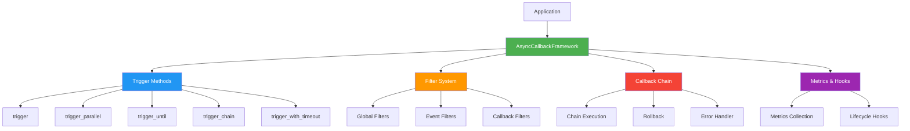

# Async Callback Framework

生产级异步回调框架，专为 asyncio 环境设计。

## 快速开始

```python
import asyncio
from openjiuwen.core.runner.callback import AsyncCallbackFramework

# 创建框架实例
framework = AsyncCallbackFramework()

# 注册回调
@framework.on("user_login", priority=10)
async def send_welcome_email(username: str):
    print(f"Sending email to {username}")
    return f"email_sent_{username}"

# 触发事件
async def main():
    results = await framework.trigger("user_login", username="alice")
    print(f"Results: {results}")

asyncio.run(main())
```

## 核心特性

### ⚡ 7种触发模式

```python
# 1. 顺序触发
results = await framework.trigger("event")

# 2. 并行触发（2-3倍性能提升）
results = await framework.trigger_parallel("event")

# 3. 条件触发（找到即停止）
result = await framework.trigger_until("event", lambda x: x > 10)

# 4. 链式触发（支持回滚）
result = await framework.trigger_chain("event")

# 5. 超时触发（防止阻塞）
results = await framework.trigger_with_timeout("event", timeout=5.0)

# 6. 流式触发（处理异步输入流）
async for result in framework.trigger_stream("event", input_stream):
    print(result)

# 7. 生成器触发（聚合异步生成器输出）
async for item in framework.trigger_generator("event"):
    print(item)
```

### 🔒 8种内置过滤器

```python
from openjiuwen.core.runner.callback import (
    RateLimitFilter,      # 限流
    CircuitBreakerFilter, # 熔断
    ValidationFilter,     # 验证
    LoggingFilter,        # 日志
    AuthFilter,           # 授权
    ParamModifyFilter,    # 参数修改
    ConditionalFilter,    # 条件过滤
)

# 添加限流过滤器
rate_limiter = RateLimitFilter(max_calls=100, time_window=60.0)
framework.add_filter("api_call", rate_limiter)

# 添加权限过滤器
auth = AuthFilter(required_role="admin")
framework.add_filter("admin_action", auth)
```

### 🔗 回调链（带回滚）

```python
from openjiuwen.core.runner.callback import ChainAction, ChainResult

# 定义回滚处理器
async def rollback_payment(context):
    print("Refunding payment...")

@framework.on("checkout", priority=30, rollback_handler=rollback_payment)
async def process_payment(order: dict, **kwargs):
    order['paid'] = True
    return ChainResult(ChainAction.CONTINUE, result=order)

@framework.on("checkout", priority=20)
async def update_inventory(order: dict, **kwargs):
    if order['quantity'] > 100:
        # 触发回滚
        return ChainResult(
            ChainAction.ROLLBACK,
            error=Exception("Insufficient inventory")
        )
    return ChainResult(ChainAction.CONTINUE, result=order)

# 执行链（失败时自动回滚）
result = await framework.trigger_chain("checkout", order={...})
```

### 🎯 自动触发装饰器

```python
# 1. 调用时触发
@framework.trigger_on_call("processing_started")
async def process_data(data):
    return {"processed": data}

# 2. 返回时触发
@framework.emits("data_processed")
async def transform_data(data):
    return {"transformed": data}  # 自动触发 data_processed 事件

# 3. 环绕触发
@framework.emit_around("task_start", "task_end", on_error_event="task_error")
async def important_task(task_id):
    # task_start 自动触发
    result = await do_work(task_id)
    # task_end 自动触发
    return result

# 4. 流式触发（异步生成器支持）
@framework.emits_stream("chunk_ready")
async def process_file(filepath):
    with open(filepath) as f:
        for line in f:
            yield {"line": line.strip()}
    # 每次 yield 都自动触发 chunk_ready 事件
```

### 🌊 异步生成器支持

```python
# 处理异步输入流
async def data_source():
    for i in range(100):
        await asyncio.sleep(0.01)
        yield {"value": i}

@framework.on("process_item")
async def handle_item(item):
    return f"processed: {item['value']}"

# 流式处理（内存高效）
async for result in framework.trigger_stream("process_item", data_source()):
    print(result)

# 生成器回调（返回多个值）
@framework.on("data_stream")
async def streaming_callback():
    for i in range(10):
        yield {"data": i}

# 聚合所有生成器输出
async for item in framework.trigger_generator("data_stream"):
    print(item)
```

### 📊 性能监控

```python
# 获取指标
metrics = framework.get_metrics()
for key, value in metrics.items():
    print(f"{key}: {value['avg_time']:.3f}s, {value['call_count']} calls")

# 查找慢回调
slow_callbacks = framework.get_slow_callbacks(threshold=1.0)
for cb in slow_callbacks:
    print(f"Slow: {cb['callback']} - {cb['avg_time']:.2f}s")
```

## 架构图



## 性能对比

| 场景 | 顺序触发 | 并行触发 | 提升 |
|------|----------|----------|------|
| 3个 I/O 回调 (0.15s each) | 0.45s | 0.20s | **2.25x** |
| 5个 API 调用 (0.2s each) | 1.0s | 0.25s | **4.0x** |
| 10个数据库查询 (0.1s each) | 1.0s | 0.15s | **6.7x** |

## 完整示例

```python
import asyncio
from openjiuwen.core.runner.callback import (
    AsyncCallbackFramework,
    RateLimitFilter,
    AuthFilter,
    ChainAction,
    ChainResult,
)

# 创建框架
framework = AsyncCallbackFramework(enable_metrics=True)

# 添加过滤器
rate_limiter = RateLimitFilter(max_calls=100, time_window=60.0)
framework.add_filter("order.create", rate_limiter)

auth_filter = AuthFilter(required_role="customer")
framework.add_filter("order.create", auth_filter)

# 定义回滚处理器
async def rollback_inventory(context):
    print("Rollback: Restoring inventory")

async def rollback_payment(context):
    print("Rollback: Refunding payment")

# 订单处理链
@framework.on("order.create", priority=50, rollback_handler=rollback_inventory)
async def reserve_inventory(order: dict, **kwargs):
    print(f"Reserving inventory for order {order['id']}")
    if order['quantity'] > order.get('available_stock', 100):
        return ChainResult(
            ChainAction.ROLLBACK,
            error=Exception("Insufficient stock")
        )
    order['inventory_reserved'] = True
    return ChainResult(ChainAction.CONTINUE, result=order)

@framework.on("order.create", priority=40, rollback_handler=rollback_payment)
async def process_payment(order: dict, **kwargs):
    print(f"Processing payment for order {order['id']}")
    order['payment_status'] = 'paid'
    return ChainResult(ChainAction.CONTINUE, result=order)

@framework.on("order.create", priority=30)
async def send_confirmation(order: dict, **kwargs):
    print(f"Sending confirmation for order {order['id']}")
    order['confirmation_sent'] = True
    return ChainResult(ChainAction.CONTINUE, result=order)

# 主流程
async def create_order(order_data: dict, user_role: str):
    result = await framework.trigger_chain(
        "order.create",
        order=order_data,
        user_role=user_role
    )

    if result.action == ChainAction.CONTINUE:
        print(f"✓ Order {result.result['id']} completed!")
        return result.result
    else:
        print(f"✗ Order failed: {result.error}")
        return None

# 运行
async def main():
    # 成功案例
    order1 = {'id': 'ORDER-001', 'quantity': 5, 'available_stock': 100}
    await create_order(order1, user_role="customer")

    # 失败案例（库存不足，自动回滚）
    order2 = {'id': 'ORDER-002', 'quantity': 150, 'available_stock': 100}
    await create_order(order2, user_role="customer")

    # 查看性能指标
    metrics = framework.get_metrics()
    for key, value in metrics.items():
        print(f"{key}: {value['avg_time']:.3f}s, {value['call_count']} calls")

asyncio.run(main())
```

## 模块结构

```
openjiuwen/core/runner/callback/
├── __init__.py          # 公共 API
├── enums.py             # FilterAction, ChainAction, HookType
├── models.py            # CallbackMetrics, ChainContext, etc.
├── filters.py           # 8种内置过滤器
├── chain.py             # CallbackChain 实现
├── framework.py         # AsyncCallbackFramework 核心
├── README.md            # 本文档
└── DESIGN.md            # 详细设计文档
```

## API 快速参考

### 注册回调

```python
@framework.on(
    event="event_name",
    priority=0,              # 优先级（越大越先执行）
    once=False,              # 是否只执行一次
    namespace="default",     # 命名空间
    tags={"tag1", "tag2"},  # 标签
    filters=[...],          # 回调专属过滤器
    rollback_handler=None,  # 回滚处理器
    error_handler=None,     # 错误处理器
    max_retries=0,          # 最大重试次数
    retry_delay=0.0,        # 重试延迟（秒）
    timeout=None            # 超时时间（秒）
)
async def callback(*args, **kwargs):
    pass
```

### 触发事件

```python
# 顺序触发
results = await framework.trigger("event", *args, **kwargs)

# 并行触发
results = await framework.trigger_parallel("event", *args, **kwargs)

# 条件触发
result = await framework.trigger_until("event", condition, *args, **kwargs)

# 链式触发
result = await framework.trigger_chain("event", *args, **kwargs)

# 超时触发
results = await framework.trigger_with_timeout("event", timeout, *args, **kwargs)

# 延迟触发
results = await framework.trigger_delayed("event", delay, *args, **kwargs)
```

### 添加过滤器

```python
# 全局过滤器（应用于所有事件）
framework.add_global_filter(filter_obj)

# 事件过滤器（应用于特定事件）
framework.add_filter("event_name", filter_obj)

# 回调过滤器（应用于特定回调）
@framework.on("event", filters=[filter_obj])
async def callback():
    pass
```

### 生命周期钩子

```python
from openjiuwen.core.runner.callback import HookType

# 添加钩子
framework.add_hook("event", HookType.BEFORE, before_hook)
framework.add_hook("event", HookType.AFTER, after_hook)
framework.add_hook("event", HookType.ERROR, error_hook)
framework.add_hook("event", HookType.CLEANUP, cleanup_hook)
```

## 最佳实践

### 1. 使用并行触发提升性能

```python
# ✅ I/O 密集型任务 - 使用并行
results = await framework.trigger_parallel("fetch_all_data")

# ❌ CPU 密集型任务 - 不要使用并行
results = await framework.trigger("compute_heavy_task")
```

### 2. 合理设置优先级

```python
# 高优先级：关键操作
@framework.on("user_login", priority=100)
async def security_check(): pass

# 中优先级：业务逻辑
@framework.on("user_login", priority=50)
async def create_session(): pass

# 低优先级：辅助操作
@framework.on("user_login", priority=10)
async def send_notification(): pass
```

### 3. 使用命名空间组织回调

```python
# 按模块组织
@framework.on("event", namespace="auth")
async def auth_handler(): pass

@framework.on("event", namespace="billing")
async def billing_handler(): pass

# 批量注销
await framework.unregister_namespace("auth")
```

### 4. 监控慢回调

```python
# 定期检查
slow_callbacks = framework.get_slow_callbacks(threshold=1.0)
for cb in slow_callbacks:
    logger.warning(f"Slow: {cb['callback']} - {cb['avg_time']:.2f}s")
```

## 文档

- [详细设计文档](./DESIGN.md) - 完整架构、API 参考、最佳实践
- [源代码](.) - 浏览源代码

## 许可证

Copyright (c) Huawei Technologies Co., Ltd. 2025. All rights reserved.

---

**版本**: 1.0.0
**最后更新**: 2026-01-31
