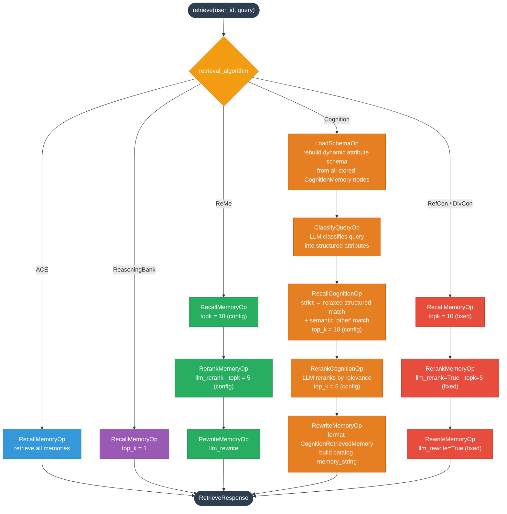
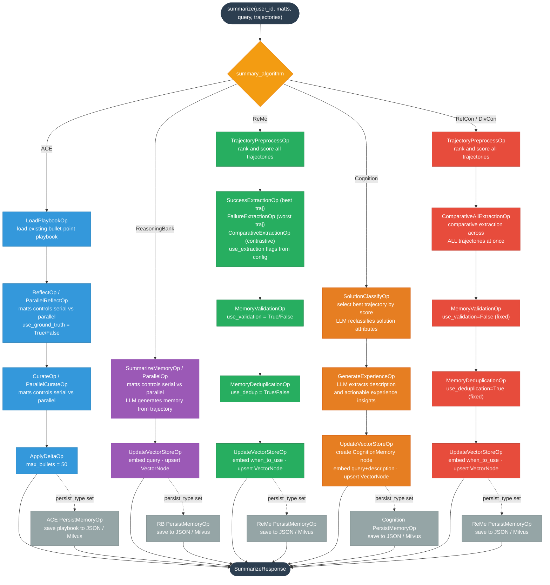

# TaskMemoryService — Algorithm Flowchart

Illustrates the **retrieve** and **summary** operation pipelines for all algorithms
supported by `TaskMemoryService` in `task_memory_service.py`.

**Supported algorithms:** ACE · ReasoningBank · ReMe · Cognition · RefCon · DivCon

**Conventions used in the diagrams:**

| Convention | Meaning |
|---|---|
| Solid arrow `→` | Sequential, always-executed step |
| Dashed arrow `⤏` | Conditional step (appended only when `persist_type` is configured) |
| `matts` notation | Execution mode : `none` = serial op, `parallel` = parallel op |
| `(fixed)` notation | Hard-coded parameter, not exposed through config |

---

## 1. Retrieve Flow

Triggered by `TaskMemoryService.retrieve(user_id, query)`.

---

## 2. Summary Flow

Triggered by `TaskMemoryService.summarize(user_id, matts, query, trajectories)`.

Dashed arrows `⤏` indicate the optional `PersistMemoryOp` appended to the pipeline
only when `persist_type` is set (`"json"`, `"milvus"`, or `"auto"`).

---

## 3. Algorithm Comparison

| Algorithm | Retrieve Pipeline | Retrieve Description | Summary Pipeline | Summary Description | Key Characteristic |
|---|---|---|---|---|---|
| **ACE** | RecallMemoryOp | Return all existing memories in the playbook. | LoadPlaybook → Reflect → Curate → ApplyDelta | Loads the existing playbook, reflects on the trajectory to generate delta bullets, curates them for quality, and applies the delta to keep the playbook within the size limit. | Bullet-point playbook with memory section, content, and helpful/harmful counter |
| **ReasoningBank** | RecallMemoryOp | Embeds the query and retrieves the top-k most semantically similar memory entries from the vector store. | SummarizeMemory → UpdateVectorStore | LLM summarizes the trajectory into a structured memory (title, description, content), then embeds by query and upserts it into the vector store. | Title/description/content memory structure |
| **ReMe** | Recall → Rerank → Rewrite | Recalls candidates by semantic search on when to use index, reranks them by LLM relevance scoring, and rewrites the memory string to fit the current query context. | Preprocess → Extract(3 modes) → Validate → Dedup → Update | Ranks trajectories by score, extracts insights from the best, worst, and contrastive pairs (configurable), validates memory quality, deduplicates, and upserts into the vector store. | Multi-mode extraction from best/worst/contrast |
| **Cognition** | LoadSchema → Classify → Recall → Rerank → Rewrite | Rebuilds the dynamic attribute schema from stored memories, classifies the query via LLM, recalls via strict-then-relaxed structured matching plus semantic "other" matching, reranks with LLM, and formats the output. | SolutionClassify → GenerateExperience → Update | Selects the best trajectory by score, uses LLM to reclassify solution attributes and extract a structured description with actionable experience insights, then stores the resulting CognitionMemory node. | Attribute-based schema + LLM experience extraction |
| **RefCon** | Recall → Rerank → Rewrite (fixed params) | Same three-step ReMe pipeline with hyperparameters fixed at optimized values (topk=10 recall, topk=5 rerank, llm_rerank=True, llm_rewrite=True). | Preprocess → ComparativeAll → Validate(off) → Dedup → Update | Applies comparative extraction across all trajectories simultaneously; validation is disabled and deduplication is always enabled, all with fixed hyperparameters. | All-trajectory comparative, fixed hyperparams |
| **DivCon** | Recall → Rerank → Rewrite (fixed params) | Identical retrieve pipeline to RefCon; fixed hyperparameters are tuned for diverse and contrastive trajectory sets. | Preprocess → ComparativeAll → Validate(off) → Dedup → Update | Same pipeline as RefCon; intended for trajectory sets that are diverse or contrastive in nature rather than reference-aligned. | Same pipeline as RefCon, diverse trajectory intent |
