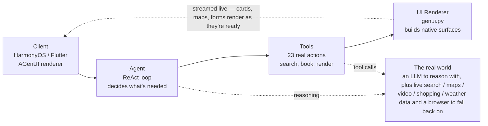
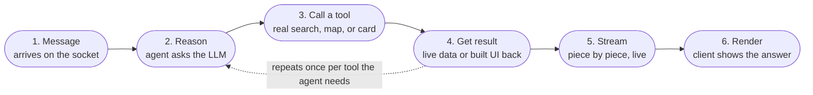
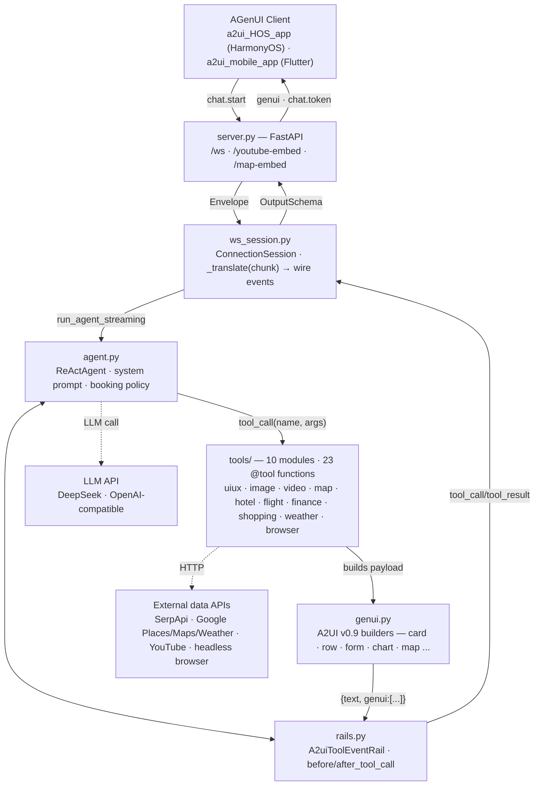
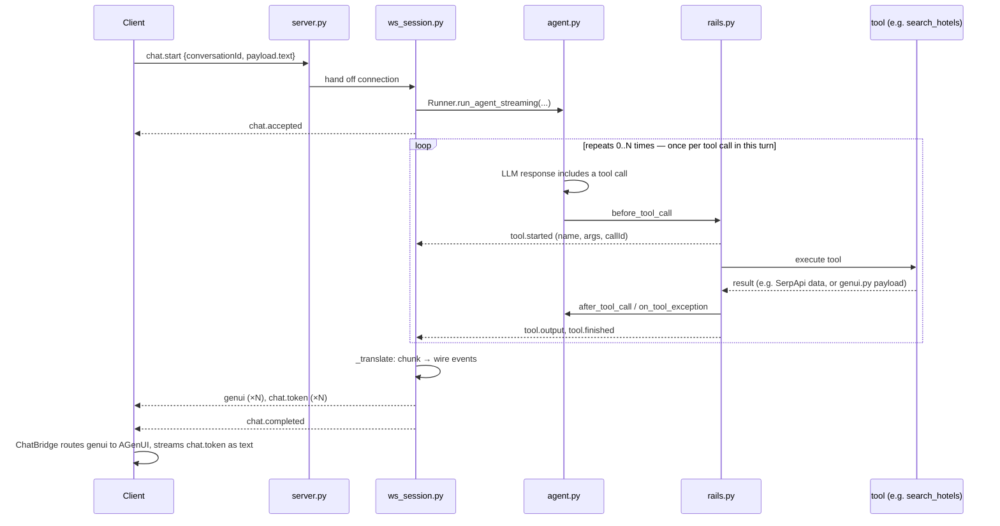

# A2UI ReAct Agent Extension

One openJiuwen [`ReActAgent`](../../../examples/react_agent), exposed over
one WebSocket endpoint, that turns a chat message into streamed A2UI
(GenUI) surfaces -- cards, maps, forms, charts -- rendered natively by any
client that speaks the envelope protocol (HarmonyOS `a2ui_HOS_app`, Flutter
`a2ui_mobile_app`'s `WsService`/`ChatBridge`, or your own). No REST layer,
no database: one socket, one agent, twenty-three tools.

## Run it

```bash
cp openjiuwen/harness/a2ui/.env.example openjiuwen/harness/a2ui/.env   # fill in API_KEY etc., or export env vars directly
uv run python -m openjiuwen.harness.a2ui.server.server
# or: uv run uvicorn openjiuwen.harness.a2ui.server.server:create_app --factory --host 0.0.0.0 --port 8090
```

Point any envelope-protocol client at the resulting `ws://`/`wss://.../ws`
URL and send a message like "what's a good 3-step morning routine?" -- the
agent should reply with text and a rendered card.

---

## Part 1 -- Overview

### 1. Four stages, one loop

Everything the extension does happens between a client opening a socket
and that same socket receiving back native UI, not a chat transcript.
Nothing is faked or remembered from training data -- every card, map pin,
and price the agent shows came back from a real call made a few hundred
milliseconds earlier.



### 2. From message to rendered answer

Not every message needs all six steps -- "hello" skips straight to step 6.
A trip-planning request runs the middle loop several times, once per
place, flight, or hotel involved. The loop over steps 2-4 is the whole
point of a ReAct agent over a plain chat completion: the model can ask for
more real information before committing to an answer, instead of guessing
once and hoping.



### 3. The four guarantees

| | | |
|---|---|---|
| **Input** | One socket | No REST endpoints, no polling -- a single WebSocket carries every message in both directions. |
| **Reasoning** | One agent | A single ReAct agent handles every request type -- no routing between separate bots per domain. |
| **Action** | Real services only | Every tool hits a real API or a real page -- nothing in the response is invented by the model. |
| **Output** | Native, not text | Results become native cards, maps, and forms on the client, not a block of markdown. |

---

## Part 2 -- Engineering detail

### 4. System architecture

The request path runs down the left spine, the streamed response back up
the right -- `rails.py` is what makes that response path exist per tool
call rather than only at the very end. `genui.py` has no network access of
its own; every tool that renders something calls into it to shape the
JSON, then hands that back up through the same result path.



### 5. Request lifecycle

One `chat.start` can trigger zero, one, or several tool calls before the
agent has a final answer. Steps 3-6 are the ReAct loop, not a fixed
pipeline -- a query that needs no data ("hello") skips the loop entirely;
one that needs several (`geocode_place` for each stop on a trip) runs it
several times before the agent has enough to answer.



### 6. Tool inventory

Every module lives under `tools/` and is assembled into one `ALL_TOOLS`
tuple in `uiux_tools.py` for `agent.py` to register. A tool either renders
through `genui.py`, calls an external service, or both.

| Module | `@tool` functions | External service | Notes |
|---|---|---|---|
| `uiux_tools.py` | `get_current_time` · `show_card` · `show_info_list` · `ask_preferences_form` | — | General-purpose; assembles `ALL_TOOLS` for every other module |
| `image_tools.py` | `search_images` · `fetch_page_image` | SerpApi | Google Images Light engine; og:image scrape fallback |
| `video_tools.py` | `search_youtube_videos` · `fetch_video_source` · `show_video_clips` | YouTube | Direct-video HTML5 source also supported, not just YouTube |
| `map_tools.py` | `geocode_place` · `show_map` · `render_map_embed_html` | Google Places · Maps | Serves `/map-embed` itself; shared aiohttp session for connection pooling |
| `hotel_tools.py` | `search_hotels` · `show_hotel_results` | SerpApi | Google Hotels engine; falls back to `free_search` when empty |
| `flight_tools.py` | `search_flights` · `show_flight_results` | SerpApi | Google Flights engine; same booking-policy fallback as hotels |
| `finance_tools.py` | `search_finance` · `show_finance_results` | SerpApi | Renders price history as a native `genui.chart()` |
| `shopping_tools.py` | `search_products` · `show_shopping_results` | SerpApi | Google Shopping engine |
| `weather_tools.py` | `search_weather_forecast` · `show_weather_forecast` · `search_weather_history` · `show_weather_history` | Google Weather · Places | Day-pill tap updates the same card in place; the model is told to add no reply text of its own for that action |
| `browser_tools.py` | `browser_inspect_page` | Headless browser | Read-only Playwright fallback for JS-rendered pages |

### 7. Wire protocol

Every message on the socket is one `Envelope` -- no framing beyond that,
no separate control channel.

```json
{
  "id": "a1b2c3…",
  "type": "chat.start",
  "conversationId": "conv-9",
  "timestamp": 1735689600000,
  "payload": { }
}
```

**Client → server** (2 message types): `chat.start`, `chat.cancel`

**Server → client** (7 message types, streamed): `chat.accepted`,
`tool.started`, `tool.output`, `tool.finished`, `genui`, `chat.token`,
`chat.completed`

### 8. Top-level files

The per-tool-module breakdown lives in the [Tool inventory](#6-tool-inventory)
table above; these are everything else, split into `core/` (agent logic and
A2UI rendering) and `server/` (transport layer). `core/config.py` computes
`.env`/`certs/` paths one level up from itself (`Path(__file__).parent.parent`)
since both still live at the `a2ui/` package root, not inside `core/`.

`core/`:
- `config.py` -- env-driven config (model creds, host/port, catalog id).
- `genui.py` -- A2UI v0.9 message builders (`createSurface`, `updateComponents`, `summary_card`, ...).
- `rails.py` -- `A2uiToolEventRail`, captures raw tool results for the WS layer.
- `agent.py` -- builds and configures the `ReActAgent`.

`server/`:
- `models.py` -- the `Envelope` wire schema (`id`/`type`/`conversationId`/`timestamp`/`payload`).
- `ws_session.py` -- `ConnectionSession` + the OutputSchema-chunk-to-wire-event translator.
- `server.py` -- FastAPI app factory + `/ws` endpoint + entrypoint. Also serves two small HTML pages the client's custom WebView components load directly: `/youtube-embed` (wraps a YouTube URL in a real `<iframe>`) and `/map-embed` (an interactive Google Maps JavaScript API page with default markers, see `tools/map_tools.py`).
