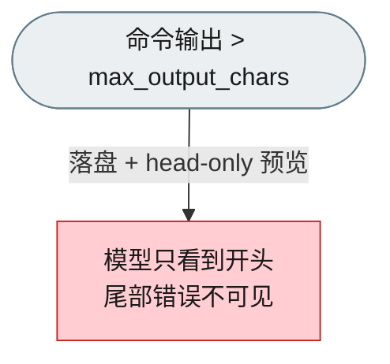
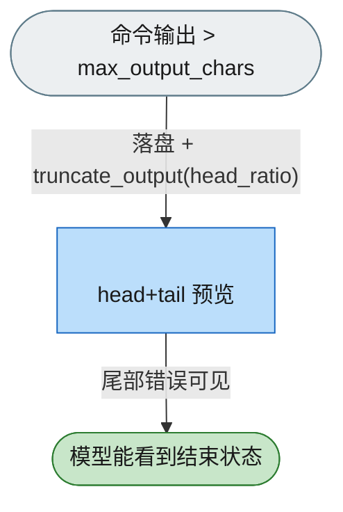

# F_04 Bash / PowerShell 大输出 head+tail 截断

## 元信息

| 项 | 值 |
|---|---|
| 日期 | 2026-09-14 |
| 范围 | `openjiuwen/harness/tools/shell/bash/`、`openjiuwen/harness/tools/shell/powershell/`（`_output.py` / `_tool.py`） |
| 测试基线 | `tests/unit_tests/harness/tools/test_bash`、`tests/unit_tests/harness/tools/test_powershell` |
| Refs | #<issue> |

## 背景

`BashTool` / `PowerShellTool` 对超过 `max_output_chars`（默认 20000）的输出会把完整内容落盘为临时文件，并在 `<persisted-output>` 块里**只回显前 2000 字节**的 head-only 预览。`_output.py` 中已有 `truncate_output(text, max_chars, head_ratio)` 实现 head+tail 截断，但从未被调用，大型输出的尾部（通常是错误或最终状态）对模型不可见。此前宿主（jiuwenswarm）在 `bash_tool_safety.py` 里 monkey-patch 工具类补齐该行为——那是对上游工具行为的越界复制，依赖私有属性与临时文件路径。

## 决策

1. **工具内建 head+tail**：`render_tool_content` 的超限分支改用 `truncate_output(cleaned, max_output_chars, head_ratio)` 生成 head+tail 预览，仍落盘并保留 `<persisted-output>` 与完整输出文件路径；`truncate_output` 因此成为活代码。
2. **可配置比例**：`CommandOutput` 新增 `head_ratio: float = 0.6`；`BashTool` / `PowerShellTool` 新增输入 `head_ratio`（缺省 0.6，环境变量 `BASH_TOOL_HEAD_RATIO` / `POWER_SHELL_TOOL_HEAD_RATIO` 覆盖缺省），并透传进每一处 `CommandOutput`（含失败路径的部分输出）。
3. **清理**：删除仅服务 head-only 预览的 `_generate_preview` / `_PREVIEW_SIZE_BYTES`；`_build_persisted_message` 改为输出 `Head+tail preview:` 标签。

## 拒绝的方案

- **只在宿主 monkey-patch 补齐**：依赖私有属性、临时文件路径与 `<persisted-output>` 字面量，且把上游工具行为复制到宿主。
- **新增 rail / post-execute 插件处理输出**：输出渲染是工具自身契约的一部分，放在工具内对所有消费方一致，也不需要额外生命周期。
- **保持 head-only**：大输出尾部错误仍不可见，触发本特性的问题未解决。
- **把比例固定在函数默认值（0.8）**：宿主既有行为是 0.6，保留为工具默认以维持行为一致。

## 验证

- `tests/unit_tests/harness/tools/test_bash/test_output.py`：`render_tool_content` 超限输出同时含 head 与 tail、`head_ratio` 生效、小输出内联、默认比例 0.6。
- `tests/unit_tests/harness/tools/test_powershell/test_output.py`：同上（PowerShell）。
- 既有 `<persisted-output>` 相关用例（`test_bash_tool.py`）保持通过。

## 已知遗留

- `head_ratio` 工具默认 0.6（对齐既有行为）；`truncate_output` 函数自身默认仍为 0.8，供直接调用方使用。
