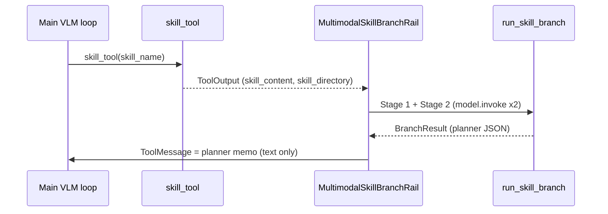

# Skill branch (`skill_branch/`)

MMSkills-style **side consultation** for mobile GUI skills. When the main VLM agent calls `skill_tool`, multimodal reasoning about SKILL reference images happens here (two LLM invokes, no tools). The main ReAct loop only receives a short **planner memo** as the `skill_tool` result—never raw skill figures via `read_file`.

Wiring lives in `[MultimodalSkillBranchRail](../rails/multimodal_skill_branch_rail.py)`, which hooks `after_tool_call` on openjiuwen `AgentRail` and calls `run_skill_branch()`. Legacy **inline** mode skips this package and uses `[MultimodalSkillReadRail](../rails/multimodal_skill_read_rail.py)` instead.

## Problem this solves

SKILL.md files often embed local reference screenshots (`(path)`). In **inline** mode the main agent loads those images with `read_file`, which bloats context and mixes documentation UI with live device screenshots.

In **branch** mode (`MULTIMODAL_SKILL_CONSULT_MODE=branch`, default):

1. `skill_tool` still returns full SKILL text + `skill_directory` in `ToolOutput.data`.
2. If the skill has resolvable local images, `MultimodalSkillBranchRail` runs `run_skill_branch()`.
3. The rail **rewrites** `ToolMessage.content` to a text planner memo before the next model turn.
4. The main agent follows the memo; it must not `read_file` skill reference images (see `[vlm_grounding_prompt.py](../vlm_grounding_prompt.py)`).

## End-to-end flow




### Stage 1 — image gate

- **Input:** pinned user goal, SKILL markdown, image manifest (ids + paths), live device screenshot, optional `previous_steps` text.
- **Output:** `LOAD_SKILL_IMAGES({...})` — parsed by `parsers.parse_load_skill_images_response`.
- **Behavior:** Model decides whether skill reference images are needed; if yes, picks up to `MULTIMODAL_SKILL_BRANCH_MAX_IMAGES` by `image_id`. No GUI actions, no `read_file`.
- **Retries:** Up to 2 rounds with parser feedback if the response format is invalid.

Example Stage 1 model output (abbreviated; not shown to the main loop):

```python
LOAD_SKILL_IMAGES({
  "visual_reference_needed": true,
  "why_not_text_only": "Need skill figures for mobile vs desktop repo header layout.",
  "requests": [
    {"image_id": "github_mobile_repo", "reason": "Mobile stars/forks placement."},
    {"image_id": "github_desktop_repo", "reason": "Desktop header metadata layout."}
  ]
})
```

If text and the live screenshot are enough, Stage 1 returns `visual_reference_needed: false` and `requests: []`; Stage 2 then runs without reference `image_url` blocks.

### Stage 2 — planner JSON

- **Input:** Same context plus Stage 1 decision; selected reference images are attached as `image_url` blocks (documentation only).
- **Output:** Single JSON object — parsed by `parsers.parse_planner_json_response`.
- **Behavior:** Produces structured guidance for the **current** screenshot, not coordinate actions.
- **Retries:** Up to 2 rounds with parser feedback.

On success, `[format.format_planner_tool_message](format.py)` turns the planner dict into the `skill_tool` body the main loop sees.

Example Stage 2 → main-loop `skill_tool` message (abbreviated):

```
Skill consult: github-com
Visual selection: The task requires locating stars and forks; skill figures show mobile vs desktop layouts.
Applicability: effective
Subgoal: Open Chrome browser to navigate to the GitHub repository
Plan: ['Tap Chrome in the dock.', 'Open the repo URL.', 'Find Stars/Forks; use Desktop site if needed.']
Do not do: Do not use a GitHub app if not installed.
Fallback if no progress: Use the home-screen search widget.
Expected state: Chrome open on the repo page with metadata visible.
Completion scope: local_only
```

`Visual selection` comes from Stage 1 `why_not_text_only` when images were considered.

## Module map


| File                                     | Role                                                                                                                 |
| ---------------------------------------- | -------------------------------------------------------------------------------------------------------------------- |
| `[runner.py](runner.py)`                 | `run_skill_branch()` — orchestrates Stage 1/2, loads images, returns `BranchResult`.                                 |
| `[manifest.py](manifest.py)`             | Parses `(path)` from SKILL.md; resolves files under `skill_directory`; stable `image_id` from filename stem. |
| `[prompts.py](prompts.py)`               | System/user prompts for both stages.                                                                                 |
| `[parsers.py](parsers.py)`               | Strict parsers for `LOAD_SKILL_IMAGES(...)` and planner JSON.                                                        |
| `[format.py](format.py)`                 | Formats planner output (or failure) as `skill_tool` ToolMessage text.                                                |
| `[previous_steps.py](previous_steps.py)` | Builds main-loop history for branch context (assistant + tool turns only).                                           |


Public exports: `[__init__.py](__init__.py)` (`run_skill_branch`, `BranchResult`, `build_skill_image_manifest`, `format_planner_tool_message`).

## Inputs the rail supplies


| Input                           | Source                                                         |
| ------------------------------- | -------------------------------------------------------------- |
| `instruction`                   | `pinned_user_goal` in `ctx.extra` or `mobile_gui_shared`       |
| `live_screenshot_b64`           | `ctx.extra["vlm_grounding_base64"]`                            |
| `previous_steps`                | `format_previous_steps_for_branch(ctx.context messages)`       |
| `skill_text`, `skill_directory` | `skill_tool` `ToolOutput.data`                                 |
| `model`                         | Same LLM as the DeepAgent/ReAct agent (`resolve_branch_model`) |


**Previous steps** intentionally omit all `user` messages (task query, VLM observations, inline skill images). The task is only `User instruction:` in branch prompts. The in-flight `skill_tool` result is skipped via `skip_tool_call_id` so Stage 2 does not see a duplicate consult.

## SKILL.md image requirements

Reference images must use standard markdown image syntax with a **local relative path**:

```markdown

```

- HTTP(S) and `data:` URLs are ignored.
- Paths are resolved under `skill_directory` from `skill_tool`.
- Missing files are dropped from the manifest; if nothing resolves, the rail does not run the branch (main loop keeps the raw tool result).

`image_id` defaults to the file stem (e.g. `desktop_header`); duplicates get a numeric suffix.

## Configuration

Set in `examples/.env` (see `examples/.env.example`):


| Variable                                         | Default  | Meaning                                                    |
| ------------------------------------------------ | -------- | ---------------------------------------------------------- |
| `MULTIMODAL_SKILL_CONSULT_MODE`                  | `branch` | `branch` = this package; `inline` = legacy read_file path. |
| `MULTIMODAL_SKILL_BRANCH_MAX_IMAGES`             | `4`      | Max reference images in Stage 1.                           |
| `MULTIMODAL_SKILL_BRANCH_MAX_CONSULTS_PER_SKILL` | `2`      | Per-skill consult cap per run (`ctx.extra` counter).       |
| `MULTIMODAL_SKILL_BRANCH_PREVIOUS_STEPS_TURNS`   | `10`     | Assistant turns included in `previous_steps`.              |


Legacy `MOBILE_SKILL_*` env names are still read as fallback.

Settings are loaded via `[MobileGuiRuntimeSettings](../config.py)` and registered in `[rails_factory.build_mobile_gui_rails](../rails_factory.py)`.

## Planner JSON fields (Stage 2)


| Field                     | Values / notes                                         |
| ------------------------- | ------------------------------------------------------ |
| `skill_applicability`     | `effective` | `ineffective` | `uncertain`              |
| `subgoal`                 | Short local milestone                                  |
| `plan`                    | 2–4 actions/checks for current screen                  |
| `do_not_do`               | Anti-patterns to avoid                                 |
| `fallback_if_no_progress` | Alternate route                                        |
| `expected_state`          | Visible success cues                                   |
| `completion_scope`        | `local_only` | `needs_verification` | `maybe_complete` |


## Failure and limits

- **No local images:** branch not run; raw `skill_tool` output unchanged.
- **Consult limit:** rail replaces tool message with a short “limit reached” note.
- **Stage 1/2 parse or model errors:** `format_branch_failure_tool_message` with error + optional SKILL excerpt.
- **Branch mode + no model:** rail logs and skips rewrite.

## Related code

- Rail hook: `[multimodal_skill_branch_rail.py](../rails/multimodal_skill_branch_rail.py)`
- Inline alternative: `[multimodal_skill_read_rail.py](../rails/multimodal_skill_read_rail.py)`
- Main-loop prompt rules: `[vlm_grounding_prompt.py](../vlm_grounding_prompt.py)`

